# 1 —流失=快乐:以客户为中心的保持方法

> 原文：<https://towardsdatascience.com/1-churn-happiness-a-customer-centric-approach-to-retention-540d1f4a7037?source=collection_archive---------19----------------------->

## [异种客户血统](https://towardsdatascience.com/tagged/hetero-customer-geneous)

## 通过计算终身价值来庆祝“客户异质性”

[Photo by Henry & Co on Pexels](https://www.pexels.com/photo/white-staircase-2450885/)

> “从来没有人说:*嗯……他是个糟糕的律师，但至少他很便宜*！!"彼得·费德

[在之前的一篇文章](https://medium.com/@dangoml/1-churn-happiness-customer-centric-approach-to-retention-fd1d85464e45)中，我讨论了如何超越预测，留住客户不可避免地归结为理解 ***客户价值*** 和 ***我们愿意支付*** 的价格来保持这一价值。为了达成这一谅解及其各自的实施，我们提出了三个必须回答的问题:

**1)哪些客户很快就有翻盘的概率最高？**

**2)我们每个客户的终身价值是什么？**

**3)什么样的挽留优惠最适合每位客户？**

在回答问题#1 时，我们开发了一个客户流失预测模型，该模型提供了几种我们可以用来识别高风险客户/会员的策略。由于各种权衡，不存在单一的最优策略，因此决定使用哪种特定策略将完全基于我们愿意投资的金额，以防止现有成员离开。

*你会问，“那么我们应该对每个高风险客户投资多少呢？”？嗯，这完全取决于我们期望他们在一生中购买和贡献多少。这种期望被称为顾客的终身价值(LTV)。*

*这篇文章是我的回购的“后续文章”。在这里，我将涵盖我在这个项目过程中遇到的主要想法、结果和推论。现在，让我们直接跳到问题 2:*

> *我们每个客户的终身价值是什么？*

***终生价值(LTV)为什么它很重要？***

*通常，当我们想到获取和保留客户时，我们会立即进入成本最小化(底线)的思维状态。然而，为什么当我们雇佣人才时，我们想要最好的，而且我们愿意为最好的支付(最高限额)？我们需要将同样的逻辑应用到我们的客户获取和保留工作中。如果有美元可赚，我们就不应该纠结于便士！*

*LTV，又名获取-保留价值，被定义为未来(净)现金流的现值。这是一个前瞻性的概念，而不是衡量过去的盈利能力。*

*那么我们如何计算 LTV 呢？ 嗯，看情况。所有的收入来源都可以归结为合同或非合同模式。主要区别在于，在合同环境中，我们观察客户“死亡”的时间(例如:一个应用程序提供每月订阅，而客户没有重新订阅)，而在非合同环境中，不观察客户变得不活跃的确切时间(例如:客户从电子商务网站购买商品，并且不再返回)。*

*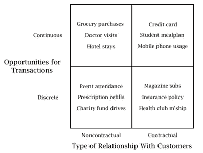*

*Types of Revenue Streams*

*这些模型中的每一个都有自己独特的评估 LTV 的方式，因此我们将只涵盖离散的合同计算，因为我们的用例涉及基于订阅的固定价格业务**。**如果你对非合约 LTV 分析感兴趣，可以参考[这个很棒的教程](/whats-a-customer-worth-8daf183f8a4f)。*

***在离散的合同环境中计算 LTV——游戏计划:***

*1)进行生存分析，并使用 Kaplan Meier 曲线分析我们每个成员的生存概率。*

*2)创建一个 Cox 比例风险模型(生存回归)来研究生存时间(预期寿命)和我们的变量之间的关系。*

*3)使用该回归模型确定所有成员的预期寿命，并计算其各自的 ltv。*

*4)重新审视我们的客户流失模型和已识别的高风险会员。*

# ***生存分析***

*[生存分析](https://www.youtube.com/watch?v=lBijo0WhwYM&)是统计学的一个分支，最初用于医学和生物学科，研究患有重大疾病的试验患者的生存时间。简单地说，我们称之为“事件时间”分析。这项技术不仅可以进一步应用于传统的死亡事件，还可以应用于不同业务领域中许多不同类型的事件。*

*生存分析适用于我们可以定义的情况:*

*   ***一个“出生”事件:**对于我们的应用程序，这将是客户与公司签订合同的时候。我们用这个来衡量用户成为会员的时间(任期)。*
*   ***“死亡”事件:**当客户在 2016 年 2 月会员资格到期后的 30 天内没有重新订购时，就会发生这种情况。*

*但是，请记住，这更像是一种探索性的数据分析技术，用于通过可视化不同群组各自随时间推移的累积生存概率来评估不同群组的预期寿命。该函数的直观表示通常被称为卡普兰-迈耶曲线，它展示了某一时间间隔内某一事件(例如，生存)的概率。*

*类似于我们如何在创建回归模型之前进行双变量 EDA 以了解个体特征的行为和潜在影响，我们在创建 Cox 比例风险(CPH)回归之前进行生存分析。现在让我们看看使用一种叫做[卡普兰-迈耶曲线](/survival-analysis-intuition-implementation-in-python-504fde4fcf8e)的特定类型的生存曲线，我们可以收集到什么信息。*

*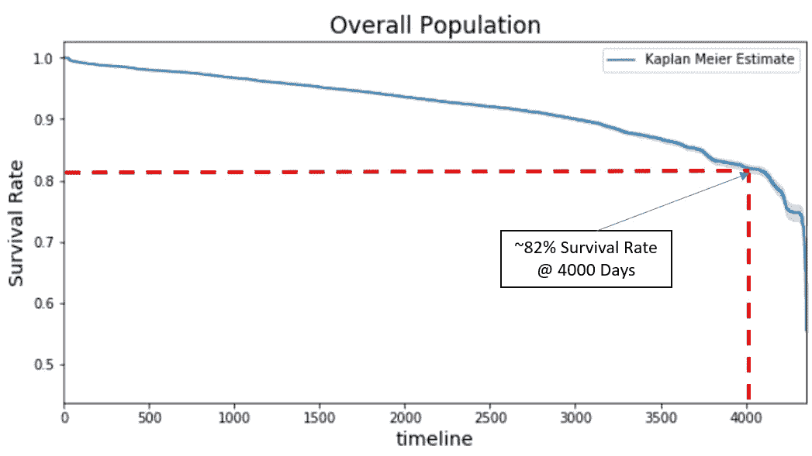*

*上面的曲线提供了一些与我们人口健康相关的直觉。总的来说，我们的成员在 4000 天时有*～80%*的存活概率，因此保持力似乎相对较强。这表明 KKBox 是一个相当健康的业务，因为客户幸存的几率很高。现在，在确定客户的终身价值之前，让我们将我们的数据分成不同的群组，以建立一个坚实的基础。*

## *生存分析#1:集群客户群*

*在[之前的项目](https://github.com/dangoML/Project-Portfolio/blob/master/KKBox%20Part%202%20-%20Customer%20Segmentation%20Analysis/KKBox%20Segmentation%20-%20Part%202%20-%20Segmentation%20Analysis.ipynb)中，我们根据用户活动确定了以下 4 个群组:*

*   **集群 3，电力用户**
*   **集群 2，二级电力用户**
*   **群集 0，活动多数**
*   **聚类 1，不太活跃的少数群体**

*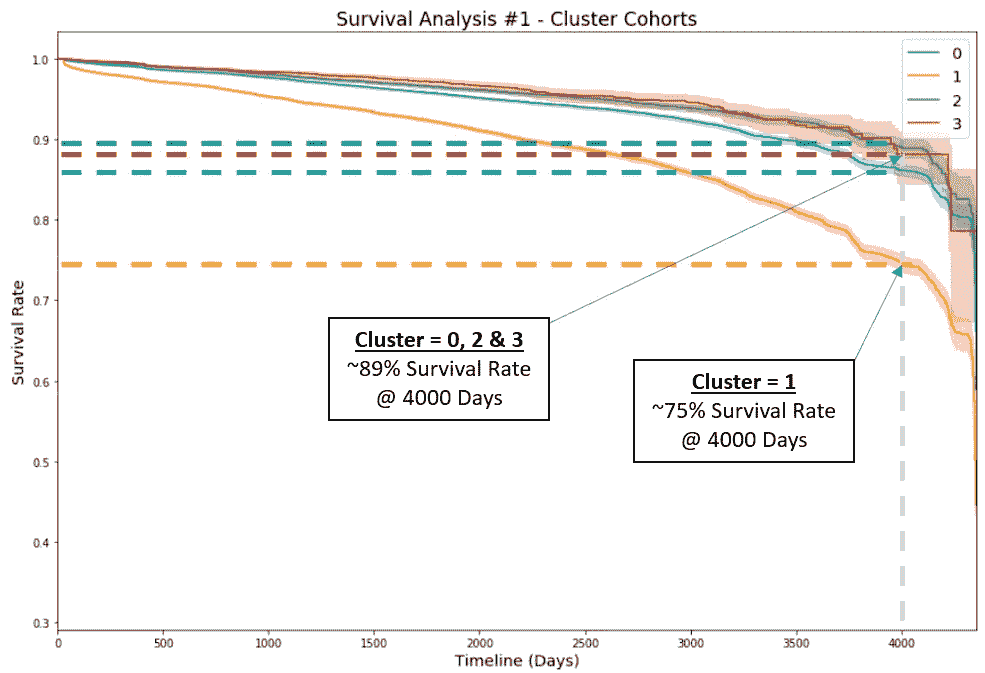*

*在这里，我们可以看到*群 1(不太活跃的少数)*和其他群之间的明显区别。这是对我们的细分分析的可靠跟进，因为它进一步证明了集群 1 如何明显地具有该组的最差预期寿命(75%的存活率，而其他组在 4000 天的存活率约为 89%)。然而，从长远来看，让 75%的最差客户存活 11 年是一个很大的问题。*

## *生存分析#2:注册方法*

*虽然 KKBox 没有提供太多关于注册方法值的信息，但我发现这是一个有趣的特性，因为它可能代表用户“如何”加入平台。*

*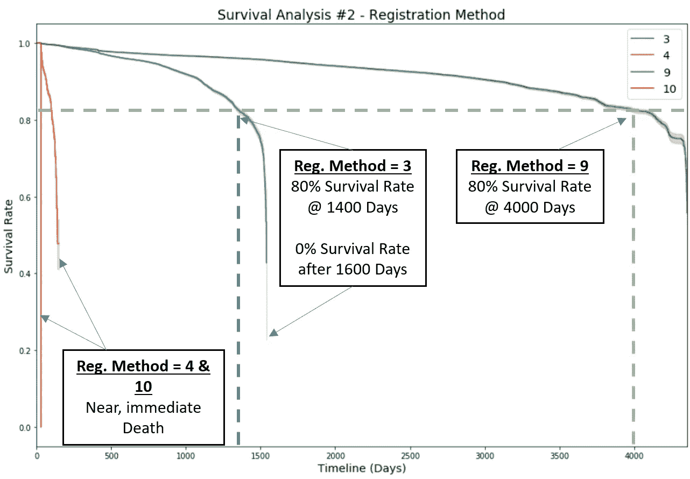*

*进行生存分析的一个好处是，我们可以清楚地看到影响强成员和弱成员的确切因素。在这里，我们看到了所有 4 种注册方法的存活率的明显差异，其中 **registered_via = 9 和 3** 优于其他方法。拥有 **registered_via = 10 和 4** 的成员似乎几乎瞬间死亡。如果我们对这一特征的假设是正确的，那么通过归因，我们可以用前两种方法重新分配我们的资源，以获得更多的长期成员。*

*从过程改进的角度来看，存活曲线也是调查为什么 4 和 10 表现如此差的一个提示。这是一个很好的例子，说明我们如何通过评估营销活动及其为我们公司创造的客户类型，使用生存曲线来优化用户获取*。**

## **生存分析#3:付款计划期限**

**使用订阅的公司通常为客户提供不同的层级。通常，这些层中的一个会被突出显示或区分，因为公司有意试图吸引客户选择默认包。通过生存分析，我们可以问这样一个问题:*我们默认用户订阅的内容会如何影响他们作为客户与我们在一起的时间？***

**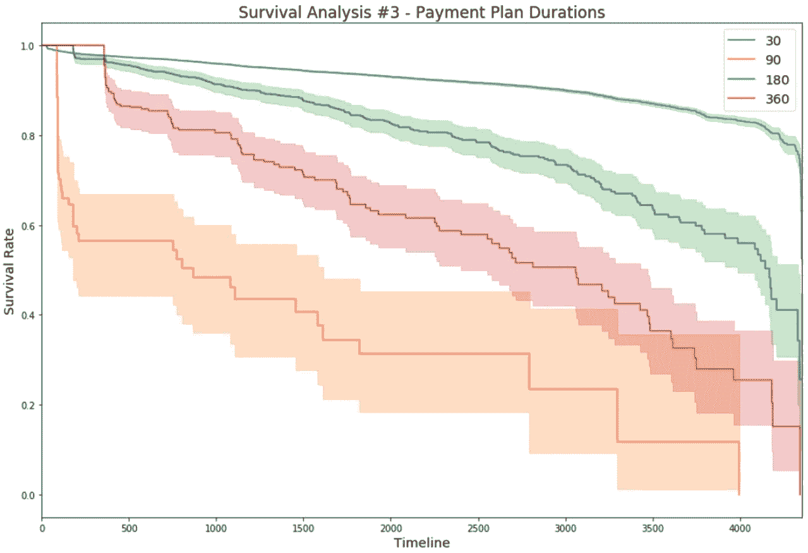**

**在这里，我们可以看到计划的选择对会员资格期限有重大影响。与每月 30 天的计划相比，持续时间更长的计划随着时间的推移存活率更低。这可能是因为一旦计划到期，计划期限长的人不太愿意以同样高的一次性付款重新投保。此外，这张图表对我们如此有价值是因为它告诉我们如何能够 ***优化客户激活*** 。**

**那么我们应该给每个人默认一个 30 天的计划吗？嗯，那要看目前的经营策略。如果企业希望在短期内(365 天或更短)增加收入以获得现金流，那么默认用户使用 360 天计划可能是最好的选择。但如果企业优先考虑长期客户健康和权益，那么 30 天计划是显而易见的候选方案。**

**这些卡普兰迈耶图不仅在视觉上吸引人，而且它们清楚地向我们现有的客户解释了潜在的模式。这是一个如此简单和初级的工具，但它提供了有价值的信息，我们可以根据这些信息做出清晰、有效的决策。不要忘记，所有这些见解仅仅来自于从两个特征(任期和流失率)计算累积边际率！**

# ****Cox 比例风险(CPH)回归****

**如前所述，我们的卡普兰迈耶曲线只适用于一个特征，忽略了所有其他特征的影响。因此，需要一个更好的模型来同时评估所有数字和多重预测因子对生存时间的影响。**

**[Cox 比例风险(CPH)](https://blog.clairvoyantsoft.com/cox-proportional-hazards-model-for-survival-analysis-7f7bcc1be1ee) 是一种常用的半参数模型，用于研究生存时间和所有变量(包括分类和定量预测因子)之间的关系。对于给定的危险率，它通过累积计算一段时间内个人的“死亡”风险来返回每个用户的预期寿命。这些“危险”可以被认为是增加/减少生存机会的东西。例如，在我们的业务问题中，风险可能是由于客户拥有的合同类型或他们注册应用程序的方式而导致的相关死亡可能性(客户流失)。**

**我们必须再次强调，运行 CPH 回归模型的要点不是分析谁死谁不死。相反，我们这样做是为了研究我们的特征(也称为协变量)对死亡的*时间*的影响。所述研究的结果是预测用户预期寿命的能力，然后我们反过来用它来计算他们各自的寿命值。**

**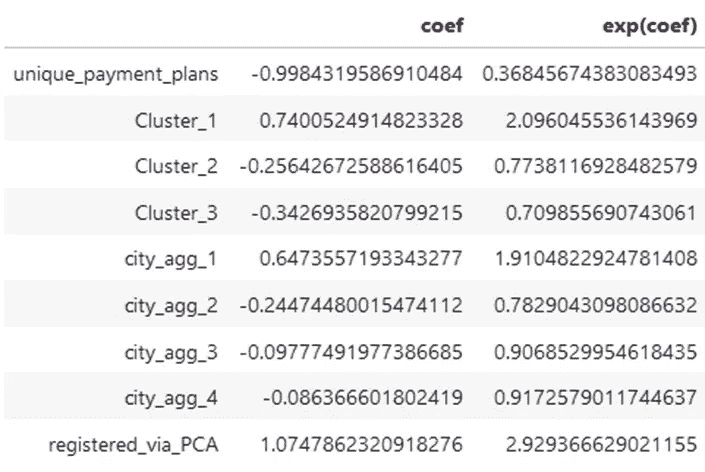**

**CPH Regression Output**

**由此产生的模型摘要相当详细，所以现在我们只关注关键输出: ***exp(coef)*** 。这被解释为变量的每个额外单位的危害(风险)的标度:**

*   ****1:** 无影响，对死亡贡献无影响**
*   ****低于 1:** 风险降低，对死亡的影响较小**
*   ****以上 1:** 危险增加，对死亡的贡献更大**

**解释摘要:**

*   ****city_agg** 是一个工程特性，根据人口将所有城市减少到 5 个组成部分。在 ***exp(coef)*** 下针对每个预测值给出的风险比(HR)表明，具有***exp(coef)=～. 9***的 **city_agg_4 和 city_agg_3** 特征在降低风险方面的作用最小。**
*   ****Cluster_2 和 Cluster_3** 分别具有 ***exp(coef) = .77 和. 71，*** (即小于 1)的特征意味着危险降低，因此生存更好。因此，一个成员被归类为这些集群中的任何一个，死亡的几率就会降低一倍。 ***分别为 77 和. 71*** ，因此是更好生存的良好预后。**
*   ****city_agg_1，Cluster_1，registered_via_PCA** 有 ***危害比= ~2*** 及以上！因此，这些是重要的“杀手”,因此是低存活率的强烈迹象。**

**既然我们有了 CPH 回归模型，我们现在可以计算预期寿命和寿命价值。**

# ****估算所有成员的预期总寿命，并计算其各自的 ltv。****

**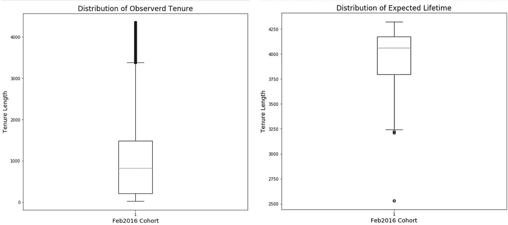**

**这里我们看到观察到的任期和我们新计算的预期寿命。通过比较这两块地，我们可以看到，就任期而言，我们目前的成员人口相当年轻。中位年龄约为 1000 天，我们的成员变动率(死亡事件)，我们可以预计我们的成员与我们在一起的中位时间为 4000 天(约 11 年)。**

**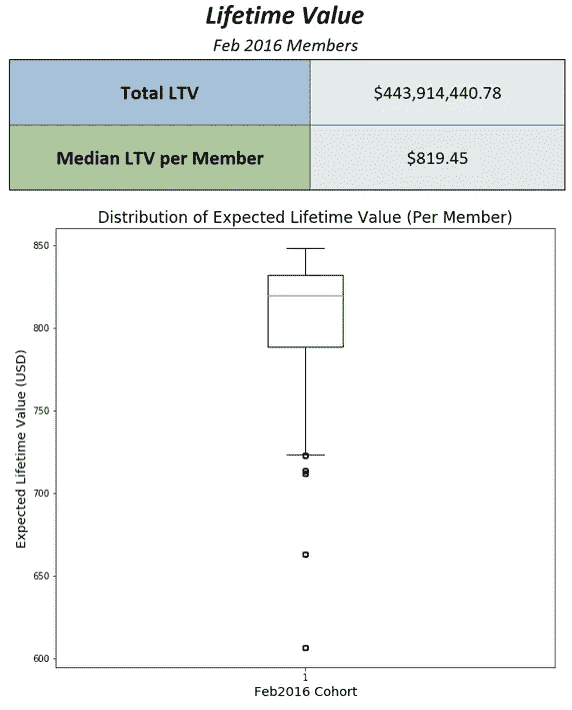**

**如前所述，预期寿命价值是作为未来(净)现金流的现值计算的。我们假设加权平均月成本为 9.50 美元(每天约 0.32 美元，美元换算)，年折扣率为 10%(实际上，折扣率通常为 6-12%)。**

**超过 4000 天的总 LTV 为 819.45 美元，我们看到了大规模采用对于这种商业模式的成功是多么的关键。值得注意的是，这一计算没有考虑成员的任期，这意味着 443，914，440.78 美元的总 LTV 包括了我们的成员已经为公司贡献的过去价值。然而，我们更感兴趣的是确定我们期望成员贡献多少剩余价值。**

**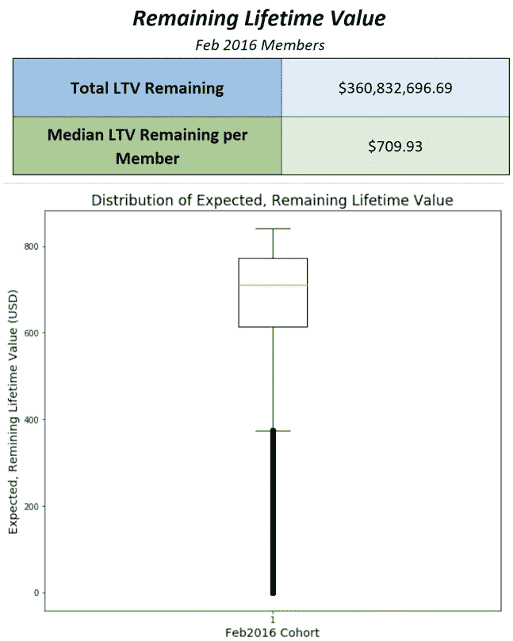**

**对于我们的用例来说，这更有价值，因为我们现在对未来的预期有了一个现实的视角。此外，我们可以看到 LTV 如何陷入负面，因此我们可以识别根据我们对生命周期的估计预计会死亡的活着的用户。为了更好地理解这一点，有助于将它们解释为代表这些成员贡献的超过其各自 LTV 数额的额外价值的绝对值。**

**这是 LTV 建模提供的另一个很好的洞察，因为这些成员可能属于 ***【集群 3(高级用户)*** ，并且可能是潜在的溢价向上销售的候选人。即使从公司估值的角度来看，我们也可以做出一个非常有力的论证，仅仅基于这种分布，这家公司实际上值多少钱。**

# ****重新审视我们的流失模型和已识别的高风险会员****

**在之前的项目中，我们就着手回答了这个问题:*哪些客户很快就有翻盘的概率最高？*尽管我们创建了几个可以轻松回答这个问题的模型，但我们仍然没有足够的信息来为我们的业务选择最佳模型。我们的结论是，因为我们不知道每个客户的价值，我们不能正确地确定什么样的治疗将有效地说服他们留在我们身边。这种治疗的成本是最终决定我们应该使用哪种模型的因素，因为这些模型让我们清楚地了解了取决于策略的风险和回报。现在我们知道了客户对我们的价值，让我们重温一下之前的模型，量化两者之间的风险回报权衡。**

**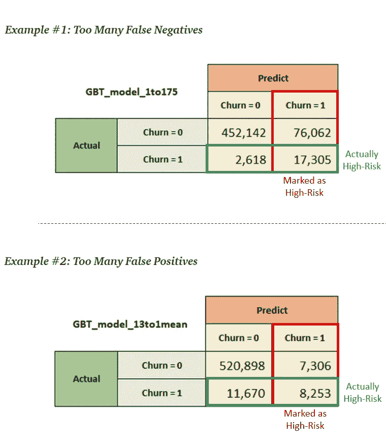**

**在我们继续之前，这是一个很好的地方来简要提及 LTV 分析的一个小免责声明。最终，LTV 将作为一个临时快照来使用和对待。它应该被视为一种结果，而不是原因。因此，价值的变化应该是我们在营销、产品、沟通策略等方面采取行动的结果。考虑到这一点，即使我们见证了 4000 天的高存活率，假设这一存活率将随着时间的推移保持不变也是不明智的。因此，我们将使用我们当前的模型，使用未来三年的 LTV 上限值进行推断。**

**因此，如果我们不进行干预，而我们所有的实际高风险成员都受到了影响，那么总的潜在价值损失会是多少？答案是 ***未来三年 5833677.41 美元。*** 这是对实际上是高风险成员的预期剩余 LTV 的总和。但是如果我们真的干预了呢？你愿意花多少钱来保持这种价值？**

****GBT 1:1 比率模型—太多的假阴性****

**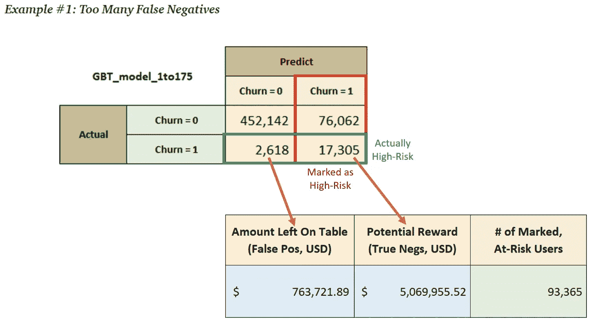**

**在这个模型中，我们放弃了 2，618 名会员，剩下约 764，000 美元，因此我们有机会在三年内保留 17，305 名会员，剩余 LTV 为 507 万美元。然而，这也带来了一个问题。为了接触到所有 17，305 名成员，我们必须再次接触被标记为高风险的 94，020 名成员。**

****GBT 13:1 比率模型—假阳性太多****

**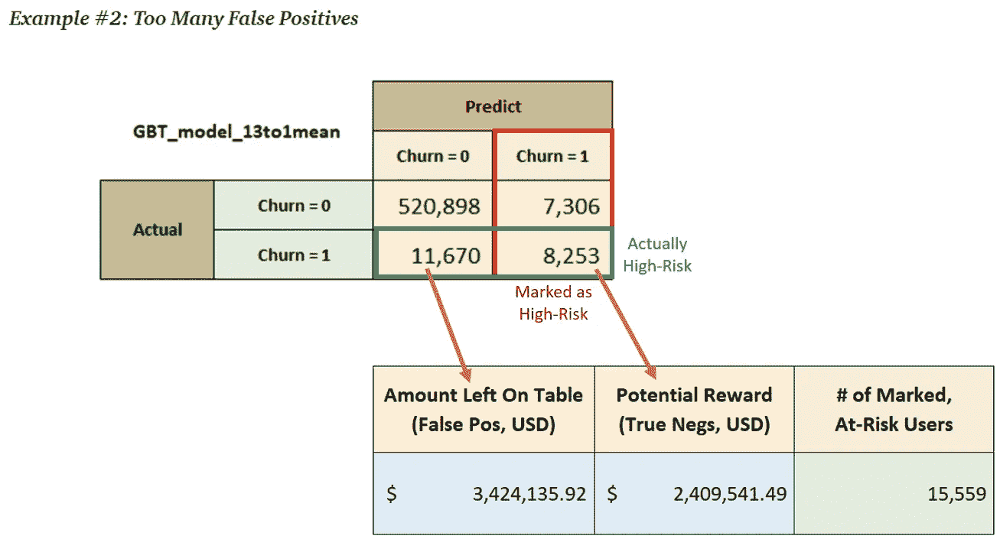**

**这种模式基本上放弃了 11，670 名会员，剩下 324 万美元，因此我们有机会保留 8，253 名会员，剩余 LTV 为 241 万美元。这种模式的优点是，我们只有 15，559 名成员被确定为实际高风险。这意味着“按比例”与其他模型相比，我们不需要接近那么多人来接触那些实际上是高风险的用户。**

**有了这些信息，我们现在就有了做出实际决策的框架。作为一个例子，让我们以单个治疗成本来评估每个模型，以更好地了解它们的总成本和 ROI。让我们从一些假设开始:**

*   **治疗费用为 9.50 美元(1 个月订阅，加权平均)**
*   **我们只会接近那些我们能获得至少 200%总回报的用户。这样我们就忽略了 LTV 不超过 30 美元的会员。**
*   **所有成员都受到同样的待遇**

**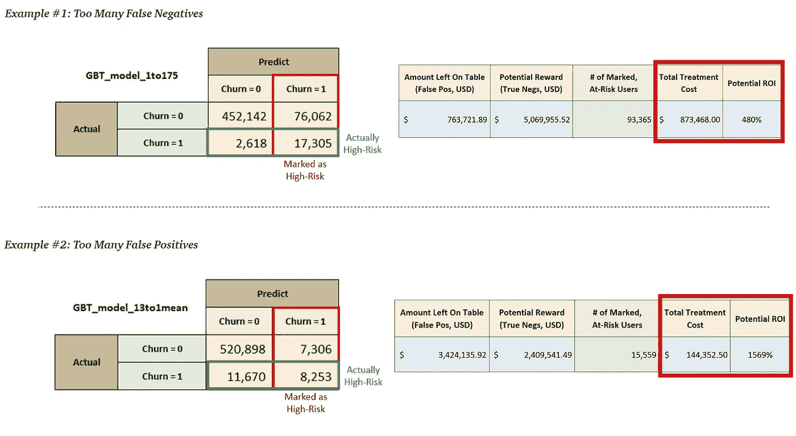**

**由于 LTV 建模，我们可以做出明智的决定，我们应该选择哪种模型策略。通过只追逐有潜力给我们带来合理投资回报的客户，我们可以确保明智地花钱。还需要注意的是，这仅仅是一个查看成本对我们每个模型的影响的练习。事实上，我们不会给予所有会员相同的待遇，因为顾客*从来都不是同质的*。当我们忽视客户的异质性时，我们会浪费宝贵的资源去追逐任何人和任何人的产品销售，不惜任何代价。我们稍后再看这个。**

**有了这些模型以及它们相关的风险、回报和成本，我们可以简单地决定我们愿意花多少钱。**

## ****结论:*我们每个客户的终身价值是什么？*****

**我们从了解 LTV 的需要开始这篇文章，这样我们就可以确定我们可以花多少钱来说服一个高风险客户重新考虑他们的退出。这个成本是至关重要的，因为它将阐明我们的每个模型策略在成本和潜在收益方面的权衡。在执行计算时，我们实际上能够通过计算获得更多的价值。**

****优化客户获取和激活****

**进行生存分析的一个好处是，我们可以清楚地看到促成强势和弱势成员的确切因素，从而使我们能够根据需要重新分配资源，以更好地集中精力进行收购。**

**尽管人们普遍认为长期计划对企业最有利，但这项分析利用相对有限的数据为相反的观点提供了有力的证据。诸如此类的洞见使得生存分析对所有企业来说都是非常宝贵的。**

****收购成本与收购价值****

**正如我之前提到的，我们经常寻求将获取和保留客户的成本降至最低，同时愿意为最优秀的人才支付额外费用。LTV 是一个有价值的工具，可以用来寻找和获得最好的成员。当有美元可赚时，我们不应该纠结于便士！**

**让我们看看第三个也是最后一个问题:**

> ****什么样的挽留服务最适合每位客户？****

**不幸的是，这个问题的答案超出了这个项目的范围。但是，回答这个问题背后的主要思想是承认所有的顾客并不是生来平等的。如前所述，我们对所有客户一视同仁，仅仅是为了展示成本对客户流失模型的影响。事实上，平等对待所有客户的问题在于存在“普通客户”的错误观念。使用这种方法，我们无法在更精细的层次上识别客户的独特属性。当我们忽视客户的异质性时，我们会浪费宝贵的资源去追逐任何人的产品销售，不惜任何代价。 LTV 是我们用来了解适合合适客户的合适价格的工具。将这些治疗方法分配给所有高风险客户后，可以创建一个模型来了解哪些治疗方法被证明是最有效的。**

**正确回答这个问题的一种方法是通过细分、目标和定位的方法。从总体上看，我们可以将 CLV 的客户群分为三类，并定义一个如何对待他们的简单主题:**

*   *****高价值客户*** :识别他们**
*   *****中等价值客户*** :发展他们**
*   *****低价值客户*** :控制成本**

**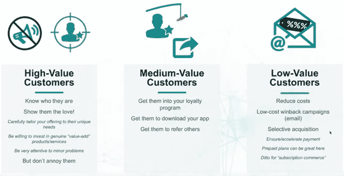**

**[Screenshot from InfoTrust CLV Video](https://www.youtube.com/watch?v=oBMgUAsrZ6c&t=1813s)**

**通过利用 LTV，我在这个项目中展示的一切都为我们如何处理客户流失建模项目增加了一个新的视角。这一点尤其正确，因为它们不像许多人想象的那样是一维的。关于这个项目，最令人印象深刻的是我们能够从客户获取、激活和保留方面得出的推论数量。这证明了终身价值是一种无价的工具，任何企业都不应该缺少它，但却没有得到足够的重视。干杯！**

**其他参考资料和灵感:**

*   **Peter Fader 和 Bruce Hardie，[契约环境中基于顾客的估价:忽视异质性的危险](https://pubsonline.informs.org/doi/10.1287/mksc.1080.0482)**
*   **Peter Fader，[回归基础客户终身价值](https://www.youtube.com/watch?v=oBMgUAsrZ6c&)**
*   **[鲁本·范·帕门](https://towardsdatascience.com/@Ruben.VanPaemel)，[卡普兰·迈耶曲线:简介](/kaplan-meier-curves-c5768e349479)**
*   **布鲁斯·哈迪和彼得·费德，[CLV](https://www.brucehardie.com/notes/035/distribution_of_CLV__contractual.pdf)的合同分配**
*   **Cam Davidson-Pilon，[生命线库(Python)](https://lifelines.readthedocs.io/en/latest/)**

**我希望你喜欢这些文章！我对客户终身价值这一话题非常感兴趣，如果您想进一步了解这一话题[，请随时通过 LinkedIn 与我联系！](https://www.linkedin.com/in/danny-jurado/)**