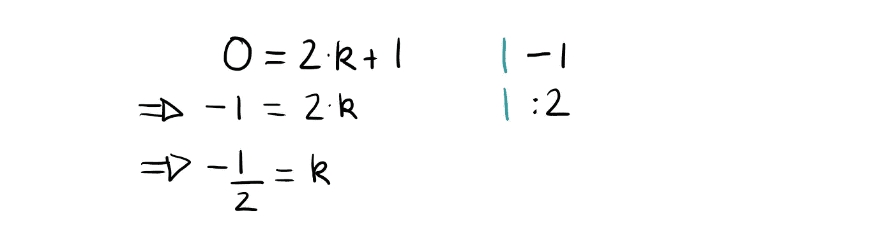

# 1 分钟数学:0 是偶数还是奇数？

> 原文：<https://towardsdatascience.com/1-minute-math-is-0-even-or-odd-93d30090201f?source=collection_archive---------18----------------------->

我的学生经常问我的一个问题是:**0 是偶数还是奇数** **还是两者都是**？

Photo by [Jeremy Perkins](https://unsplash.com/@jeremyperkins?utm_source=medium&utm_medium=referral) on [Unsplash](https://unsplash.com?utm_source=medium&utm_medium=referral). Zero — a beautiful number.

# 0 是偶数吗？

要回答这个问题，我们首先需要定义“偶数”是什么意思。

> 偶数是一个数 n，它可以写成某个整数 k 的 n=2⋅ k

这意味着如果我们把一个偶数除以 2，就没有余数了！

**我们可以把 *0=2⋅ k* 写成一些 *k* 吗？** Yepp，如果选择 *k=0* 就可以。

太棒了。这意味着 0 是偶数！

# 0 也是奇数吗？

同样，我们首先需要定义“奇数”的含义，常见的定义与偶数的定义非常相似。

> 奇数是一个数 n，对于某个整数 k，它可以写成 n=2⋅ k+1

我们能把 0=2⋅k+1 写成整数 k 吗？没有。我们不能，因为解这个方程得到的不是一个整数。

# 答案

好了，证明完成了。0 是偶数(且只有偶数！).

不会*甚至*(一语双关)太难吧？