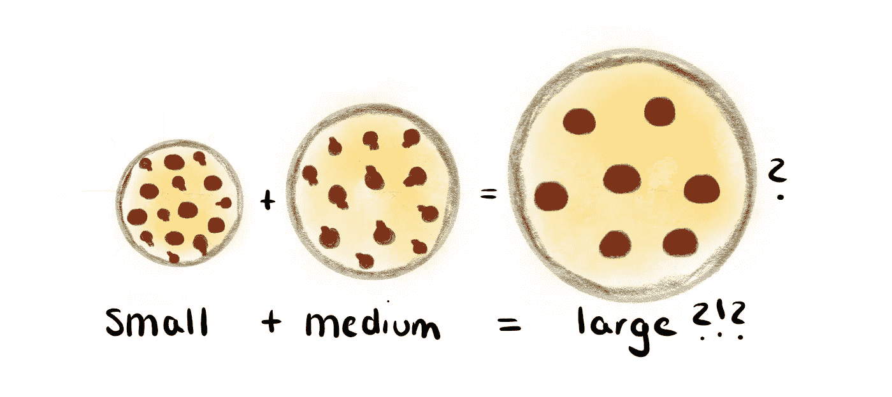
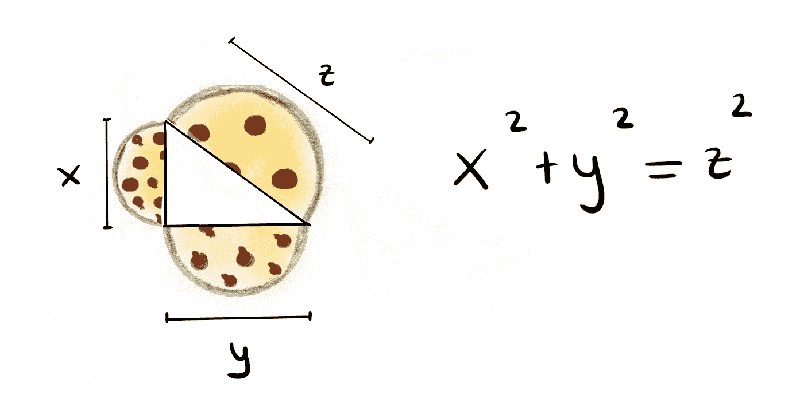
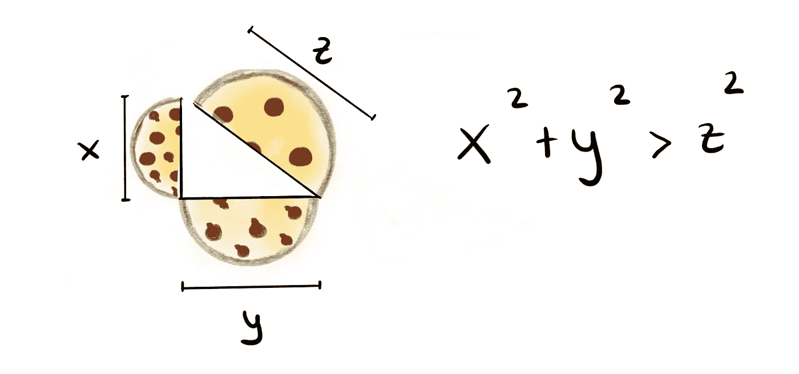
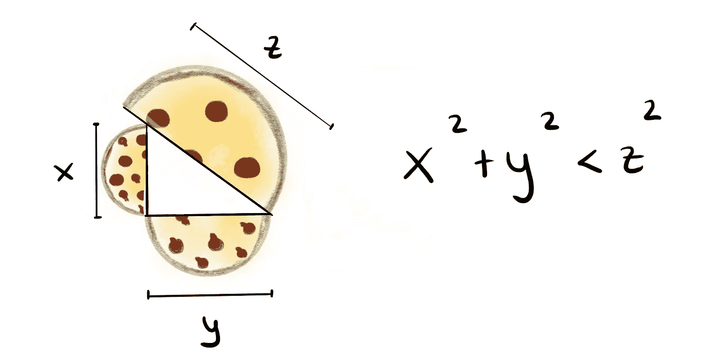
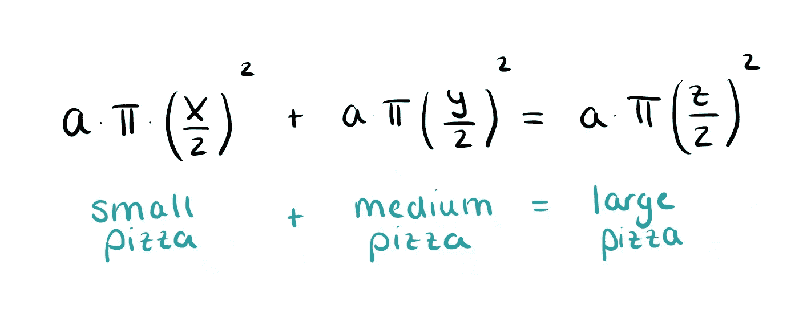

# 一分钟数学:比萨和毕达哥拉斯可视化

> 原文：<https://towardsdatascience.com/1-minute-math-pizza-and-pythagoras-visualized-359470941bd6?source=collection_archive---------44----------------------->

## 小号+中号还是大号？还有呢？

许多比萨饼店提供小号、中号和大号的比萨饼。如果你想知道点一个大披萨而不是一个小的和一个中的披萨会不会让你得到更多的披萨，这里有一个漂亮的视觉技巧可以帮你找到答案。

每种尺寸点一份披萨(我知道，这就是它如此美丽的原因！多好的理由去订购更多的比萨饼！)，把它们切成两半，像这样放在一起。

Perfectly fitting pizza!

它是否完全合适，并且在左下角有一个直角？如果你点了一个小的和一个中的比萨，而不是一个大的，你会得到同样多的比萨。披萨的三个直径符合毕达哥拉斯的方程式。

是不是长这样而且大披萨“太短”了？那么你可能想点一个小号和中号的比萨饼来代替。

The pizza is too small. The small and the medium pizza together are indeed more than the large pizza.

还是大披萨“太长”？这在大多数地方都应该发生——这意味着如果你点一个大披萨而不是一个小的和一个中的一起点，你会得到更多。

The pizza is too big! These were our original dimensions — it looks like we made a good deal.

当然，我们假设所有三个比萨饼的高度 *a* 是相同的。因为如果我们将毕达哥拉斯方程两边的一些数字相乘，我们会得到一个包含三个披萨体积[的方程。](https://medium.com/1-minute-reads/1-minute-math-how-much-pizza-is-in-a-pizza-8ef637915b7a)

所以下次你点披萨的时候，记得每种尺寸至少买一个，亲自尝试一下。

当然，纯粹是出于科学原因。