# 从零开始的单向方差分析—用一个工作实例剖析方差分析表

> 原文：<https://towardsdatascience.com/1-way-anova-from-scratch-dissecting-the-anova-table-with-a-worked-example-170f4f2e58ad?source=collection_archive---------4----------------------->

ANOVA 是方差分析的缩写，是一种使用统计显著性比较平均值的常用统计方法。在这篇文章中，我解释了如何从零开始计算一元方差分析表，应用于一个很好的例子。

本文概述:

1.  介绍单因素方差分析的示例和目标
2.  了解方差分析模型
3.  使用 Python 的 statsmodels 库执行 ANOVA
4.  从头开始的方差分析—剖析方差分析表
5.  结论

# 1.单因素方差分析的目的是通过一个例子

在整篇文章中，我将使用一个关于披萨递送时间的例子。假设我们在 3 家不同的披萨公司(A、B 和 C)订了很多次披萨，并且测量了送货时间。

[**跟着 Python 笔记本过来吧！**](http://bit.ly/1-way-anova-notebook)

首先，我们需要将数据导入 Python:

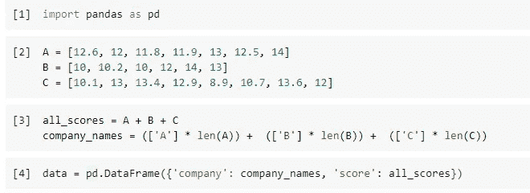

Getting our 21 observed pizza delivery times into pandas

数据现在看起来如下:

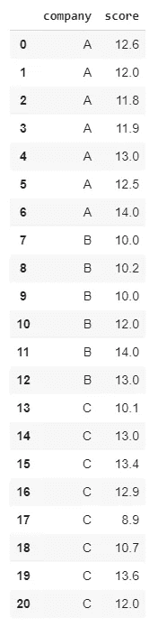

Pandas DataFrame with the pizza delivery times

每家公司的平均交付时间提供了哪家公司更快的第一手信息，在本例中，B 公司:

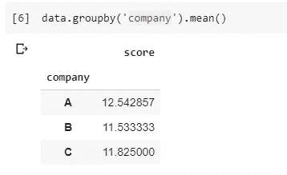

Average delivery time per company

但是，平均水平不足以很好地描述这种情况，因为交付时间存在相当大的差异。例如，原始数据显示 B 公司有时也非常慢。

为了说明 B 公司是否比 T4 公司更快，我们需要一个假设检验。如果需要的话，不要犹豫，回到这篇文章中，这篇文章对假设检验给出了直观的解释。

在当前比较 2 组以上平均值的情况下，我们需要一个单向方差分析。

# 2.ANOVA 是如何工作的？

ANOVA 模型从估计比萨饼交付时间中存在的总变化量开始(这就是为什么它被称为方差分析)。

查看我们的示例，我们可以说比萨饼的交付时间从 8.9 分钟到 14.0 分钟不等。如果我们忽略关于公司的信息，我们对新的比萨饼外卖的最佳估计是 8、9 和 14 分钟之间。我们暂且称之为*总变差*。

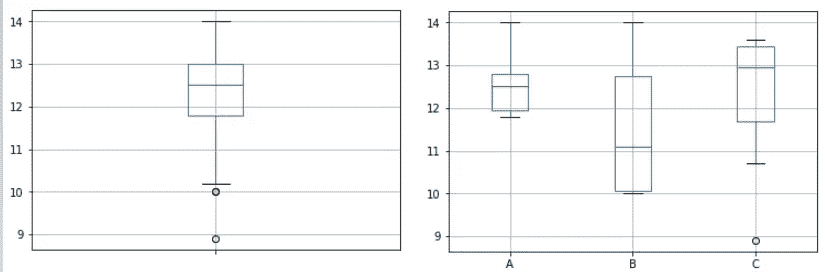

The companies’ average delivery time is more valuable information than the overall average delivery time

下一步是将这个总的变化分成两部分:组间变化和组内变化

## 组间差异由我们的变量公司解释

如果我们在图表中添加变量 *company* ，我们会发现，如果我们知道哪家公司配送我们的披萨，我们就可以给出更精确的配送时间范围。

*   如果 A 公司送货，需要 11，8 到 14 分钟。
*   如果 B 公司送货，需要 10，0 到 14，0 分钟。
*   如果 C 公司送货，需要 8.9 到 13.6 分钟。

这种现象是由于组间变异:由我们的变量解释的变异的量化。

## 我们的可变公司无法解释组内变化

但是，也有一部分变化是我们的变量“公司”无法解释的:我们仍然不知道为什么 A 公司的交付时间在 11、8 和 14 之间存在差异，我们需要更多的变量来解释这一点。

由于我们没有这些新的变量，这种变异仍然无法解释，被称为*组内变异*。

## 方差分析:组间差异的假设检验

当总变差被一分为二时，应用假设检验来找出在我们的 21 个样本中观察到的差异是否具有**显著性:**

*   是一家比萨公司**系统地更快**，还是这种随机噪声是由于抽样效应？

我们需要一个统计测试来给我们这个答案:ANOVA F-test(T7 ),这将在本文的剩余部分中详细讨论。

# 3.使用统计模型的方差分析

在 Python 中，可以如下获得单向 ANOVA F 检验:

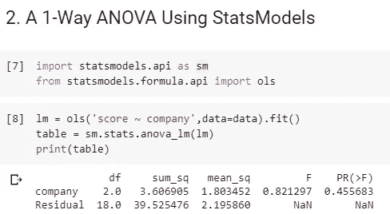

1-Way ANOVA table

为了理解这个表中发生了什么，我现在从头开始展示 ANOVA 表中每个值的计算！

# 4.使用数学和 python 的方差分析——从零开始

[**跟着 Python 笔记本过来吧！**](http://bit.ly/1-way-anova-notebook)

## 4.1.平方和总计

我们开始行动吧！我之前描述的变化是用平方和来计算的，

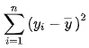

Sum of Squares

为了达到这个目的，我们首先计算整体平均值

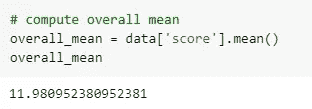

Compute overall mean for ANOVA

然后计算原始分数和总平均值之间的平方差之和:

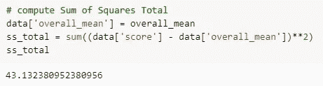

Compute the Sum of Squares Total

通过对 *sum_sq* 列求和，可以在 *statsmodels* 的 ANOVA 表中找到该值。

## 4.2.残差平方和

残差平方和的计算略有不同，因为它采用的不是整体平均值，而是三组平均值。

我们需要从其组的平均值(其自己的比萨饼公司的平均值)中减去每个值，然后对这些差值求平方并求和。

下面是 Python 中的实现方式:

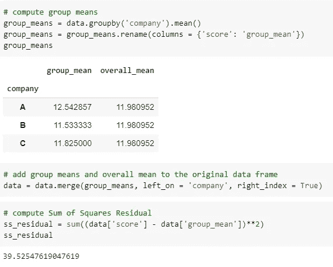

Compute Sum of Squares Residual

我们可以在 *sum_sq* 下的 statsmodels 的 ANOVA 表中的 *Residual 行找到该值。*

## 4.3.解释的平方和

计算了总平方和和残差平方和后，我们现在可以使用以下公式计算解释的平方和:

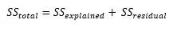

Summation of Sums of Squares

因为我们已经有了 SS 残差和 SS 总数，我们可以做一个简单的减法来得到 SS 解释。为了达到这一目的，我们采用每组平均值和总体平均值之间的平方差的加权和，如下所示:

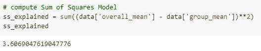

Compute Sum of Squares Model

该值可在 c*company 行的 *sum_sq* 下的 *statsmodels* 表中找到。*

## 4.4.自由度

在本文中，我不会深入探讨自由度，但我们在进一步的计算中需要用到它们:

*   df1 =被解释部分的 df1 =组数-1
*   df2 =残差的 df2 =观察次数-组数

在我们的示例中，df1 = 2，df2 = 18。

## 4.5.均方差

方差分析中最重要的统计检验是 f 检验。零假设表明所有组的平均值是相等的，这意味着我们的模型没有解释价值，我们没有证据选择一家比萨饼公司而不是另一家。

另一种假设认为，至少有一种方法是不同的，这将是更深入地了解哪家或哪些公司更快的原因。

我们计算均方如下:

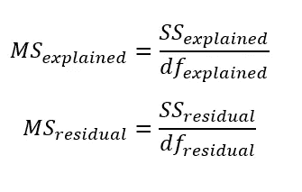

Computing the Mean Squares

下面是 Python 中的实现方式:

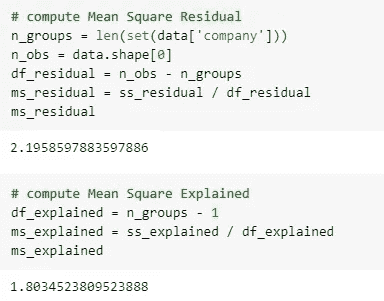

Computing the Mean Squares in Python

## 4.6.f 统计量

我们使用均方差来计算 F 统计量，作为解释变量与未解释变量之间的比率:

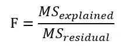

Computing the F statistic

以下是 Python 中的实现:

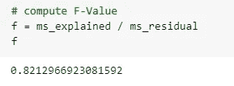

Compute the F score in Python.

## 4.7.p 值

在假设检验中，p 值用于决定一个替代假设是否可以被接受(如有必要，在此阅读更多关于 p 值的内容)。

如果 p 值低于 0.05，我们拒绝零假设，支持替代方案:这意味着至少有一个组均值**显著不同**。

我们使用具有 df1 和 df2 自由度的 *F 分布计算 P 值，在我们的例子中是 F(2，18)分布。使用概率计算，我们发现 p 值如下:*

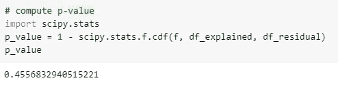

Compute the p-value using scipy

## 4.8.解释 p 值

我们必须将 p 值与我们选择的α值进行比较，在本例中，α值为 0.05。

我们的 p 值 0.45 大于 0.05，所以我们不能拒绝我们的零假设，也不能接受我们的替代方案。尽管三个样本的平均值不同，**我们没有统计上的显著差异。**

这意味着，根据观察到的数据，没有足够的证据来假设三家披萨公司的送货时间存在普遍差异。

# 5.结论

在本文中，方差分析使我们能够从统计上检验样本差异是否可以概括为总体差异。

在我们的数据中，一家披萨公司的平均速度更快，但由于方差分析，我们意识到这种差异并不显著:我们没有足够的证据来得出一家公司总体速度更快的结论*。*

这完美地说明了统计推断的目标:判断观察到的差异是否显著。

我希望这篇文章对你有用，并祝你在单向方差分析中好运。感谢阅读！