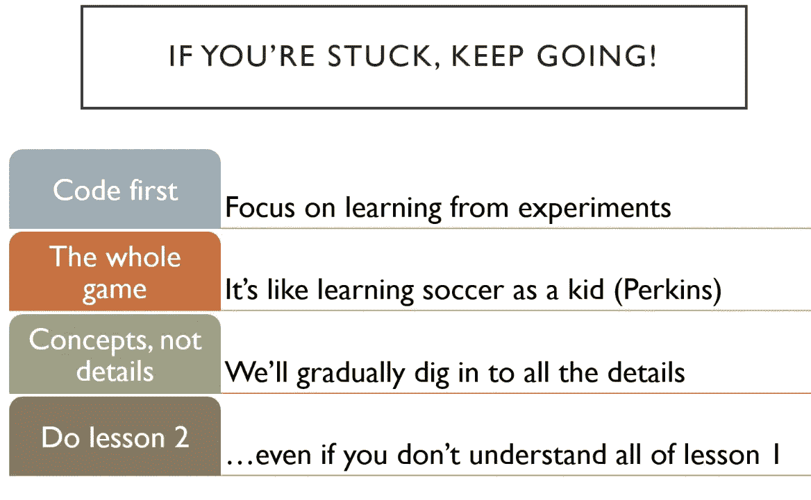

# 一万种行不通的方法

> 原文：<https://towardsdatascience.com/10-000-ways-that-wont-work-311925525cf0?source=collection_archive---------23----------------------->

## fast.ai《程序员实用深度学习》第三课

> “我没有失败。我刚刚发现了一万种行不通的方法。”
> 
> ~托马斯·爱迪生

我是一名数学助教，正在努力学习 fast.ai 的[“程序员实用深度学习”](https://course.fast.ai/)的[第三课](https://course.fast.ai/videos/?lesson=3)，这一周对我来说是一个主要的骄傲吞咽者。在第二课结束时，我能够构建一个模型，将画作分类为毕加索或莫奈的作品，并将我的模型投入生产([在此尝试一下！](https://picasso-or-monet.onrender.com/))。

然而，这个星期，我什么也没做出来。我遵循了我通常的 fast.ai 工作流程:我看了一遍讲座，然后边看边翻阅笔记本，根据需要暂停。当我复习第二次(第三次，第四次…)时，我将宝贵的详细版讲稿放在手边。

Photo by [Lukas Blazek](https://unsplash.com/@goumbik?utm_source=unsplash&utm_medium=referral&utm_content=creditCopyText) on [Unsplash](https://unsplash.com/s/photos/studying?utm_source=unsplash&utm_medium=referral&utm_content=creditCopyText)

所以这个星期，我打开了讲座中使用的第一个笔记本，这是一个多标签分类器，使用了 Kaggle 的[“星球:从太空了解亚马逊”](https://www.kaggle.com/c/planet-understanding-the-amazon-from-space)数据集。我计划用那个数据集运行笔记本，就像在讲座中一样，然后获取另一个数据集，并确保我仍然可以让它工作。

但是我甚至不能让笔记本像在课堂上那样运行。使用 Kaggle API 获取数据、查看数据、拟合网络头部以及拟合一个周期都很顺利，但是当需要为整个模型绘制学习率图时，我得到了以下错误:

`RuntimeError: CUDA out of memory. Tried to allocate 2.00 MiB (GPU 0; 7.43 GiB total capacity; 6.89 GiB already allocated; 2.94 MiB free; 47.24 MiB cached)`

我毫不气馁，转向 fast.ai 论坛，看看是否还有人遇到过这个问题。[有人有](https://forums.fast.ai/t/lesson-3-in-class-discussion/29733/608?u=go_go_gadget)，他们的问题通过减少批量解决了。也许那对我也有用！

没有。我尝试通过将`bs=32`作为参数传递给`databunch()`函数来将批处理大小设置为 32，还尝试了`bs=16`、`bs=4`和`bs=2`，但是我一直得到相同的错误。`bs=1`给了我一个不同的错误，因为该函数进行比较，所以每批需要多个项目。于是我[自己在论坛发帖](https://forums.fast.ai/t/lesson-3-in-class-discussion/29733/761?u=go_go_gadget)。

没有人回答这个问题，但我在 fast.ai 网站上找到了一个关于 CUDA 内存错误的[文档](https://docs.fast.ai/troubleshoot.html#cuda-out-of-memory-exception)。它说要减少批量大小或训练一个更小的模型，这是我尝试过的，所以因为那时我已经花了整整三天试图解决这个问题，我把笔记本放在一边。

其他笔记本——使用 [CAMVID 数据集](http://mi.eng.cam.ac.uk/research/projects/VideoRec/CamVid/)进行图像分割，以及使用 [BIWI 头部姿态数据集](https://data.vision.ee.ethz.ch/cvl/gfanelli/head_pose/head_forest.html#db)进行图像回归——至少进展顺利。

在讲座的最后，Jeremy 说我们应该尝试思考一个有趣的多标签分类、图像回归或图像分割问题，并警告我们最具挑战性的部分将是创建我们的数据集群。他绝对是对的！

fastai 库有一个名为 data_block API 的工具，它完成了大量繁重的工作，包括将数据分成训练集和验证集以及它们的标签，并设置它们以加载到您的模型中。只涉及到 10 行代码，但我并不真正理解第 0 步是什么:我不知道如何为它选择数据集，如何让数据集准备好成为数据束，一般来说，我只是觉得它难以理解。在接下来的四天里，我阅读了 [data_block API 文档](https://docs.fast.ai/data_block.html)，Wayde Gilliam 的[“寻找数据块涅槃(快速 ai 数据块 API 之旅)](https://blog.usejournal.com/finding-data-block-nirvana-a-journey-through-the-fastai-data-block-api-c38210537fe4)”，以及几十个论坛帖子，但我仍然只是.没有.明白。

Photo by [JESHOOTS.COM](https://unsplash.com/@jeshoots?utm_source=unsplash&utm_medium=referral&utm_content=creditCopyText) on [Unsplash](https://unsplash.com/s/photos/studying?utm_source=unsplash&utm_medium=referral&utm_content=creditCopyText)

Jeremy 说我们会经常回到 data_block API，所以我会采纳下图(本课程第 1 课的幻灯片)的建议，收起我的骄傲，继续学习第 4 课，而不会觉得自己已经稍微掌握了第 3 课。口碑-口碑。

Slide from Lesson 1 of the course, found on [https://hackernoon.com/how-not-to-do-fast-ai-or-any-ml-mooc-3d34a7e0ab8c](https://hackernoon.com/how-not-to-do-fast-ai-or-any-ml-mooc-3d34a7e0ab8c)

关于此主题的其他帖子:

第一课:[fast . ai 入门](/getting-started-with-fast-ai-350914ee65d2)

第二课:[对孕检结果进行分类](/classifying-pregnancy-test-results-99adda4bca4c)！

第二课(续):[深度学习能比鸽子表现得更好吗？](/can-deep-learning-perform-better-than-pigeons-d37ef1581a2f)

第四课:[预测服务员的小费](/predicting-a-waiters-tips-1990342a0d02)

第五课:但是泡菜去哪里了？

第六课:[每个人都想成为一只猫](/everybody-wants-to-be-a-cat-6dd6190c5d9c)我是一名南加州大学东湾分校的数学讲师，也是一名有抱负的数据科学家。在 [LinkedIn](https://linkedin.com/in/laura-langdon/) 上和我联系，或者在 [Twitter](https://twitter.com/laura_e_langdon) 上和我打招呼。