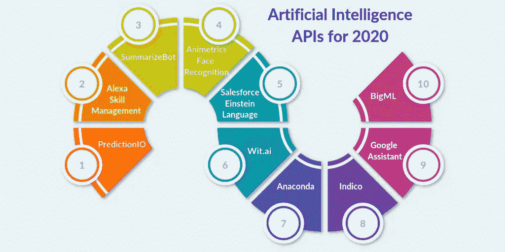

# 2020 年要考虑的 10 个人工智能 API

> 原文：<https://towardsdatascience.com/10-artificial-intelligence-apis-to-consider-for-2020-4b8147578833?source=collection_archive---------44----------------------->

你认为开发人员会自己编写整个软件的代码吗？即使他们想也做不到。软件代码很复杂，包含数百万个逻辑。开发人员最终可能会感到困惑，搞乱整个软件。

这就是应用编程接口(API)的用武之地。对于那些不知道的人来说，API 是一种现成的代码，有助于将单调的任务数字化和将复杂的功能自动化。现在，每个 IT 服务领域都有它的 API:网站开发、手机 app 开发、联网、DevOps。甚至当涉及到[人工智能开发服务](https://www.signitysolutions.com/ai-machine-learning-development-services)时，我们有一些特定的 API 使得整个人工智能应用程序开发&部署过程变得更加容易。

在这篇博客中，我列出了 10 个最受欢迎的 API。这些 API 将是人工智能(AI)行业中最常用的。我在对流行的人工智能和机器学习咨询服务进行了广泛的研究和讨论后，收集了这个列表。为此，非常值得你花时间。因此，仔细阅读列表，决定哪一个符合您的要求:

# 2020 年十大人工智能 API

[Signity Solutions](https://www.signitysolutions.com/blog/wp-content/uploads/2019/10/10-Artificial-Intelligence-APIs-to-Consider-for-2020-1024x512.png)

# 1.Alexa 技能管理 API

大家都知道亚马逊的智能助手 Alexa 吧？它通过允许人们使用语音命令与设备进行交互而改变了人们的生活，这种方式非常壮观。

Alexa 技能管理 API 允许开发者通过为 Alexa 智能助手创建、管理和测试新技能来更新交互模型。这些技能可以是任何东西——比如播放你最喜欢的歌曲，阅读新闻标题，打开某个网站，预订航班，支付账单，或者播放你最喜欢的电影。(如果我们相信亚马逊，有超过 70，000 种技能可用。

这样使用 Alexa 技能管理 API，开发者可以将 Alexa 智能助手的功能提升到一个全新的水平。该 API 对开发 Alexa 智能助手的开发人员非常有用。

# 2.谷歌助手 API

Google Assistant API 允许开发者将 Google 智能助手嵌入到移动应用、扬声器、智能显示器、手表、汽车、笔记本电脑、电视和其他 Google Home 设备中。这样做可以在这些设备中实现语音控制，让用户搜索天气、交通、新闻、航班、添加提醒和管理任务，并通过使用他们的手机来控制智能家居设备。类似热门词汇检测、自然语言理解和其他智能服务的功能在谷歌助手 API 的帮助下也是可行的。所以，对于希望让自己的人工智能应用更智能、更高效的人工智能开发者来说，这个 API 可以成为一个很好的资源。

# 3.BigML

从事 BigML 工作的开发人员同意其公司的说法，即它是人工智能和机器学习的最简单的 API。嗯，这是因为 API 包含了令人印象深刻的功能，如异常检测和旭日东升可视化。这意味着开发人员可以完美地使用它，即使他们没有以前的经验。此外，还有案例研究和用户指南来帮助开发人员，以防他们在任何任务中遇到困难。

因此，API 甚至可以帮助新手人工智能开发人员以无与伦比的专业知识执行他们的任务。难怪它是目前可用的最优选的人工智能 API。

# 4.预测

PredictionIO 是你在理想的人工智能 API 中想要的一切。它可以免费部署，提供了各种可定制的模板，并能够在部署为 web 服务后动态响应查询。更令人兴奋的是，PredictionIO API 附带了包含开发人员说明和演示教程的详细文档。这意味着开发者在充分利用它的时候不会遇到任何问题。

最重要的是，API 会定期更新。这意味着使用它的开发人员会不时遇到新的特性。

# 5.Animetrics 人脸识别

对于正在寻找一个 API 来创建面部软件或只是简单地进行图像分析的开发人员来说，Animetrics 人脸识别是正确的选择。找原因？嗯，这里有一些:

首先，Animetrics 人脸识别软件的工作很简单。它检测照片中的人脸，并将它们与已知人脸集进行匹配。

第二，API 返回关于面部特征或地标的信息，作为图像上的坐标。

第三，开发人员可以使用 API 轻松地从图库中上传或提取主题，甚至从主题中删除人脸。

通过这种方式，这些开发人员可以使用这种人工智能 API 轻松获得面部识别和图像分析所需的相关信息。如果你问我，这个人工智能 API 对于开发者来说无疑是一个很好的选择。

# 6.Wit.ai

Wit.ai 用于为家庭自动化、联网汽车、机器人、智能手机和可穿戴设备等人工智能系统构建智能语音接口。

人工智能 API 是我最喜欢的选择，它可以在人工智能系统中为开发人员提供强大的语音自动化工具。不仅仅是因为它帮助他们轻松地传输和处理来自人类互动的自然语言。还因为它通过鼓励开发人员与社区中的其他人共享他们的发现来促进合作和共享的文化。Wit.ai 帮助每个人成长。也许，这是主要原因之一，Wit.ai API 因创建高度先进的人工智能系统而受到全球开发者的青睐。

# 7.Salesforce 爱因斯坦语言

如果你正在寻找一个有效的人工智能 API 来分析来自电子邮件、聊天或网络表单的文本，没有比它更好的选择了:Salesforce Einstein 语言 API。背后最大的原因是

API 将文本情感分为积极、消极和中性类别，以理解文本背后的情感。(我们也可以创建自定义模型或使用预建的情感模型。)然后，API 将文本分类到用户定义的标签中，以理解用户发送文本的意图。因此，通过这种方式，Salesforce Einstein 语言 API 可以让开发人员轻松理解他们从电子邮件、消息或任何 web 表单中收到的任何文本背后的意图。

# 8.蟒蛇

Anaconda 是一个由 Python 支持的企业级安全和可伸缩的 API。开发人员用它来控制数据科学资产。使用 API 的主要原因之一是它允许开发者访问 700 多个易于安装的软件包。此外，您可以使用 Anaconda 快速地将项目部署到交互式数据应用程序、实时笔记本和 ML 模型中。正因如此，许多开发者都在使用它。

# 9.Indico

Indico 无疑是用于预测分析的最佳人工智能 API 之一，原因是它的工作速度非常快。API 有两个选项。其中一个进行文本演变(情感分析、参与度、情感)，另一个进行文本演变(面部情感、面部定位)。这样，API 可以很容易地预测照片和文本，而不必获得任何正式的培训。难怪 Indico API 是每个想要创建高级文本和图像分析系统的人的最爱。

# 10.SummarizeBot API

SummarizeBot API 用于人工智能系统和区块链驱动的解决方案的文本和多媒体分析。这个 API 非常适合这些功能是有原因的。使用 API，您可以轻松地从文档或网站中抓取重要信息，从视频、图像和 gif 中进行情感分析和提取。此外，还有超过 100 种语言，以及对多种文件格式的支持。总的来说，人工智能提供了很多，开发者应该选择它。

## 结论:

那么，现在你有 10 个最好的人工智能 API，你可以在 2020 年考虑。现在，您的工作是确定哪一个满足您的业务需求。你当然可以借助人工智能开发公司，有足够的知识和经验。所以，赶紧伸出手吧。

*原载于 2019 年 10 月 15 日*[*【https://www.signitysolutions.com】*](https://www.signitysolutions.com/blog/artificial-intelligence-apis/)*。*