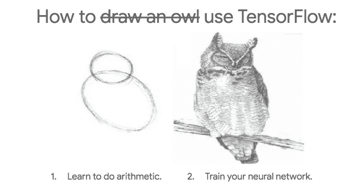

# 学生的 10 本最佳数据科学读物

> 原文：<https://towardsdatascience.com/10-best-data-science-reads-for-students-3bae97d9bb23?source=collection_archive---------5----------------------->

## 学习数据概念的前 10 篇 ML 和统计文章

是时候进行一些精选了！以下是我给学生写的 10 篇最好的文章。如果你发现自己对写作很感兴趣，试着跟随文章中的链接——它们几乎总是来自同一个博客。我尽量让事情不那么无聊，让你开心。

尽情享受吧！

# #1 了解数据

 [## 什么是数据？

### 关于信息、内存、分析和分布的思考

bit.ly](http://bit.ly/quaesita_hist) 

# #2 向孩子(或你的老板)解释监督学习

 [## 向孩子(或你的老板)解释监督学习

### 既然知道了什么是机器学习，那就来认识一下最简单的那种。我的目标是让各种各样的人…

towardsdatascience.com](/explaining-supervised-learning-to-a-kid-c2236f423e0f) 

# #3 无监督学习去神秘化

 [## 无监督学习去神秘化

### 无监督学习听起来像是“让孩子们自己学习不要碰热烤箱”的一种奇特方式，但是…

hackernoon.com](https://hackernoon.com/unsupervised-learning-demystified-4060eecedeaf) 

# #4 数据科学简史

 [## 自动灵感

### 在 19 世纪，医生可能会为情绪波动开出水银处方，为哮喘开出砷处方。它可能没有…

bit.ly](http://bit.ly/quaesita_history) 

# #5 机器学习——皇帝穿衣服了吗？

 [## 机器学习——皇帝穿衣服了吗？

### 深入了解机器学习的工作原理

medium.com](https://medium.com/@kozyrkov/machine-learning-is-the-emperor-wearing-clothes-928fe406fe09) 

# #6 一句话的统计推断

 [## 一句话的统计推断

### 每一个假设测试——从 STAT101 到那些最可怕的博士资格考试——都可以归结为一句话。这是…

hackernoon.com](https://hackernoon.com/statistical-inference-in-one-sentence-33a4683a6424) 

# #7 TensorFlow 已死，TensorFlow 万岁！

 [## 张量流死了，张量流万岁！

### 如果你是一个人工智能爱好者，你没有看到这个月的大新闻，你可能只是打了个盹…

hackernoon.com](https://hackernoon.com/tensorflow-is-dead-long-live-tensorflow-49d3e975cf04) 

# #8 统计学家证明统计很无聊

 [## 统计学家证明统计很无聊

### 统计学词汇的基础知识

towardsdatascience.com](/statistician-proves-that-statistics-are-boring-4fc22c95031b) 

# #9 用小狗解释 p 值

 [## 用小狗解释 p 值

### 你会发现 p 值潜伏在数据科学(以及其他科学)中。如果你选了 STAT101…

hackernoon.com](https://hackernoon.com/explaining-p-values-with-puppies-af63d68005d0) 

# #10 什么是决策智能？

 [## 什么是决策智能？

### 人工智能时代领导力的新学科

towardsdatascience.com](/introduction-to-decision-intelligence-5d147ddab767) 

# 额外收获 1:刻薄的统计学 YouTube 课程

Catch the rest of the playlist [here](http://bit.ly/statthinking).

# 奖金 2:娱乐性机器学习课程

如果你正在寻找一门为初学者和专家设计的有趣的应用人工智能课程，这里有一个我为你制作的娱乐课程:

Enjoy the entire course playlist here: [bit.ly/machinefriend](http://bit.ly/machinefriend)

# 喜欢作者？与凯西·科兹尔科夫联系

让我们做朋友吧！你可以在 [Twitter](https://twitter.com/quaesita) 、 [YouTube](https://www.youtube.com/channel/UCbOX--VOebPe-MMRkatFRxw) 、 [Substack](http://decision.substack.com) 和 [LinkedIn](https://www.linkedin.com/in/kozyrkov/) 上找到我。有兴趣让我在你的活动上发言吗？使用[表格](http://bit.ly/makecassietalk)联系。