# 指导你在新加坡寻找数据科学工作的 10 张图表

> 原文：<https://towardsdatascience.com/10-charts-to-guide-your-search-for-a-data-science-job-in-singapore-e4e3be9f1135?source=collection_archive---------13----------------------->

## 银行薪酬最高，大多数职位都在其中。雇主大多在寻找有经验的雇员。

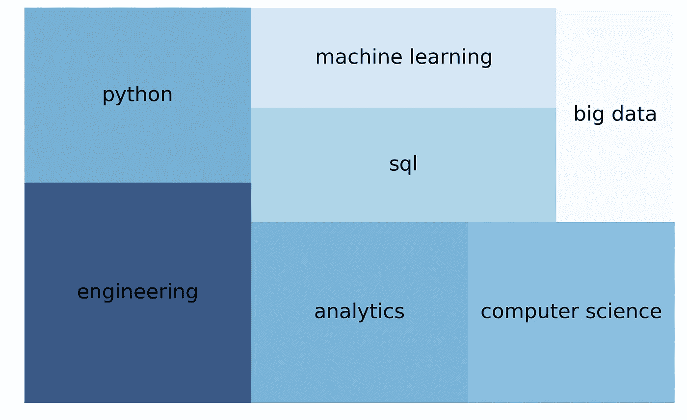

Top technical skills requested by employers hiring for data science jobs in Singapore. The size of the boxes in this simple tree map is proportional to the number of times these key words appear in job requirements posted by employers.

数据科学相关的职位是目前市场上谈论最多的工作之一，这是由行业内的传言和各种公司不断增长的需求推动的。

以下是 812 份最近的招聘启事告诉我们新加坡的雇主想要什么，以及求职者应该期待什么。

# **背景**

2019 年 4 月 27 日，作为课堂作业的一部分，我刮了政府的就业银行 [MyCareersFuture](https://www.mycareersfuture.sg/) 。这是我的项目回购的链接，但请注意，有些链接可能已经过期，因为职位发布有一个有限的保质期。

在剔除了离群值和在网络搜索中发现的奇怪角色后，我将数据集缩减到 812 个职位条目，这并不总是精确的。几家公司也公布了年薪数据，我把这些数据转换成了月薪。

# 摘要

简而言之，雇主主要寻找有经验的数据科学专业人员，他们也了解业务需求，并能领导团队。这些高级职位薪酬较高，尤其是在银行业和 IT 行业。

经验丰富的数据专业人士——尤其是高级数据科学家——将从当前的就业市场前景中获得最大收益，而那些几乎没有或根本没有经验的人应该降低他们的期望。入门级和初级数据专业人员的月薪预计不到 5000 新元。

担任高级数据职位的薪酬中值超过 8000 新元，尽管有些公司愿意为顶级人才支付更高的薪酬。让我们仔细看看主要趋势。

# 一、工作在哪里(以及高薪):

# 1.月薪中位数:6750 新元

在某些情况下，一些希望填补高级职位空缺的雇主准备支付超过 2 万新元。但数据专业人士的月薪中值更低，为 6750 新元。大约三分之一(35%)的公司提供的平均工资在 4，50 至 7，500 新元之间。

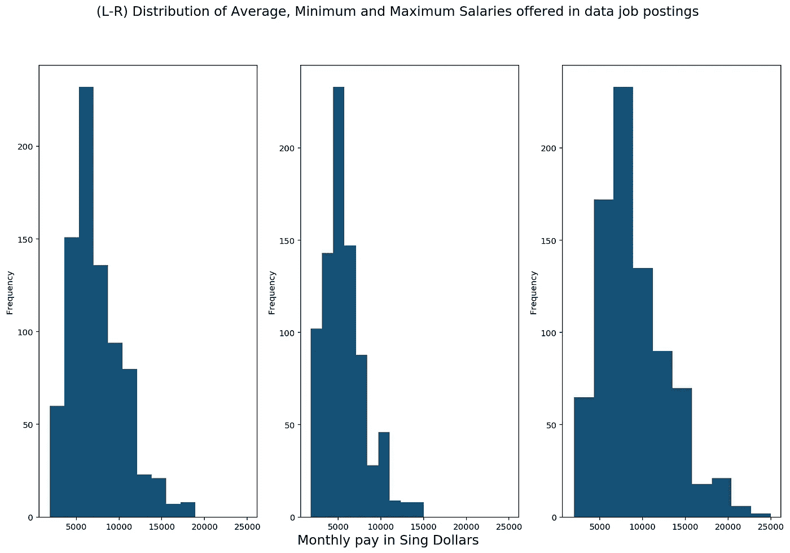

# 2.IT 行业银行薪酬最高，数据工作最多

银行和金融部门的数据工作提供最好的中等工资，而大多数空缺职位(40%)在 IT 部门(也提供有竞争力的工资)。

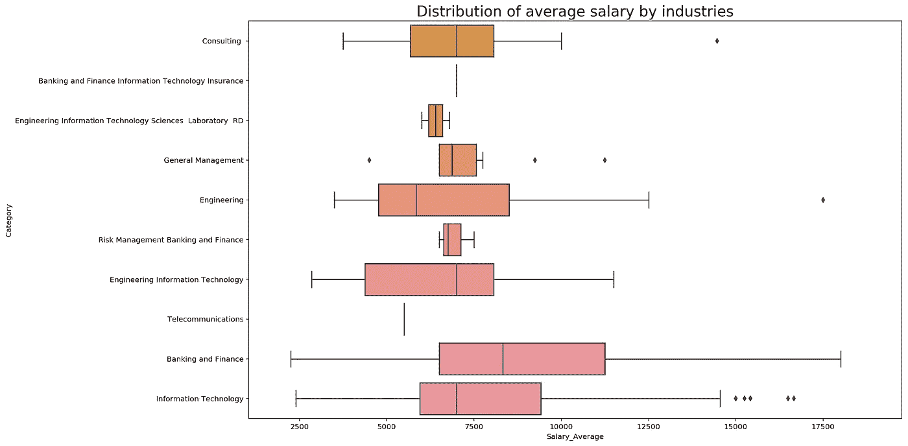

The middle “line” in each box represents the median value for that category. For a good explanation on how to interpret box plots, see: [https://www.wellbeingatschool.org.nz/information-sheet/understanding-and-interpreting-box-plots](https://www.wellbeingatschool.org.nz/information-sheet/understanding-and-interpreting-box-plots)

在招聘数据职位的公司中，星展银行提供的薪酬中位数最高，紧随其后的是安永会计师事务所和印度尼西亚旅游预订网站 Traveloka。

如果你对工作地点很挑剔，那么，你会很高兴地知道，CBD 和滨海湾的热门办公地点是一些薪酬最高的数据工作的所在地。

那些有合适技能并准备去西部稍远一点的科学园大道的人会发现默克公司和强生公司提供的两个高薪职位。

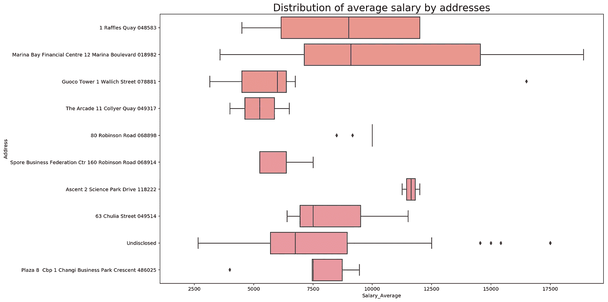

# 二。雇主在寻找什么:

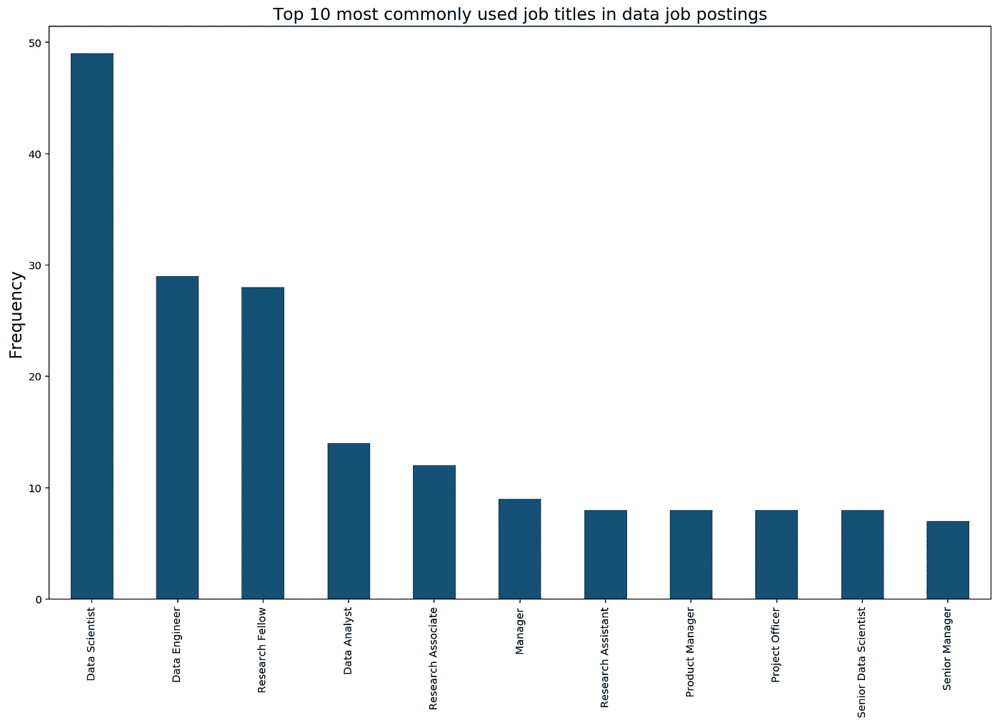

# 1.招聘:数据科学家，数据工程师

这是 812 份招聘启事中最常见的两个职位，尽管它们只占启事的 10%。这主要是因为在这个行业中，描述同一个角色的头衔有各种各样的混乱方式。

# 2.经验、商业知识、管理技能

“数据”是公司描述潜在雇员职责时最常用的词。

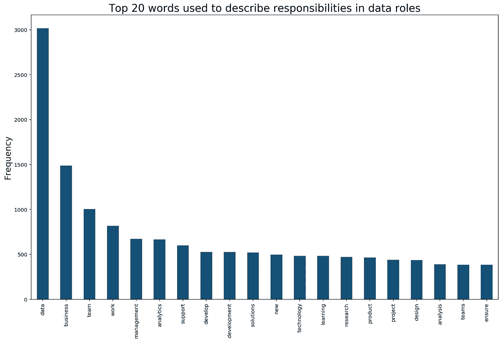

但在那之下，最常用的关键词是:业务、团队工作(显示为两个独立的词)、管理、解决方案、团队等。这与业内人士的非正式反馈是一致的，即公司不仅仅想要数据专家，还想要那些能够将他们的专业知识转化为业务需求的人。

当谈到工作要求时，雇主最常使用的词是“经验”，其次是“技能”和“知识”。

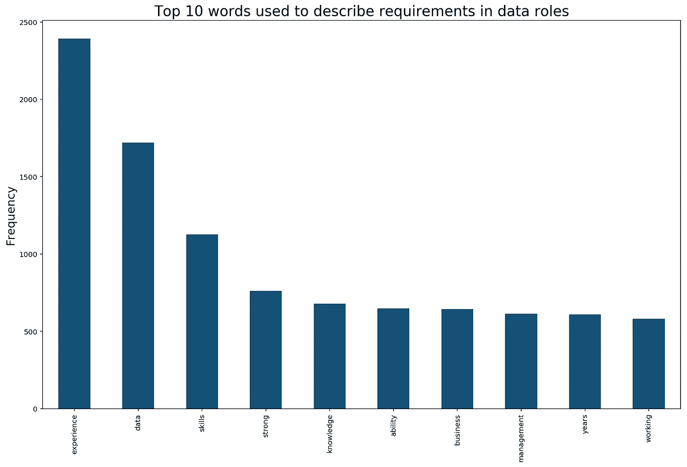

这对新来者来说可能是一个潜在的绊脚石，尽管在一个非科技或 STEM 行业出身的人大量交叉的行业，“经验”可以有某种程度的宽泛解释。

# 3.技术要求:Python，SQL，计算机科学背景，工程技能

令人惊讶的是，用来描述技术技能的术语并不在十大需求之列。它们只出现在数据科学角色工作要求中使用的前 20 个关键词列表中。在我的数据集中，“工程”是最顶级的技术技能术语，其次是“Python”、“分析学”、“计算机科学”和“SQL”。

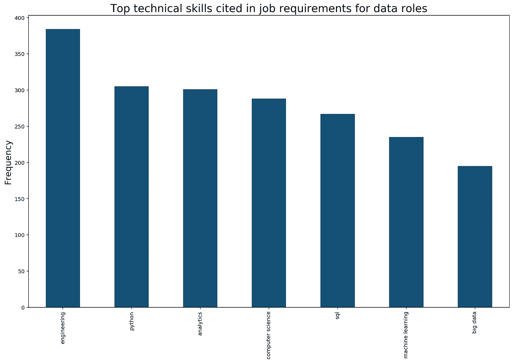

引用更高级技能的术语，如“机器学习”和“大数据”，出现在列表的更靠后的位置，尽管仍在职位要求描述中最常用的 50 个词之列。“深度学习”不在关键词的前 50 名之列，这反映了它在新加坡就业市场的相对利基地位。

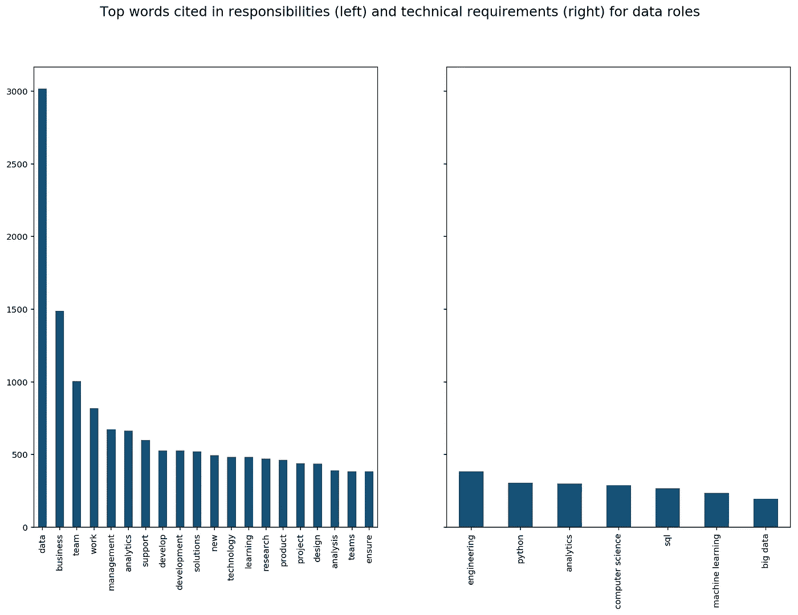

A side-by-side comparison of the top words used to describe job responsibilities and desired technical skills in data roles.

# 求职者应该知道的:

# 1.经验是你的主要财富

很明显，那些有更多经验的人会要求更高的报酬。但是有经验和没有经验的雇员之间的工资差距的视觉确认和感觉总是好的:

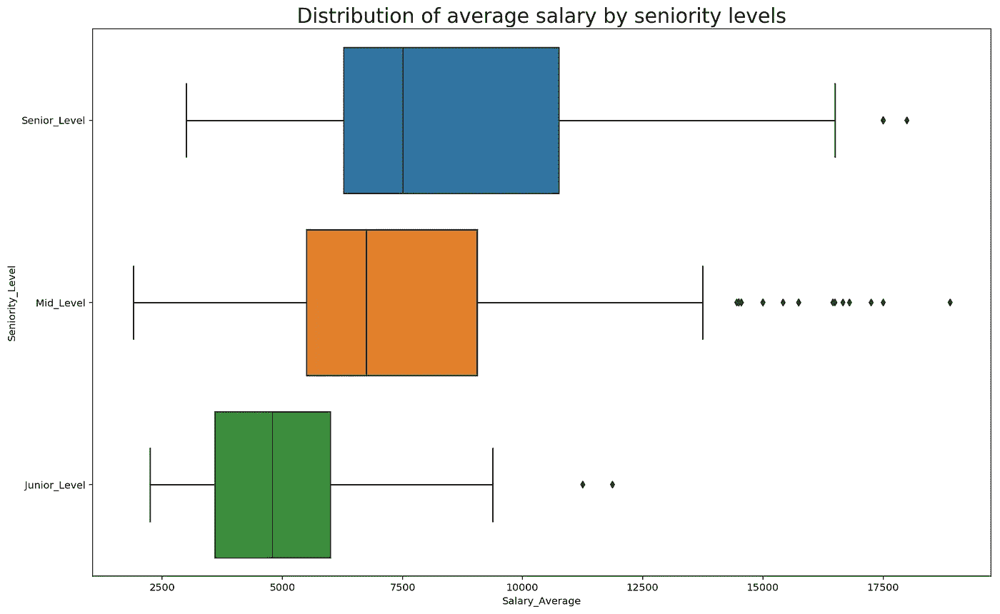

# 2.对那些“处于中间”的人来说，良好的工作流动性

处于中间位置的数据专业人员——有一些年的经验，但还不被认为是老手——会为大多数空缺职位(几乎 74%)都是中级职位而欢呼。这将为初级数据专业人员提供晋升的机会，对于那些已经处于中间类别的人来说，他们可以在不同的部门之间横向移动，或者晋升到高级职位。

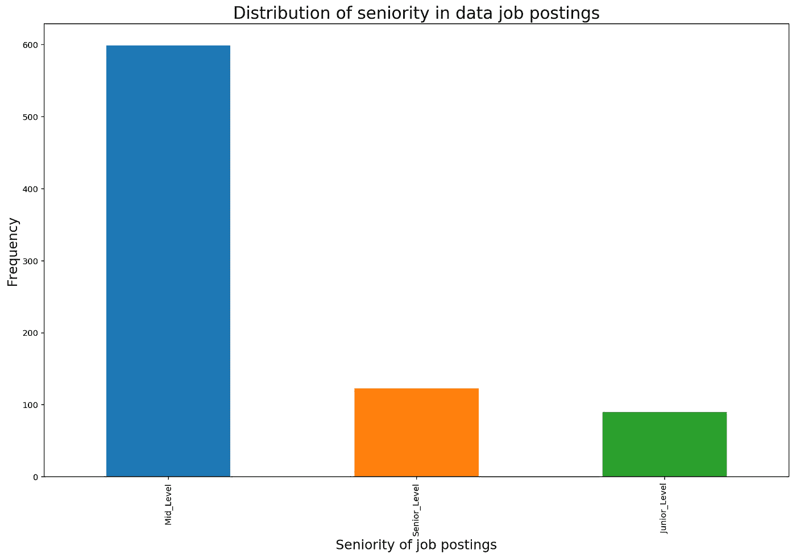

# 3.如果你是新人，管理你的期望

上面的两张图表显示了为什么新人需要对他们的求职和薪水期望持现实态度。在 812 个数据职位空缺中，只有 90 个(11%)是初级或入门级职位。工资中位数自然也是最低的，每月不到 5000 新元。

# 4.实习和临时工作安排很少

数据专业人员需要处理大量的敏感数据。这可能是为什么绝大多数职位空缺都是永久性的，而实习或临时工作的机会很少的一个原因。但很有可能是公司没有正式为这些职位做广告。

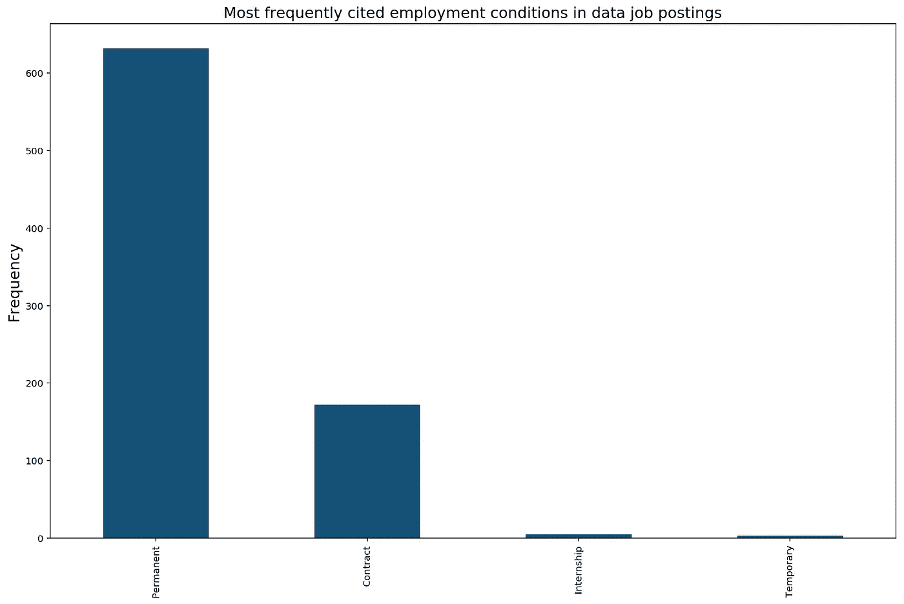

这里是这些图表的[数据集](https://github.com/chuachinhon/ga_project4_cch/blob/master/data/jobs_clean.csv)和我的 [Jupyter 笔记本](https://github.com/chuachinhon/ga_project4_cch/blob/master/notebooks/1.2-cch-project4-Visualisation.ipynb)的链接。

为了这个项目，我还必须建立一系列机器学习模型，试图预测[的高薪](https://github.com/chuachinhon/ga_project4_cch/blob/master/notebooks/2.0-cch-project4-Question1_Modelling.ipynb)，以及招聘信息中提供的职位的[资历。](https://github.com/chuachinhon/ga_project4_cch/blob/master/notebooks/3.0-cch-project4-Question2_Modelling.ipynb)

这项练习有助于磨练我构建和评估机器学习模型的技能，尽管我不认为数据集足够大或足够细，可以产生远远超出我们从这些图表中所能辨别的主要见解。但是将这些模型应用到一个更大的数据集会很有趣，如果我将来能得到一个的话。

同时，祝你找工作好运！

源链接:

[*Github 回购*](https://github.com/chuachinhon/ga_project4_cch)

[*原始数据来源*](https://www.mycareersfuture.sg/)