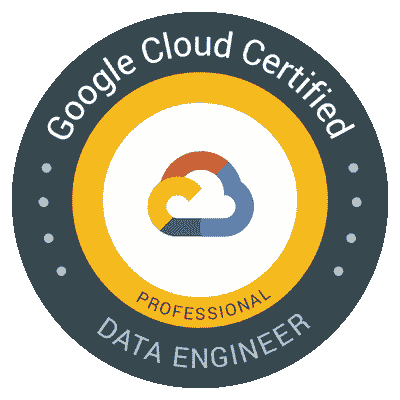
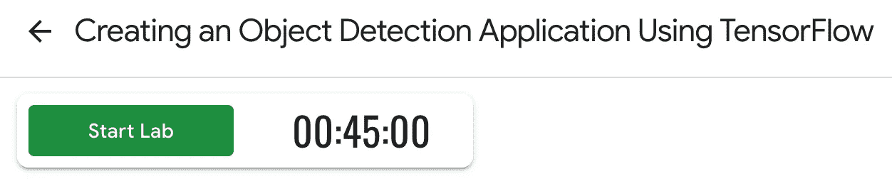

# 10 天成为谷歌云认证专业数据工程师

> 原文：<https://towardsdatascience.com/10-days-to-become-a-google-cloud-certified-professional-data-engineer-fdb6c401f8e0?source=collection_archive---------4----------------------->

最近参加了更新的 [Google Cloud 认证专业数据工程师考试](https://cloud.google.com/certification/data-engineer)。为考试而学习是用谷歌云学习数据工程过程的一个很好的方法。

如果你想使用谷歌云产品并且:

*   是一名数据工程师
*   想成为一名数据工程师
*   想建立一家科技公司
*   是一名数据科学家，希望了解整个数据管道

在这篇文章中，我将分享什么，为什么，以及如何帮助你在考试中尽最大努力。🎯

Aim for the apple.

# 为什么

让我们先解决*为什么*的问题。我决定参加谷歌云认证专业数据工程师考试有两个原因。首先，我想了解更多关于数据工程和机器学习的谷歌云产品。第二，我想通过考试，证明我已经掌握了信息。😃

出于几个原因，我选择了谷歌考试，而不是 AWS 和微软 Azure。首先，谷歌在机器学习和人工智能方面是领先的云提供商。如果我要在这个领域创办一家公司，它们也是我会使用的平台。

与其他主要云服务相比，谷歌拥有最清晰的帮助文档和最好的 UX。他们也有最低价格的[GPU](/maximize-your-gpu-dollars-a9133f4e546a)和[最强大的机器](https://cloud.google.com/tpu/)用于训练深度学习模型。

此外，谷歌考试有很好的学习材料，我们将在下面深入探讨。这也是一个专业水平的考试，这意味着它很难，但通过意味着最高水平的掌握。最后，专业数据工程师考试在 2019 年 3 月更新，所以我认为它应该比一个更老的，未更新的考试更相关。

如果你是一名数据人员，并且更喜欢 AWS，请参加[机器学习](https://aws.amazon.com/certification/certified-machine-learning-specialty/)和[大数据](https://aws.amazon.com/certification/certified-machine-learning-specialty/) [专业证书](https://aws.amazon.com/certification/?nav=tc&loc=3)考试。每本 300 美元，外加每次模拟考试 40 美元。

如果你对微软 Azure 感兴趣，他们有两个考试必须通过才能获得[认证:Azure 数据工程师助理](https://www.microsoft.com/en-us/learning/azure-data-engineer.aspx)称号。Azure 考试的修改日期是 2019 年 6 月 21 日。

# 学习计划

作为背景，我使用过许多谷歌云产品，但在开始准备考试之前，我不知道 BigQuery 和 Bigtable 之间的区别。我也没有做过多少数据工程工作。

这不是一两天就能应付的考试。我怀疑几乎没有人不好好学习就准备参加这个考试；谷歌产品及其选项的数量变化如此之快。

以下是我用来准备考试的资源。下面的格式是受[丹尼尔·伯克](https://medium.com/u/dbc019e228f5?source=post_page-----fdb6c401f8e0--------------------------------)的有用帖子的启发，我用它来指导我的学习计划。

# Linux 学院

**乐于助人** : 7.5/10

Linux 学院的谷歌云认证专业数据工程师[课程](https://linuxacademy.com/google-cloud-platform/training/course/name/google-cloud-data-engineer)内容不错。这门课程有视频、测验、一本[清晰图表电子书](https://www.lucidchart.com/documents/view/0ca44a63-4ea4-4d78-8367-2465512d21be/1)和一次期末考试。Linux 学院提供免费的 GCP 实践时间。它还有一个有用的社区 Slack 频道。

我在学习的时候记了很多笔记——其中大部分来自 Linux 学院的视频。

A legal pad before studying.

截至 2019 年 6 月初，该课程没有针对新考试进行更新，因此它没有发挥应有的作用。导师表示，这些资料可能会在 2019 年 6 月下旬全部更新。

Linux Academy 期末考试从谷歌官方实践考试中抽取了一些问题。如果你在 2019 年 6 月中旬参加考试，不要太相信最终的考试结果。测试没有完全更新，实际的考试问题感觉更难。

总的来说，UX 还不错，但是有一些小问题(例如，视频不是全屏就是太小)。

一句话:Linux Academy 是一个很好的基础，但是你可能想等到他们的培训材料更新后再开始为考试学习。

Linux Academy 每月 49 美元，按月付费，7 天免费试用。

# Qwicklabs 实验室

乐于助人:5.5/10

快速实验室练习的重点不是考试。我发现这对整体学习来说很好，但如果你想弄清楚你需要为考试学习什么，那就没什么帮助了。

和 Linux Academy 一样，Qwicklabs 提供了一个 Google Cloud 沙盒用于练习。Qwicklabs 在沙盒中检查你的进度，这很好。它没有视频。

UX 没问题。每节课的倒计时有点分散注意力和压力——然而实际的谷歌考试也有倒计时。Qwicklabs 计时器很大——如果它会分散注意力，我建议将窗口的这一部分移到屏幕之外。

Qwicklabs countdown timer example

在做互动练习时，我建议并排设置你的窗口——一个用于教学，一个用于你在 GCP 的工作。

Qwicklabs 的课程可以购买学分。你可以每月花 55 美元购买无限制的 Qwicklabs 套餐。折扣代码可以在 [sathish vj](https://medium.com/u/ba857441758a?source=post_page-----fdb6c401f8e0--------------------------------) 的帖子[这里](https://medium.com/@sathishvj/qwiklabs-free-codes-gcp-and-aws-e40f3855ffdb)获得。

我建议先做 Linux Academy，然后用 Qwicklabs 多练习。

# 乌德米

乐于助人:5.5/10

本资源由三个 50 题的带计时器的模拟考试组成。实践考试有一些更新的问题，但仍然有旧的案例研究问题。他们使用了与 Linux academy 相同的 Google 官方实践考试题。几个问题有语法问题。此外，现在有几个问题是不正确的。比如现在有一个 BigQuery ML K-means 算法。

我确实通过考试和复习答案学到了东西。答案是详细的，并链接到源文档。只是不要太相信分数。真正的考试感觉难多了。😄

总的来说，这些考试不是很好，但我发现它们值得花时间和金钱，因为没有什么好的选择。

一次性购买 9.99 美元(价格可能会有变化——我先看到的是 10.99 美元)。

# Coursera

谷歌推荐参加 GCP 专业的 [Coursera 数据工程、大数据和机器学习。这个专业包括五门 Coursera 课程。我决定不参加，因为它看起来好像没有为修订后的考试更新过——它参考了旧的考试案例。事后看来，我会选择这些课程，因为它们看起来相当全面。](https://www.coursera.org/learn/preparing-cloud-professional-data-engineer-exam?utm_source=googlecloud&utm_medium=institutions&utm_campaign=GoogleCloud_Cert_Prep_PDE)

# 官方实践考试

乐于助人:5.5/10

谷歌官方实践考试在网上是真实考试的迷你版。问题是最相关的；我只是希望有更多这样的人。如上所述，其他一些人也在他们的模拟考试中使用这些问题。

你必须填一张表格来参加模拟考试，但是它是免费的。

# 其他好资源

这里是我用来准备考试的小抄、博客帖子和其他资源。

*   特立独行的林的小抄[在这里](https://github.com/ml874/Data-Engineering-on-GCP-Cheatsheet/blob/master/data_engineering_on_GCP.pdf)很好，但是在三月考试前刷新。
*   [广 X](https://medium.com/u/faf29a77ec33?source=post_page-----fdb6c401f8e0--------------------------------) 的[这里的](https://medium.com/weareservian/google-cloud-data-engineer-exam-study-guide-9afc80be2ee3)是预更新的考试。
*   [Dmitri Lerko](https://medium.com/u/857e12d5597a?source=post_page-----fdb6c401f8e0--------------------------------) 的帖子[这里](https://deploy.live/blog/google-cloud-certified-professional-data-engineer/)反映了更新后的考试。
*   [Chetan Sharma](https://medium.com/u/138b47b69562?source=post_page-----fdb6c401f8e0--------------------------------) 的帖子[这里](https://medium.com/@chetansharma90)也反映了更新的考试。
*   官方的谷歌云文档内容丰富。你肯定想花些时间给他们做笔记。不是所有的最新材料都在考试中，但学习这些都很有好处。😃例如，下面是 [BigQuery](https://cloud.google.com/bigquery/docs/) 文档。
*   谷歌云官方博客是[这里](https://cloud.google.com/blog/products/gcp)。值得花一些时间来帮助你理解你可能会觉得有挑战性的话题。

So many things learn!

你还有其他有用的资源吗？请在评论中分享或在 Twitter @discdiver 上发给我。

我发现一件不必要的困难是确定学习材料的更新程度。为了让这变得更容易，我向谷歌建议，他们应该对他们的认证考试进行版本化——就像大多数软件遵循语义版本化一样。像 1.1 这样的版本标签可以使培训材料提供者很容易地指出他们的材料与哪个测试版本相匹配。这可以节省考生的时间，避免挫败感。如果你认为这是一个好主意，请告诉谷歌。你可以发推特给他们 [**@** GCPcloud](https://twitter.com/GCPcloud) 。😃

不管怎样，我一般都考得很好，并且对自己自学的能力很有信心。如果你不喜欢自学，并且你的预算允许，你可能想参加[面授课程](https://cloud.google.com/certification/data-engineer)。

现在让我们转向测试。

# 考试

考试由 50 道选择题组成。你有两个小时来完成它。您可以标记问题供以后查看，并在提交测试之前重新查看所有问题。

有传言说你需要 70%左右的正确率才能通过考试。然而，没有官方公布的及格分数。谷歌称:

1.并非所有问题都可以评分。

> 在任何给定的时间，我们考试中的一小部分问题可能是未评分的。这些是新开发的问题，正在对其有效性进行评估。这是测试行业的标准做法。

2.通过考试所需的分数是保密的。

> 每次考试的及格分数是保密的。它由内部和外部主题专家小组按照行业公认的标准制定流程确定。及格分数平等地适用于所有考生。当考试内容发生变化时，会重新评估。

你永远不知道你的分数，只知道你是否及格。如果你通过了测试，你的认证有效期为两年。

考试将花费你 200 美元。如果你没有通过，你可以在 14 天后再花 200 美元参加考试。如果你第二次没有通过，你需要等 60 天，然后再付钱。

下面是[官方测试概述](https://cloud.google.com/certification/guides/data-engineer/)。

What do you see in the crystal?

# 如何知道自己准备好了？

如果你决定学习谷歌云认证专业数据工程师考试，很难知道你什么时候准备好参加考试。这很棘手，因为很少有好的测试模拟，你甚至不知道你需要通过什么！

就像生活中的大多数事情一样，练习增加了你表现出色的机会。尽可能多地参加模拟考试，并查看结果。您希望确信自己了解概念、陷阱和最佳实践。

本来打算学习一个月左右，但是决定硬推。第六天我试图报名参加第二天的考试，但是考点已经被预订了。我决定多花几天时间学习，并在周末与家人一起度过。

我结束了 10 天相当紧张的学习，中间休息了几天。我觉得考试那天准备得还不错。我没有记住每个资源的每个 IAM 角色，但是我对关键产品的最佳实践有很好的理解。

# 测试体验

你在考试中心的电脑上参加考试。你必须把你的电话和其他个人物品交给监考人。测试过程中你会被录像。其他人可能会在同一个房间参加其他考试。

提供耳塞、草稿纸和铅笔。这听起来很傻，但是如果你不戴耳塞，你可能想提前练习一下。我建议你不要按开始，直到他们牢牢地在你的耳朵里。

Ears.

我已经知道考试会很难。这比我想象的要难多了。这感觉是我参加过的最难的考试，我参加过 SAT、ACT、GMAT、GRE、LSAT 和几个认证考试。不管怎样，这是我第一次参加云提供商的考试。

测试很难，原因有几个:

*   材料的广度是巨大的。谷歌有很多产品，每个产品都有很多潜在的问题，它们是如何协同工作的。有超过 200 个谷歌云 API。这个考试没有涵盖全部，但是涵盖了一堆。
*   该考试还测试您对与 Google 产品相关的几个 Apache 开源产品的了解。
*   甚至不清楚到底有多少谷歌产品会参加考试，因为新产品总是在增加，产品总是在变化。
*   问题通常是多行的，需要考虑多个变量和高度集中。
*   有些问题需要多个答案(如果需要多个答案，则指定答案的数量)。
*   很多回答都有些正确。你需要选择最佳答案。

考试将在多个方面测试你。当我参加考试时，我只是努力保持注意力集中，不让自我怀疑的声音进入我的脑海。

在我第一次做完这些问题后，我还有大约 30 分钟的时间。我标记了七个答案来复习。复习完后，我有 10 分钟的空闲时间。我点击了*提交*知道我已经尽了最大的努力，筹码会落在他们可能落的地方。

Poker chips.

在下一个屏幕上，我看到我已经暂时通过了*。😃我从学监那里拿了我的东西，然后出去了。*

*第二天我收到了谷歌发来的邮件，我已经正式通过了。它包括一些免费赠品的代码。我本来更喜欢一个不太贵的测试，但现在我感到有些尴尬。*

*我计划在未来的一篇文章中写关于 Google 工具的数据摄取、处理、存储和机器学习。跟随 [me](http://medium.com/@jeffhale) 确保你不会错过。现在我来提一下考试上没看到的。*

# *我没看到的是*

*   *我想问多少问题就问多少。各种模拟考试都有一堆。*
*   *关于确切产品成本的问题。只要知道什么是有意义的，如果你对成本更敏感或不太敏感。*
*   *Firestore 问题。*
*   *AI Hub 提问。*
*   *很多 ML 概念题。我参加测试时比谷歌数据库产品更了解 ML 概念，所以这也许解释了为什么测试的这一部分对我来说并不重要。*
*   *许多关于代码示例的问题。*

# *包装*

*如果你想更多地了解谷歌的数据科学和工程产品，并且你有时间投入其中，那么为这个考试而学习是有意义的。这个考试不需要你编写实际的查询或清理数据，所以你需要到别处去发展这些技能。*

*如果你还不是 GCP 的专业人士，我保证如果你花时间为考试而学习，你会学到很多东西。*

*在我看来，如果你通过了测试，很好。如果没有，也没关系。不管怎样，你都会学到很多，这是最重要的。😃*

**

*It’s the climb.*

*说到学习，希望这篇文章对你的学习有帮助。如果你有，请分享到你最喜欢的社交媒体频道。👍*

*我帮助人们了解云计算、数据科学和其他技术主题。如果你对这些感兴趣，可以看看[我的其他文章](https://medium.com/@jeffhale)。*

**

*学习愉快！📙*