# 11 个免费工具，让您轻松、快速地开始数据可视化。

> 原文：<https://towardsdatascience.com/10-free-tools-to-instantly-get-started-with-data-visualisation-d7fadb5f6dce?source=collection_archive---------0----------------------->

## 使用这些简单直观的工具，直接进入数据可视化流程。

Photo by [rawpixel.com](https://www.pexels.com/@rawpixel?utm_content=attributionCopyText&utm_medium=referral&utm_source=pexels) from [Pexels](https://www.pexels.com/photo/photograph-of-a-yellow-and-purple-mixed-substance-1270954/?utm_content=attributionCopyText&utm_medium=referral&utm_source=pexels)

> **#编辑:自 2020 年 10 月起，MyHeatMap 和 OpenHeatMap 不再有效。**

> 不要单纯的展示数据，用数据讲一个故事！

是的，我们有数据和见解，现在怎么办？显然，下一步将是与人们交流这些发现，以便他们能够采取必要的行动。**传达** **数据**的最有效方式之一就是通过**讲故事。但是要成为有效的故事讲述者，我们需要把事情简单化，而不是复杂化，这样分析的真正本质才不会丢失。**

当谈到讲故事和观想时，有许多工具可供选择。有些是免费的，有些是付费订阅的。有些简单直观，但缺乏交互性，而有些复杂，需要一点努力才能开始。

如果你刚刚开始数据可视化，没有艺术或图形设计经验，不想编码，想立即开始制作图表或地图，那么这篇文章就是为你准备的。除了 Tableau Public、PowerBI 和 Google Charts 等在数据科学生态系统中非常常用的流行工具之外，本文还试图揭示其他工具。

因此，这里有**11 个免费可用的工具**，让初学者立即开始构建漂亮的视觉效果。

> 所有这些数据可视化工具都是免费的，但如果你想升级和访问更多选项，尤其是云服务，可能需要一个高级版本。

# 1.数据包装器

[Datawrapper](https://www.datawrapper.de/) 使创建图表&地图变得容易。只需点击鼠标，您就可以轻松创建 choropleth、符号或定位器地图。同样，您也可以根据自己的数据创建图表。这些图表是交互式的，可响应的，可嵌入你的网站。该工具的免费版本面向单个用户，支持每月 10，000 次图表查看。

Datawrapper 主要是为记者构建的，也是由记者构建的。全世界的新闻编辑室都使用 Datawrapper 来构建图表和地图。然而，它对任何人来说都是非常有用的，谁想要可视化伴随他们的文章。该网站还托管了他们名为 [CHARTABLE](https://blog.datawrapper.de/) 的博客，在那里他们定期撰写关于数据可视化的最佳实践。

## 过程

只需从 Excel 或谷歌工作表中复制您的数据。您还可以上传 CSV 文件或链接到 URL 以实时更新图表。只需一次点击，即可从多种图表和地图类型中进行选择。定制和注释图表，使其更加有效。将现成的嵌入代码复制到您的 CMS 或网站中，或将图表导出为图像或 PDF 进行打印。

## 演示

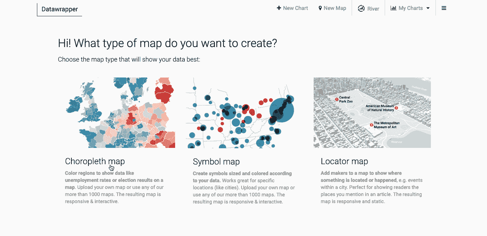

# 2.草图

RAWGraphs 是一个开放的网络工具，可以在令人惊叹的 T2 D3 . js T3 库的基础上创建基于矢量的可视化。

RAWGraphs 主要是为设计师和 vis 极客设计的工具，旨在提供电子表格应用程序(如 Microsoft Excel、Apple Numbers、Google Docs)和矢量图形编辑器(如 Adobe Illustrator、Inkscape 等)之间缺少的链接。

RAWGraphs 是高度可定制和可扩展的，接受用户定义的新的定制布局。关于如何添加或编辑布局的更多信息，请访问他们的[网站](https://rawgraphs.io/)。

## 过程

RAWGraphs 处理表格数据(例如电子表格和逗号分隔值)以及从其他应用程序(例如 Microsoft Excel、TextWrangler、TextEdit 等)复制和粘贴的文本。基于 [SVG](http://en.wikipedia.org/wiki/Svg) 格式，可视化可以很容易地用矢量图形应用程序进行编辑，以便进一步细化，或者直接嵌入到网页中。

只需在 RawGraphs 中插入原始数据，在各种可视化模型中进行选择，然后调整创建的图表并浏览数据。

使用 RAWGraphs 最简单的方法是访问[官方应用页面](http://app.rawgraphs.io/)上的最新版本。然而，RAWGraphs 也可以在您的机器上本地运行。按照 G [ithub repo](https://github.com/densitydesign/raw/#installation) 上的说明进行安装。

## 演示

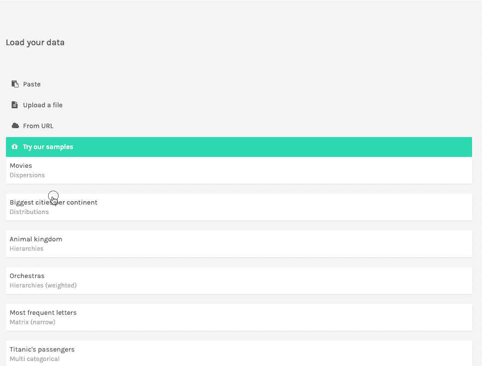

# 3.记录

[Charted](https://www.charted.co/) 让您可视化数据并自动创建漂亮的图表。它是由 Medium 的[产品科学团队](https://medium.com/data-lab)开发的。Charted 被刻意保持简单和易于使用。它不存储、操作或转换数据，因此它不是一个格式化工具。但是，它有几个强大的核心功能:

*   在所有尺寸的屏幕上都能很好地渲染，包括监视器
*   每 30 分钟重新获取数据并更新图表
*   将数据系列移动到单独的图表中
*   调整图表类型、标签/标题和背景

## 过程

提供数据文件的链接，Charted 返回一个漂亮的、交互式的、可共享的数据图表。当前图表支持。csv、. tsv. google 电子表格和 dropbox 共享链接。还可以生成 HTML 代码，然后嵌入到网站中。

## 演示

下载 [repo](https://github.com/charted-co/charted) 并运行`npm install`来安装依赖项。之后就可以跑`npm start`了。这将在 localhost:3000 上启动一个服务器。或者，也可以在 charted.co 的[试用。](http://charted.co)

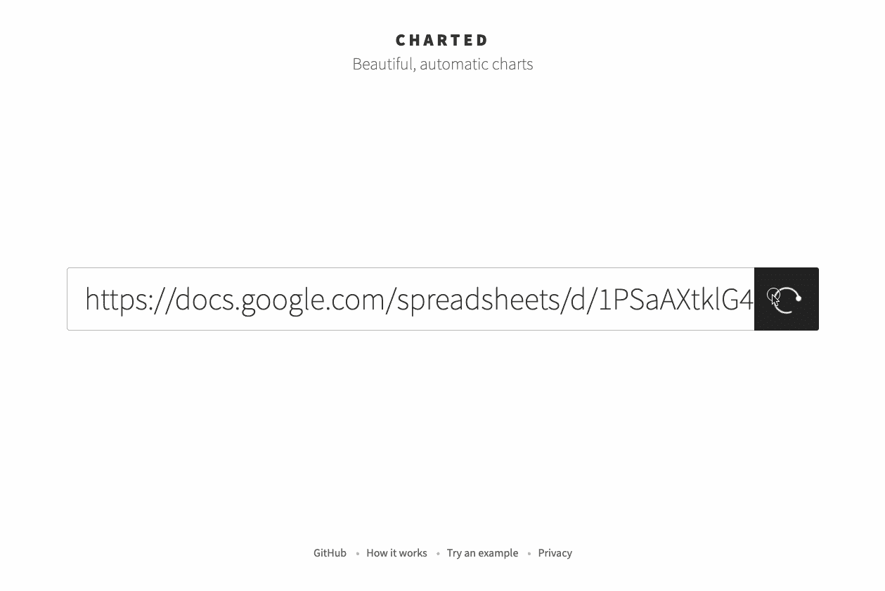

# 4.图表工作室

Chart Studio 是 Plotly 强大的基于网络的在线图表创建工具。它是创建 D3.js 和 WebGL 图表的最复杂的编辑器之一。它有一个免费使用的基本版本。此外，还有付费的企业版和云版。任何人都可以将[源代码](https://github.com/plotly/react-chart-editor)集成到他们的应用中。

## 过程

要么拖放数据文件，要么通过 [Falcon SQL 客户端](https://plot.ly/database-connectors/)连接到 SQL。然后，只需玩提供的选项，并立即获得交互式图表。

## 演示

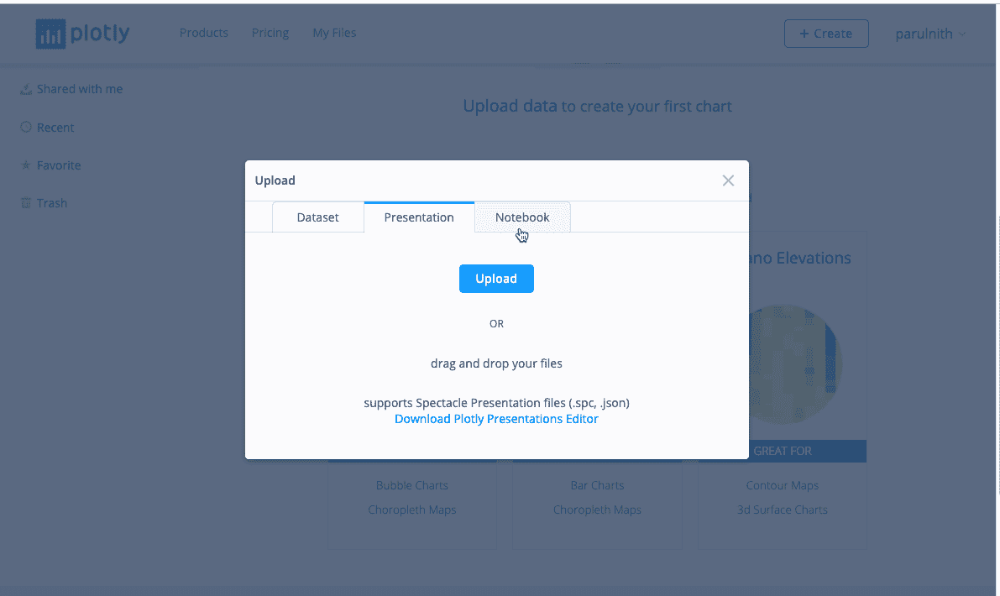

# 5.快速图表

[FastCharts](https://fastcharts.io/) 是来自**金融时报** DataViz 团队的产品。他们最近软推出了一个公共版本的内部浏览器制图工具，供人们工作和提供反馈。

该工具可用于:
通过简单地将数据直接粘贴到浏览器中制作折线图、条形图和面积图
为图的点和/或区域添加注释
下载 png 和可编辑 SVG

虽然这个工具是为内部使用而设计的，但 FastCharts 也在该业务的其他部分赢得了声誉，因为他们为演示文稿创建图表——这是一个比 Excel 或 Google Sheets 更简单的工具，为用户提供了更专业的带有 FT 品牌的图表。

## 过程

CSV 或 TSV 格式的任何数据都可以用来创建图表，然后可以根据用户的喜好进一步定制。

## 演示

这里有一个展示如何在一分钟内制作图表的演示 GIF:

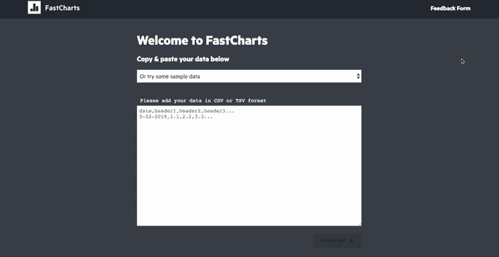

[https://fastcharts.io](https://fastcharts.io/edit)/

# 6.帕拉弟奥

Palladio 是一款免费的数据驱动工具，旨在轻松可视化复杂的历史数据。该项目旨在理解如何设计基于人文探究的图形界面。帕拉第奥位于历史和设计的交汇处。

使用 Palladio 可以创建四种类型的可视化:

*   地图视图:将坐标数据转换为地图上的点。
*   图表视图:让您可视化数据的任何两个维度之间的关系
*   列表视图:可以排列数据的维度来制作定制的列表。
*   图库视图:数据可以显示在网格设置中，以便快速参考

## 过程

任何可以用表格/电子表格格式表示的信息集合都可以使用 Palladio，唯一的要求是所有数据都用包括逗号、分号和制表符在内的分隔值表示。

我们可以粘贴、上传或提供数据链接，以创建新的 Palladio 项目。

## 演示

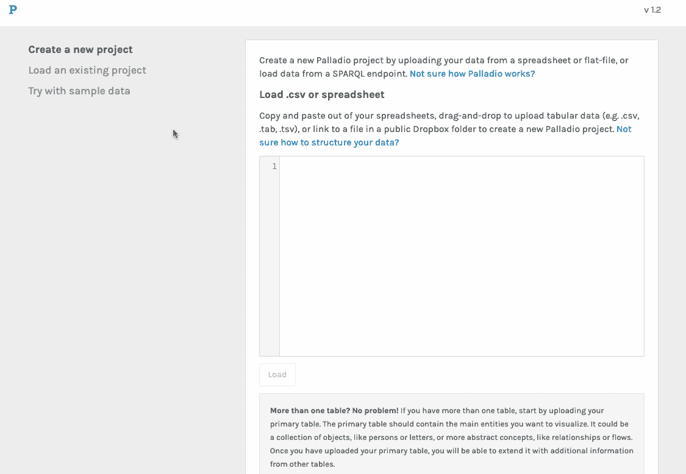

# 7.Openheatmap(不再受支持)

[Opeheatmap](http://www.openheatmap.com/) 是一个非常简单的工具，可以立即将电子表格转换成地图。从绘制一个街区的房价到 twitter 关注者，openheatmap 可以将所有这些转化为交互式可视化，而不涉及任何复杂性。

## 过程

只需上传你的电子表格或提供谷歌硬盘的链接。如果数据没有问题，接下来您就可以查看您的地图了。您的电子表格应该有一列用于您要映射的位置，一列用于值，如果您想要动画地图，还可以选择一列用于每行的时间。例如:

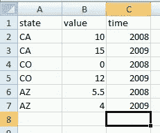

Source: [http://www.openheatmap.com/upload.html](http://www.openheatmap.com/upload.html)

## 演示

让我们使用 openheatmap 绘制'[伦敦地铁站](http://static.openheatmap.com/csv_examples/tube.csv)'的地图。

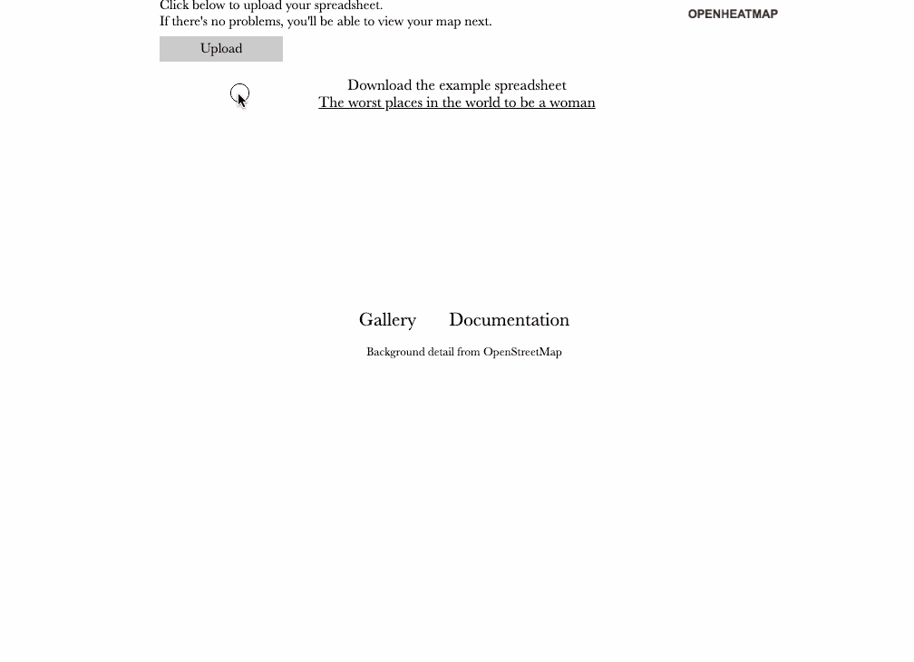

# 8.我的热图(不再受支持)

MyHeatMap 是另一个可以交互查看地理数据的工具。然而，免费版本只允许用户创建最多只有 20 个数据点的公共地图，这实际上非常少。Myheatmap 输出颜色编码的热图，目标受众非常容易理解。地图上没有杂乱的标记、旗帜、等高线或生长的斑点。此外，使用 myheatmap 创建的热点图完全可以与平移和缩放功能进行交互。

## 过程

用户只需上传 CSV 格式的地理数据。该文件应包含一个标题行，其中至少有三个字段。其中两个字段必须命名为“纬度”和“经度”，它们对应的列必须包含以纬度和经度表示的地理坐标。

## 演示

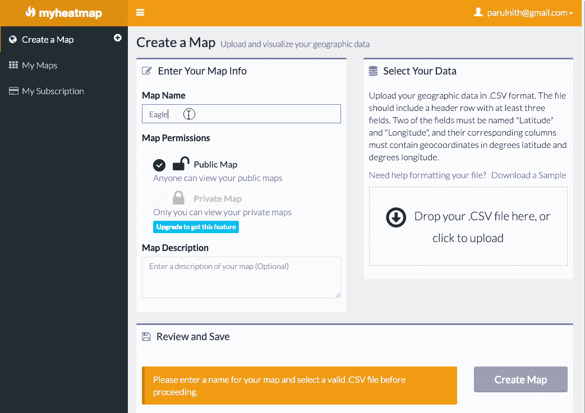

# 9.图表生成器

[Chartbuilder](http://quartz.github.io/Chartbuilder/) 是一个前端图表应用程序，可以方便地创建简单漂亮的图表。Chartbuilder 是用户和导出界面。Chartbuilder 支持在 Quartz 开发的制图平台 [Atlas](http://atlas.qz.com/) 上创建所有图表。Chartbuilder 不是数据分析或数据转换工具。它只是以一致的预定义样式创建图表。

## 过程

将 csv 或 tsv 格式的数据粘贴到 chartbuilder 中，并导出代码以绘制移动友好响应图表或静态 SVG 或 PNG 图表。对于那些对定制图表风格不感兴趣的人来说，托管版本:【http://quartz.github.io/Chartbuilder】就可以了，否则也可以下载并在本地安装。

## 演示

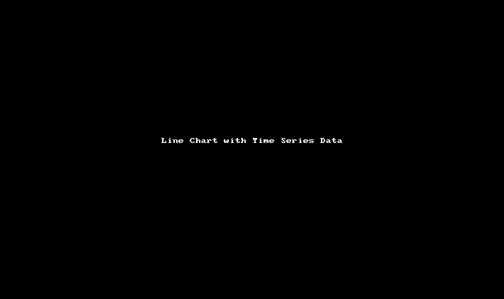

# 10.Timeline.js

TimelineJS 是一个开源工具，它使任何人都能够构建视觉上丰富的交互式时间线。初学者只需使用谷歌电子表格就可以创建一个时间表。专家可以利用他们的 JSON 技能创建定制安装，同时保持 TimelineJS 的核心功能。

TimelineJS 可以从各种来源获取媒体。Twitter，Flickr，YouTube，Vimeo，Vine，Dailymotion，Google Maps，Wikipedia，SoundCloud，Document Cloud 等等！

## 过程

创建时间表是一个简单的过程。提供了一个电子表格模板，需要填写，然后简单地发布内容。然后，所生成的链接可以被嵌入到媒体中或任何网站上需要时间线的地方。该网站有一个很好的 i [ntroductory 视频](https://vimeo.com/143407878)来开始使用 Timeline JS。

## 演示

时间线将如何在中型博客/网站中呈现的示例。

## 曼德拉:有目标的一生

 [## 嵌入时间线

### 嵌入时间线

Embedcdn.knightlab.com 时间线](http://cdn.knightlab.com/libs/timeline/latest/embed/index.html?source=0AmNxBKGzRxw8dE9rbThJX0RCUmxheW1oOUMxWEdLd3c&font=Georgia-Helvetica&maptype=TERRAIN&lang=en&height=650) 

# 11.Canva 图形生成器

[**Canva Graph make**](https://www.canva.com/graphs/)**r**是一款多功能工具，可让您立即轻松地创建漂亮的数据可视化。与其他在线图表制作者不同，Canva 既不复杂也不耗时。没有学习曲线—您将在几分钟内获得一个漂亮的图表，将原始数据转化为既直观又易于理解的东西。

## 过程

本质上，在 Canva 中创建图表只需 5 个简单的步骤:

*   选择图形或图表模板
*   添加您的数据或信息
*   从我们的库中添加图标或插图
*   更改颜色、字体、背景等
*   下载、打印或共享

对于任何类型的用例，都有大量可用的图表类型。有面积图，条形图，比较图，饼状图和其他各种你可以在他们的网站上探索。

## 演示

这里有一个演示 GIF，展示了如何用 Canva 轻松制作一个非常基本的图表。自己尝试构建更专业、更美观的图表。

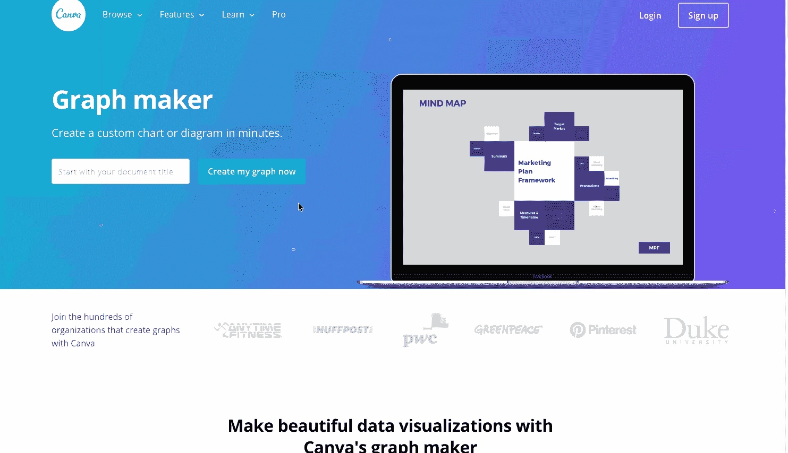

# 结论

数据可视化并不一定很困难或昂贵。编码无疑给了你更多的选择来创建和定制图表，尤其是在数据混乱的时候，但是这些工具在即时数据可视化方面提供了很好的选择。这不是一个详尽的列表，我一直在寻找更多的工具来简化其他人的可视化过程。