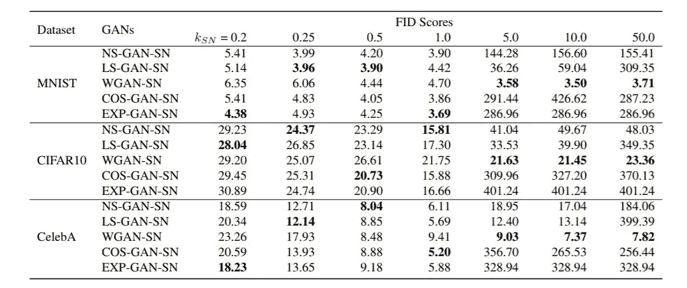
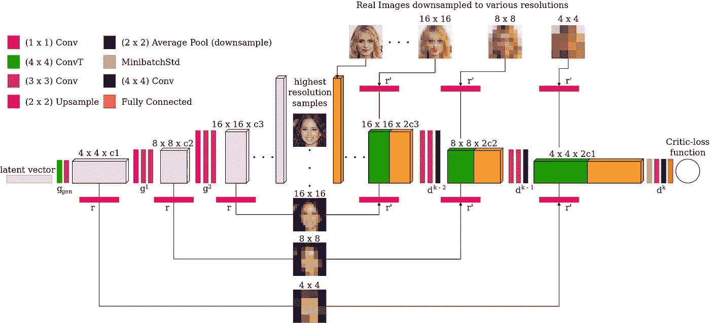

# 一年来训练甘的 10 个教训

> 原文：<https://towardsdatascience.com/10-lessons-i-learned-training-generative-adversarial-networks-gans-for-a-year-c9071159628?source=collection_archive---------1----------------------->

## 训练生成性对抗网络很难:让我们把它变得简单一些

# 介绍

一年前，我决定开始我的旅程，进入生成性对抗网络(GANs)的世界。自从我开始对深度学习感兴趣以来，我就一直对它们感兴趣，主要是因为它们可能产生的令人难以置信的结果。当我想到人工智能这个词时，GAN 是我脑海中首先出现的词之一。

Faces generated by GANs (StyleGAN)

但只有当我第一次开始训练它们时，我才发现这种有趣算法的两面性:训练对**来说非常困难。是的，在我尝试之前，我从报纸和其他在我之前尝试过的人那里知道这一点，但我一直认为他们夸大了一个本来很小但很容易克服的问题。**

**我错了。**

当我试图创造出不同于传统的 MNIST 例子的东西时，我发现了影响甘斯的巨大的**不稳定性问题**，随着花在寻找解决方案上的时间增加，这个问题变得**极其令人讨厌**。

现在，在花了无数天研究已知的解决方案并试图提出新的解决方案后，我终于可以说，我至少对我的 GAN 项目中融合的稳定性有了更多的控制，你也一样。我不能承诺给你 10 分钟的解决方案，让你的每个项目都达到**完美的收敛**(或者用博弈论的话说，纳什均衡)，但是我很乐意给你一些**提示和技巧**，你可以遵循，让你的 GAN 之旅变得更容易一点，不那么耗时，最重要的是，不那么烦人。

# 甘斯的现状

自从生成敌对网络及其稳定性问题诞生以来，**已经进行了大量的研究**。现在我们有大量的论文提出稳定收敛的方法，除此之外还有冗长而困难的数学证明。此外，一些**实用技术和启发**浮出了深度学习世界:我注意到，这些未经证实、背后没有数学思维的技巧往往**非常有效**，一定不能丢弃。

随着稳定性的提高，生成的**图像真实感**也有了重大飞跃。你可以看看英伟达的 StyleGAN 和谷歌的 BigGAN 的结果，就能真正了解 GANs 已经走了多远。

Images generated by BigGAN

在阅读并尝试了文献和实践中的许多技巧后，我**整理了一份你在训练 GANs 时应该考虑和不应该考虑的建议清单**，希望能在这个复杂且有时乏味的主题上拓展你的视角。

# 1.稳定性和容量

当我开始我的第一个独立 GAN 项目时，我注意到在训练过程中的某个早期点，鉴别器对抗损耗总是变为零，而发电机损耗非常高。我立即得出结论，一个网络没有足够的“容量”(或参数数量)来跟上另一个网络:所以我急忙改变生成器的架构，为卷积层添加更多的滤波器，但令我惊讶的是，**什么都没有改变**。

在进一步探索了网络容量变化对训练稳定性的影响后，我没有发现任何**明显的相关性**。肯定有某种联系，但它并不像你刚开始时想的那么重要。

因此，如果你发现自己的训练过程不平衡，而且你没有任何网络在能力方面明显超过对方，我**不会建议**你添加或删除过滤器作为主要解决方案。

当然，如果您非常不确定您的网络容量，您可以查看一些在线架构示例，这些示例用于与您类似的情况。

# 2.提前停止

你在 GANs 训练中可能遇到的另一个常见错误是，一旦你看到发电机或鉴频器损耗突然增加或减少，就停止训练。我自己也这样做过无数次:在看到损失上升后，我立即认为整个**训练都毁了**并且归咎于一些不完美的超参数。

后来我才意识到，损失经常随机上升或下降，这并没有什么错。当发电机损耗比鉴频器损耗高得多时，我获得了一些很棒很真实的结果，这是完全正常的。因此，当你在训练过程中遇到突然的不稳定时，我建议让训练进行得更久一点，在训练过程中关注生成图像的质量，因为视觉理解通常比一些损失数字更有意义。

# 3.损失函数选择

当面对选择用来训练我们的 GAN 的损失函数时，**我们应该选择哪个**？

这个问题在最近的一篇论文中得到解决，在这篇论文中，所有不同的损失函数都进行了基准测试和比较:出现了一些非常有趣的结果。显然**选择哪个损失函数并不重要**:没有哪个函数绝对胜过其他函数，GAN 能够在每种不同的情况下学习。

Results from the [paper](https://arxiv.org/abs/1811.09567): no loss is superior

因此，我的建议是从最简单的**损失函数**开始，留下一个更具体的“最先进的”选项作为可能的最后一步，因为我们从文献中知道，你很可能以更差的结果**结束**。

# 4.平衡发生器和鉴别器重量更新

在许多 GAN 的论文中，尤其是一些早期的论文中，在实现部分看到作者对鉴别器的每次更新使用了生成器的**两次或三次更新的情况并不罕见。**

在我的第一次尝试中，我注意到，在不平衡训练的情况下，几乎每次网络**超过另一个**时，鉴别器都会出现(损失大幅减少)。因此，读到即使是著名论文的作者也有类似的问题，并实施了一个**难以置信的简单解决方案**来克服它，给了我信心，让我相信我所做的是正确的。

不幸的是，在我看来，通过不同的网络权重更新来平衡训练是一个非常短视的解决方案。几乎从未改变生成器必须更新其权重的频率，最终成为稳定我的训练的最终解决方案:它有时可以推迟“不稳定性”，但永远无法解决它，直到收敛。当我注意到这个技术的**无效时，我甚至试图使它更动态，根据两个网络丢失的当前状态改变权重**更新时间表**；只是后来我发现，我不是唯一一个试图走这条路的人，和许多其他人一样，我没有成功克服不稳定性。**

我只是后来才明白，其他的技巧，稍后在文章中解释，对提高训练稳定性有更大的效果。

# 5.模式崩溃和学习率

如果你在和 GANs 打交道，你肯定会知道什么是模式崩溃。它包括**发生器“折叠”**，并且总是为作为输入的每个可能的潜在向量生成单个图像。这是 GAN 训练中一个相当常见的障碍，在某些情况下，它会变得**非常烦人**。

Mode Collapse example

如果你发现自己处于这种情况，我推荐的最直接的解决方案是尝试**调整 GAN 的学习速率**，因为根据我的个人经验，我总是可以通过改变这个特定的超参数来克服这个障碍。根据经验，当处理模式崩溃时，尝试使用**较低的学习速率**，并从头开始训练。

学习率是最重要的超参数之一，如果不是最重要的话，因为在训练过程中，即使很小的变化也会导致**的剧烈变化**。通常当使用更大的批量时，你可以允许更高的学习率，但是根据我的经验，保守一点几乎总是一个安全的选择。

还有其他方法来对抗模式崩溃，如**特征匹配**和**迷你批次鉴别**，我从未在自己的代码中实现过，因为我总是找到另一种方法来避免这种特殊的麻烦，但如果需要的话，可以随意给予它们一点关注。

# 6.添加噪声

众所周知，加大鉴别器的训练难度**有利于**整体稳定性。增加鉴别器训练的复杂性的一个最公知的方法是**将噪声**添加到真实和合成数据(例如由生成器生成的图像)中；在数学世界中，这应该是可行的，因为它有助于给两个竞争网络的数据分布带来一定的稳定性。这确实是一个简单的解决方案，我推荐尝试**它在实践中可以很好地工作**(即使它不能神奇地解决你可能遇到的任何不稳定的问题)，同时只需要最小的努力来设置。也就是说，我开始使用这种技术，但过了一段时间后就放弃了，转而使用其他一些我认为更有效的技术。

# 7.标签平滑

实现相同目标的另一种方法是标签平滑，它更容易理解和实现:如果真实图像的标签集是 1，我们将其更改为更低的值，如 0.9。这个解决方案**阻止了**鉴别者对其分类**过于自信**，或者换句话说，阻止了依靠非常有限的一组特征来确定图像是真是假。我**完全赞同**这个小技巧，因为它在实践中表现得非常好，而且它只需要改变你代码中的一两个字符。

# 8.多尺度梯度

当处理不太小的图像时(比如 MNIST 的图像)，你必须查看多尺度渐变。这是一个特殊的 GAN 实现，由于两个网络之间的多个**跳跃连接**，使得**梯度从鉴别器流向生成器**，类似于传统上用于语义分割的 U-Net 中发生的情况。

MSG-GAN architecture

多尺度渐变论文的作者能够训练 GAN 直接生成**高清** 1024x1024 图像，而没有任何特殊障碍(模式崩溃等)，而在此之前，只有渐进增长的 GAN 才有可能(Nvidia 的 ProGAN)。我已经在我的项目中实现了，我注意到了更稳定的训练和令人信服的结果。查看[文件](https://arxiv.org/abs/1903.06048)了解更多细节，并进行尝试！

# 9.TTUR

当我说**两个时标更新规则**或 TTUR 时，你可能会认为我指的是 GAN 培训中采用的复杂而清晰的技术，你可能完全错了。它只包括为发生器和鉴别器选择不同的学习速率**就这样。在首次引入 TTUR 的[论文](https://arxiv.org/abs/1706.08500)中，作者提供了收敛到纳什均衡的数学证明，并表明使用不同的学习速率实现著名的 gan(DCGAN，WGAN-GP)实现了**最先进的**结果。**

但是当我说“使用不同的学习率”时，实际上我真正的意思是什么？一般来说，我建议为鉴别器选择一个较高的**学习率，为生成器选择一个较低的**学习率:这样，生成器不得不做出**较小的步骤**来欺骗鉴别器，并且不会选择快速、不精确和不现实的解决方案来赢得对抗游戏。举一个实际的例子，我经常选择 0.0004 作为鉴别器，0.0001 作为生成器，我发现这些值在我的一些项目中工作得很好。请记住，使用 TTUR 时，您可能会注意到发电机的损耗较高。

# 10.光谱归一化

在许多论文中，例如在 SAGAN(或自我关注 GAN)的论文中，显示了谱归一化，一种应用于**卷积核**的特殊类型的归一化，可以极大地帮助训练的稳定性。最初只在鉴别器中使用，后来证明如果也用在生成器的卷积层中也是有效的，我完全赞同这个决定！

我几乎可以说，在我的 GAN 中发现并实现频谱归一化改变了我的 GAN 之旅的方向，坦率地说，我看不出**有任何理由**不亲自使用它:我几乎可以保证它将带您进入一个显著更好和**更稳定的训练**，同时让您专注于深度学习项目的其他更有趣的方面！(详见[本文](https://arxiv.org/abs/1802.05957)。)

# 结论

大量的其他技巧、更复杂的技术和架构有望终结 GANs 的训练问题:在这篇文章中，我想告诉你我个人发现并实施的克服我遇到的障碍的方法。

因此，如果你发现自己在了解这里介绍的每种方法和技巧时遇到了困难，那么还有很多材料需要研究。我只能说，在花了无数个小时研究和尝试每一种可能的方法来解决我的 GAN 相关问题之后，我对我的项目更有信心了，我真的希望你也能这样做。

最后，我想**真诚地感谢**阅读并关注这篇文章，希望你能带着**有价值的东西**走出去。

非常感谢，祝**甘历险记**愉快！