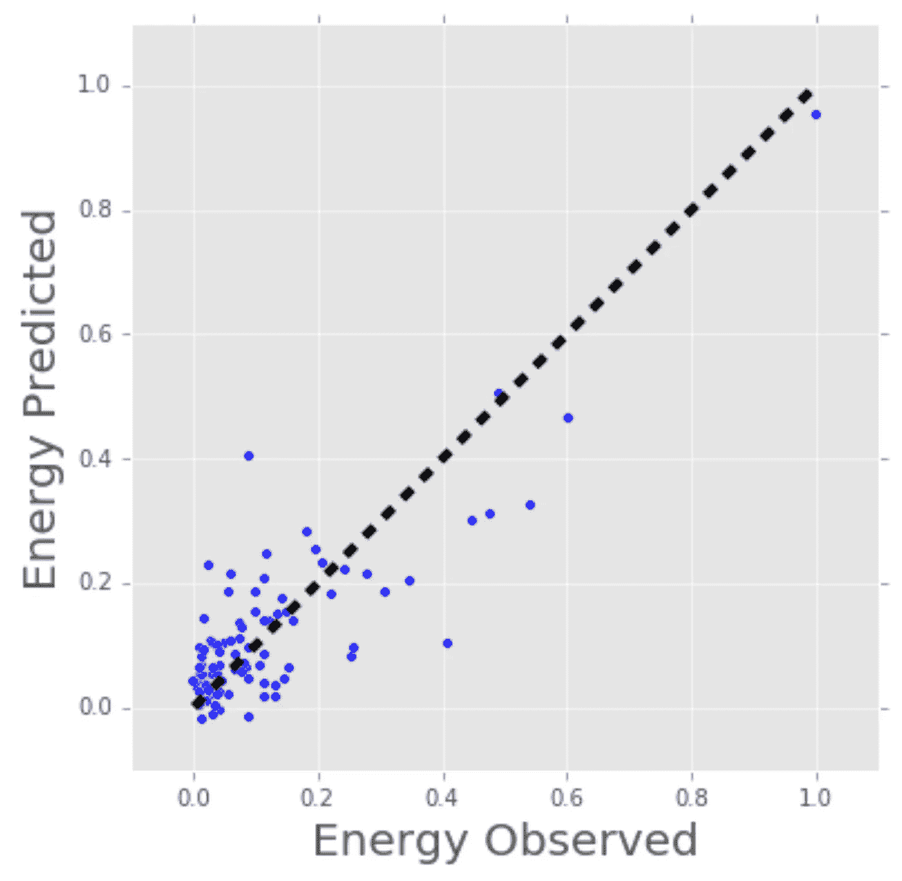
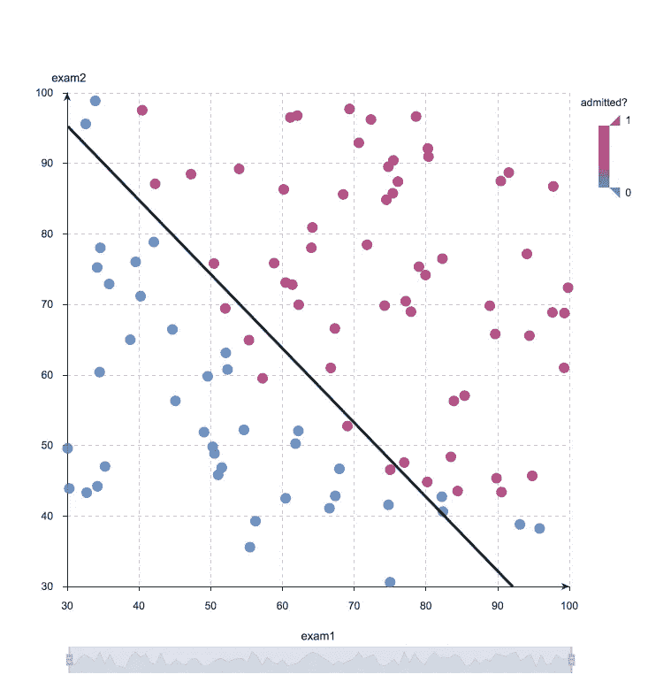
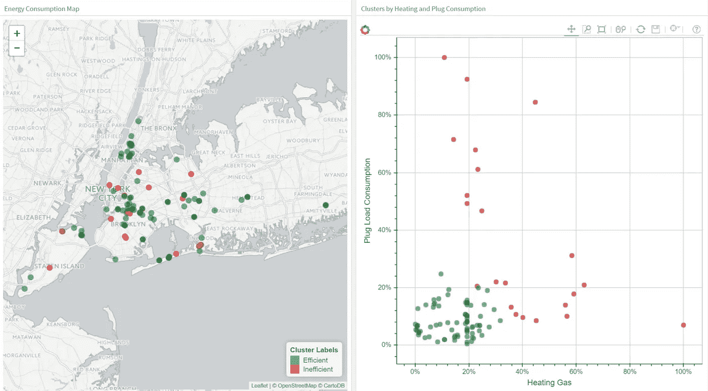
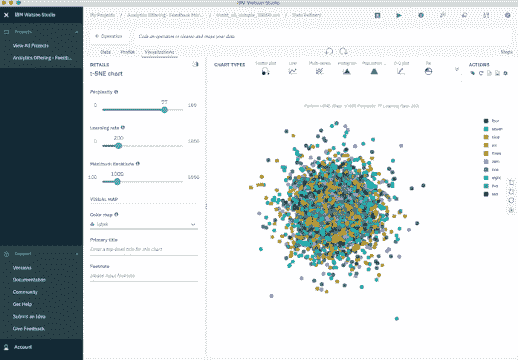
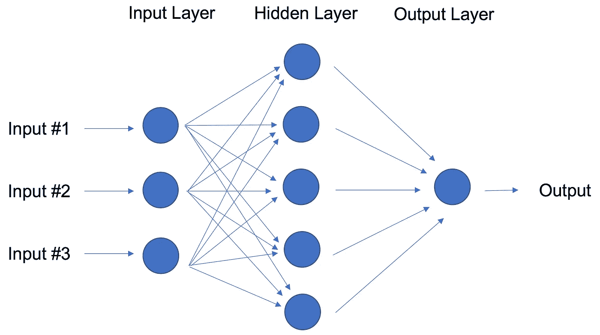
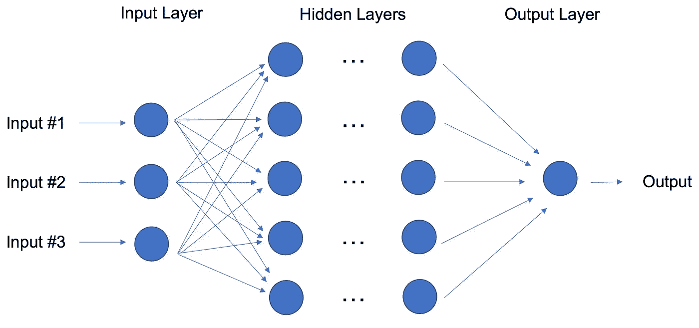
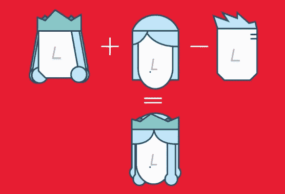

# 每个数据科学家都应该知道的 10 种机器学习方法

> 原文：<https://towardsdatascience.com/10-machine-learning-methods-that-every-data-scientist-should-know-3cc96e0eeee9?source=collection_archive---------0----------------------->

## [**现实世界中的数据科学**](https://medium.com/towards-data-science/data-science-in-the-real-world/home)

## 快速启动您的数据科学技能

Photo by [chuttersnap](https://unsplash.com/@chuttersnap?utm_source=medium&utm_medium=referral) on [Unsplash](https://unsplash.com?utm_source=medium&utm_medium=referral)

机器学习是研究和行业的热门话题，新的方法一直在发展。这个领域的速度和复杂性使得即使对专家来说，跟上新技术的步伐也很困难——对初学者来说更是势不可挡。

为了揭开机器学习的神秘面纱，并为那些不熟悉核心概念的人提供一条学习之路，让我们来看看十种不同的方法，包括每种方法的简单描述、可视化和示例。

机器学习算法也称为模型，是一种数学表达式，表示问题(通常是业务问题)上下文中的数据。目的是从数据到洞察力。例如，如果一家在线零售商希望预测下一季度的销售额，他们可能会使用机器学习算法，根据过去的销售额和其他相关数据来预测这些销售额。类似地，风车制造商可能会对重要设备进行视觉监控，并通过训练有素的算法提供视频数据，以识别危险的裂缝。

所描述的十种方法提供了一个概述，以及一个在您磨练机器学习知识和技能时可以建立的基础:

1.  **回归**
2.  **分类**
3.  **聚类**
4.  **降维**
5.  **集成方法**
6.  **神经网络和深度学习**
7.  **迁移学习**
8.  **强化学习**
9.  **自然语言处理**
10.  **单词嵌入**

在我们开始之前还有最后一件事。让我们区分机器学习的两个一般类别:有监督的和无监督的。当我们有一份想要预测或解释的数据时，我们应用**监督** ML 技术。我们通过使用以前的输入和输出数据来预测基于新输入的输出。例如，您可以使用监督 ML 技术来帮助服务企业预测下个月将注册该服务的新用户数量。相比之下，**无监督** ML 着眼于在不使用目标变量进行预测的情况下关联和分组数据点的方法。换句话说，它根据特征来评估数据，并使用特征来形成彼此相似的项目聚类。例如，您可以使用无监督学习技术来帮助零售商对具有相似特征的产品进行细分，而不必事先指定要使用哪些特征。

# 回归

回归方法属于监督最大似然法的范畴。它们有助于根据一组先前的数据来预测或解释特定的数值，例如，根据类似物业的先前定价数据来预测物业的价格。

最简单的方法是线性回归，我们使用直线的数学方程( **y = m * x + b** )来模拟数据集。我们通过计算直线的位置和斜率来训练具有许多数据对 **(x，y)** 的线性回归模型，该直线使所有数据点和直线之间的总距离最小化。换句话说，我们计算最接近数据中观察值的直线的斜率( **m** )和 y 截距( **b** )。

让我们考虑一个更具体的线性回归的例子。我曾经使用线性回归来预测某些建筑的能源消耗(以千瓦时为单位),方法是收集建筑的年龄、楼层数、平方英尺和插墙设备的数量。由于有多个输入(年龄、平方英尺等)，我使用了多变量线性回归。原理与简单的一对一线性回归相同，但在这种情况下，我创建的“线”发生在基于变量数量的多维空间中。

下图显示了线性回归模型对建筑实际能耗的拟合程度。现在想象一下，你可以访问一栋建筑的特征(年龄、平方英尺等)，但你不知道它的能耗。在这种情况下，我们可以使用拟合线来估算特定建筑的能耗。

请注意，您还可以使用线性回归来估计对最终能耗预测有贡献的每个因素的权重。例如，一旦你有了一个公式，你就可以确定年龄、体型还是身高是最重要的。

Linear Regression Model Estimates of Building’s Energy Consumption (kWh).

回归技术涵盖从简单(如线性回归)到复杂(如正则化线性回归、多项式回归、决策树和随机森林回归、神经网络等)的所有领域。但是不要陷入困境:从学习简单的线性回归开始，掌握技术，然后继续前进。

# 分类

另一类监督 ML，分类方法预测或解释类值。例如，它们可以帮助预测在线客户是否会购买产品。输出可以是或不是:买方或不是买方。但是分类方法不限于两类。例如，分类方法有助于评估给定图像中包含的是汽车还是卡车。在这种情况下，输出将是 3 个不同的值:1)图像包含汽车，2)图像包含卡车，或者 3)图像既不包含汽车也不包含卡车。

最简单的分类算法是逻辑回归——这使它听起来像一种回归方法，但它不是。逻辑回归基于一个或多个输入估计事件发生的概率。

例如，逻辑回归可以将一个学生的两个考试分数作为输入，以估计该学生被特定大学录取的概率。因为估计值是一个概率，所以输出是一个介于 0 和 1 之间的数字，其中 1 表示完全确定。对于这个学生，如果估计的概率大于 0.5，那么我们预测他或她会被录取。如果估计概率小于 0.5，我们预测他或她将被拒绝。

下面的图表显示了往届学生的分数以及他们是否被录取。逻辑回归允许我们画一条代表决策边界的线。

Logistic Regression Decision Boundary: Admitted to College or Not?

因为逻辑回归是最简单的分类模型，所以它是分类的好起点。随着您的进步，您可以深入非线性分类器，如决策树、随机森林、支持向量机和神经网络等。

# 使聚集

使用聚类方法，我们可以进入无监督最大似然分类，因为它们的目标是对具有相似特征的观察结果进行分组或聚类。聚类方法不使用输出信息进行训练，而是让算法定义输出。在聚类方法中，我们只能使用可视化来检查解决方案的质量。

最流行的聚类方法是 K-Means，其中“K”表示用户选择创建的聚类数。(注意，有各种选择 K 值的技术，例如肘法。)

大致来说，K-Means 对数据点的作用是:

1.  在数据中随机选择 K 个中心。
2.  将每个数据点分配给随机创建的最近的中心。
3.  重新计算每个聚类的中心。
4.  如果中心没有变化(或者变化很小)，这个过程就结束了。否则，我们返回步骤 2。(为了防止在中心不断变化的情况下陷入无限循环，请预先设置最大迭代次数。)

下一个图将 K-Means 应用于一组建筑物数据。图中的每一列表示每栋建筑的效率。这四项测量与空调、插入式设备(微波炉、冰箱等)、家用燃气和供暖燃气有关。我们选择 K=2 进行聚类，这样可以很容易地将其中一个聚类解释为高效建筑群，而将另一个聚类解释为低效建筑群。左边你可以看到建筑的位置，右边你可以看到我们用作输入的四个维度中的两个:接入设备和加热气体。

Clustering Buildings into Efficient (Green) and Inefficient (Red) Groups.

在探索聚类时，您会遇到非常有用的算法，例如基于密度的带噪声应用程序空间聚类(DBSCAN)、均值偏移聚类、凝聚层次聚类、使用高斯混合模型的期望最大化聚类等。

# 降维

顾名思义，我们使用降维从数据集中删除最不重要的信息(有时是冗余的列)。在实践中，我经常看到具有数百甚至数千列的数据集(也称为特征)，因此减少总数至关重要。例如，图像可能包含数千个像素，但并非所有像素都对您的分析有影响。或者在制造过程中测试微芯片时，您可能需要对每个芯片进行数千次测量和测试，其中许多会提供冗余信息。在这些情况下，您需要降维算法来使数据集易于管理。

最流行的降维方法是主成分分析(PCA)，它通过寻找最大化数据线性变化的新向量来降低特征空间的维度。当数据的线性相关性很强时，PCA 可以显著地降低数据的维数，而不会丢失太多的信息。(事实上，您还可以测量信息丢失的实际程度，并做出相应的调整。)

另一种流行的方法是 t-随机邻居嵌入(t-SNE)，它进行非线性维数约简。人们通常使用 t-SNE 进行数据可视化，但你也可以将其用于机器学习任务，如减少特征空间和聚类，仅举几例。

下一幅图显示了对 MNIST 手写数字数据库的分析。MNIST 包含数以千计的从 0 到 9 的数字图像，研究人员用这些图像来测试他们的聚类和分类算法。数据集的每一行都是原始图像的矢量化版本(大小为 28 x 28 = 784)以及每个图像的标签(零、一、二、三、…、九)。请注意，我们因此将维度从 784(像素)减少到 2(我们可视化的维度)。投影到二维可以让我们把高维的原始数据集可视化。

t-SNE Iterations on MNIST Database of Handwritten Digits.

# 集成方法

假设你决定造一辆自行车，因为你对商店和网上的选择不满意。你可以从找到你需要的每个部分的最佳部分开始。一旦你组装所有这些伟大的部分，最终的自行车将胜过所有其他选项。

集成方法使用相同的想法，将几个预测模型(监督 ML)结合起来，以获得比每个模型单独提供的预测质量更高的预测。例如，随机森林算法是一种集成方法，它结合了用数据集的不同样本训练的许多决策树。因此，随机森林的预测质量高于用单个决策树估计的预测质量。

将集成方法视为减少单个机器学习模型的方差和偏差的一种方式。这很重要，因为任何给定的模型在某些条件下可能是准确的，但在其他条件下可能是不准确的。对于另一个模型，相对精度可能是相反的。通过结合这两个模型，预测的质量被抵消了。

绝大多数卡吉尔比赛的冠军都使用某种合奏方法。最流行的集成算法有随机森林、 [XGBoost](https://xgboost.readthedocs.io) 和 [LightGBM](https://github.com/Microsoft/LightGBM) 。

# 神经网络和深度学习

与被认为是线性模型的线性和逻辑回归相比，神经网络的目标是通过向模型添加参数层来捕获数据中的非线性模式。在下图中，简单的神经网络有三个输入、一个具有五个参数的隐藏层和一个输出层。

Neural Network with One Hidden Layer.

事实上，神经网络的结构足够灵活，可以构建我们熟知的线性和逻辑回归。术语深度学习来自具有许多隐藏层的神经网络(见下图)，并封装了各种各样的架构。

跟上深度学习的发展尤其困难，部分原因是研究和行业社区已经加倍努力进行深度学习，每天都在产生全新的方法。

Deep Learning: Neural Network with Many Hidden Layers.

为了获得最佳性能，深度学习技术需要大量数据和大量计算能力，因为该方法可以在庞大的架构内自我调整许多参数。很快就清楚了为什么深度学习实践者需要用 GPU(图形处理单元)增强的非常强大的计算机。

特别是，深度学习技术在视觉(图像分类)、文本、音频和视频领域取得了极大的成功。深度学习最常见的软件包有 [Tensorflow](https://www.tensorflow.org/) 和 [PyTorch](https://pytorch.org/) 。

# 迁移学习

让我们假设你是一名在零售业工作的数据科学家。你已经花了几个月的时间训练一个高质量的模型来将图像分类为衬衫、t 恤和 polos。您的新任务是构建一个类似的模型，将服装图像分类为牛仔裤、工装裤、休闲裤和礼服裤。能否将构建在第一个模型中的知识转移并应用到第二个模型中？是的，你可以，使用迁移学习。

迁移学习是指重新使用以前训练过的神经网络的一部分，并使其适应新的但类似的任务。具体来说，一旦您使用某项任务的数据来训练神经网络，您就可以转移一部分已训练的层，并将它们与一些可以使用新任务的数据来训练的新层相结合。通过增加几层，新的神经网络可以学习并快速适应新的任务。

迁移学习的主要优势在于，你需要更少的数据来训练神经网络，这一点尤为重要，因为深度学习算法的训练在时间和金钱(计算资源)方面都很昂贵——当然，找到足够的标记数据来进行训练通常非常困难。

让我们回到我们的例子，假设衬衫模型使用一个有 20 个隐藏层的神经网络。在运行了几个实验之后，您意识到您可以转移 18 个衬衫模型层，并将它们与一个新的参数层相结合，以在裤子的图像上进行训练。因此，裤子模型将有 19 个隐藏层。这两个任务的输入和输出是不同的，但是可重用层可以汇总与两者相关的信息，例如布料的各个方面。

迁移学习已经变得越来越受欢迎，现在有许多可靠的预训练模型可用于常见的深度学习任务，如图像和文本分类。

# 强化学习

想象一只老鼠在迷宫中试图找到隐藏的奶酪块。我们把老鼠暴露在迷宫中的次数越多，它就越容易找到奶酪。起初，老鼠可能会随机移动，但一段时间后，老鼠的经验有助于它意识到哪些动作会让它更靠近奶酪。

鼠标的过程反映了我们用强化学习(RL)来训练系统或游戏的过程。一般来说，RL 是一种帮助代理从经验中学习的机器学习方法。通过记录行动并在设定的环境中使用试错法，RL 可以最大化累积奖励。在我们的例子中，鼠标是代理，迷宫是环境。鼠标可能的动作有:向前、向后、向左或向右移动。奖励是奶酪。

当你对一个问题只有很少甚至没有历史数据时，你可以使用 RL，因为它不需要预先的信息(不像传统的机器学习方法)。在 RL 框架中，您可以边走边从数据中学习。毫不奇怪，RL 在游戏方面尤其成功，尤其是像国际象棋和围棋这样的“[完全信息](https://en.wikipedia.org/wiki/Perfect_information)游戏。有了游戏，来自代理和环境的反馈很快就来了，允许模型快速学习。RL 的缺点是，如果问题很复杂，可能需要很长时间来训练。

就像 1997 年 IBM 的深蓝打败了人类最好的棋手一样，2016 年基于 RL 的算法 AlphaGo 打败了最好的围棋手。目前 RL 的先驱是英国 DeepMind 的团队。更多关于 AlphaGo 和 DeepMind [的信息请点击这里](https://deepmind.com/research/alphago/)。

2019 年 4 月，OpenAI Five 团队是第一个击败电子竞技 Dota 2 世界冠军团队的人工智能，这是一个非常复杂的视频游戏，OpenAI Five 团队选择它是因为当时没有能够赢得它的 RL 算法。击败 Dota 2 冠军人类队的同一个 AI 团队也开发了一种可以重新定向街区的机器人手。点击阅读更多关于 OpenAI 五人组[的信息。](https://openai.com/blog/how-to-train-your-openai-five/)

你可以看出强化学习是一种特别强大的人工智能形式，我们肯定会看到这些团队取得更多进展，但也值得记住这种方法的局限性。

# 自然语言处理

世界上很大一部分数据和知识是以某种人类语言的形式存在的。你能想象在几秒钟内阅读和理解成千上万的书籍、文章和博客吗？显然，计算机还不能完全理解人类的文本，但我们可以训练它们完成某些任务。例如，我们可以训练我们的手机自动完成我们的短信或纠正拼写错误的单词。我们甚至可以教机器与人类进行简单的对话。

自然语言处理(NLP)本身不是一种机器学习方法，而是一种广泛使用的为机器学习准备文本的技术。想想各种格式的大量文本文档(word、在线博客等等)。).这些文本文档中的大多数都充满了需要过滤掉的错别字、漏字和其他单词。目前，最流行的文本处理软件包是由斯坦福大学的研究人员开发的 NLTK(自然语言工具包)。

将文本映射成数字表示的最简单方法是计算每个文本文档中每个单词的频率。想象一个整数矩阵，其中每行代表一个文本文档，每列代表一个单词。词频的这种矩阵表示通常被称为词频矩阵(TFM)。从那里，我们可以创建另一个流行的文本文档矩阵表示，方法是将矩阵中的每个条目除以每个单词在整个文档集内的重要性权重。我们将这种方法称为术语频率逆文档频率(TFIDF ),它通常更适合机器学习任务。

# 单词嵌入

TFM 和 TFIDF 是文本文档的数字表示，它们仅考虑频率和加权频率来表示文本文档。相比之下，单词嵌入可以捕获文档中单词的上下文。通过单词上下文，嵌入可以量化单词之间的相似性，这反过来允许我们对单词进行算术运算。

Word2Vec 是一种基于神经网络的方法，它将语料库中的单词映射到一个数字向量。然后，我们可以使用这些向量来查找同义词，对单词执行算术运算，或者表示文本文档(通过取文档中所有单词向量的平均值)。例如，让我们假设我们使用足够大的文本文档语料库来估计单词嵌入。我们还假设单词*国王*、*王后*、*男人*和*女人*是语料库的一部分。假设*向量('字')*是表示字*'字'*的数值向量。为了估计*向量(‘女人’)*，我们可以对向量执行算术运算:

> 向量('国王')+向量('女人') *—* 向量('男人')~向量('女王')

Arithmetic with Word (Vectors) Embeddings.

单词表示允许通过计算两个单词的矢量表示之间的余弦相似性来找到单词之间的相似性。余弦相似性度量两个向量之间的角度。

我们使用机器学习方法来计算单词嵌入，但这通常是应用机器学习算法的前一步。例如，假设我们可以访问几千名 Twitter 用户的推文。还假设我们知道这些 Twitter 用户中的哪一个买了房子。为了预测 Twitter 新用户买房的概率，我们可以将 Word2Vec 与逻辑回归结合起来。

你可以自己训练单词嵌入，或者获得一组预训练(迁移学习)的单词向量。要下载 157 种不同语言的预训练单词向量，请看一下 [FastText](https://fasttext.cc/docs/en/crawl-vectors.html) 。

# 摘要

我试图涵盖十种最重要的机器学习方法:从最基础的到最前沿的。很好地学习这些方法并充分理解每一种方法的基础可以作为进一步研究更高级的算法和方法的坚实起点。

当然，还有大量非常重要的信息需要涵盖，包括质量度量、交叉验证、分类方法中的类别不平衡以及过度拟合模型等，仅举几例。敬请关注。

这个博客的所有可视化都是使用[沃森工作室桌面](https://www.ibm.com/products/watson-studio-desktop)完成的。

特别感谢[史蒂夫·摩尔](https://medium.com/u/c81f0352abb7?source=post_page-----3cc96e0eeee9--------------------------------)对这篇文章的大力反馈。

***推特:***[@ castan](https://twitter.com/castanan) ***LinkedIn:***@[jorgecasta](https://www.linkedin.com/in/jorgecasta/)