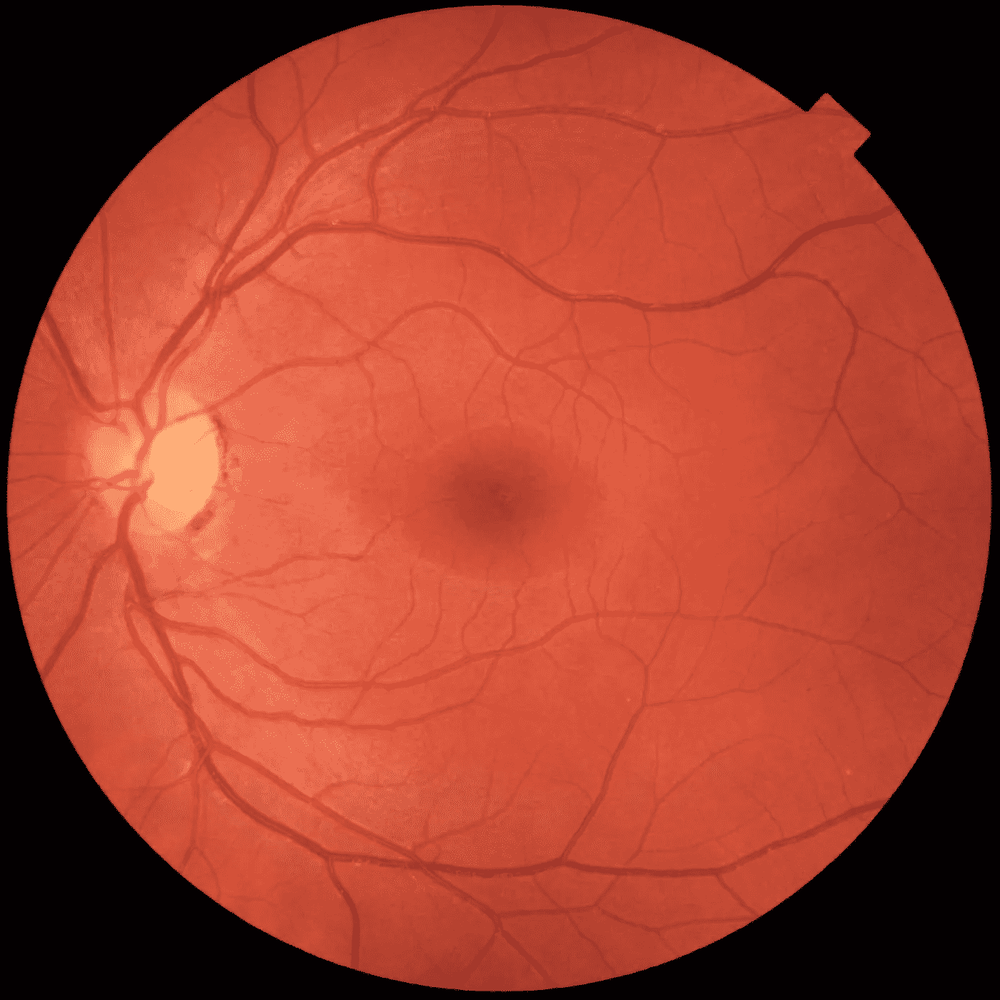
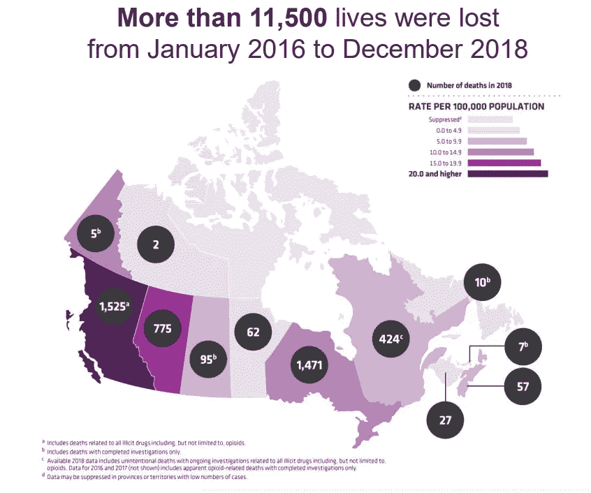

# 本年度 10 大医学创新…是谷歌和微软领先吗？

> 原文：<https://towardsdatascience.com/10-medical-innovation-in-the-current-year-is-google-and-microsoft-taking-the-lead-327d43a89506?source=collection_archive---------15----------------------->

## 在不久的将来，我们可以期待看到什么样的医学创新？

# 介绍

2019 年已经过去了将近一半，我希望每个人都度过了美好的一年，没有任何人出现任何严重的健康问题。让我们继续讨论，让我们谈谈医疗行业。

医疗行业总体来说是一个有趣的领域。有许多政府法规和私营企业试图“介入”这一行动以获取利润。那么 2019 年医疗行业有哪些最有前景的技术正在发生？一些科技巨头正在做什么来利用这个行业并渗透到这个领域呢？

为了找到这些问题的答案，我们需要关注克利夫兰诊所的医疗创新峰会，简称 MIS。因为他们刚刚公布了十大医学创新。最后，对于技术部分，我们需要看看谷歌的 2018 年 I/O 峰会，以及来自微软的 Ellie Patient Engagement 和 Care Management。

# 从列表开始

从底部开始，我们有:

1.  基于 RNA 的疗法
2.  二尖瓣和三尖瓣经皮置换和修复(心脏修复)→是的，我不知道这是什么，简单搜索后是关于无创心脏手术的，所以我们就叫它心脏修复。
3.  **机器人手术的创新(机器人手术)**
4.  **院前卒中诊断面罩(卒中面罩)**
5.  **用于医学教育的虚拟和混合现实(虚拟现实/混合现实)**
6.  **通过 3D 打印实现的患者专用产品**(**3D 打印)**
7.  癌症治疗免疫疗法的进展免疫疗法(利用人体自身的免疫系统来对抗癌症)。
8.  急性卒中干预的扩展窗口
9.  **人工智能在医疗保健中的出现** ( **人工智能)→** 我是一个超级人工智能迷，所以我对这项创新非常兴奋。
10.  疼痛的替代疗法:对抗阿片类药物危机→这是一个相当大的问题，我将有一个单独的部分来讨论这个主题。

## 技术

这个榜单有意思的是，在十大创新中，有五项与技术创新有很强的关联。更具体地说，机器人、人工智能、3D 打印、VR/AR 和遮阳板。

所有这些设备都有一个共同点——它们增强了医生帮助病人的能力。人工智能可以用来直接辅助决策过程。VR/AR 和 3D 打印等其他工具可以用来加快医生的教育过程。

想想上面列举的例子，难怪谷歌和微软等科技巨头会感兴趣。让我们具体看看这些公司计划如何利用这些机会赚钱。现在请注意，虽然我无法涵盖这些公司在医疗保健行业所做的一切，但我希望能让您大致了解一下他们正在开发的产品。

## 谷歌

从谷歌开始，从他们的 [2018 谷歌大会](https://www.youtube.com/watch?v=JzB7yS9t1YE&t=589s)我们知道他们一直在研究一个人工智能系统。人工智能系统基本上是一个从视网膜眼底照片中检测糖尿病视网膜病变的分类器。

这些图像看起来像这样:

这是非常有趣的东西，特别是考虑到这些模型可以部署在农村地区，那里没有足够的医生。今年，谷歌已经表明他们的算法可以执行类似甚至更好的视网膜专家，这在我看来是非常惊人的。

## 微软

虽然微软在医疗保健行业有多种产品，但我想介绍一种我认为特别有趣的产品。

该产品名为“埃莉患者参与和护理管理”，我将简称为埃莉。虽然 Ellie 是由另一家名为“Get Real Health”的公司构建的，但它是使用微软云技术构建的，因此它确实植根于微软。

这款软件产品与谷歌产品的不同之处在于，它不是一款基于人工智能的产品，而更像是一款面向医生的数据管理软件。现在，我不是说这个产品不会有人工智能的成分。我相信在不久的将来，一些人工智能组件将会出现，因为他们正在收集数据。但目前来看，我认为这不是他们的主要卖点。

当您观看“[获得真正健康](https://www.youtube.com/watch?v=8fakZ6PpI_Q&t=288s)”的产品视频时，您会意识到他们的卖点是远程患者管理、与患者协作以及增加医疗机构的收入。

虽然我不确定数据隐私是如何得到保护的，但这似乎是一个非常有前途的方向。然而，与数据隐私安全相关的医疗保健法律极其复杂，因此我们将看到该产品如何在未来几年生存下去。

## 类鸦片

当我们想到阿片类药物危机时，我们倾向于认为这完全是美国的问题。但是根据许多不同的消息来源，阿片类药物过量显然是一个全球性的现象。

例如，我们可以看看[加拿大政府](https://www.canada.ca/content/dam/hc-sc/documents/services/substance-use/problematic-prescription-drug-use/opioids/responding-canada-opioid-crisis/federal-actions/federal-actions-overview.pdf)发布的关于阿片类药物的联邦行动:

我们可以看到不列颠哥伦比亚省因使用不同药物而死亡的人数最高。虽然我不知道为什么不列颠哥伦比亚省的死亡率最高，但这个省似乎比看上去的要多。

丹麦、挪威和瑞典等欧洲国家似乎也面临着类似的问题。这方面有很多不同的资源，所以对于对这个主题感兴趣的人，我强烈建议他们自己做研究。

## 关闭

那么哪个创新最让你兴奋呢？你在医疗行业的哪个领域工作？这些创新如何影响你的职业？请在下面留言，我会很感兴趣的。

我个人对医疗行业的 AI 创新感到非常兴奋。如果你们想让我介绍其他话题，请在下面留言。

## **参考**

1.  MIS2018:“十大”医疗创新:2019。(2019).YouTube。检索于 2019 年 7 月 18 日，发自 https://www.youtube.com/watch?v=yVIbfQFlPv0[t = 3251s](https://www.youtube.com/watch?v=yVIbfQFlPv0&t=3251s)
2.  克利夫兰诊所公布 2019 年十大医疗创新。(2018).咨询 QD。检索于 2019 年 7 月 18 日，来自[https://consult qd . clevelandclinic . org/Cleveland-clinic-unveils-top-10-medical-innovations-for-2019/](https://consultqd.clevelandclinic.org/cleveland-clinic-unveils-top-10-medical-innovations-for-2019/)
3.  克利夫兰诊所公布 2019 年十大医疗创新。(2018).咨询 QD。检索于 2019 年 7 月 18 日，来自[https://consult qd . clevelandclinic . org/Cleveland-clinic-unveils-top-10-medical-innovations-for-2019/](https://consultqd.clevelandclinic.org/cleveland-clinic-unveils-top-10-medical-innovations-for-2019/)

## 图像

1.  加拿大不列颠哥伦比亚省。(2019).Flickr。检索于 2019 年 7 月 23 日，来自[https://www . Flickr . com/photos/152977080 @ N03/32736012704/in/photostream/](https://www.flickr.com/photos/152977080@N03/32736012704/in/photostream/)
2.  文件:正常左 eye.jpg 的眼底照片。(2012).Commons.wikimedia.org。检索于 2019 年 7 月 23 日，来自[https://commons . wikimedia . org/wiki/File:眼底 _ 照片 _ 正常 _ 左眼. jpg](https://commons.wikimedia.org/wiki/File:Fundus_photograph_of_normal_left_eye.jpg)
3.  文件:克利夫兰诊所 logo.svg —维基共享。(2018).Commons.wikimedia.org。检索于 2019 年 7 月 23 日，来自[https://commons . wikimedia . org/wiki/File:Cleveland _ Clinic _ logo . SVG](https://commons.wikimedia.org/wiki/File:Cleveland_Clinic_logo.svg)
4.  克利夫兰诊所公布 2019 年十大医疗创新。(2018).咨询 QD。检索于 2019 年 7 月 23 日，来自[https://consult qd . clevelandclinic . org/Cleveland-clinic-universes-top-10-medical-innovations-for-2019/](https://consultqd.clevelandclinic.org/cleveland-clinic-unveils-top-10-medical-innovations-for-2019/)
5.  推特。(2019).Twitter.com。检索于 2019 年 7 月 23 日，来自[https://Twitter . com/Cleveland clinic/status/1055099130001924096](https://twitter.com/clevelandclinic/status/1055099130001924096)
6.  图片来自 [Pixabay](https://pixabay.com/?utm_source=link-attribution&utm_medium=referral&utm_campaign=image&utm_content=2681507) 的[罗宾·希金斯](https://pixabay.com/users/RobinHiggins-1321953/?utm_source=link-attribution&utm_medium=referral&utm_campaign=image&utm_content=2681507)
7.  来自 [Pexels](https://www.pexels.com/photo/two-person-doing-surgery-inside-room-1250655/?utm_content=attributionCopyText&utm_medium=referral&utm_source=pexels) 的 [Vidal Balielo Jr.](https://www.pexels.com/@vidalbalielojrfotografia?utm_content=attributionCopyText&utm_medium=referral&utm_source=pexels) 照片
8.  来自 [Pexels](https://www.pexels.com/photo/woman-holding-a-blunt-1089423/?utm_content=attributionCopyText&utm_medium=referral&utm_source=pexels) 的 [Alexander Krivitskiy](https://www.pexels.com/@krivitskiy?utm_content=attributionCopyText&utm_medium=referral&utm_source=pexels) 的照片
9.  病人右眼的照片显示没有糖尿病视网膜病变的视神经萎缩。沃尔夫拉姆·syndrome.jpg。(2009).Ru.m.wikipedia.org。检索于 2019 年 8 月 4 日，来自[https://ru . m . Wikipedia . org/wiki/% D0 % A4 % D0 % D0 % B0 % D0 % B9 % D0 % BB:Photographic _ image _ of _ the _ patient _ right _ eye _ showing _ optic _ atrophy _ without _ diabetic _ retinopathy _ Wolfram _ syndrome . jpg](https://ru.m.wikipedia.org/wiki/%D0%A4%D0%B0%D0%B9%D0%BB:Photographic_image_of_the_patient_right_eye_showing_optic_atrophy_without_diabetic_retinopathy_Wolfram_syndrome.jpg)
10.  Pixabay 上的免费图片——微软、微软、Logo、商业。(2019).Pixabay.com。检索于 2019 年 8 月 10 日，来自[https://pix abay . com/vectors/Microsoft-ms-logo-business-windows-80658/](https://pixabay.com/vectors/microsoft-ms-logo-business-windows-80658/)
11.  来自 [Pexels](https://www.pexels.com/photo/drink-girl-glass-hands-576831/?utm_content=attributionCopyText&utm_medium=referral&utm_source=pexels) 的【JESHOOTS.com】T2 的照片

## 录像

1.  由 [Pexels](https://www.pexels.com/photo/fireworks-display-1741279/?utm_content=attributionCopyText&utm_medium=referral&utm_source=pexels) 的 [Suzy Hazelwood](https://www.pexels.com/@suzyhazelwood?utm_content=attributionCopyText&utm_medium=referral&utm_source=pexels) 制作的视频
2.  免费视频-家庭，图片，绘画，儿童。(2019).Pixabay.com。检索于 2019 年 7 月 23 日，来自[https://pix abay . com/videos/family-picture-drawing-children-11283/](https://pixabay.com/videos/family-picture-drawing-children-11283/)

## gif

1.  狗，我不知道我在做什么。(2019).吉菲。检索于 2019 年 7 月 23 日，来自[https://giphy . com/gifs/dog-mechanic-I-have-no-idea-im-do-vxcpgzwep 7 f1 e](https://giphy.com/gifs/dog-mechanic-i-have-no-idea-what-im-doing-VXCPgZwEP7f1e)c