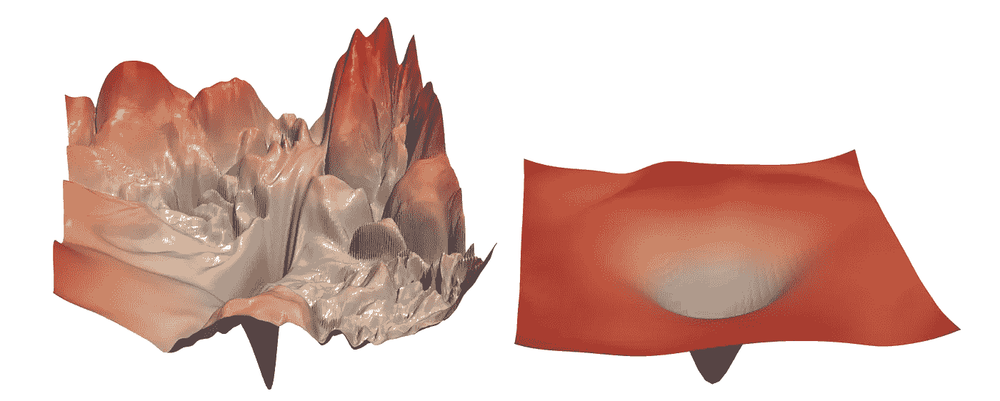
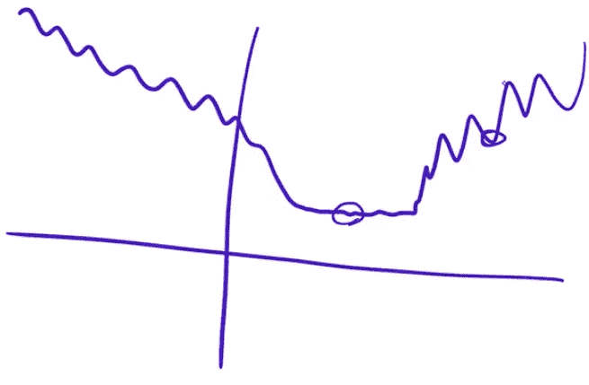
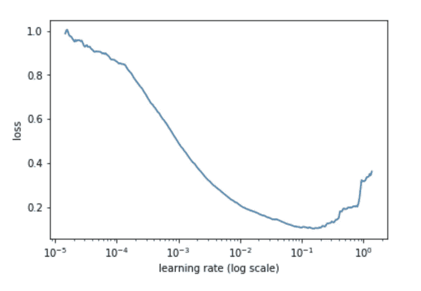
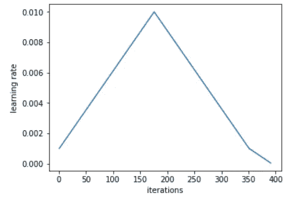
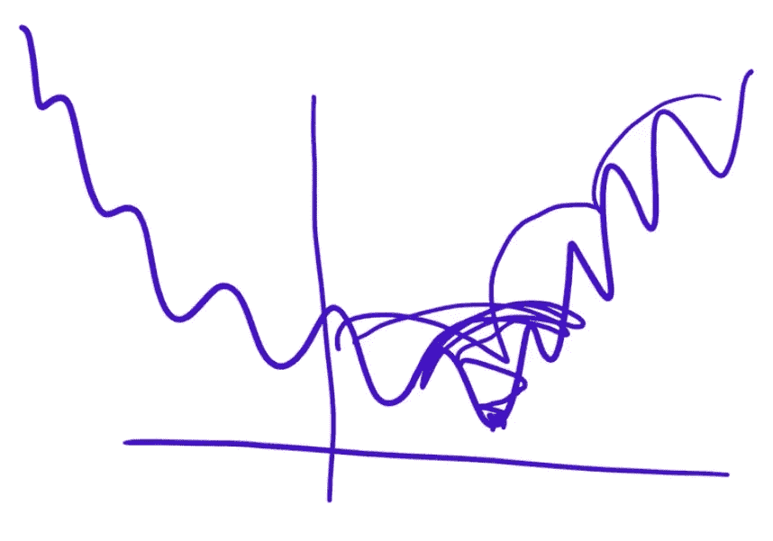

# 我从 fast.ai v3 中学到的 10 件新事情

> 原文：<https://towardsdatascience.com/10-new-things-i-learnt-from-fast-ai-v3-4d79c1f07e33?source=collection_archive---------3----------------------->

## 参加课程 3 周后的学习要点

2022 年 1 月 12 日—修正错别字并提高清晰度

E 每个人都在谈论 **fast.ai** 大规模开放在线课程(MOOC)，所以我决定试一试他们 2019 年的深度学习课程[程序员实用深度学习，v3](https://course.fast.ai/) 。

我一直知道一些深度学习的概念/想法(我在这个领域已经有一年左右了，主要是处理计算机视觉)，但从来没有真正理解过一些直觉或解释。课程导师[杰瑞米·霍华德](https://medium.com/u/34ab754f8c5e?source=post_page-----4d79c1f07e33--------------------------------)、[瑞秋·托马斯](https://medium.com/u/ee56d0bac1b7?source=post_page-----4d79c1f07e33--------------------------------)和西尔万·古格(在推特上关注他们！)都是深度学习领域有影响力的人(Jeremy 有很多 Kaggle 比赛的经验)，所以我希望从他们那里获得直觉，新的见解，以及一些模型训练的技巧和诀窍。我有很多东西要向这些人学习。

所以我在看了 3 周视频后(我没有做任何练习🤫🤫🤫🤫)写这篇文章是为了把我学到的新东西与你分享。当然，有些事情我一无所知，所以我对它们做了一些研究，并在这篇文章中提出了它们。最后，我还写了我对这门课程的感受(剧透:我喜欢❣️).

**免责声明** : 不同的人聚集不同的学习点，看你的深度学习背景。这篇文章不推荐给深度学习的初学者，也不是课程内容的总结。相反，这篇文章假设你有神经网络、梯度下降、损失函数、正则化技术和生成嵌入的基础知识。有以下方面的经验也很好:图像分类、文本分类、语义分割和生成对抗网络。

我组织了我的 10 个学习点的内容:从神经网络理论到架构，到与损失函数相关的事情(学习率、优化器)，到模型训练(和正则化)，到深度学习任务，最后是模型可解释性。

## 内容:我学到的 10 件新事情

1.  [普适逼近定理](#9715)
2.  [神经网络:设计&架构](#7cb3)
3.  [了解亏损情况](#a997)
4.  [梯度下降优化器](#7cab)
5.  [损失函数](#bf96)
6.  [培训](#1807)
7.  [规范化](#7cdd)
8.  [任务](#e471)
9.  [模型可解释性](#030f)
10.  [附录:关于模型复杂性的杰瑞米·霍华德&规范化](#e219)

## 0.Fast.ai &迁移学习

> “如果可以的话，使用迁移学习(来训练你的模型)总是好的。”—杰瑞米·霍华德

Fast.ai 是转移学习和在短时间内取得巨大成果的同义词。这门课程名副其实。迁移学习和实验主义是杰瑞米·霍华德强调要成为高效机器学习实践者的两个基本理念。

## 1.通用逼近定理

Photo by [Vincentiu Solomon](https://unsplash.com/photos/ln5drpv_ImI?utm_source=unsplash&utm_medium=referral&utm_content=creditCopyText) on [Unsplash](https://unsplash.com/search/photos/astronomy?utm_source=unsplash&utm_medium=referral&utm_content=creditCopyText)

[通用逼近定理](https://en.wikipedia.org/wiki/Universal_approximation_theorem)说你可以在前向神经网络中仅用一个隐藏层来逼近*任何*函数。由此得出结论，你也可以对任何更深层次的神经网络实现同样的近似。

我是说，哇！我现在才知道这件事。这个*就是*深度学习的根本。如果你有一堆仿射函数(或矩阵乘法)和非线性函数，你最终得到的东西可以任意接近任何函数。这就是仿射函数和非线性的不同组合竞赛背后的原因。这是*架构越来越深入的*原因。

## 2.神经网络:设计与架构

本节将重点介绍课程中引人注目的架构，以及融入最先进(SOTA)模型(如 dropout)的具体设计。

*   相当于 SOTA；因此，您通常会使用它来完成许多与图像相关的任务，如图像分类和对象检测。这种架构在本课程的 Jupyter 笔记本中被大量使用。
*   对于图像分割任务来说，U-net 是非常先进的。
*   对于卷积神经网络(CNN ),步长=2 的卷积是前几层的标准
*   DenseNet 使用串联作为构建块中的最终操作，而 ResNet 使用加法操作。
*   **随意退出**
    ，我们扔掉*激活*。直觉:因此没有激活可以记忆输入的任何部分。这将有助于过度拟合，其中模型的某些部分学习识别特定的图像，而不是特定的特征或项目。还有**嵌入丢失、**但这只是简单地提到了一下。
*   **批量规格化(BatchNorm)**
    BatchNorm 做两件事:(1)规格化激活和(2)为每个规格化激活引入缩放和移动参数。但是，事实证明(1)没有(2)重要。在论文[中，批处理规范化如何帮助优化？](https://t.co/mvCCL1DLYF)，提到“[BatchNorm]重新参数化潜在的优化问题，使其景观显著平滑[er]。”直觉是这样的:因为现在不那么颠簸了，我们可以使用更高的学习率，因此收敛更快(见图 3.1)。

# 3.了解损失情况

Fig 3.1: Loss landscapes; the left landscape has many bumps, and the right is smooth. Source: [https://arxiv.org/abs/1712.09913](https://arxiv.org/abs/1712.09913)

损失函数通常有凹凸不平和平坦的区域(如果你在 2D 或 3D 图中可视化它们)。请看图 3.2。如果你最终处于一个崎岖不平的区域，这个解决方案可能不太适用。这是因为你在一个地方找到了很好的解决方案，但在另一个地方却不是很好。但是如果你在一个平坦的区域找到了一个解决方案，你可能会概括得很好。那是因为你找到了一个解决方案，它不仅适用于某一点，也适用于整个问题。

Fig. 3.2: Loss landscape visualised in a 2D diagram. Screenshot from course.fast.ai

上面的大部分段落都引自杰瑞米·霍华德。如此美丽而直白的解释。

## 4.梯度下降优化器

我学到的新东西是 RMSprop 优化器充当了一个“加速器”。直觉:如果你的梯度在过去的几步中一直很小，你现在需要走快一点。

(关于梯度下降优化器的概述，我写了一篇名为 [10 梯度下降优化算法](/10-gradient-descent-optimisation-algorithms-86989510b5e9)的文章。)

## **5。损失函数**

学习了两个新的损失函数:

1.  像素均方误差(**像素 MSE** )。这可以用在语义分割中，语义分割是课程内容之一，但不在本文中讨论。
2.  **特征丢失🤗**。这可以用于图像恢复任务。请参见任务:图像生成。

## 6。培训

Photo by [Victor Freitas](https://www.pexels.com/@victorfreitas?utm_content=attributionCopyText&utm_medium=referral&utm_source=pexels) from [Pexels](https://www.pexels.com/photo/man-about-to-lift-barbell-2261477/?utm_content=attributionCopyText&utm_medium=referral&utm_source=pexels)

本节研究了针对**的调整组合**

*   **重量初始化**
*   **超参数设置**
*   **模型拟合/微调**
*   **其他改进**

****转移学习**
模型权重既可以(I)随机初始化，也可以(ii)在称为**转移学习**的过程中从预先训练的模型转移。迁移学习利用预先训练的权重。预训练的重量*有有用的信息*。**

**适用于迁移学习的常见模型是这样工作的:训练更接近输出的权重，并冻结其他层。**

**对于迁移学习来说，使用与预训练模型应用的相同的**统计数据是至关重要的，例如，使用特定偏差校正图像 RGB 值。****

****❤️1 周期政策❤️** 这确实是我在这个课程中学到的最好的东西。我很抱歉一直认为学习率是理所当然的。[找到一个好的学习率](https://sgugger.github.io/how-do-you-find-a-good-learning-rate.html)是至关重要的，因为我们至少可以为我们的梯度下降提供一个学习率的有根据的猜测，而不是一些可能是次优的直觉值。**

**杰瑞米·霍华德一直在他的代码中使用`lr_finder()`和`fit_one_cycle()`——这让我很困扰，它工作得很好，我不知道为什么它会工作。于是我看了莱斯利·史密斯的[论文](https://arxiv.org/abs/1803.09820)和西尔万·古格的[博文](https://sgugger.github.io/the-1cycle-policy.html)(推荐阅读！)，这就是**1 周期**的工作方式:**

**1.执行 **LR 范围测试**:以从小数值(10e-8)到大数值(1 或 10)的(线性)递增学习率训练模型。绘制一个损失与学习率的关系图，如下所示。**

****

**Fig 6.1: Loss vs learning rate. Sourc[e: https://sgugger.github.io/how-do-you-find-a-good-learning-rate.h](https://sgugger.github.io/how-do-you-find-a-good-learning-rate.html)tml**

**2.选择最小和最大学习率。要选择最大学习率，请查看图表，选择一个足够高的学习率，并给出较低的损失值(不要太高，也不要太低)。这里你会选择 10e-2。选择最小值可以低十倍左右。这里应该是 10e-3。有关确定这些值的更多信息，请参见博客文章。**

**3.通过**周期学习率**的周期数拟合模型。一个周期是你的训练经历从最小到最大，然后回到最小的学习率。**

****

**Source: [https://sgugger.github.io/the-1cycle-policy.html](https://sgugger.github.io/the-1cycle-policy.html)**

**那么，我们为什么要这样做呢？整个想法如下。在亏损的情况下，我们想跳过它的突起(因为我们不想被困在某个沟里)。所以，在开始时增加学习率有助于模型跳出那个沟，探索函数曲面，并试图找到损失低且区域不均匀的区域(因为如果是，它又会被踢出去)。这使我们能够更快地训练模型。我们也倾向于以更一般化的解决方案结束。**

****

**Fig. 6.2: Screenshot from course.fast.ai**

****预训练模型的判别学习率** 用超低学习率训练前面的层，用较高的学习率训练最后的层。这个想法是不要剧烈改变几乎完美的预训练权重，除了极少量的，并且更积极地教导输出附近的层。在 ULMFiT 中引入了判别学习率。**

****一个幻数除数****

**在 1 周期拟合中，为获得最小学习率，用 2.6⁴.除以最大值这个数字适用于 NLP 任务。更多信息见 https://course.fast.ai/videos/?lesson=4 33:30。**

****用于超参数搜索的随机森林** 提到了随机森林可用于搜索超参数。**

****使用默认值** 使用库或实现论文的代码时，使用默认的超参数值和“不要逞英雄”。**

****预训练模型的模型微调****

**我注意到了杰里米的风格:训练最后几层，解冻所有层，训练所有重量。然而，这一步是实验性的，因为它可能会也可能不会提高准确性。如果没有，我希望你已经保存了你最后一次训练的重量😅。**

****渐进式调整大小** 这最适用于与图像相关的任务。使用较小版本的图像开始训练。然后，使用更大的版本进行训练。为此，使用迁移学习将训练的权重移植到具有相同架构但接受不同输入大小的模型。天才。**

****混合精度训练**** 

## **7。正规化**

****

**Photo by [Rosemary Ketchum](https://www.pexels.com/@ketchumcommunity?utm_content=attributionCopyText&utm_medium=referral&utm_source=pexels) from [Pexels](https://www.pexels.com/photo/man-wearing-black-officer-uniform-1464230/?utm_content=attributionCopyText&utm_medium=referral&utm_source=pexels)**

**使用**幻数 0.1** 进行重量衰减。如果你使用太多的权重衰减，你的模型将不会训练得足够好(拟合不足)。如果太少，你会倾向于过量，但没关系，因为你可以提前停止训练。**

## **8.任务**

****

**请注意，此处并未提及本课程涵盖的所有任务。**

*   **多标签分类**
*   **语言建模**
*   **表列数据**
*   **协同过滤**
*   **图象生成**

****a)多标签分类****

**我一直想知道你如何执行一个标签数量可变的[n 图像]分类任务，即[多标签分类](https://en.wikipedia.org/wiki/Multi-label_classification)(不要和[多类分类/多项式分类](https://en.wikipedia.org/wiki/Multiclass_classification)混淆，它的同胞是[二分类](https://en.wikipedia.org/wiki/Binary_classification))。**

**没有详细提到损失函数如何用于多标签分类。但是谷歌了一下，发现标签应该是多热点编码的向量。这意味着每个元素必须应用于最终模型输出中的 sigmoid 函数。损失函数是输出和地面实况的函数，使用二进制交叉熵来计算，以独立地惩罚每个元素。**

****b)语言建模****

**对于这个语言建模任务，我喜欢“语言模型”的定义(重新措辞):**

> ***语言模型是学习预测句子的下一个单词的模型。为此，你需要了解相当多的英语和世界知识。***

**这意味着你需要用大量的数据来训练模型。这就是本课程介绍 **ULMFiT** 的地方，这是一个可以基于预训练(换句话说，迁移学习)重用的模型。**

****c)表格数据****

**这是我第一次使用深度学习处理带有分类变量的表格数据！我不知道你可以这样做？无论如何，我们能做的是从分类变量中创建**嵌入。如果我没有选这门课，我不会想到这些。稍微搜索了一下，我就找到了 Rachel Thomas 关于表格数据深度学习介绍的帖子。****

**那么，如何将(a)连续变量的向量和(b)分类变量的嵌入结合起来呢？课程没有提到这方面的任何东西，但是这篇 StackOverflow [帖子](https://datascience.stackexchange.com/questions/29634/how-to-combine-categorical-and-continuous-input-features-for-neural-network-trai)强调了 3 种可能的方法:**

1.  **两种型号–一种用于(a)，一种用于(b)。让他们合奏。**
2.  **一个模型，一个输入。这个输入是(a)和(b)之间的连接。**
3.  **一个模型，两个输入。这两个输入是(a)和(b)。您在模型本身中将这两者连接起来。**

****d)协同过滤****

**协同过滤是当你的任务是预测一个*用户*会有多喜欢一个特定的*项目*(在这个例子中，假设我们使用电影评级)。课程介绍了使用**嵌入**来解决这个问题。这是我第一次遇到使用深度学习的协同过滤(好像我一开始就对协同过滤很有经验)！**

**目标是为每个用户和项目创建大小为 *n* 的嵌入。为此，我们随机初始化每个嵌入向量。然后，对于一部电影的每个用户评级，我们将其与他们各自嵌入的点积进行比较，例如使用 MSE。然后我们执行梯度下降优化。**

****e)图像生成****

**以下是我学到的一些东西:**

*   ****可根据我们的期望生成数据。我只是喜欢这个被创造出来的术语。****
*   **生成敌对网络(GANs) **讨厌** **气势**，所以设置为 0。**
*   **看亏损很难知道模型表现如何。人们必须**不时亲自看到生成的图像**(尽管对于鉴别器和发生器来说，最后的损耗应该大致相同)。**
*   **提高生成图像质量的一种方法是在我们的损失函数中包含*感知损失*(在 fast.ai 中也称为**特征损失**)。通过从网络中间某处的张量中取值来计算特征损失。**

## **9。模型可解释性**

****

**Photo by [Maria Teneva](https://unsplash.com/photos/2Wa88Py0h0A?utm_source=unsplash&utm_medium=referral&utm_content=creditCopyText) on [Unsplash](https://unsplash.com/search/photos/understand?utm_source=unsplash&utm_medium=referral&utm_content=creditCopyText)**

**在其中一堂课上，杰瑞米·霍华德展示了一幅图像的**激活** **热图**用于图像分类任务。该热图显示了“激活”的像素。这种可视化将帮助我们理解图像的哪些特征或部分导致了模型的输出👍🏼。**

## **10.附录:杰瑞米·霍华德关于模型复杂性和正则化**

****

**Photo by [NEW DATA SERVICES](https://unsplash.com/photos/UO-QYR28hS0?utm_source=unsplash&utm_medium=referral&utm_content=creditCopyText) on [Unsplash](https://unsplash.com/search/photos/dialogue?utm_source=unsplash&utm_medium=referral&utm_content=creditCopyText)**

**我转录了课程的这一部分(第五课),因为直觉是如此令人信服❤️.在这里，Jeremy 首先召集了那些认为增加模型复杂性不可取的人，重塑他们的观点，然后将他们带到 [**L2 规则**](https://en.wikipedia.org/wiki/Regularization_(mathematics)) 。**

**哦，我是统计部的，所以他让我措手不及😱。**

> **所以如果你们中的任何一个人不幸被统计学、心理学、计量经济学或任何这类课程的背景所洗脑，你必须放弃你需要更少参数的想法，因为你需要意识到的是你将会适应你需要更少参数的谎言，因为这是一个方便的虚构，真实的事实是你不希望你的函数太复杂。拥有更少的参数是降低复杂性的一种方式。**
> 
> **但是如果你有 1000 个参数，其中 999 个是 1e-9 呢？或者如果有 0 呢？如果是 0，那么它们就不存在。或者如果他们是 1e-9，他们几乎不在那里。**
> 
> **如果很多参数都很小，为什么我不能有很多参数呢？答案是你可以。所以这个东西，计算参数的数量是我们限制复杂性的方式，实际上是非常有限的。这是一部存在很多问题的小说，对吗？所以，如果在你的头脑中，复杂性是通过你有多少参数来评分的，那你就大错特错了。适当评分。**
> 
> **那么我们为什么要在乎呢？为什么我要使用更多的参数？**
> 
> **因为更多的参数意味着更多的非线性，更多的相互作用，更多的弯曲位，对吗？现实生活充满了曲折。现实生活不是这样的[温饱线]。但是我们不希望它们比必要的更弯曲，或者比必要的更互动。**
> 
> **因此，让我们使用大量的参数，然后惩罚复杂性。**
> 
> **好的，惩罚复杂性的一个方法是，就像我之前建议的，让我们总结一下参数的值。因为有些参数是正的，有些是负的，所以这不太适用，对吧？那么如果我们对参数的平方求和。**
> 
> **这确实是个好主意。**
> 
> **让我们实际创建一个模型，在损失函数中，我们将添加参数的平方和。现在有一个问题。也许这个数字太大了，以至于最好的损失是将所有参数设置为 0。这可不好。所以实际上我们想确保这不会发生。因此，我们不仅要将参数的平方和加到模型中，还要乘以我们选择的某个数字。我们在斋戒中选择的数字叫做`wd`。**

**你可能也想看看我是如何在我的文章[L1 和 L2 正则化的直觉](/intuitions-on-l1-and-l2-regularisation-235f2db4c261)中使用梯度下降解释这两种正则化技术的。**

## **结论**

**我喜欢这门课。以下是一些原因:**

*   **他们给出直觉和易于理解的解释。**
*   **他们用丰富的资源补充功课。**
*   **他们鼓励你将深度学习应用到各自的领域来构建东西。**
*   **他们似乎总是与令人兴奋的和新颖的出版物保持同步，然后在适当的时候将它们整合到 fastai 图书馆中。**
*   **他们也对深度学习做了很多研究(阅读:ULMFiT)。**
*   **他们围绕 fastai 图书馆建立了一个社区；因此你会很快得到支持。**
*   **他们的技巧和诀窍对 Kagglers 和精度驱动的建模很有帮助。**

**我期待着课程的下一部分！**

**如果你喜欢这篇文章，请给我一两个掌声:)如果你看到任何错误，请突出显示并告诉我。另外，看看我写的关于深度学习的其他文章:**

****通用****

**[统计深度学习模型中的参数数量](/counting-no-of-parameters-in-deep-learning-models-by-hand-8f1716241889)**

****语言****

**[RNN、LSTM 和 GRU 的动画](/animated-rnn-lstm-and-gru-ef124d06cf45)**

**[经办人:图文并茂的注意事项](/attn-illustrated-attention-5ec4ad276ee3)**

**[图文并茂:自我关注](/illustrated-self-attention-2d627e33b20a)**

**[逐行 Word2Vec 实现](/an-implementation-guide-to-word2vec-using-numpy-and-google-sheets-13445eebd281)(由我的朋友 Derek 完成)**

****计算机视觉****

**[分解平均平均精度(图)](/breaking-down-mean-average-precision-map-ae462f623a52)(朋友任杰写的)**

****神经架构搜索****

**[图文并茂:高效的神经架构搜索](/illustrated-efficient-neural-architecture-search-5f7387f9fb6)**

****优化****

**[随机梯度下降线性回归分步指南](/step-by-step-tutorial-on-linear-regression-with-stochastic-gradient-descent-1d35b088a843)**

**[10 种梯度下降优化算法+备忘单](/10-gradient-descent-optimisation-algorithms-86989510b5e9)**

***关注我上*[*Twitter*](https://www.twitter.com/remykarem)*@ remykarem 或者*[*LinkedIn*](http://www.linkedin.com/in/raimibkarim)*。你也可以通过 raimi.bkarim@gmail.com 联系我。欢迎访问我的网站*[*remykarem . github . io*](https://remykarem.github.io/)*。***