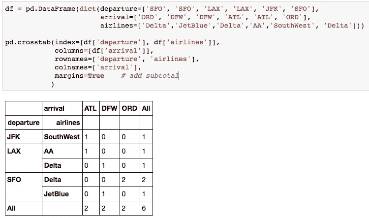

# 让数据分析更快的 10 个 Python 熊猫技巧

> 原文：<https://towardsdatascience.com/10-python-pandas-tricks-to-make-data-analysis-more-enjoyable-cb8f55af8c30?source=collection_archive---------5----------------------->


Photo by [Vashishtha Jogi](https://unsplash.com/photos/COnonhVjy58?utm_source=unsplash&utm_medium=referral&utm_content=creditCopyText) on [Unsplash](https://unsplash.com/search/photos/lake?utm_source=unsplash&utm_medium=referral&utm_content=creditCopyText)

## 1.式样

在 Jupyter 笔记本上做`.head()`的时候，你有没有抱怨过表格输出看起来很无聊？有没有办法不显示索引(尤其是已经有 ID 列的时候)？有办法解决这些问题。

**A .突出显示数据帧中的所有负值。**(示例修改自[https://pandas . pydata . org/pandas-docs/stable/user _ guide/style . html](https://pandas.pydata.org/pandas-docs/stable/user_guide/style.html))

```
import pandas as pd
def color_negative_red(val):
    color = 'red' if val < 0 else 'black'
 return 'color: %s' % colordf = pd.DataFrame(dict(col_1=[1.53,-2.5,3.53], 
                       col_2=[-4.1,5.9,0])
                 )
df.style.applymap(color_negative_red)
```


**B .隐藏索引。**试试`df.head().style.hide_index()`！
**C .添加悬停效果。**(示例修改自[https://pandas . pydata . org/pandas-docs/stable/reference/API/pandas . io . formats . style . styler . set _ table _ styles . html](https://pandas.pydata.org/pandas-docs/stable/reference/api/pandas.io.formats.style.Styler.set_table_styles.html))

```
df = pd.DataFrame(np.random.randn(5, 3))
df.style.set_table_styles(
[{'selector': 'tr:hover',
  'props': [('background-color', 'yellow')]}]
)
```


**D .更多 CSS 样式。你可以使用 CSS 来改变表格的外观。**

```
df = pd.DataFrame(
dict(departure=['SFO', 'SFO', 'LAX', 'LAX', 'JFK', 'SFO'],
     arrival=['ORD', 'DFW', 'DFW', 'ATL', 'ATL', 'ORD'],
     airlines=['Delta','JetBlue','Delta',’AA','SouthWest',  
               'Delta']),
columns=['airlines', 'departure','arrival'])df.style.set_table_styles(
[{'selector': 'tr:nth-of-type(odd)',
  'props': [('background', '#eee')]}, 
 {'selector': 'tr:nth-of-type(even)',
  'props': [('background', 'white')]},
 {'selector': 'th',
  'props': [('background', '#606060'), 
            ('color', 'white'),
            ('font-family', 'verdana')]},
 {'selector': 'td',
  'props': [('font-family', 'verdana')]},
]
).hide_index()
```


## 2.熊猫选项

读者在使用`.head(n)`检查数据帧时可能会遇到以下问题:
(1)数据帧中的列/行太多，中间的一些列/行被省略。
(2)包含长文本的列被截断。
(3)包含浮动的列显示的数字太多/太少。

人们可以设定

```
import pandas as pd 
pd.options.display.max_columns = 50  # None -> No Restrictions
pd.options.display.max_rows = 200    # None -> Be careful with this 
pd.options.display.max_colwidth = 100
pd.options.display.precision = 3
```

来解决这些问题。

## 3.使用多个聚合进行分组

在 SQL 中，我们可以像这样进行聚合

```
SELECT A, B, max(A), avg(A), sum(B), min(B), count(*)
FROM table
GROUP BY A, B
```

在熊猫身上，这可以通过`.groupby()`和`.agg()`来实现:

```
import pandas as pd
import numpy as np 
df = pd.DataFrame(dict(A=['coke', 'sprite', 'coke', 'sprite',
                          'sprite', 'coke', 'coke'],
                       B=['alpha','gamma', 'alpha', 'beta',
                          'gamma', 'beta', 'beta'],
                       col_1=[1,2,3,4,5,6,7],
                       col_2=[1,6,2,4,7,9,3]))tbl = df.groupby(['A','B']).agg({'col_1': ['max', np.mean],
                                 'col_2': ['sum','min','count']})# 'count' will always be the count for number of rows in each group.
```

结果会是这样的:


行和列都是多索引的。将其更改为没有多索引的数据帧的快速解决方案是

```
tbl = tbl.reset_index()
tbl.columns = ['A', 'B', 'col_1_max', 'col_2_sum', 'col_2_min', 'count']
```

如果您想让列重命名过程自动化，您可以执行`tbl.columns.get_level_values(0)`和`tbl.columns.get_level_values(1)`来提取每个级别中的索引并组合它们。

## 4.列切片

你们中的一些人可能对此已经很熟悉了，但是我仍然发现它在处理包含大量列的数据帧时非常有用。

```
df.iloc[:,2:5].head()             # select the 2nd to the 4th column
df.loc[:,'column_x':].head()   
# select all columns starting from 'column_x'
```

## 5.向每个组添加行 ID /随机行 ID

要通过 A、B 为每个组添加行 ID /随机行 ID，可以首先将 ID /随机 ID 附加到所有行:

```
import numpy as np
# df: target dataframe np.random.seed(0)   # set random seed
df['random_ID_all'] = np.random.permutation(df.shape[0])
df['ID_all'] = [i for i in range(1, df.shape[0]+1)]
```

要为每个组添加一个随机 ID(通过 A、B)，可以这样做

```
df['ID'] = df.groupby(['A', 'B'])['ID_all'].rank(method='first', ascending=True).astype(int)df['random_ID'] = df.groupby(['A', 'B'])['random_ID_all'].rank(method='first', ascending=True).astype(int)
```

得到


## 6.列出组中所有唯一的值

有时，在执行 group by 后，我们希望将目标列中的值聚合为唯一值的列表，而不是 max、min 等。这是怎么做的。

```
df = pd.DataFrame(dict(A=['A','A','A','A','A','B','B','B','B'],
                       B=[1,1,1,2,2,1,1,1,2],
                       C=['CA','NY','CA','FL','FL',     
                          'WA','FL','NY','WA']))tbl = df[['A', 'B', 'C']].drop_duplicates()\
                         .groupby(['A','B'])['C']\
                         .apply(list)\
                         .reset_index()# list to string (separated by commas) 
tbl['C'] = tbl.apply(lambda x: (','.join([str(s) for s in x['C']])), axis = 1)
```


如果您想保存结果，不要忘记将分隔符更改为逗号以外的任何内容。

## 7.将行总计和列总计添加到数字数据框架中

这是另一种常见的数据操作。你需要的只是`.apply()`。

```
df = pd.DataFrame(dict(A=[2,6,3],
                       B=[2,2,6], 
                       C=[3,2,3]))df['col_total']     = df.apply(lambda x: x.sum(), axis=1)
df.loc['row_total'] = df.apply(lambda x: x.sum())
```


## 8.检查内存使用情况

`.memory_usage(deep=True)`可用于 Pandas 数据帧，查看每一列使用的内存量(以字节为单位)。这在构建机器学习模型时很有用，因为在训练中可能需要大量内存。

## 9.累积和

有时，当您生成一些统计结果时，需要累积和。干脆做`df['cumulative_sum'] = df['target_column'].cumsum()`。

## 10.交叉表

当您需要统计由 3 个以上特征组成的组的频率时，`pd.crosstab()`可以让您的工作变得更加轻松。



感谢阅读！如果你发现了错误/更好的解决方案，请在下面评论。