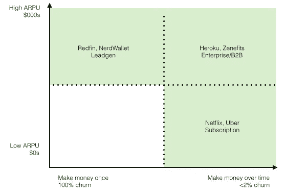
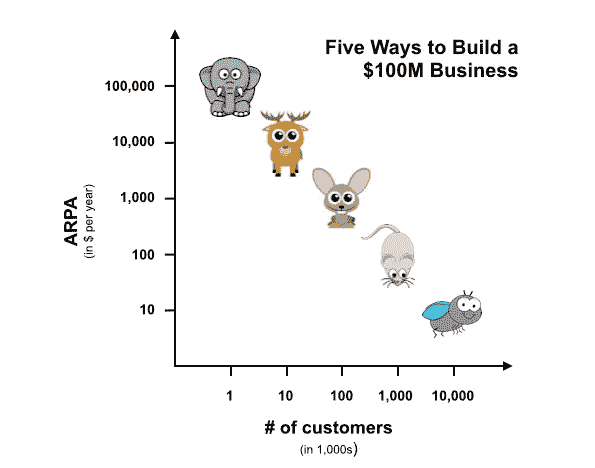

# 数据科学家开始使用商业模型的 10 个阅读材料

> 原文：<https://towardsdatascience.com/10-reads-for-data-scientists-getting-started-with-business-models-78e6a224fd66?source=collection_archive---------14----------------------->

Photo by [Andrew Gook](https://unsplash.com/photos/I_RiQF3bcZk?utm_source=unsplash&utm_medium=referral&utm_content=creditCopyText) on [Unsplash](https://unsplash.com/search/photos/business-model?utm_source=unsplash&utm_medium=referral&utm_content=creditCopyText)

## 弥合技术技能和业务之间的差距

如果您刚开始接触数据科学，您可能会将注意力主要集中在统计和编码上。这没有错，事实上，这是正确的举措——这些是你需要在旅程早期培养的基本技能。

话虽如此，但在我的[数据科学之旅](https://github.com/conordewey3/DS-Career-Resources)中，我遇到的最大知识缺口并不涉及这两个领域。相反，在开始我的第一份全职数据科学家工作时，我惊讶地意识到，我并不真正了解业务。

我怀疑这是一个共同的主题。如果你在大学里学习了某个技术领域，或者通过在线课程学到了一些东西，那么你就不太可能有任何理由去深入研究商业概念，比如模型、战略或者重要的指标。除此之外，我真的没有遇到过对这种理解进行压力测试的数据科学采访。他们中的许多人试图获得产品直觉的感觉，但我发现它很少超越这一点。

事实是，在数据科学社区中，业务理解并没有被教授或传播到实际应用的程度。这篇文章的目标是通过分享一些我发现最有帮助的资源来帮助弥合这一差距，因为我已经了解了企业是如何从内到外运作的。

# [16 个创业指标](https://a16z.com/2015/08/21/16-metrics/)

如果你试图熟悉一个企业中出现的大量指标和首字母缩写词，无论它是否是一家初创企业，那么来自[的安德森·霍洛维茨](https://a16z.com/)的这篇文章是一个很好的起点。总的来说，他们的帖子质量一贯很高，几乎总是值得你花时间。如果你有更大的胃口，查看他们关于 [16 个更多指标](https://a16z.com/2015/09/23/16-more-metrics/)的后续帖子和下面的帖子，了解更多关于指标的技巧。

Some helpful tips on misleading metrics

# [30 种成功的商业模式](https://fourweekmba.com/what-is-a-business-model/)

作为一个全面的可靠资源，FourWeekMBA 上的文章在某种程度上是值得探究的。我特别推荐这本书，因为它是对所有不同商业模式的概述。不学点新的东西，很难从中解脱出来。为了更实际地探究商业模式，我还发现[这篇文章](https://fourweekmba.com/slack-business-model/)讲述了 Slack 如何让金钱变得有趣。

# [聚集理论](https://stratechery.com/2015/aggregation-theory/)

这个比前两个密一点，但是真的很优秀。Stratechery 中不容错过的 Ben Thompson 讲述了市场是如何运作的，以及为什么某些公司主宰着他们的行业。这篇文章的要点是，市场有三个组成部分，能够垄断其中两个的公司通常会大获全胜。想想网飞。

# [为什么投资者不投资相亲](https://andrewchen.co/why-investors-dont-fund-dating/)

到目前为止，我们看到的很多都是概念性的，所以让我们来看一个具体的模型，并分析它为什么可行和不可行。我最喜欢的商业作家之一，[陈楚翔](https://andrewchen.co/)关注约会行业以及为什么大多数投资者不觉得它有吸引力。这位风险投资家的其他优秀文章通常会涵盖诸如[增长](https://andrewchen.co/how-to-build-a-growth-team/)和[指标](https://andrewchen.co/why-consumer-product-metrics-are-all-terrible/)等内容。

[Why Investors Don’t Fund Dating](https://andrewchen.co/why-investors-dont-fund-dating/)

# [数据工厂](https://stratechery.com/2018/data-factories/)

更多来自本·汤普森，这是他的另一篇伟大的文章。这一次是关于大公司，尤其是脸书和谷歌，如何将数据从原始形式处理成有独特价值的东西。该报告于 2018 年秋季发布，为我们现在看到的所有数据隐私和监管问题的商业方面提供了一个良好的早期视角。

# [LTV 公式的危险诱惑](http://abovethecrowd.com/2012/09/04/the-dangerous-seduction-of-the-lifetime-value-ltv-formula/)

如果你不熟悉 LTV(终生价值)，那么你可能必须在某个时候熟悉它。关于这个指标有很多资源，但这可能是我最喜欢的关于这个主题的方法。它清楚地解释了如何计算 LTV，以及为什么你应该在没有上下文的情况下盲目买入之前三思。

# [打造 1 亿美元企业的五种方法](http://christophjanz.blogspot.com/2014/10/five-ways-to-build-100-million-business.html)

这篇短文主要关注 SaaS(软件即服务)商业模式。下图简单地描述了基本的想法，但是我仍然建议你花时间阅读完整的文章。Christoph Janz 在解决复杂问题并将其分解方面做得非常出色。他最近还在[的新帖](http://christophjanz.blogspot.com/2019/04/five-years-later-five-ways-to-build-100.html)中更新了图表。

[Five Ways to Build A $100 Million Business](http://christophjanz.blogspot.com/2014/10/five-ways-to-build-100-million-business.html)

# [战略信 V](https://www.joelonsoftware.com/2002/06/12/strategy-letter-v/)

StackOverflow 的联合创始人和前首席执行官 Joel Spolsky 在这里强调了一个重要的半商业半经济学的教训:聪明的公司试图将他们产品的补充物商品化。他们是否成功是一个非常不同的故事，这里有大量的例子。

# [如何通过捆绑销售获得商业成功](https://hbr.org/2014/06/how-to-succeed-in-business-by-bundling-and-unbundling)

我们讨论了公司赚钱的几种方式，但是这个资源采用了最简单的(也是最准确的)方法。这一切都是从吉姆·巴克斯代尔在一次贸易展览会上开始的。当他出门赶飞机时，他在离开前给观众留下了最后一颗智慧之珠，它很好地总结了这篇文章。

> "先生们，我知道的赚钱方式只有两种:捆绑销售和非捆绑销售."

# [MBA 案例研究](https://www.gsb.stanford.edu/faculty-research/case-studies)

最后但同样重要的是，如果你想更进一步，我推荐案例研究。你可以从顶尖大学找到很多，比如斯坦福大学、T2 大学和哈佛大学，价格很便宜，或者经常是免费的。一旦你掌握了基本原理，这是继续补充你的学习的极好方法。这就是我目前的处境——我已经挑战自己，整个夏天每两周进行一次案例研究。[和我一起](https://twitter.com/conordewey3/status/1123926075652943872)上路吧！

# 包扎

列表就这样了。我知道以上所有的链接真的帮助了我，我希望你花时间去探索它们。您可能已经注意到，并非所有这些都与数据科学家的日常生活息息相关，这是有意的。

我在我的[上一篇文章](https://www.conordewey.com/blog/what-should-onboarding-look-like-for-data-scientists/)中说过，我将再说一遍——数据科学家是思想家。当我们了解我们周围的系统时，我们的工作做得最好。这种理解为我们设置了很酷的东西:探索性分析、机器学习和数据可视化。先打基础，后收获收益。这就是它的意义所在。

*以上选取的资源深受《Squarespace》的 SVP、安德鲁·巴塞洛缪的* [*阅读清单*](https://www.abartholomew.com/reading) *的影响。*

感谢阅读！请随意查看下面我的一些类似文章，并订阅我的时事通讯中有趣的链接和新内容。

*   [新的和有抱负的数据科学家建议汇编](https://www.conordewey.com/blog/compilation-of-advice-for-new-and-aspiring-data-scientists/)
*   [数据科学家的入职应该是什么样的？](https://www.conordewey.com/blog/what-should-onboarding-look-like-for-data-scientists/)
*   [面向数据科学家的 13 份重要新闻简报:重新制作](https://www.conordewey.com/blog/13-essential-newsletters-for-data-scientists-remastered/)

你可以在 Medium 上关注我更多类似的帖子，也可以在 Twitter 上找到我。更多关于我和我在做什么，请查看[我的网站](https://www.conordewey.com/)。