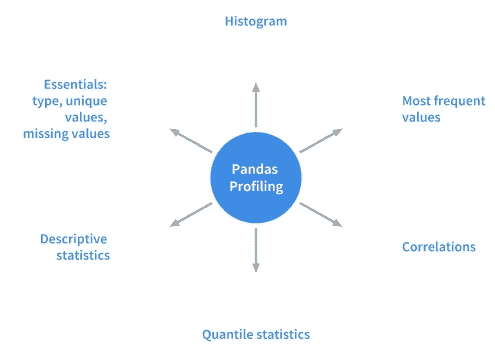
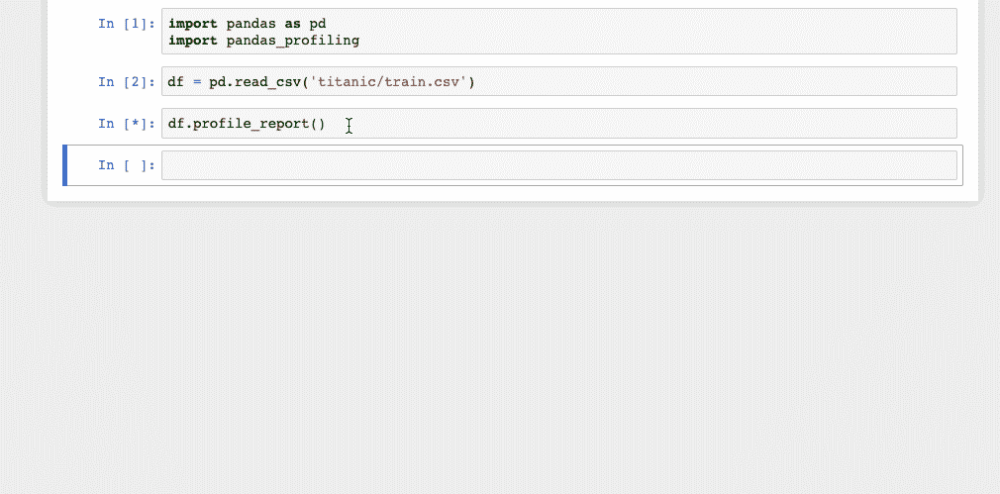

# 用 Python 加速数据分析的 10 个简单技巧

> 原文：<https://towardsdatascience.com/10-simple-hacks-to-speed-up-your-data-analysis-in-python-ec18c6396e6b?source=collection_archive---------0----------------------->


[Source](https://pixabay.com/images/id-2123970/)

提示和技巧，尤其是在编程领域，非常有用。有时候一点小技巧既能节省时间又能挽救生命。一个小的快捷方式或附加功能有时会被证明是天赐之物，可以成为真正的生产力助推器。所以，这里有一些我最喜欢的技巧和窍门，我用它们汇编成了这篇文章。有些可能是相当有名的，有些可能是新的，但我相信，下次你从事数据分析项目时，它们会非常方便。

# 1.描绘熊猫数据帧

**剖析**是一个帮助我们理解数据的过程，而**[**Pandas Profiling**](https://github.com/pandas-profiling/pandas-profiling)是一个 python 包，它正好可以做到这一点。这是对熊猫数据框架进行探索性数据分析的一种简单而快速的方法。熊猫`df.describe()`和`df.info()functions`通常被用作 EDA 过程的第一步。但是，它只是给出了数据的一个非常基本的概述，对于大型数据集没有太大的帮助。另一方面，Pandas Profiling 函数使用`df.profile_report()`扩展了 pandas DataFrame，以便进行快速数据分析。它用一行代码显示了大量信息，在交互式 HTML 报告中也是如此。**

**对于给定的数据集，pandas profiling 包计算以下统计数据:**

****

**Statistics computer by Pandas Profiling package.**

## **装置**

```
pip install pandas-profiling
or
conda install -c anaconda pandas-profiling
```

## **使用**

**让我们使用古老的 titanic 数据集来演示多功能 python 分析器的功能。**

```
#importing the necessary packages
import pandas as pd
import pandas_profiling#Pandas-Profiling 2.0.0
df = pd.read_csv('titanic/train.csv')
df.profile_report()
```

**在 Jupyter 笔记本中显示数据分析报告只需要这一行代码。这份报告非常详细，必要时还附有图表。**

****

**该报告也可以用下面的代码导出到一个**交互式 HTML 文件**中。**

```
profile = df.profile_report(title='Pandas Profiling Report')
profile.to_file(outputfile="Titanic data profiling.html")
```

****

**更多细节和示例请参考[文件](https://pandas-profiling.github.io/pandas-profiling/docs/)。**

# **2.给熊猫情节带来互动性**

****Pandas** 有一个内置的`.plot()`函数作为 DataFrame 类的一部分。然而，用这个函数呈现的可视化效果不是交互式的，这使得它不那么吸引人。相反，也不能排除用`pandas.DataFrame.plot()`功能绘制图表的方便性。如果我们不用对代码进行大的修改就能绘制出像熊猫图表那样的交互式图表，会怎么样？嗯，实际上你可以借助 [**袖扣**](https://github.com/santosjorge/cufflinks) 库**来做到这一点。****

**袖扣库将[**plottly**](http://www.plot.ly/)的力量与[熊猫](http://pandas.pydata.org/)的灵活绑定，方便出图。现在让我们看看如何安装这个库，并让它在 pandas 中工作。**

## **装置**

```
pip install plotly # Plotly is a pre-requisite before installing cufflinks
pip install cufflinks
```

## **使用**

```
#importing Pandas 
import pandas as pd
#importing plotly and cufflinks in offline mode
import cufflinks as cfimport plotly.offline
cf.go_offline()
cf.set_config_file(offline=False, world_readable=True)
```

**是时候看看泰坦尼克号数据集的神奇之处了。**

```
df.iplot()
```

******

**df.iplot() vs df.plot()**** 

**右边的可视化显示了静态图表，而左边的图表是交互式的，更加详细，所有这些都没有在语法上做任何重大改变。**

**[**点击此处**](https://github.com/santosjorge/cufflinks/blob/master/Cufflinks%20Tutorial%20-%20Pandas%20Like.ipynb) 查看更多示例。**

# **3.一丝魔力**

****Magic commands** 是 Jupyter 笔记本中的一组便利功能，旨在解决标准数据分析中的一些常见问题。在`%lsmagic`的帮助下，你可以看到所有可用的魔法。**

****

**List of all available magic functions**

**魔术命令有两种: ***行魔术*** ，以单个`%`字符为前缀，对单行输入进行操作；以及 ***单元格魔术*** ，与双`%%`前缀相关联，对多行输入进行操作。如果设置为 1，魔术函数无需输入初始%即可调用。**

**让我们看看其中一些在常见数据分析任务中可能有用的工具:**

*   ****% pastebin****

**%pastebin 上传代码到 [Pastebin](https://en.wikipedia.org/wiki/Pastebin) 并返回 URL。Pastebin 是一个在线内容托管服务，在这里我们可以存储像源代码片段这样的纯文本，然后可以与他人共享 URL。事实上，Github gist 也类似于 **pastebin** ，尽管有版本控制。**

**考虑具有以下内容的 python 脚本`file.py`:**

```
#file.py
def foo(x):
    return x
```

**使用 Jupyter 笔记本中的 **%pastebin** 生成一个 pastebin url。**

****

*   ****%matplotlib 笔记本****

**`%matplotlib inline`函数用于呈现 Jupyter 笔记本中的静态 matplotlib 图。尝试用`notebook` 替换`inline`部分，轻松获得可缩放的&可调整大小的图。确保在导入 matplotlib 库之前调用该函数。**

****

****%matplotlib inline vs %matplotlib notebook****

*   ****%运行****

**`%run`函数在笔记本中运行一个 python 脚本。**

```
%run file.py
```

*   ****% %写文件****

**`%%writefile`将单元格的内容写入文件。这里，代码将被写入一个名为 **foo.py** 的文件，并保存在当前目录中。**

****

*   ****% %乳胶****

**%%latex 函数将单元格内容呈现为 latex。这对于在单元格中书写数学公式和方程式非常有用。**

****

# **4.查找和消除错误**

**交互式调试器也是一个神奇的功能，但是我给了它一个自己的类别。如果在运行代码单元时出现异常，在新的一行中键入`%debug`并运行它。这将打开一个交互式调试环境，将您带到发生异常的位置。您还可以检查程序中分配的变量值，并在此执行操作。点击`q`退出调试器。**

****

# **5.印刷也可以很漂亮**

**如果您想要生成美观的数据结构表示，那么 [**pprint**](https://docs.python.org/2/library/pprint.html) 是您需要的模块。它在打印字典或 JSON 数据时特别有用。让我们看一个同时使用`print`和`pprint`来显示输出的例子。**

********

# **6.让音符突出。**

**我们可以在您的 Jupyter 笔记本中使用提醒/笔记框来突出显示重要的事情或任何需要突出显示的内容。注释的颜色取决于指定的警报类型。只需在需要突出显示的单元格中添加以下任意或所有代码。**

*   ****蓝色警告框:信息****

```
<div class="alert alert-block alert-info">
<b>Tip:</b> Use blue boxes (alert-info) for tips and notes. 
If it’s a note, you don’t have to include the word “Note”.
</div>
```

****

*   ****黄色警告框:警告****

```
<div class="alert alert-block alert-warning">
<b>Example:</b> Yellow Boxes are generally used to include additional examples or mathematical formulas.
</div>
```

****

*   ****绿色警告框:成功****

```
<div class="alert alert-block alert-success">
Use green box only when necessary like to display links to related content.
</div>
```

****

*   ****红色警告框:危险****

```
<div class="alert alert-block alert-danger">
It is good to avoid red boxes but can be used to alert users to not delete some important part of code etc. 
</div>
```

****

# **7.打印单元格的所有输出**

**考虑包含以下代码行的 Jupyter Notebook 的一个单元格:**

```
In  [1]: 10+5          
         11+6Out [1]: 17
```

**只有最后一个输出被打印出来，这是单元格的正常属性，对于其他输出，我们需要添加`print()`函数。事实证明，我们可以通过在笔记本顶部添加以下代码片段来打印所有输出。**

```
from IPython.core.interactiveshell import InteractiveShell  InteractiveShell.ast_node_interactivity = "**all**"
```

**现在所有的输出都一个接一个地打印出来了。**

```
In  [1]: 10+5          
         11+6
         12+7Out [1]: 15
Out [1]: 17
Out [1]: 19
```

**要恢复到原始设置:**

```
InteractiveShell.ast_node_interactivity = "**last_expr**"
```

# **8.使用“I”选项运行 python 脚本。**

**从命令行运行 python 脚本的典型方式是:`python hello.py.`然而，如果在运行相同的脚本时添加一个额外的`-i` ，例如`python -i hello.py`，它会提供更多的优势。让我们看看怎么做。**

*   **首先，一旦程序结束，python 不会退出解释器。因此，我们可以检查变量值和程序中定义的函数的正确性。**

****

*   **其次，我们可以通过以下方式轻松调用 python 调试器，因为我们仍然在解释器中:**

```
import pdb
pdb.pm()
```

**这将把我们带到发生异常的位置，然后我们可以处理代码。**

***原文* [*出处*](http://www.bnikolic.co.uk/blog/python-running-cline.html) *的 hack。***

# **9.自动注释掉代码**

**`Ctrl/Cmd + /`自动注释掉单元格中选中的行。再次点击该组合将取消对同一行代码的注释。**

****

# **10.删除是人性，恢复神性**

**你曾经不小心删除了 Jupyter 笔记本中的单元格吗？如果是，那么这里有一个可以撤消删除操作快捷方式。**

*   **如果您删除了单元格中的内容，您可以通过点击`CTRL/CMD+Z`轻松恢复**
*   **如果您需要恢复整个删除的单元格，请点击`ESC+Z` 或`EDIT > Undo Delete Cells`**

****

# **结论**

**在本文中，我列出了我在使用 Python 和 Jupyter 笔记本时收集的主要技巧。我相信这些简单的技巧会对你有用，你会从这篇文章中受益匪浅。直到那时快乐编码！。**