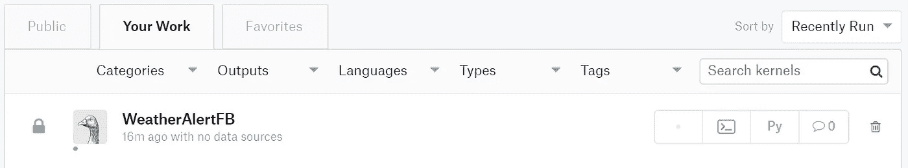

# 使用云服务安排脚本的 10 步指南(免费)

> 原文：<https://towardsdatascience.com/10-step-guide-to-schedule-your-script-using-cloud-services-7f4a8e517d81?source=collection_archive---------5----------------------->


credit: [https://www.pexels.com/photo/bandwidth-close-up-computer-connection-1148820/](https://www.pexels.com/photo/bandwidth-close-up-computer-connection-1148820/)

# 为什么我不能在我的笔记本上运行它？

嗯…，你可以在本地运行它，我相信如果你是 Windows 用户，很多人可能知道任务调度功能。我们设置触发时间和条件，脚本将根据我们预定义的标准运行。然而，这样做的缺点是，你需要让你的电脑在预定的时间“开机”(如果不是一直开机的话)。

当我想运行我的[小脚本来检索每天早上](https://medium.freecodecamp.org/how-to-get-facebook-messenger-to-notify-you-about-the-weather-8b5e87a64540)的天气预报时，我遇到了这个问题。让我的笔记本电脑一直开着，只是为了每天运行这个简单的任务，这对我来说是不现实的。

请将此视为[带笔记本仪表板的免费指南:第三天](https://www.kaggle.com/rtatman/dashboarding-with-notebooks-day-3) / [第四天](https://www.kaggle.com/rtatman/dashboarding-with-notebooks-day-4)。这完全归功于雷切尔博士和 Kaggle 团队。感谢他们在原创内容上的努力，他们还在这里发布了直播录制的[。](https://www.youtube.com/watch?v=cdEUEe2scNo&feature=youtu.be&utm_medium=email&utm_source=intercom&utm_campaign=dashboarding-event)

本文旨在帮助那些不是核心程序员并且不熟悉 Bash 和云服务中的文件系统的人。因此，我在这里包括了很多截图和详细的解释。

## 使用 Kaggle 和 PythonAnywhere 云服务调度 Python/R 脚本

1.  [Kaggle account](https://www.kaggle.com.) ，我们将使用内核来托管和运行我们的 Python 脚本。
2.  [PythonAnywhere account](https://www.pythonanywhere.com) ，我们将使用任务调度来触发我们托管在 Kaggle 上的脚本。

## 我们需要做什么？

1.  设置 [Kaggle](https://www.kaggle.com/) 账户，进入“内核”标签，然后点击“新内核”。您可以选择脚本或笔记本。


它将重定向到控制台，带有设置选项卡。在这里，您可以上传数据，选择语言(Python/R /RMarkdown)，添加自定义包，还可以在这里为您的脚本设置 GPU/Internet 选项。


You can customize your settings here, in my case, I changed option to “Internet connected”. I also added some packages, you can select your “Docker” as well.

保存并提交您的代码，然后返回内核页面，您将在这里看到您的工作。在这个例子中，我的内核名是‘weather alert FB’。



‘WeatherAlertFB’ script

现在，你的剧本准备好了…

2.转到您的用户配置文件的“帐户”选项卡，向下滚动直到您找到“创建 API 令牌”。这将下载`kaggle.json`，一个包含您的 API 凭证的文件。更多关于 Kaggle API [的细节请点击](https://github.com/Kaggle/kaggle-api#api-credentials)。


用记事本打开你的`kaggle.json`文件。

在你的结尾加上一行`"proxy": "http://proxy.server:3128"`。json 文件。应该是这样的。


**{“username”:”**`[KAGGLE USERNAME]`**”,”key”:”**`[API KEY]`**",”proxy”: “http://proxy.server:3128"}**

3.到[的](https://www.pythonanywhere.com/)处登记。在您的仪表板页面的“新控制台:”部分，单击`$ Bash`。您将看到创建了新的 Bash 控制台。运行命令`pip install kaggle --user`来安装 Kaggle API。


上传您的`kaggle.json`文件。通过运行`ls`检查您的文件是否已经上传。您应该看到列出了`kaggle.json`。


You can also inspect your json file by typing `**cat kaggle.json**`

4.制造。kaggle 目录；

`mkdir --parents /home/[Your_Python_Anywhere_Username]/.kaggle`

通过运行命令移动`kaggle.json`文件；

`mv kaggle.json /home/[Your_Python_Anywhere_Username]/.kaggle/kaggle.json`


**kaggle -h** will show the help commands.

5.通过运行以下命令将您的凭据设为私有；`chmod 600 /home/[Your_Python_Anywhere_Username]/.kaggle/kaggle.json`

6.你可以通过运行来搜索你的内核，根据你最近运行它们的时间来排序；`kaggle kernels list --user [YOUR KAGGLE USERNAME HERE] --sort-by dateRun`


**kaggle kernels list — user** ekapope **— sort-by dateRun**

通过运行以下命令获取内核的副本:`kaggle kernels pull [AUTHOR'S KAGGLE USERNAME]/[KERNEL SLUG FROM URL] -m`

正在运行`ls`。您应该看到笔记本文件和元数据文件都在您当前的工作目录中。


**kaggle kernels pull** ekapope/world-bank-eda-for-dashboard **-m**

7.通过运行`kaggle kernels push`推送您的笔记本

该命令将重新运行脚本，并在 Kaggle 上提交新版本。


It shows that ‘Kernel version 8’ successfully pushed.


Check on Kaggle log, pushed successful. No errors.

8.使用任何文本编辑器创建新的文本文件，将下面的代码放入其中。

```
#!/usr/bin/env bash
kaggle kernels pull pull [KAGGLE USERNAME]/[KERNEL SLUG] -m
kaggle kernels push -p /home/[Your_Python_Anywhere_Username]
```

另存为' **run_kernel.sh** '，然后上传到 PythonAnywhere。


**run_kernel.sh** file


Checking your files in the root directory.


You should have 3 new files by now.

9.运行命令`chmod u+x run_kernel.sh`。

然后通过运行`./run_kernel.sh`来运行您的脚本。这应该会更新您在 Kaggle 上的内核。


10.转到 PythonAnywhere 上的 Task 选项卡来计划您的脚本。

时间是 UTC，而不是您当地的时区。输入您的文件路径。sh 脚本。`/home/[Your_Python_Anywhere_Username]/run_kernel.sh`，点击“创建”按钮。


然后…完成了！您的脚本将在每天指定的 UTC 时间运行。

请注意，对于免费层，您的脚本将在一个月后停止运行，除非您手动续订，所以要小心。

感谢您的阅读。请尝试一下，玩得开心，并让我知道你的反馈！[与我联系](https://ekapope.github.io/)讨论你的鼓舞人心的项目。

如果你喜欢我的做法，可以考虑在 [GitHub](https://github.com/Ekapope) 、 [Medium](https://medium.com/@ekapope.v) 和 [Twitter](https://twitter.com/EkapopeV) 上关注我。:P