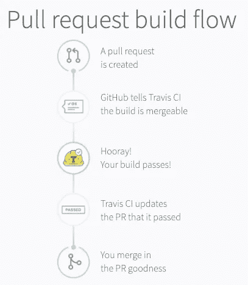
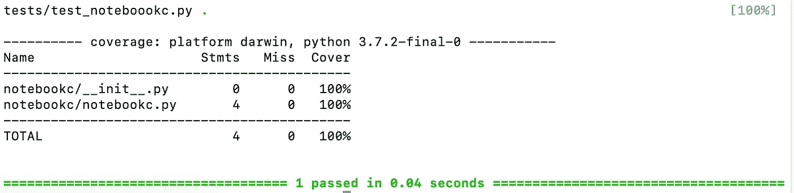

# 成功设置 Python 项目的 10 个步骤

> 原文：<https://towardsdatascience.com/10-steps-to-set-up-your-python-project-for-success-14ff88b5d13?source=collection_archive---------4----------------------->

## 如何添加测试、CI、代码覆盖率等等


在本指南中，我们将通过添加测试和集成来加速开发并提高代码质量和一致性。如果你没有一个基本的 Python 包，可以看看我的构建指南，然后在这里见面。

[](/build-your-first-open-source-python-project-53471c9942a7) [## 构建您的第一个开源 Python 项目

### 工作包的逐步指南

towardsdatascience.com](/build-your-first-open-source-python-project-53471c9942a7) 

酷毙了。以下是本文的十步计划:

1.  安装黑色
2.  创造。pycache
3.  安装 pytest
4.  创建测试
5.  注册 Travis CI 并配置
6.  创建. travis.yaml
7.  测试 Travis CI
8.  添加代码覆盖率
9.  添加工作服
10.  添加 PyUp

本指南适用于使用 Python 3.7 的 macOS。截至 2019 年初，一切正常，但事情变化很快。

我们有工作要做。让我们开始吧！🐸

# 第一步:安装黑色


您的包代码应该遵循通用的样式约定。 [Black](https://github.com/ambv/black) 是一个 Python 包，它自动为你格式化你的代码，使之符合 [PEP 8](https://www.python.org/dev/peps/pep-0008/) 。Black 相对较新，已经有超过一百万的下载量。使用它很快成为 Python 编码中的最佳实践。这里有一个很好的黑色指南。

我使用 Atom 作为我的编辑器，所以我给 Atom *添加了 *Python-Black* 包—* 安装信息在这里是。现在，当您保存文件时，Atom 将重新格式化您的代码。

现在，让我们为我们的合作者将 Black 添加到开发环境中。最终，任何参与该项目的人都将遵循相同的风格指南，否则他们的拉请求将不会被接受。😦

将`black==18.9b0`添加到 requirements_dev.txt 的下一个空行，并运行`pip install -r requirements_dev.txt`。

黑色使 88 个字符成为默认的最大行长度。有些指南和程序需要 79 个字符，例如[斯芬克斯风格指南](https://documentation-style-guide-sphinx.readthedocs.io/en/latest/style-guide.html)。在黑色原子包中，你可以设置最大长度。

既然我们已经开始节省编写代码的时间，那么让我们节省将应用程序推送到 PyPI 的时间。

# 第二步:创建。pypirc

当我们使用 [twine](https://twine.readthedocs.io/en/latest/) 将我们的构建推送到 TestPyPI 和 PyPI 时，我们需要手动输入我们的登录信息。如果你对麻线不熟悉，请看我之前的文章。让我们自动化这个过程。

Twine 将查找名为*的文件。pypirc* 在我们的主目录中。它会在上传文件时获取我们的 url、登录名和密码。

创建您的*。您的主目录中的 pypirc* 文件，包含:

`touch ~/.pypirc`

将以下内容添加到您的*中。pypirc* 文件:

```
[distutils]
index-servers =
    pypi
    testpypi

[testpypi]
repository: https://test.pypi.org/legacy
username = your_username
password = your_pypitest_password

[pypi]
username = your_username
password = your_pypi_password
```

替换为您的用户名和密码。确保将该文件保存在您的主目录中，而不是当前的工作目录中。如果要确保您机器上的其他用户不能访问该文件，您可以从命令行更改其权限:

`chmod 600 ~/.pypirc`

现在，您可以使用以下命令将您的包上传到 TestPyPI:

`twine upload -r testpypi dist/*`

使用以下命令上传到真实的 PyPI:

`twine upload dist/*`

不再需要输入用户名和密码。这不是很好吗？😄

现在让我们添加一些测试来确保我们的包能够工作。

# 步骤 3:安装和配置 pytest

Pytest 是测试 Python 代码的最流行、最容易使用的库。在这个例子中，我们将向我们的项目添加简单的测试。如果你想了解 pytest，[这里有一个很好的介绍教程。另一个很好的指南是](https://semaphoreci.com/community/tutorials/testing-python-applications-with-pytest) [Brian Okken](https://medium.com/u/aa64089587cf?source=post_page-----14ff88b5d13--------------------------------) 的书 [Python 测试与 Pytest](https://www.amazon.com/Python-Testing-pytest-Effective-Scalable/dp/1680502409) 。

使用以下命令将 pytest 添加到 requirements_dev.txt 文件中

`pytest==4.3.0`

运行`pip install requirements_dev.txt`

然后运行以下命令，以便 pytest 可以找到您的包:

`pip install -e .`

如果您停用您的虚拟环境，您将需要再次运行两个 pip 命令来运行您的测试。


# 步骤 4:创建测试

在项目的顶层添加一个*测试*文件夹。在其中添加一个名为`test_your_package_name.py`的文件。我的文件命名为`test_notebookc.py`。以`test_`开头的文件可以让 pytest 自动发现它。

在`test_notebookc.py`中，我添加了以下测试来检查正确的名称是否作为函数输出的一部分打印出来。修改以适合您自己的文件名和函数名。

这是怎么回事？

我们首先导入我们的模块。然后我们用`test_my_function_name`创建一个函数。这个命名约定对其他人和我们即将添加的代码覆盖包很有帮助。

然后我们调用我们的函数， *convert* ，用*“Jill”*作为参数。然后我们捕捉输出。提醒一下，我们的 *convert* 函数非常基本——它接受参数 *my_name* 并输出一行:

`print(f”I’ll convert a notebook for you some day, {my_name}.”)`

Pytest 检查输出中是否有字符串“Jall”。它不应该存在，因为我们传入了“Jill”。参见 pytest 文档中关于捕获输出[的内容。](https://docs.pytest.org/en/latest/capture.html)

通过在命令行输入`pytest`来运行您的测试。您的测试应该失败，并显示红色文本。


确保您的测试在应该失败的时候失败是一个很好的实践。不要只是写他们，所以他们马上是绿色的。否则，您的测试可能不会测试您认为它们是什么。😉

在测试失败后，我们可以将预期输出从`Jall`更改为 `Jill`，我们的测试应该以绿色通过。


是的，都很好。现在我们有了一个测试，确保当有人向我们的函数传递一个字符串值时，该字符串被打印出来。

让我们添加一个测试来检查是否只有一个字符串被传递给了我们的函数。如果传递了字符串之外的任何内容，则应该引发 TypeError。[这里有一个关于 Python 中异常和错误处理的好指南](https://www.datacamp.com/community/tutorials/exception-handling-python)。

当我们在编写通过测试的代码之前编写测试时，我们正在进行测试驱动开发(TDD)。TDD 是一种行之有效的方法，可以编写错误更少的代码。这里有一篇关于 TDD 的好文章。

这次让我们尝试一些不同的东西。作为练习，添加您自己的测试和代码，以确保只有一个字符串可以作为参数传递给`convert()`。提示:整数、列表和字典被类型转换成字符串。在 Twitter @discdiver 上关注我，我会在那里发布解决方案。

在我们通过测试后，我们准备好将我们的包与 CI 服务集成。

# 步骤 5:注册 Travis CI 并进行配置


[Travis CI](https://en.wikipedia.org/wiki/Travis_CI) 是一个“托管的、分布式的持续集成服务，用于构建和测试软件项目”。它最近被 [Idera](https://www.ideracorp.com/) 收购。还有其他 CI 选项，但是 Travis CI 很受欢迎，是免费的开源软件，并且有很好的文档记录。

Travis CI 更容易确保只有通过测试和标准的代码才被集成到项目中。点击了解更多关于 Travis CI [的信息，点击](https://docs.travis-ci.com/user/for-beginners/)了解更多关于持续集成[的信息。](https://en.wikipedia.org/wiki/Continuous_integration)

在[https://travis-ci.org/](https://travis-ci.org/)注册账户。从您的 Travis CI 档案页面点击*查看并添加您的授权组织*链接。系统会提示您输入 GitHub 密码。点击贵组织访问权限旁边的*授予*。


我必须将我的*notebook 帐户同步到所有*以显示为一个组织，并显示 *notebookc* 存储库。数据开始流动通常需要一分钟或更长时间。然后将你的回购切换到的*。*


点击*设置*。您可以选择是否希望 Travis 基于推送请求和/或推送分支进行构建。


现在我们需要在本地配置一个文件，以便 Travis 为每个 pull 请求构建。

# 步骤 6:创建. travis.yml

在项目文件夹的顶层，添加一个包含以下内容的. *travis.yml* 文件:

```
dist: xenial
language: python
python: 3.7.2
install:
  - pip install -r requirements_dev.txt
  - pip install -e .
script:
  - pytest
```

需要`dist: xenial`来指定 Travis 应该为其虚拟环境使用 Ubuntu Xenial 16.04。必须指定 Xenial 来测试 Python 3.7 代码。更多信息[点击这里](https://docs.travis-ci.com/user/reference/xenial/)。

可以指定不同版本的 Python 进行测试。我们将在以后的文章中讨论这个主题。跟着[我](https://medium.com/@jeffhale)确保不要错过！

`install`部分确保我们的开发包被安装。`pip install -e .`将您的软件包作为轮子安装到 Travis 的虚拟环境中。然后 Travis 会在运行 pytest 时找到您的包。

# 步骤 7:测试 Travis CI

提交你的修改，推送到 GitHub，做一个公关。Travis 应该会在几秒钟内开始自动运行。


特拉维斯是这么做的。



From travis.ci

如果你的公关失败了，特拉维斯会告诉你的。

请注意，如果拉请求失败，您可以推送到同一个分支，Travis 会自动重新运行。

去 Travis 上你的回购页面看看吧。崔维斯有很多关于你身材的信息。您将来可能会经常访问这个站点，试图找出您的构建没有通过的原因。😄

假设一切都是绿色的，你就可以走了！


如果您没有看到任何红色或绿色，请点击*更多选项*菜单，并从下拉菜单中选择*请求*。如果您看到红色，请查看错误消息。如果您看到错误*构建配置文件是必需的，*那么 Travis 没有在 GitHub 上找到您的. travis.yml 文件。确保它在您的 GitHub repo 中。😉

Travis 会向您发送电子邮件，让您知道何时构建失败以及何时失败的构建已被修复。

请记住，您可以继续将您的提交推送到一个开放的 PR，Travis 将自动重新运行。

让我们看看我们的代码有多少测试覆盖率。

# 步骤 8:添加代码覆盖率

代码覆盖率报告向您展示了多少百分比的代码至少具有一些测试覆盖率。我们将添加 [pytest-cov](https://pypi.org/project/pytest-cov/) 包来创建一个报告。

将下面一行添加到 *requirements_dev.txt* 中:

`pytest-cov==2.6.1`

用`pytest --cov=my_project_name`运行

我对`pytest --cov=notebookc`的输出是这样的:



太好了，我们所有的代码都被覆盖了！当你只有几行的时候，那就不算高了。😄但是我们不需要告诉全世界——让我们向他们展示我们已经覆盖了！

# 第九步:添加工作服

工作服为全世界提供了您的代码覆盖率的历史。


前往[https://coveralls.io/](https://coveralls.io/)用你的 GitHub 证书注册一个账户。添加您的组织，并在 repo 出现时打开它。

在 *requirements_dev.txt* 中增加`coveralls==1.6.0`。你的 *requirements_dev.txt* 现在应该是这样的:

```
pip==19.0.3
wheel==0.33.0
twine==1.13.0
pytest==4.3.0
pytest-cov==2.6.1
coveralls==1.6.0
```

修改您的 *.travis.yml* 文件，如下所示(替换您的包名):

```
dist: xenial
language: python
python: 3.7.2
install:
  — pip install -r requirements_dev.txt
  — pip install -e .
script:
  — pytest --cov=my_package_name
after_success:
  — coveralls
```

现在，当 Travis 构建您的项目时，它将安装必要的包，运行您的测试，并创建一个覆盖报告。然后它将覆盖范围报告发送给工作服。

提交，推送到 GitHub，看看奇迹发生。您的覆盖率报告可能需要几分钟才能完成，请耐心等待。


现在工作服显示在你的公关支票上。酷！

在工作服的网页上，我们应该显示 100%的覆盖率。


好吧，让我们在腰带上再加一件工具。

# 步骤 10:添加 PyUp

PyUp.io 让你知道什么时候包依赖过期或者有安全漏洞。它会自动发出一个 pull 请求来更新 GitHub 上的包。

前往[https://pyup.io/](https://pyup.io/)，通过 GitHub 注册，连接您的组织。

当你添加你的回购，我建议你切换到每周更新时间表。如果你有一堆包依赖，你就不会收到很多拉请求。


这里有一个 PyUp 上的存储库的例子，展示了一些过时的包。


现在你会知道一个包什么时候更新——知道是成功的一半。自动拉取请求必须是另一半，对吗？😏

# 包装

在本文中，您学习了如何添加和配置 Black、pytest、Travis CI、连体工作服和 PyUp。我们已经为更安全的代码和更一致的风格做好了准备。那是相当甜蜜的！

在以后的文章中，我们将看看如何配置和构建您的文档，包括阅读文档、添加徽章、管理发布等等。跟着[我](https://medium.com/@jeffhale)确保你不会错过。

我希望这个指南对你有用。如果你有，请分享到你最喜欢的社交媒体渠道，这样其他人也可以找到它。👏

我撰写关于 Python、Docker、数据科学和其他技术主题的文章。如果你对此感兴趣，请关注我，在这里阅读更多。

[](https://dataawesome.com)

感谢阅读！

