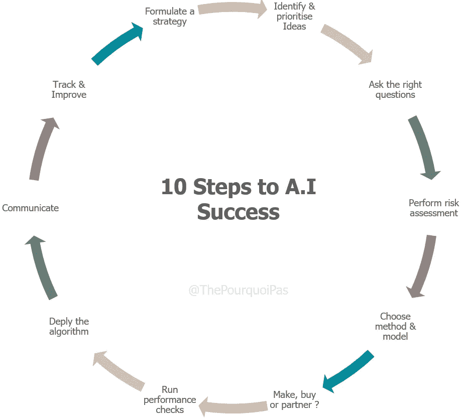

# 实现你自己的公司人工智能项目的 10 个步骤

> 原文：<https://towardsdatascience.com/10-steps-to-your-very-own-corporate-a-i-project-ced3949faf7f?source=collection_archive---------31----------------------->

## 管理者、领导者、思想家和梦想家的非技术性指南

> 像世界其他地方一样，人工智能有 1%的问题。

虽然(非常)大的公司受益于他们可以获得的大量数据，以及商业、技术和监管专业知识的结合，但大多数中小企业没有这样的运气。

然而，这不应该阻止那些寻求踏上数据科学之旅的勇敢者和大胆者。虽然没有捷径，但要开始一个人工智能项目还是有明确的步骤，我在下面列出了这个项目，希望它能消除一些围绕创造“智能”算法的神秘主义。

请注意，这并不意味着是一个技术指南，为了简洁起见，定义将保持在最低限度。

# **1。制定执行战略**

在考虑人工智能之前，一些关键问题必须由各种关键的公司高管来回答:他们想通过创造一种不同类型的价值主张来扰乱他们的市场吗？他们是否寻求成为“班上最好的”？也许他们的目标是在竞争激烈的市场上保持平衡？或者甚至追到现任领导？

在任何人工智能项目启动之前，这些问题都必须得到回答。否则，运营团队将只能漫无目的地挖掘数据，寻找故事来讲述。然而，鉴于大多数行业的性质，它们将追逐一个移动的目标，随着数据的到来改写历史。是的，数据很有趣。是的，很有趣。但是它本身没有任何意义。从它开始，而不是明确的目标，只会产生寻找问题的解决方案。

> 提示:一个好的策略始于心中不满的客户，而不是技术。

# **2。识别并优先考虑想法**

当然，决策并不仅仅停留在战略的制定上；策略只回答“我是谁”这个问题。“我在干什么？”是一个完全不同的问题，需要通过识别[用例](https://www.techopedia.com/definition/25813/use-case)来更好地回答。

假设一家公司的长期战略是成为其行业中最“值得信赖”的参与者。It 可以通过确保正确无误地回答所有客户的问题、快速回答客户的问题、让所有打电话的人都受到人而不是机器人的问候来实施这一战略……可以(应该)在研讨会或小型咨询活动中系统地识别、评估、分组、优先排序和讨论数百个这样的想法( *woo！*)。

有些会直接去销售、营销、会计、人力资源…可能会使用传统的运营/统计方法处理；其中一些将被认为适合作为人工智能的解决方案，以多种形式中的一种。我建议从三个具体问题入手:

*   **瓶颈**:公司内部存在能力，但没有得到最佳分配。
*   **扩展**:公司内部有能力，但是使用它们的过程耗时太长、太贵或者无法扩展。
*   **资源**:该公司收集的数据超过了现有资源目前可以分析和应用的数据量[大约 55%的公司收集的数据没有被使用](https://app.getpocket.com/read/2684558325)。

> 提示:对公司来说，通过商业能力而不是技术来看待人工智能更有成效。

# **3。询问关于数据的正确问题**

在一个机器学习项目([“机器学习”这个术语比“人工智能”更准确](https://www.datasciencecentral.com/profiles/blogs/artificial-intelligence-vs-machine-learning-vs-deep-learning))被认为在操作上合理、技术上可行之后，数据问题立即出现。或者，我应该说，数据问题…

## 需要什么类型的数据？

从技术上讲，没有很多不同类型的数据:它可以是数字(由于其表格的性质，历史上最容易使用)、文本、图像、视频、声音...任何可以被记录的东西都可以被认为是数据。最终，计算机不知道你给它们的输入是什么类型；对他们来说都只是数字。

## 需要多少数据？

没有具体数量的数据点可以规定，因为项目与项目之间差异很大；但一个刚刚起步、客户不超过 300 人的初创企业，可能天生就没有启动 ML 项目的资源。此外，注意[数据可以由许多数据点(“大 N”)、每个数据点的许多细节(“大 D”)或两者构成](https://www.amazon.co.uk/AIQ-artificial-intelligence-harness-better/dp/0593079779)。两者都是最好的。

## 我们有这些数据吗？

数据要么是“可用”的，要么是“要收集的”(*是的，我过分简化了，告我吧*)。收集可以在内部完成，这可能非常耗时(我们正在谈论几个月和重大重组)，也可以通过外部来源收集(例如，预测雨伞需求将使用所有人都可以免费获得的天气数据)。

> 提示:创造有价值的人工智能解决方案的是独特的数据，而不是尖端的模型。

# **4。执行必要的风险评估**

任何自尊的项目都需要持续的风险评估，以便在问题出现之前解决问题( [*PMO 101*](https://explore.easyprojects.net/blog/project-management-101-pmo#noagree) )。这应该在项目的早期进行，并在项目的整个生命周期中彻底和持续地完成。下面是 10 个问题，你可以先问一下:

*   **我有没有一个** [**智能目标**](https://corporatefinanceinstitute.com/resources/knowledge/other/smart-goal/) **？**:“别人都在做”是进入 A.I 游戏的可怕理由。
*   我有足够的数据吗？如果不敏锐地意识到过去，算法根本不可能理解现在和未来。
*   **我的数据集** **有错误吗？**:垃圾进，垃圾出。
*   我的数据集是 d*ck 吗？:数据必须代表现实，避免反映现实存在的偏见。
*   我有能让这一切发生的人吗？全球目前只有 22，000 名博士级专家能够开发前沿算法。
*   我需要改变我的层级结构吗？:如果项目的所有员工都向不同公司分支机构的不同经理负责，那么很可能会出现不同的目标。
*   我的员工会成为勒德分子吗？:“它会取代乔布斯吗？”以及“我必须接受培训吗？”是需要答案的有效问题。
*   我有合适的架构吗？:算法存在于依赖[数据收集](https://en.wikipedia.org/wiki/Data_collection)、[工作流管理](https://www.signavio.com/post/what-workflow-management-is/)、 [IaaS](https://en.wikipedia.org/wiki/Infrastructure_as_a_service) …本身是由[API](https://en.wikipedia.org/wiki/Application_programming_interface)、数据存储、网络安全构成的更大生态系统的一部分…
*   **有监管障碍吗？当前位置不仅要查看当前的法规，还要了解正在讨论的法规，这一直是企业界的关键，并将继续如此。**
*   我有时间吗？如果一家公司正处于时间敏感的紧要关头，人工智能可能不是答案。

> 提示:风险评估最好由外部人员执行。

# **5。选择相关方法&型号**

一旦以上所有问题都解决了(*如果没有，返回步骤 1* )，就该选择技术上最合适的解决方案来解决之前确定的问题了。

在这个过程的后期做这件事可能看起来很奇怪，但当人们意识到下面的技术是高度适应性的，并且只从一个方面开始只会缩小可能性的范围时，这是完全有意义的。在任何情况下，任何在这方面有一些经验的人都会想到在项目的前几个步骤中使用正确的工具。

下面是对机器学习的 7 个主要类别的浅见。具体的例子将在后面的文章中给出，但同时在网络上也可以找到:

## 监督机器学习

*   **线性算法**:基于自变量的 LAs 模型预测。它主要用于找出变量和预测之间的关系，并且在**稳定环境**中很好地进行预测。→更多详情:[线性回归](/introduction-to-machine-learning-algorithms-linear-regression-14c4e325882a)、[逻辑回归](https://hackernoon.com/introduction-to-machine-learning-algorithms-logistic-regression-cbdd82d81a36)、 [SVM](/support-vector-machine-introduction-to-machine-learning-algorithms-934a444fca47) 、[岭/套索](/ridge-and-lasso-regression-a-complete-guide-with-python-scikit-learn-e20e34bcbf0b)……
*   **集成方法**:集成学习是一种基于许多不同模型进行预测的系统。通过组合单个模型，集合模型趋向于更加灵活(偏差更小)和对数据更不敏感(方差更小)。→更多详情:[随机森林、梯度提升、AdaBoost](/basic-ensemble-learning-random-forest-adaboost-gradient-boosting-step-by-step-explained-95d49d1e2725)……
*   **概率分类**:概率分类器能够在给定输入观测值的情况下，预测一组类别的概率分布，而不是仅输出该观测值最可能属于的类别。→更多详情:[朴素贝叶斯](https://en.wikipedia.org/wiki/Naive_Bayes_classifier)、[贝叶斯网络](/introduction-to-bayesian-networks-81031eeed94e)、[MLE](https://en.wikipedia.org/wiki/Maximum_likelihood_estimation)……
*   **深度学习**:对于有监督的学习任务，深度学习方法通过将数据转化为数据的紧凑中间表示来提高精度，从而使耗时的[特征工程](https://en.wikipedia.org/wiki/Feature_engineering)任务变得无关紧要(*思考类别*)。它非常适合分类、处理和基于非数字数据进行预测。→更多详情: [CNN，RNN，MLP](https://machinelearningmastery.com/when-to-use-mlp-cnn-and-rnn-neural-networks/) ， [LSTM](https://en.wikipedia.org/wiki/Long_short-term_memory) …

## 无监督机器学习

*   **聚类**:“聚类”是将相似的数据点分组在一起的过程。这种无监督机器学习技术的目标是找到数据点中的相似性，并将相似的数据点自动分组在一起。→更多详情: [K-means，DB 扫描](https://medium.com/@soroush.hashemi76/kmeans-vs-dbscan-d9d5f9dbee8b)，[层次聚类](https://en.wikipedia.org/wiki/Hierarchical_clustering)……
*   **降维**:降维，又名降维，是通过获得一组主变量来减少所考虑的随机变量的数量的过程。它还能制作非常漂亮的图形。→更多详情: [PCA](https://en.wikipedia.org/wiki/Principal_component_analysis) ， [t-SNE](https://en.wikipedia.org/wiki/T-distributed_stochastic_neighbor_embedding) …
*   **深度学习**:对于无监督的学习任务，深度学习方法允许对未标记的数据进行分类。任何更多的细节都会大大增加这篇文章的篇幅。→更多细节:[强化学习，自动编码器](https://www.samuelcheng.info/deeplearning_2017/13-autoencoder-gan.pdf)， [GANs](https://skymind.com/wiki/generative-adversarial-network-gan) ...

> 提示:所有的模型都是错误的，但有些是有用的。

# **6。做出 BBP 的决定**

如前所述，很少有公司能够完全开发自己的算法，并在没有帮助的情况下大规模部署它们。不幸的 99%的人不得不做出复杂的选择，是投资成功几率低的大量资金，还是投资成功几率高但与供应商/合作伙伴关系非常密切的少量资金。

没有简单的答案。只是艰难的选择。以下是几个选项:

## 建设

*   通过各种技术投资和招聘，进一步提高公司内部现有的分析能力。
*   通过认知应用增强现有应用。
*   使用众多可用的[开源算法](https://github.com/TheAlgorithms)中的一种，以及少数企业家员工。

## 购买

*   使用来自已知提供商(如 Oracle、Microsoft、AWS 等)的现有现成软件。
*   雇佣一个现有的提供商来完全开发一个算法(但是具体的开发意味着完全依赖于该提供商。*不好了*。

## 伙伴

*   基于公司数据和初创公司技术的双赢关系。然而，这种关系可能是复杂的，而且很少是可持续的，因为各种行为者很少有相同的短期/长期目标。

> 提示:BBP 的选择在很大程度上取决于公司的执行策略和所属行业。

# **7。运行性能检查**

一个最近构建的算法不能未经测试就发布到野外。事实上，大多数机器学习系统都是作为“黑箱”运行的(*再次强调，这是一种有用的过度简化*，由于各种原因，可能对一组训练数据有效的东西可能对另一组数据无效(如果有效的话)。令人欣慰的是，[一些工具](/metrics-to-evaluate-your-machine-learning-algorithm-f10ba6e38234)已经被设计出来，以确保模型按预期工作:

*   **分类准确度**:正确预测的数量与做出的预测的数量
*   **对数损失**:惩罚数据错误分类的公式
*   **混淆矩阵**:类似于准确性，但更直观
*   **曲线下面积**:随机选择的正面例子比随机选择的负面例子排名更高的概率
*   **F1 得分**:兼顾精度和鲁棒性
*   **平均绝对误差**:原始值和预测值之差的平均值
*   **均方误差**:同上，但更容易计算梯度

只要允许团队告知预先准备好的**记分卡，以上所有内容都很重要。外部团队在这里也是有用的，因为他们不会因为项目已经投入的成本而产生偏见。**

> 提示:小心“[急于下结论”](https://www.edwardtufte.com/bboard/q-and-a-fetch-msg?msg_id=0003wa)。

# **8。部署算法**

考虑到投入的资源，人工智能项目的部署阶段可能是最关键的。事实上，从原型到生产系统的过渡可以预期是昂贵和耗时的，但是如果风险分析做得适当，至少应该不会遇到重大问题(*这是很少的情况*)。

除了高效的项目管理团队之外，没有很多方法可以确保部署顺利进行。两种主要技术如下:

*   **静默部署**:不要与“静默安装”混淆，静默部署意味着与历史解决方案并行运行算法，以确保它匹配或改进其发现。
*   **A/B 测试**:也称为“分割测试”或“桶测试”，它要求只在一部分人身上测试新的解决方案，而另一组人继续使用以前的解决方案。

此外，尽管我会鼓励所有首次项目进展缓慢，避免打破常规，但留意扩展潜力往往是未来成功的关键。

> 提示:不要害怕围绕新解决方案重新设计工作流。

# 9.交流成功和失败

是时候“把属于凯撒的东西渲染给凯撒”了，和全世界一起分享机器学习算法构建的成功。如果这一努力不成功，也值得讨论，哪怕只是作为整个组织的一次学习机会。

应该让几个关键群体了解成功和失败，原因多种多样:

*   投资者/股东:在一个流行语可以成就或扼杀股票的时代，分享人工智能的成功故事会让投资者高兴，并有可能增加公司的价值，特别是如果该项目使开发新的、有用的、能产生长期影响的能力成为可能。
*   **政府机构**:这当然取决于行业和所用工具的性质，但考虑到当前围绕道德和数据管理的讨论，通过透明获得公共部门的信任可能是明智之举。
*   **客户**:客户需要 a)了解解决方案能为他们做什么，b)成为改进服务或产品的大使，从而创造[光环效应](https://www.verywellmind.com/what-is-the-halo-effect-2795906)。
*   候选人:候选人需要意识到公司可能会发生变化，他们的技能可能需要在未来适应这些变化。许多候选人也认为在一家有人工智能能力的公司工作是一件积极的事情，可能会增加申请人的数量。
*   **员工**:最重要的是，员工需要知道正在做什么，这会如何影响他们，以及他们的日常生活是否会改变。人们天生反对改变，让自动化的谣言四处传播是毁掉一个好项目的最可靠的方法。

> 提示:宣传不足往往比宣传过度更有成效。

# 10.跟踪

我有坏消息。好消息是。

坏消息是这项工作永远不会结束。好消息是这项工作永远不会结束。

事实上，让一个算法在投入生产后不受检查地运行很长一段时间是愚蠢的。世界在变，人和他们的习惯也在变，导致他们的数据也在变。几个月内，用于训练算法的初始数据可能不再相关。

这里的挑战是，一开始可能很难注意到该算法不再代表世界，需要使用在构建该算法 1.0 版本期间获得的专业知识进行返工。**谈一个永无止境的任务**。

> 提示:世界变化比你想象的要快得多。而算法看不到这一点。

## 结论

数据驱动项目的本质是它不能是通用的。这意味着花费时间和金钱来创造一些独特的东西，以跨越早期采用者创造的护城河。但是，由于人工智能能力在大公司内部往往以指数速度增长，护城河只会越来越宽。这是许多公司现在面临的挑战，也是为什么他们需要一个坚实的过程来开始:他们的误差范围正在迅速缩小。

因此，我有一些最后的建议:

1.  从小处着手。
2.  从试点项目开始。
3.  设定现实的期望。
4.  专注于速赢。
5.  循序渐进地工作。

祝你好运。

# 参加一项运动

本文最初是为《T2 时报》撰写的，这是一份对当今技术挑战进行深入分析的在线杂志。[T5 点击此处进入 T7。](https://www.thepourquoipas.com/post/10-steps-to-your-very-own-corporate-a-i-project)