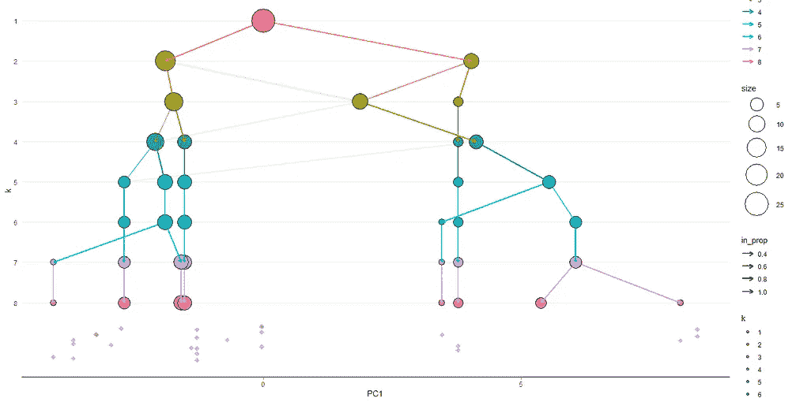

# 选择最佳集群数量的 10 个技巧

> 原文：<https://towardsdatascience.com/10-tips-for-choosing-the-optimal-number-of-clusters-277e93d72d92?source=collection_archive---------2----------------------->


Photo by [Pakata Goh](https://unsplash.com/photos/EJMTKCZ00I0?utm_source=unsplash&utm_medium=referral&utm_content=creditCopyText) on [Unsplash](https://unsplash.com/search/photos/programming?utm_source=unsplash&utm_medium=referral&utm_content=creditCopyText)

聚类是最常见的无监督机器学习问题之一。使用一些观测值间距离度量或基于相关性的距离度量来定义观测值之间的相似性。

有 5 类聚类方法:

> +层次聚类
> +划分方法(k-means，PAM，CLARA)
> +基于密度的聚类
> +基于模型的聚类
> +模糊聚类

我写这篇文章的愿望主要来自于阅读关于 [**clustree** 包](https://github.com/lazappi/clustree)、 [**dendextend**](https://cran.r-project.org/web/packages/dendextend/vignettes/Cluster_Analysis.html) 文档以及由 Alboukadel Kassambara 写的 R 书中的[聚类分析实用指南](https://www.datanovia.com/en/product/practical-guide-to-cluster-analysis-in-r/)[**facto extra**](http://www.sthda.com/english/wiki/r-packages)**包的作者。**

# **数据集**

**我将使用来自**集群**包的一个不太为人所知的数据集: [all .哺乳动物. milk.1956](https://www.rdocumentation.org/packages/cluster.datasets/versions/1.0-1/topics/all.mammals.milk.1956) ，一个我以前没有看过的数据集。**

**这个小数据集包含 25 种哺乳动物及其乳汁成分(水、蛋白质、脂肪、乳糖、灰分百分比)的列表，来自 [John Hartigan，Clustering Algorithms，Wiley，1975](http://people.sc.fsu.edu/~jburkardt/datasets/hartigan/hartigan.html) 。**

**首先让我们加载所需的包。**

```
library(tidyverse)
library(magrittr)
library(cluster)
library(cluster.datasets)
library(cowplot)
library(NbClust)
library(clValid)
library(ggfortify)
library(clustree)
library(dendextend)
library(factoextra)
library(FactoMineR)
library(corrplot)
library(GGally)
library(ggiraphExtra)
library(knitr)
library(kableExtra)
```

**现在加载数据。**

```
data("all.mammals.milk.1956")
raw_mammals <- all.mammals.milk.1956# subset dataset
mammals <- raw_mammals %>% select(-name) # set rownames
mammals <- as_tibble(mammals)
```

**让我们探索并可视化这些数据。**

```
# Glimpse the data set
glimpse(mammals)Observations: 25
Variables: 5
$ water   *<dbl>* 90.1, 88.5, 88.4, 90.3, 90.4, 87.7, 86.9, 82.1, 81.9, 81.6, 81.6, 86.5, 90.0,...
$ protein *<dbl>* 2.6, 1.4, 2.2, 1.7, 0.6, 3.5, 4.8, 5.9, 7.4, 10.1, 6.6, 3.9, 2.0, 7.1, 3.0, 5...
$ fat     *<dbl>* 1.0, 3.5, 2.7, 1.4, 4.5, 3.4, 1.7, 7.9, 7.2, 6.3, 5.9, 3.2, 1.8, 5.1, 4.8, 6....
$ lactose *<dbl>* 6.9, 6.0, 6.4, 6.2, 4.4, 4.8, 5.7, 4.7, 2.7, 4.4, 4.9, 5.6, 5.5, 3.7, 5.3, 4....
$ ash     *<dbl>* 0.35, 0.24, 0.18, 0.40, 0.10, 0.71, 0.90, 0.78, 0.85, 0.75, 0.93, 0.80, 0.47,...
```

**所有的变量都用数字表示。统计分布呢？**

```
# Summary of data set
summary(mammals) %>% kable() %>% kable_styling()
```

****

```
# Historgram for each attribute
mammals %>% 
  gather(Attributes, value, 1:5) %>% 
  ggplot(aes(x=value)) +
  geom_histogram(fill = "lightblue2", color = "black") + 
  facet_wrap(~Attributes, scales = "free_x") +
  labs(x = "Value", y = "Frequency")
```

****

**不同属性之间有什么关系？使用' corrplot()'创建相关矩阵。**

```
corrplot(cor(mammals), type = "upper", method = "ellipse", tl.cex = 0.9)
```

****

**当您有以不同尺度测量的变量时，缩放数据是有用的。**

```
mammals_scaled <- scale(mammals)
rownames(mammals_scaled) <- raw_mammals$name
```

**降维有助于数据可视化(*如* PCA 方法)。**

```
res.pca <- PCA(mammals_scaled,  graph = FALSE)# Visualize eigenvalues/variances
fviz_screeplot(res.pca, addlabels = TRUE, ylim = c(0, 50))
```

****

**这些是捕获了 80%方差的 **5 件。scree 图显示 **PC1 捕获了约 75%的方差**。****

```
# Extract the results for variables
var <- get_pca_var(res.pca)# Contributions of variables to PC1
fviz_contrib(res.pca, choice = "var", axes = 1, top = 10)# Contributions of variables to PC2
fviz_contrib(res.pca, choice = "var", axes = 2, top = 10)# Control variable colors using their contributions to the principle axis
fviz_pca_var(res.pca, col.var="contrib",
             gradient.cols = c("#00AFBB", "#E7B800", "#FC4E07"),
             repel = TRUE # Avoid text overlapping
             ) + theme_minimal() + ggtitle("Variables - PCA")
```

************

**从这些图像中可以明显看出，水和乳糖会一起增加，蛋白质、灰分和脂肪也会一起增加；这两组是反向相关的。**

# **朴素(K 均值)方法**

**分区聚类方法，如 k-means 和 Medoids 分区(PAM ),要求您指定要生成的聚类数。**

**k-means 聚类可能是最著名的划分方法之一。k-means 聚类背后的思想包括定义聚类的**总的类内变化**，其测量最小化的聚类的紧密度。**

**我们可以用 **kmeans()** 函数计算 R 中的 k 均值:**

```
km2 <- kmeans(mammals_scaled, centers = 2, nstart = 30)
```

**上面的例子将数据分成两个集群，**中心= 2** ，并尝试多个初始配置，报告最佳配置。例如，由于该算法对群集质心的初始位置敏感，所以添加 **nstart = 30** 将生成 30 个初始配置，然后对所有质心结果进行平均。**

**因为在我们开始之前需要设置簇的数量( **k** )，所以检查几个不同的 **k** 值是有利的。**

```
kmean_calc <- function(df, ...){
  kmeans(df, scaled = ..., nstart = 30)
}km2 <- kmean_calc(mammals_scaled, 2)
km3 <- kmean_calc(mammals_scaled, 3)
km4 <- kmeans(mammals_scaled, 4)
km5 <- kmeans(mammals_scaled, 5)
km6 <- kmeans(mammals_scaled, 6)
km7 <- kmeans(mammals_scaled, 7)
km8 <- kmeans(mammals_scaled, 8)
km9 <- kmeans(mammals_scaled, 9)
km10 <- kmeans(mammals_scaled, 10)
km11 <- kmeans(mammals_scaled, 11)p1 <- fviz_cluster(km2, data = mammals_scaled, frame.type = "convex") + theme_minimal() + ggtitle("k = 2") 
p2 <- fviz_cluster(km3, data = mammals_scaled, frame.type = "convex") + theme_minimal() + ggtitle("k = 3")
p3 <- fviz_cluster(km4, data = mammals_scaled, frame.type = "convex") + theme_minimal() + ggtitle("k = 4")
p4 <- fviz_cluster(km5, data = mammals_scaled, frame.type = "convex") + theme_minimal() + ggtitle("k = 5")
p5 <- fviz_cluster(km6, data = mammals_scaled, frame.type = "convex") + theme_minimal() + ggtitle("k = 6")
p6 <- fviz_cluster(km7, data = mammals_scaled, frame.type = "convex") + theme_minimal() + ggtitle("k = 7")plot_grid(p1, p2, p3, p4, p5, p6, labels = c("k2", "k3", "k4", "k5", "k6", "k7"))
```

****

**尽管这种视觉评估告诉我们在聚类之间的何处发生了描绘，但是它没有告诉我们最优的聚类数目是多少。**

# **确定最佳聚类数**

**在文献中已经提出了多种评估聚类结果的方法。术语**聚类验证**用于设计评估聚类算法结果的程序。有三十多种指标和方法可以用来确定最佳集群数量，所以我在这里只关注其中的几种，包括非常简洁的 **clustree** 包。**

## **“肘”法**

**可能是最广为人知的方法，即肘形法，在该方法中，计算每个聚类数的平方和并绘制图形，用户寻找从陡到浅的斜率变化(肘形)，以确定最佳聚类数。这种方法不精确，但仍有潜在的帮助。**

```
set.seed(31)
# function to compute total within-cluster sum of squares
fviz_nbclust(mammals_scaled, kmeans, method = "wss", k.max = 24) + theme_minimal() + ggtitle("the Elbow Method")
```

****

**肘形曲线法很有帮助，因为它显示了增加聚类数如何有助于以有意义的方式而不是边际方式分离聚类。弯曲表示超过第三个的其他聚类没有什么价值(参见[ [此处的](http://web.stanford.edu/~hastie/Papers/gap.pdf) ]以获得该方法的更精确的数学解释和实现)。肘方法是相当清楚的，如果不是一个基于组内方差的天真的解决方案。间隙统计是一种更复杂的方法，用于处理分布没有明显聚类的数据(对于球状、高斯分布、轻度不相交的数据分布，可以找到正确数量的 *k* )。**

## **差距统计**

**[缺口统计量](http://www.web.stanford.edu/~hastie/Papers/gap.pdf)将 **k** 的不同值的总体组内变异与数据的零参考分布下的预期值进行比较。最佳聚类的估计将是最大化间隙统计的值(*，即*，其产生最大的间隙统计)。这意味着聚类结构远离点的随机均匀分布。**

```
gap_stat <- clusGap(mammals_scaled, FUN = kmeans, nstart = 30, K.max = 24, B = 50)fviz_gap_stat(gap_stat) + theme_minimal() + ggtitle("fviz_gap_stat: Gap Statistic")
```

****

**gap stats 图按聚类数( **k** )显示统计数据，标准误差用垂直线段绘制，最佳值 **k** 用垂直蓝色虚线标记。根据这一观察 **k = 2** 是数据中聚类的最佳数量。**

## **剪影法**

**另一种有助于确定最佳聚类数的可视化方法称为剪影法。平均轮廓法计算不同 k 值的观测值的平均轮廓。最佳聚类数 k 是在一系列可能的 k 值**上使平均轮廓最大化的聚类数。****

```
fviz_nbclust(mammals_scaled, kmeans, method = "silhouette", k.max = 24) + theme_minimal() + ggtitle("The Silhouette Plot")
```

****

**这也表明 2 个集群是最佳的。**

## **平方和法**

**另一种聚类验证方法是通过最小化类内平方和(衡量每个类紧密程度的指标)和最大化类间平方和(衡量每个类与其他类的分离程度的指标)来选择最佳的类数。**

```
ssc <- data.frame(
  kmeans = c(2,3,4,5,6,7,8),
  within_ss = c(mean(km2$withinss), mean(km3$withinss), mean(km4$withinss), mean(km5$withinss), mean(km6$withinss), mean(km7$withinss), mean(km8$withinss)),
  between_ss = c(km2$betweenss, km3$betweenss, km4$betweenss, km5$betweenss, km6$betweenss, km7$betweenss, km8$betweenss)
)ssc %<>% gather(., key = "measurement", value = value, -kmeans)#ssc$value <- log10(ssc$value)ssc %>% ggplot(., aes(x=kmeans, y=log10(value), fill = measurement)) + geom_bar(stat = "identity", position = "dodge") + ggtitle("Cluster Model Comparison") + xlab("Number of Clusters") + ylab("Log10 Total Sum of Squares") + scale_x_discrete(name = "Number of Clusters", limits = c("0", "2", "3", "4", "5", "6", "7", "8"))
```

****

**根据这一测量，似乎 7 个集群将是合适的选择。**

## **NbClust**

****NbClust** 包提供了 30 个指数，用于确定相关的聚类数，并从通过改变聚类数、距离度量和聚类方法的所有组合获得的不同结果中向用户建议最佳聚类方案。**

```
res.nbclust <- NbClust(mammals_scaled, distance = "euclidean",
                  min.nc = 2, max.nc = 9, 
                  method = "complete", index ="all")factoextra::fviz_nbclust(res.nbclust) + theme_minimal() + ggtitle("NbClust's optimal number of clusters")
```

****

**这表明聚类的最佳数目是 3。**

## **克鲁斯特里**

**上面统计方法产生一个分数，该分数每次只考虑一组聚类。 [**clustree**](https://github.com/lazappi/clustree) R 软件包采用了另一种方法，即考虑样本如何随着聚类数量的增加而改变分组。这有助于显示哪些聚类是独特的，哪些是不稳定的。它没有明确地告诉你哪一个选择是*最优*集群，但是它对于探索可能的选择是有用的。**

**让我们来看看 1 到 11 个集群。**

```
tmp <- NULL
for (k in 1:11){
  tmp[k] <- kmeans(mammals_scaled, k, nstart = 30)
}df <- data.frame(tmp)# add a prefix to the column names
colnames(df) <- seq(1:11)
colnames(df) <- paste0("k",colnames(df))# get individual PCA
df.pca <- prcomp(df, center = TRUE, scale. = FALSE)ind.coord <- df.pca$x
ind.coord <- ind.coord[,1:2]df <- bind_cols(as.data.frame(df), as.data.frame(ind.coord))clustree(df, prefix = "k")
```

****

**在该图中，每个节点的大小对应于每个聚类中的样本数，并且箭头根据每个聚类接收的样本数来着色。一组独立的箭头，透明的，称为输入节点比例，也是彩色的，显示了一个组中的样本如何在另一个组中结束——聚类不稳定性的指标。**

**在这个图中，我们看到，当我们从 **k=2** 移动到 **k=3** 时，来自观察者左侧群集的许多物种被重新分配到右侧的第三个群集。当我们从 **k=8** 移动到 **k=9** 时，我们看到一个节点具有多个传入边，这表明我们过度聚集了数据。**

**将这个维度覆盖到数据中的其他维度上也是有用的，特别是那些来自降维技术的维度。我们可以使用 **clustree_overlay()** 函数来实现:**

```
df_subset <- df %>% select(1:8,12:13)clustree_overlay(df_subset, prefix = "k", x_value = "PC1", y_value = "PC2")
```

****

**我更喜欢从侧面看，显示 x 或 y 维度中的一个相对于分辨率维度。**

```
overlay_list <- clustree_overlay(df_subset, prefix = "k", x_value = "PC1",
                                 y_value = "PC2", plot_sides = TRUE)overlay_list$x_sideoverlay_list$y_side
```

********

**这表明，我们可以通过检查边缘来指示正确的聚类分辨率，并且我们可以通过过多的信息来评估聚类的质量。**

# **选择合适的算法**

**如何选择合适的聚类算法？ **cValid** 包可用于同时比较多个聚类算法，以确定最佳聚类方法和最佳聚类数。我们将比较 k-means、层次聚类和 PAM 聚类。**

```
intern <- clValid(mammals_scaled, nClust = 2:24, 
              clMethods = c("hierarchical","kmeans","pam"), validation = "internal")# Summary
summary(intern) %>% kable() %>% kable_styling()Clustering Methods:
 hierarchical kmeans pam 

Cluster sizes:
 2 3 4 5 6 7 8 9 10 11 12 13 14 15 16 17 18 19 20 21 22 23 24 

Validation Measures:
                                 2       3       4       5       6       7       8       9      10      11      12      13      14      15      16      17      18      19      20      21      22      23      24

hierarchical Connectivity   4.1829 10.5746 13.2579 20.1579 22.8508 25.8258 32.6270 35.3032 38.2905 39.2405 41.2405 45.7742 47.2742 50.6075 52.6075 55.8575 58.7242 60.7242 63.2242 65.2242 67.2242 69.2242 71.2242
             Dunn           0.3595  0.3086  0.3282  0.2978  0.3430  0.3430  0.4390  0.4390  0.5804  0.5938  0.5938  0.8497  0.8497  0.5848  0.5848  0.4926  0.9138  0.9138  0.8892  0.9049  0.9335  1.0558  2.1253
             Silhouette     0.5098  0.5091  0.4592  0.4077  0.4077  0.3664  0.3484  0.4060  0.3801  0.3749  0.3322  0.3646  0.3418  0.2650  0.2317  0.2166  0.2469  0.2213  0.1659  0.1207  0.1050  0.0832  0.0691
kmeans       Connectivity   7.2385 10.5746 15.8159 20.1579 22.8508 25.8258 33.5198 35.3032 38.2905 39.2405 41.2405 45.7742 47.2742 51.8909 53.8909 57.1409 58.7242 60.7242 63.2242 65.2242 67.2242 69.2242 71.2242
             Dunn           0.2070  0.3086  0.2884  0.2978  0.3430  0.3430  0.3861  0.4390  0.5804  0.5938  0.5938  0.8497  0.8497  0.5866  0.5866  0.5725  0.9138  0.9138  0.8892  0.9049  0.9335  1.0558  2.1253
             Silhouette     0.5122  0.5091  0.4260  0.4077  0.4077  0.3664  0.3676  0.4060  0.3801  0.3749  0.3322  0.3646  0.3418  0.2811  0.2478  0.2402  0.2469  0.2213  0.1659  0.1207  0.1050  0.0832  0.0691
pam          Connectivity   7.2385 14.1385 17.4746 24.0024 26.6857 32.0413 33.8913 36.0579 38.6607 40.6607 42.7869 45.7742 47.2742 51.7242 53.7242 56.9742 58.7242 60.7242 62.7242 64.7242 66.7242 69.2242 71.2242
             Dunn           0.2070  0.1462  0.2180  0.2180  0.2978  0.2980  0.4390  0.4390  0.4390  0.4390  0.4390  0.8497  0.8497  0.5314  0.5314  0.4782  0.9138  0.9138  0.8333  0.8189  0.7937  1.0558  2.1253
             Silhouette     0.5122  0.3716  0.4250  0.3581  0.3587  0.3318  0.3606  0.3592  0.3664  0.3237  0.3665  0.3646  0.3418  0.2830  0.2497  0.2389  0.2469  0.2213  0.1758  0.1598  0.1380  0.0832  0.0691

Optimal Scores:

             Score  Method       Clusters
Connectivity 4.1829 hierarchical 2       
Dunn         2.1253 hierarchical 24      
Silhouette   0.5122 kmeans       2
```

**连通性和轮廓都是连通性的度量，而邓恩指数是不在同一聚类中的观测值之间的最小距离与最大聚类内距离的比率。**

# **提取聚类的特征**

**如前所述，很难评估聚类结果的质量。我们没有真正的标签，所以不清楚如何在内部验证方面衡量"*它实际上有多好*。但是，集群是一个很好的 EDA 起点，可以用来更详细地探索集群之间的差异。把聚类想象成制造衬衫尺寸。我们可以选择只做三种尺寸:*小号*、*中号*和*大号。我们肯定会削减成本，但并不是每个人都会非常适应。想想现在的裤子尺码(或者有很多尺码的衬衫品牌(XS、XL、XXL、*等)。你有更多的类别(或集群)。对于某些领域，最佳集群的选择可能依赖于一些外部知识，如生产 k 个集群以满足客户的最佳需求的成本。在其他领域，如生物学，你试图确定细胞的准确数量，需要一个更深入的方法。例如，上面的许多试探法在群集的最佳数量上互相矛盾。请记住，这些都是在不同数量的 *k 处评估 *k 均值*算法。*这可能意味着 *k 均值*算法失败，并且没有 *k* 是好的。 *k-means* 算法不是一个非常健壮的算法，它对异常值非常敏感，而且这个数据集非常小。最好的办法是在其他算法的输出上探索上述方法(例如 **clValid** 建议的层次聚类)，收集更多的数据，或者如果可能的话花一些时间为其他 ML 方法标记样本。****

**最终，我们想回答这样的问题:“是什么让这个集群与众不同？”以及“彼此相似的集群是什么”。让我们选择五个集群，并询问这些集群的特征。**

```
# Compute dissimilarity matrix with euclidean distances
d <- dist(mammals_scaled, method = "euclidean")# Hierarchical clustering using Ward's method
res.hc <- hclust(d, method = "ward.D2" )# Cut tree into 5 groups
grp <- cutree(res.hc, k = 5)# Visualize
plot(res.hc, cex = 0.6) # plot tree
rect.hclust(res.hc, k = 5, border = 2:5) # add rectangle
```

****

```
# Execution of k-means with k=5
final <- kmeans(mammals_scaled, 5, nstart = 30)fviz_cluster(final, data = mammals_scaled) + theme_minimal() + ggtitle("k = 5")
```

****

**让我们提取聚类并将它们添加回初始数据，以便在聚类级别进行一些描述性统计:**

```
as.data.frame(mammals_scaled) %>% mutate(Cluster = final$cluster) %>% group_by(Cluster) %>% summarise_all("mean") %>% kable() %>% kable_styling()
```

****

**我们看到仅由兔子组成的簇 2 具有高灰分含量。由海豹和海豚组成的第 3 组脂肪含量高，这在如此寒冷的气候下有着苛刻的要求，而第 4 组含有大量的乳糖。**

```
mammals_df <- as.data.frame(mammals_scaled) %>% rownames_to_column()cluster_pos <- as.data.frame(final$cluster) %>% rownames_to_column()
colnames(cluster_pos) <- c("rowname", "cluster")mammals_final <- inner_join(cluster_pos, mammals_df)ggRadar(mammals_final[-1], aes(group = cluster), rescale = FALSE, legend.position = "none", size = 1, interactive = FALSE, use.label = TRUE) + facet_wrap(~cluster) + scale_y_discrete(breaks = NULL) + # don't show ticks
theme(axis.text.x = element_text(size = 10)) + scale_fill_manual(values = rep("#1c6193", nrow(mammals_final))) +
scale_color_manual(values = rep("#1c6193", nrow(mammals_final))) +
ggtitle("Mammals Milk Attributes")
```

****

```
mammals_df <- as.data.frame(mammals_scaled)
mammals_df$cluster <- final$cluster
mammals_df$cluster <- as.character(mammals_df$cluster)ggpairs(mammals_df, 1:5, mapping = ggplot2::aes(color = cluster, alpha = 0.5), 
        diag = list(continuous = wrap("densityDiag")), 
        lower=list(continuous = wrap("points", alpha=0.9)))
```

****

```
# plot specific graphs from previous matrix with scatterplotg <- ggplot(mammals_df, aes(x = water, y = lactose, color = cluster)) +
        geom_point() +
        theme(legend.position = "bottom")
ggExtra::ggMarginal(g, type = "histogram", bins = 20, color = "grey", fill = "blue")b <- ggplot(mammals_df, aes(x = protein, y = fat, color = cluster)) +
        geom_point() +
        theme(legend.position = "bottom")
ggExtra::ggMarginal(b, type = "histogram", bins = 20, color = "grey", fill = "blue")
```

********

```
ggplot(mammals_df, aes(x = cluster, y = protein)) + 
        geom_boxplot(aes(fill = cluster))ggplot(mammals_df, aes(x = cluster, y = fat)) + 
        geom_boxplot(aes(fill = cluster))ggplot(mammals_df, aes(x = cluster, y = lactose)) + 
        geom_boxplot(aes(fill = cluster))ggplot(mammals_df, aes(x = cluster, y = ash)) + 
        geom_boxplot(aes(fill = cluster))ggplot(mammals_df, aes(x = cluster, y = water)) + 
        geom_boxplot(aes(fill = cluster))
```

********************

```
# Parallel coordiante plots allow us to put each feature on seperate column and lines connecting each columnggparcoord(data = mammals_df, columns = 1:5, groupColumn = 6, alphaLines = 0.4, title = "Parallel Coordinate Plot for the Mammals Milk Data", scale = "globalminmax", showPoints = TRUE) + theme(legend.position = "bottom")
```

****

**如果你觉得这篇文章有用，请随意与他人分享或推荐这篇文章！😃**

**一如既往，如果您有任何问题或意见，请随时在下面留下您的反馈，或者您可以随时通过 LinkedIn 联系我。在那之前，下一篇文章再见！😄**