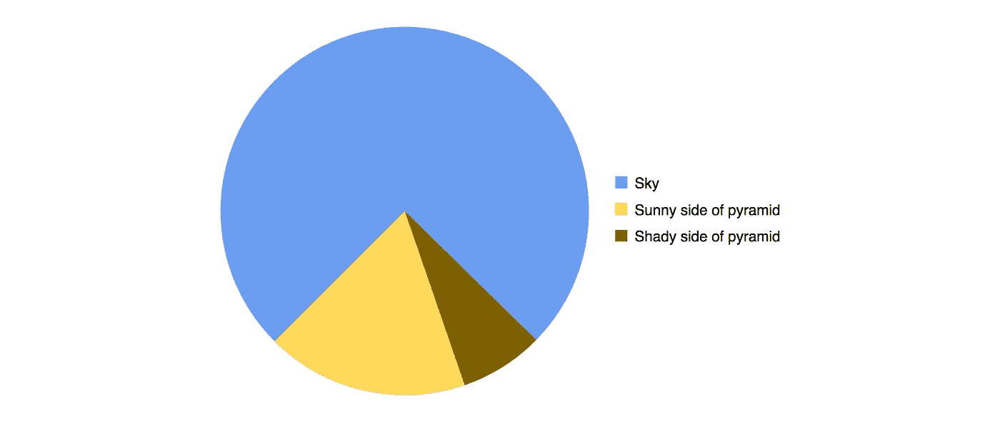
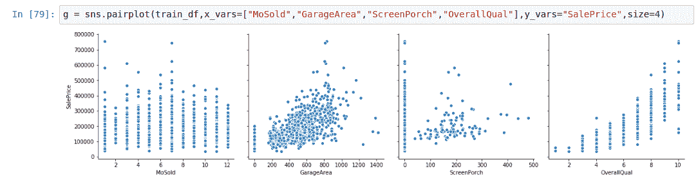
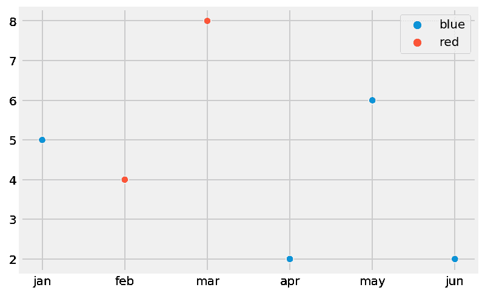
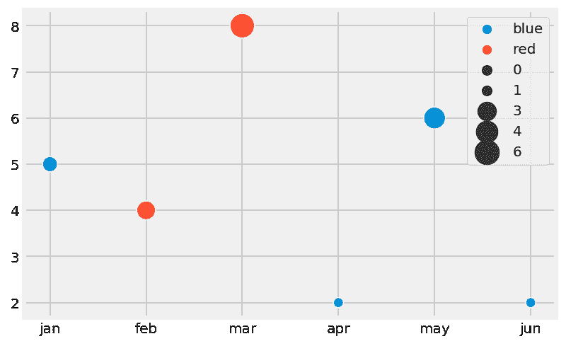
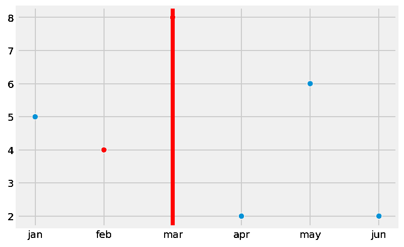
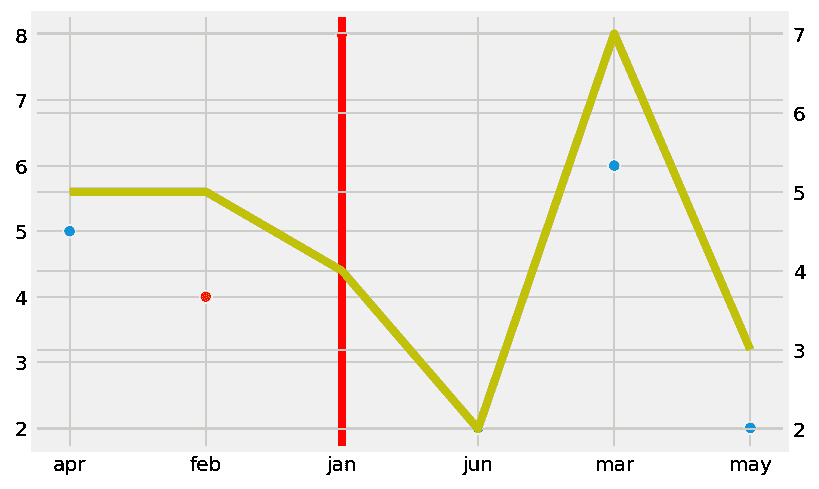
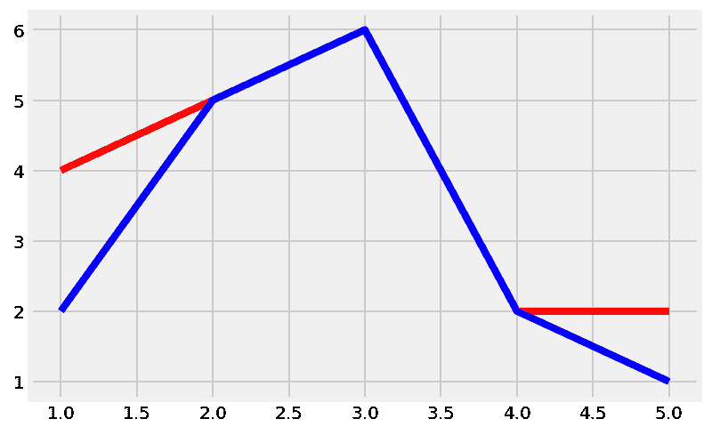
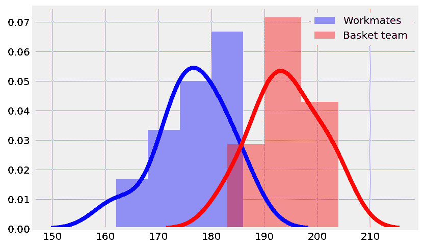
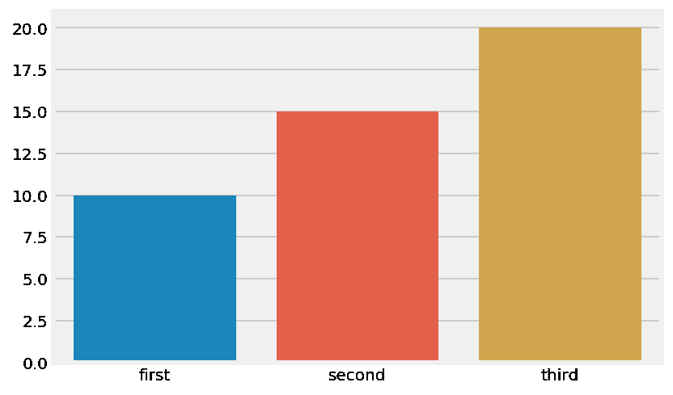

# 改善绘图的 10 个技巧

> 原文：<https://towardsdatascience.com/10-tips-to-improve-your-plotting-f346fa468d18?source=collection_archive---------13----------------------->



## 因为在现实生活的数据科学中，绘图确实很重要

我必须诚实地告诉你:当我学习数据科学时，我完全低估了绘图的重要性。没错，那时候一切都是一团糟:在从头开始学习 Python、思考所有可能的算法和理解一切背后的数学之间，绘图是我的最后一个问题。

为什么不应该呢？我们总是在策划同样的事情。你知道:pairplots、distplots、QQ plots……你在可视化数据时使用的那些图表是理解它的唯一方式。非常有用的图表。但也是非常通用和默认的图表。于是复制粘贴一堆代码成了我那几天最好的朋友。



对于我的项目来说，可交付成果总是一个模型。希望能得到一些合理的分数，这要归功于数小时的清理和功能工程。我是参与我的项目的唯一一个人，我的教授们自从把数据给我之后，已经知道了所有关于这些数据的事情。那么我会为谁策划呢？我自己？拜托…没必要！对吗？我比任何人都清楚我每一步想要达到的目标。我不需要向任何人解释任何事情。


但是除了这一切，说实话，密谋一点都不花哨。任何人都可以策划。我 60 岁的父亲只用 Excel 就能从帽子里变出一些图表。如果每个人都能做到，当然，这就是不花哨的定义。因为在这里，我的朋友们，我们正在做数据科学和机器学习。大多数人甚至不知道那是什么。正如《哈佛商业评论》杂志所言，这就是为什么我们都如此酷和性感。

问题是 peeps-如果你还没有发现我的过度讽刺，这不是真正的生活是如何工作的。我相信这可能是我沉浸在数据科学中最大的失败:没有足够重视可解释性和可解释性的重要性。你可能是个天才，但是如果你不能向第三方解释你是如何以及为什么会得到那些美妙的预测，那么你可能什么都没有。例如，在 [Ravelin Technology](https://www.ravelin.com) ，我们提供基于机器学习的防欺诈解决方案。想象一下，告诉一个客户，我们正在阻止 X%的交易，因为机器学习模型是这样说的，但完全不知道为什么要这样做。对于任何试图最大化转化和销售的电子商务来说，这肯定不是很有吸引力，对吗？想象一下，现在在医疗保健等其他敏感领域也出现了同样的情况……灾难就在眼前。

现在，除了与业务相关的问题，甚至除了从法律角度或从你的业务可能只关心预测的事实来看——无论你如何获得它们，理解算法实际上是如何工作的都会有所帮助。不仅是为了更好地向客户解释结果，也是为了更好地协调数据科学家和分析师的活动。

因此，在现实世界中，情况与我从事学术数据科学项目时的情况完全不同:我从来不是项目中的唯一参与者，我的同事和/或客户通常不太了解我使用的数据。那我现在会为谁策划呢？听起来还没必要吗？大概不会。能够向人们解释你的思维过程是任何数据相关工作的关键部分。这就是为什么复制和粘贴图表是不够的，图表个性化变得非常重要。


Te Fight Club

在这篇文章的剩余部分，我想和你分享 10 个基本的、中级的和高级的工具，我发现它们在现实生活中非常有用，可以用来解释你的数据。

我将在下面几行中引用的库是:

*   Seaborn | From: *将 Seaborn 作为 sns 导入*
*   matplotlib | From:*matplotlib . py plot as PLT*

此外，如果您愿意，您可以设置一种风格和您喜欢的格式，如:

```
plt.style.use(‘fivethirtyeight’)%config InlineBackend.figure_format = ‘retina’%matplotlib inline
```

说到这里，让我们直接跳到工具:

## **1。绘制多幅图**

你可能会想在一张图中画出几样东西，我们会简单介绍一下。但是其他时候，您可能希望在同一行或同一列中显示不同的图表，相互补充和/或显示不同的信息。

为此，我们将看到一个**非常基本却又必不可少的工具**:支线剧情。怎么用？很简单。matplotlib 中的图表是使用以下内容构建的:

*   图形:用于绘制图表的背景或画布
*   坐标轴:我们的图表

通常，这些东西是在我们的代码的背景上自动设置的，但是如果我们想要绘制几个图，我们只需要以下面的方式创建我们的图形和轴对象:

```
fig, ax = plt.subplots(ncols=number_of_cols, nrows=number_of_rows, figsize=(x,y))
```

例如，如果我们设置 ncols = 1，nrows = 2，我们将创建一个大小为 x，y 的图形，只有两个图表，分布在两个不同的行中。剩下的唯一事情就是使用“ax”参数从 0 开始指定不同绘图的顺序。例如:

```
sns.scatterplot(x=horizontal_data_1, y=vertical_data_1, **ax=ax[0]**);sns.scatterplot(x=horizontal_data_2, y=vertical_data_2, **ax=ax[1]**);
```

## 2.轴标签

这可能看起来没有必要，或者不是很有帮助，但是你无法想象如果你的图表有些混乱，或者看到它的人不太熟悉数据，你会被问多少次 X/Y 轴上有什么。按照我们前面的两个图的例子，如果我们想为我们的轴设置一个特定的名称，我们必须使用下面的代码行:

```
ax[0].set(xlabel=’My X label’, ylabel=’My Y label’)ax[1].set(xlabel=’My second X label’, ylabel=’My second and very creative Y label’)
```

## 3.设置标题

如果我们向第三方展示我们的数据，另一个基本但关键的工具是使用标题，它的工作方式与我们之前的轴标签点非常相似:

```
ax[0].title.set_text(‘This title has to be very clear and explicative’)ax[1].title.set_text(‘And this title has to explain what’s different in this chart’)
```

## 4.注释图表中的内容

通常情况下，仅将 y 轴放在图表的右边或左边本身并不清楚。无论是因为所有值之间非常接近，还是因为精度对于被分析的事物非常重要。无论是哪种情况，在图上标注值对增加澄清和自我解释非常有用。

假设现在我们使用支线图，所以我们有几个图表，其中一个是在 ax[0]位置的 Seaborn 柱状图。在这种情况下，获取每个条上的注释的代码有点复杂，但非常容易实现:

```
for p in ax[0].patches:ax[0].annotate(“%.2f” % p.get_height(), (p.get_x() + p.get_width() / 2., p.get_height()),ha=’center’, va=’center’, fontsize=12, color=’white’, xytext=(0, -10), textcoords=’offset points’)
```

对于图表中的每个“小块”或条形，代码直到“ha”参数获得条形的位置、高度和宽度，以将值标注放在正确的位置。以类似的方式，我们也可以指定注释的对齐方式、字体大小和颜色，而“xytext”参数指示我们是否希望在某个 x 或 y 方向上移动注释。在上面的例子中，我们将在 y 轴上向下移动文本。

## 5.使用不同颜色区分标签

在某些情况下，在一段时间或一个数值范围内，我们可能会测量不同种类的对象。例如，假设我们在 6 个月内测量了狗和猫的体重。在期末，我们要画出每只动物的体重，但是分别用蓝色和红色来区分狗和猫。为此，在大多数传统绘图中，我们可以使用参数“hue”来提供元素的颜色列表。

举以下例子:

```
weight = [5,4,8,2,6,2]month = [‘febrero’,’enero’,’abril’,’junio’,’marzo’,’mayo’]animal_type = [‘dog’,’cat’,’cat’,’dog’,’dog’,’dog’]hue = [‘blue’,’red’,’red’,’blue’,’blue’,’blue’]sns.scatterplot(x=month, y=weight, hue=hue);
```



## 6.更改散点图中的点的大小

使用上面的同一个例子，我们可能还想在图表中添加动物体重的大小，使用从 1 到 5 的范围。将此额外指标添加到图中的一个好方法是修改散点图的大小，通过“大小”参数将大小分配给新的附加向量，并使用“大小”来调整它们之间的关系:

```
size = [2,3,5,1,4,1]sns.scatterplot(x=month, y=weight, hue=hue, **size=size, sizes=(50,300)**);
```



顺便说一下，如果像上面的图表一样，图例使情节更难阅读，而不是有所帮助，**你总是可以通过设置“legend”参数等于 False** 来删除它；)

## 7.包括一条线来显示数据中的阈值

在现实生活中的许多情况下，数据高于或低于某个阈值可能是问题的信号或错误的警告。如果我们想在图上清楚地显示这一点，我们可以使用以下命令添加一条线:

```
ax[0].axvline(32,0,c=’r’)
```

其中:

*   ax[0]将是我们要插入线条的图表
*   32 将会是画这条线的数值
*   c='r '用红色绘制

如果我们正在处理支线剧情，就像在上面的例子中给相应的轴添加一条轴线一样简单。然而，如果我们不使用支线剧情，我们应该做以下事情:

```
g = sns.scatterplot(x=month, y=weight, hue=hue, legend=False)**g.axvline(2,c=’r’)**plt.show()
```



## 8.多 y 轴绘图

这可能是最简单的，但也是最有用的提示之一。

有时，我们只需要在聊天中添加更多信息，除了在图的右侧 y 轴上添加一个新指标之外，没有其他办法:

```
ax2 = ax[0].twinx()
```

现在，您可以添加任何您想要的图表，将“ax”参数指向“ax2”

```
sns.lineplot(x=month, y=average_animal_weight, ax=ax2)
```

注意，这个例子再次假设你正在处理支线剧情。如果你不是，你应该遵循与上一点相同的逻辑:

```
g = sns.scatterplot(x=month, y=weight, hue=hue, legend=False)g.axvline(2,c=’r’)**ax2 = g.twinx()**sns.lineplot(x=month, y=average_animal_weight, **ax=ax2**, c=’y’)plt.show()
```



请注意，要做到这一点，您应该在两个图表中为 x 轴设置相同的数据。否则，它们不会匹配。

## 9.重叠的地块和变化的标签和颜色

在同一个轴上重叠图表很容易:我们只需要为我们想要的所有绘图编写代码，然后，我们可以简单地调用' plt.show()'来将它们绘制在一起:

```
a = [1,2,3,4,5]
b = [4,5,6,2,2]
c = [2,5,6,2,1]sns.lineplot(x=a, y=b, c=’r’)
sns.lineplot(x=a, y=c, c=’b’)plt.show()
```



然而，有时重叠会导致混乱，所以我们可能希望个性化我们的图表，使吃得更清楚。

例如，假设您想在同一个图中重叠两个不同样本的身高分布:一个来自您的同事，另一个来自您当地的篮球队。这将是很好的个性化的东西，如两个地块的颜色，并添加一个说明哪个是哪个的图例，对不对？嗯，很简单:

*   设置“颜色”标签我们可以为每个标签设置特定的颜色。请注意，有时该参数可以简单地更改为“c”
*   使用' label '参数，我们可以通过简单地在' x.legend()'之后调用来为它们指定任何要显示的文本

举以下例子:

```
g = sns.distplot(workmates_height, color=’b’, label=’Workmates’)sns.distplot(basketball_team, color=’r’, ax=g, label=’Basket team’)g.legend()plt.show()
```



## 10.在条形图中为轴设置订单

最后，一个非常特别的工具，如果你喜欢使用条形图，你可能会遇到这样的问题:你的条形图没有按照你想要的顺序排列。在这种情况下，有一个简单的解决方法，将一个包含您想要的特定顺序的列表传递给“order”参数:

```
a=[‘second’,’first’,’third’]b=[15,10,20]sns.barplot(x=a,y=b,order=[‘first’,’second’,’third’]);
```



绘图本身就是一个世界，根据我的经验，提高技能的最好方式就是练习。但是我希望当现实世界的数据科学像发生在我身上一样打击你时，这些工具和技巧能帮助你:)

最后，别忘了看看我最近的一些文章，比如我在训练测试分割中犯的 6 个业余错误，或者 5 分钟内完成的 T2 网页抓取。所有这些都可以在[我的个人资料](https://medium.com/@g.ferreiro.volpi)中找到。另外，**如果你想直接在你的邮箱里收到我的最新文章，只需** [**订阅我的简讯**](https://gmail.us3.list-manage.com/subscribe?u=8190cded0d5e26657d9bc54d7&id=3e942158a2) **:)**

回头见！