# Python 中级程序员应该知道的 10 个高级概念

> 原文：<https://towardsdatascience.com/10-topics-python-intermediate-programmer-should-know-3c865e8533d6?source=collection_archive---------1----------------------->

## 想成为一名专业的 python 开发者，请阅读这篇博客，了解 python 中的 10 个高级概念。

1.  Python 中的 Everything Object 是怎样的？
2.  理解(多重和嵌套)
3.  扩展关键字参数(*args，**kwargs)
4.  闭包和装饰器
5.  生成器和迭代器协议
6.  上下文管理器
7.  @staticmethod 和@classmethod
8.  继承和封装
9.  运算符重载
10.  Python 包和程序布局

我会逐一解释所有的话题。

> **python 中的一切都是对象吗？**

字符串是对象。列表是对象。函数是对象。甚至模块也是对象。任何东西都是对象，因为它可以被赋给一个变量或者作为一个函数的参数传递。

在 Python 中，任何可以(合法地)放在等号右边的东西都是(或创建)一个对象。

```
> def hello():
      print("say hello")> hi = hello()> hi()
"say hello">hello()
"say hello"
```

## **对象:**

1.  一个身份
2.  一个值(可变或不可变)

**Mutable:** 当您更改项目时，id 仍然不变。字典，列表

**不可变:**字符串，整数，元组

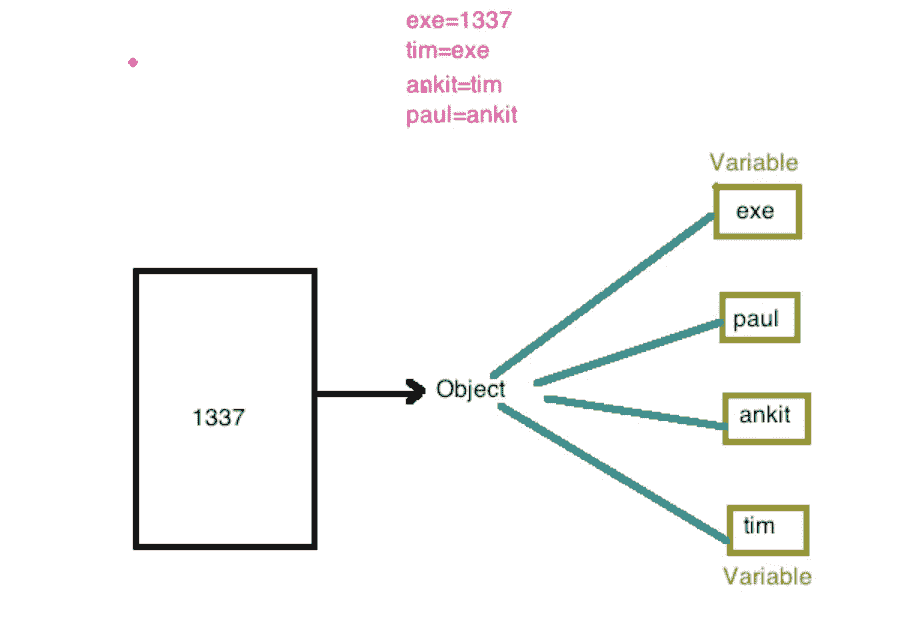

> **理解**

创建集合和可迭代对象的简写语法。

*   ***列表理解:***

```
[ expr(item) for item in iterable ]
```

*   ***设定理解:***

```
{ expr(item) for item in iterable }
```

*   ***字典理解:***

```
{ key_expr:value_expr for item in iterable }
```

*   ***生成器理解:***

```
( expr(item) for item in iterable)
```

*   ***用 If-从句理解:***

```
[ expr(item) for item in iterable if predicate(item) ]
```

*   ***多重理解:***

```
[(x,y) for x in range(10) for y in range(3)]
```

*   ***嵌套理解:***

```
[[y*3 for y in range(x)] for x in range(10)]
```

> **扩展关键字参数**

当在 **Python** 中调用函数时，你经常不得不在使用**关键字参数**或位置参数**参数**之间做出选择。**关键字参数**经常可以用来使函数调用更加明确。当我们使用**关键字参数**时:我们经常会忽略**参数**的默认值。

```
Def function_name(arg1, arg2=1.0,):
    BODYArg1 => Positional ArgumentArg2 => Keyword Argument
```

*   ***扩展的形式参数语法:***

*自变量在功能* ***定义端。***

```
**How we use print, format function?**Ex: 
> print(“one”)> print(“one”, “two”)We are passing any number of argument in print statement.
```

扩展参数的数据类型:

```
*args => tuple
**kwargs => dict**these arguments should be pass in sequence.**Def func(arg1, arg2, *args, kwarg1, **kwargv):
    print(type(*args))
    print(*args)
    print(type(**kwargv))
    print(**kwargv)
```

*   ***扩展实际参数语法***

*自变量在函数* ***调用方*** *。*

```
> print_args(*t)
  1
  2
  (3, 4, 5)
```

> **关闭和装饰**

在开始闭包之前，我们应该了解局部函数。

*   ***局部功能:***

函数内部的函数是局部函数。

*   适用于专门的一次性功能
*   有助于代码组织和可读性
*   类似于 lambdas，但更通用
*   它可能包含多个表达式
*   可能包含语句

**通过 LEGB 规则进行范围解析:**
在 Python 中， **LEGB 规则**用于决定在范围解析中搜索名称空间的顺序。
范围按照层级排列如下(最高到最低/最窄到最宽):

*   Local(L):在函数/类内部定义
*   Enclosed(E):在封闭函数内部定义(嵌套函数概念)
*   全局(G):在最高层定义
*   内置(B):Python 内置模块中的保留名称

```
def func():    
    def local_func():
        a = 'hello, '
        b = 'world'
        return a + b
    x = 1
    y = 2
    return x + y
```

*   ***返回功能:***

```
def outer():
    def inner():
        print('inner')
    return inner> I = outer()
> I()
"inner"
```

*   ***闭包:***

维护对早期作用域中对象的引用。

```
def outer(x):
    def inner(y):
        return x+y
    return inner
> add_plus3= outer(3)
> add_plus3(2)
  5
```

我们可以使用 __closure__ 来验证函数是否是闭包。

```
i = outer()  
> i.__closure__
```

*   ***装修工:***

修改和增强功能而不改变它们定义。实现为接受并返回其他可调用函数的可调用函数。

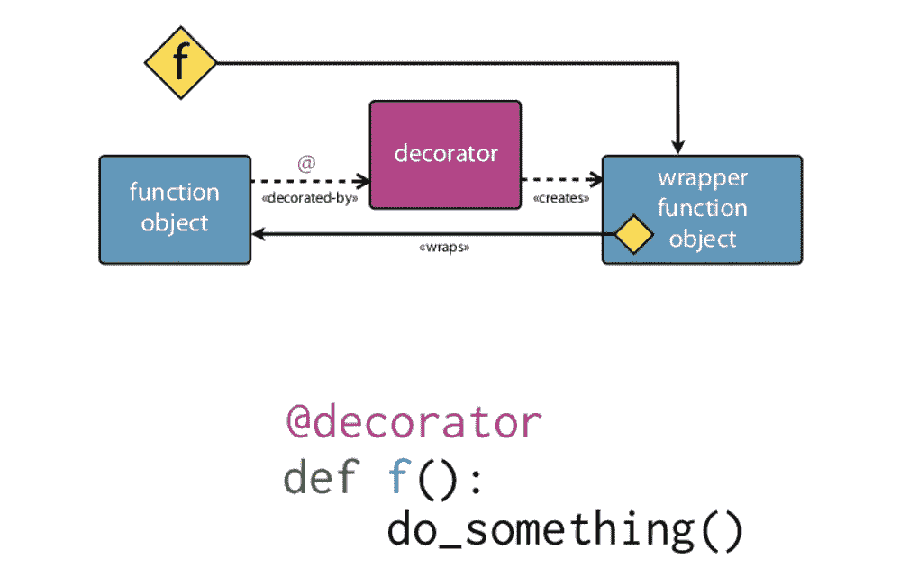

decorator workflow

我们也可以创建作为装饰者的类和作为装饰者的实例。

> **发生器和可迭代协议**

*   ***Iterable* :** 对象可以传递给内置的 iter()函数得到一个迭代器。
*   ***迭代器* :** 对象可以传递给内置的 next()函数来获取下一项。

```
iterator = iter(iterable)item = next(iterator)
```

*   ***发电机:***

Python 生成器是一种创建迭代器的简单方法。我们上面提到的所有开销都是由 **Python** 中的**生成器**自动处理的。

一个**生成器**是一个函数，它返回一个我们可以迭代的对象(迭代器)(一次一个值)。

如果一个函数包含至少一个 **yield** 语句，它就成为一个生成器函数。

不同之处在于，当 return 语句完全终止一个函数时，yield 语句暂停该函数并保存其所有状态，然后在后续调用中继续执行。

**为什么在 Python 中使用生成器？**

*   易于实施
*   内存高效
*   表示无限流
*   流水线发电机

```
def PowTwoGen(max = 0):
    n = 0
    while n < max:
        yield 2 ** n
        n += 1
```

> ***上下文管理器***

**上下文管理器**是一个设计用于 with 语句的对象。

上下文管理器确保资源得到正确和自动的管理。

```
with context-manager:
    context-manager.begin()
    Body
    context-manager.end()
```

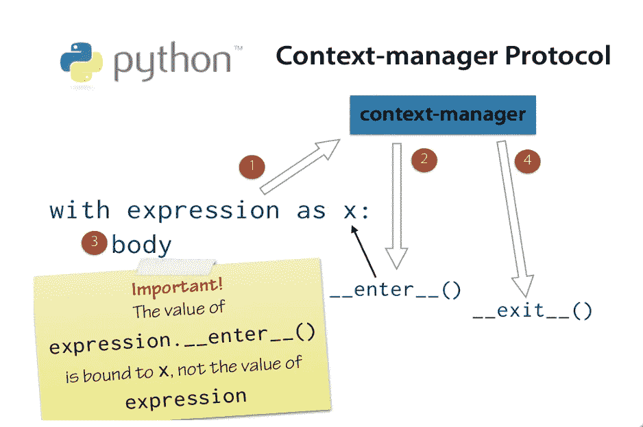

context manager workflow

**_ _ 回车 __()**

在进入 with 语句体之前调用

绑定到变量的返回值

可以返回任何类型的值

通常返回上下文管理器本身

**_ _ 出口 __()**

当 with 语句体存在时调用

__exit__(self，exc_type，exc_val，exc_tb)

> **@staticmethod，@classmethod**

```
class attributes versus instance attributes:Class A:
    CLASS_ATTRIBUTE = 1
    Def __init__(slef, instance_attribute):
        Self.instance_attribute = instance_attribute
```

如果需要访问函数中的类属性，最好使用@classmethod。

如果你不需要使用 cls 对象，那么使用@static 方法。

与其他语言不同，在 python 中，静态方法可以在子类中被覆盖。

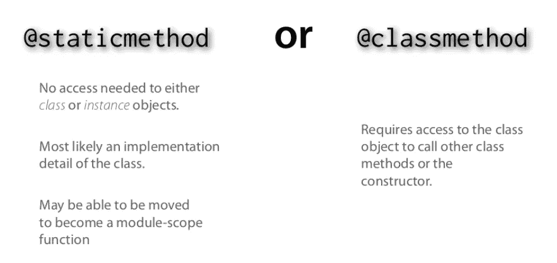

> **继承和封装**

*   ***传承*** :

**继承**是一个类获取另一个类的属性的机制。例如，一个孩子继承了他/她父母的特征。通过**继承**，我们可以重用现有类的字段和方法。因此，**继承**促进了可重用性，并且是 OOPs 的一个重要概念。

*   ***单一继承* :**

子类将拥有基类的所有功能，它还可以修改和增强。

子类初始化器想要调用基类初始化器来使整个对象初始化有意义。

```
class SubClass(BaseClass):
```

**调用其他类初始化器:**

*   其他语言自动调用基类初始化器
*   Python 对待 __init__()就像对待任何其他方法一样
*   如果被覆盖，则不调用基类 __init__ ()
*   使用 super()调用基类 __init__()

***isinstance*** (实例，类):判断一个对象是否属于指定的类型。

***Issubclass* (** 子类，基类):确定一个类型是否是其他类型的子类。

*   ***多重继承:***

定义具有多个基类的类。

```
Class SubClass(Base1, Base2, …):
```

python 怎么知道应该调用哪个基类函数？

Python 使用方法 Resolution Order 和 super 来做到这一点。

```
__bases__ => a tuple of base classes
__mro__ => a tuple of mro ordering
```

**方法解析顺序**

确定方法名查找的顺序

*   通常被称为“MRO”
*   方法可以在多个地方定义
*   MRO 是继承图的一种排序
*   其实很简单

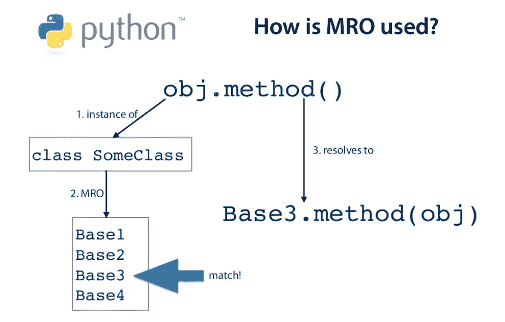

MRO workflow

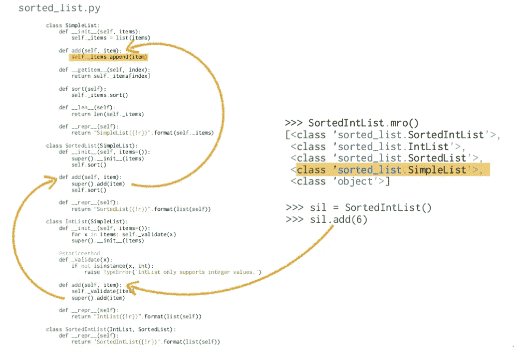

*   **封装:封装:**

请参考本文，了解关于封装的更多细节。

 [## python——封装存在吗？？

### 封装是将数据和对数据进行操作的功能打包到一个组件中，并限制…

medium.com](https://medium.com/@manjuladube/encapsulation-abstraction-35999b0a3911) 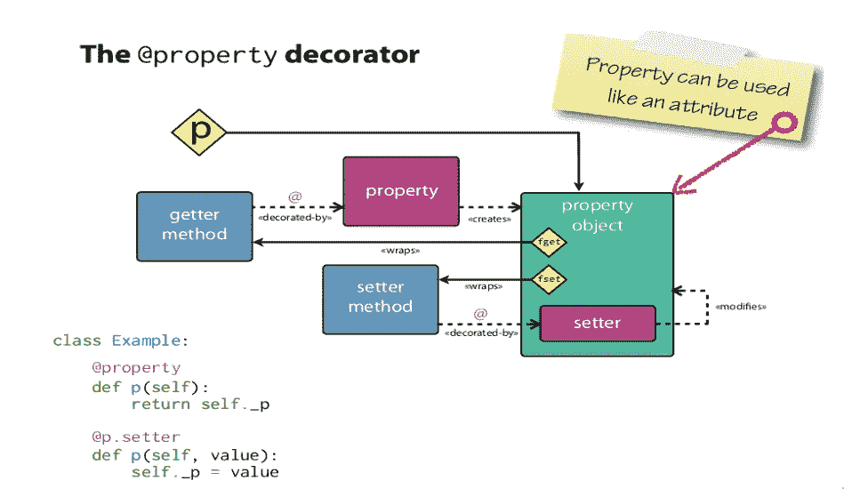

> **操作员超载**

Python 运算符适用于内置类。但是同一个操作符对不同的类型表现不同。例如，+运算符将对两个数字执行算术加法，合并两个列表并连接两个字符串。

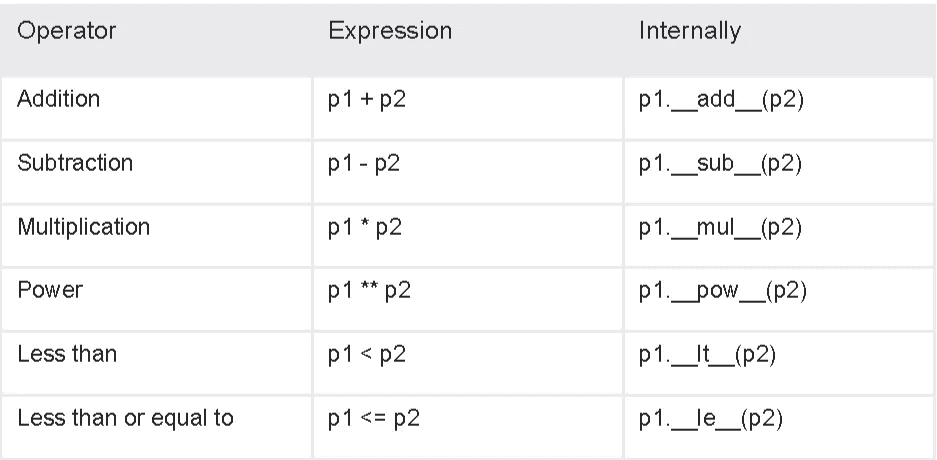

Examples of operator overloading

> **Python 包和程序布局**

**包**是一个可以包含其他模块的模块。

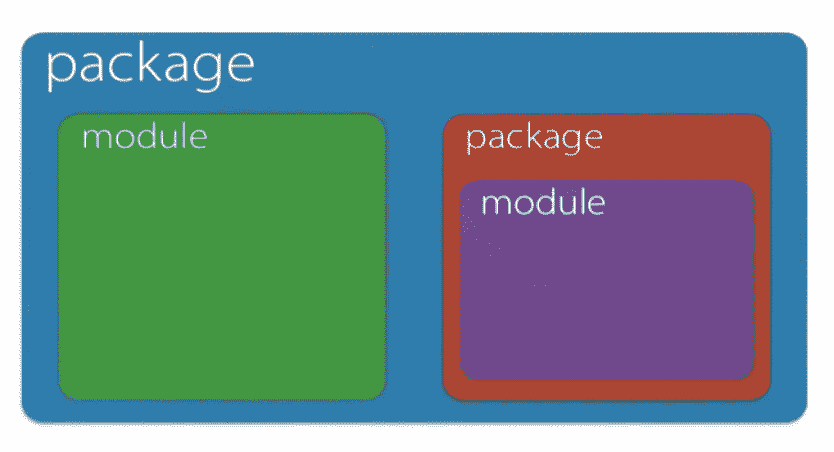

modules and packages

**sys . path**Python 搜索模块的目录列表。

**PYTHONPATH** 列出添加到 sys.path 的路径的环境变量。

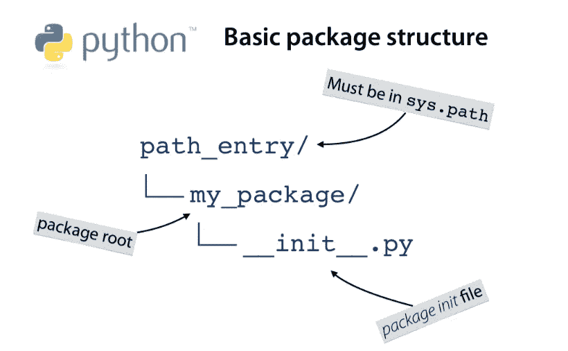

minimal package

1.包是包含其他模块的模块。

2.包通常被实现为包含特殊

__init__。py 文件。

3.__init__。py 文件在导入包时执行。

4.包可以包含自己实现的子包

用 __init__。目录中的 py 文件。

5.包的模块对象具有 __path__ 属性。

***绝对导入:*** 使用完整路径导入模块。

```
from test.test import Tester
```

***相对导入:*** 使用相对路径导入同一个包中的模块。

```
from .test import Tester
```

**__all__:** 通过模块导入*导入的属性名称列表

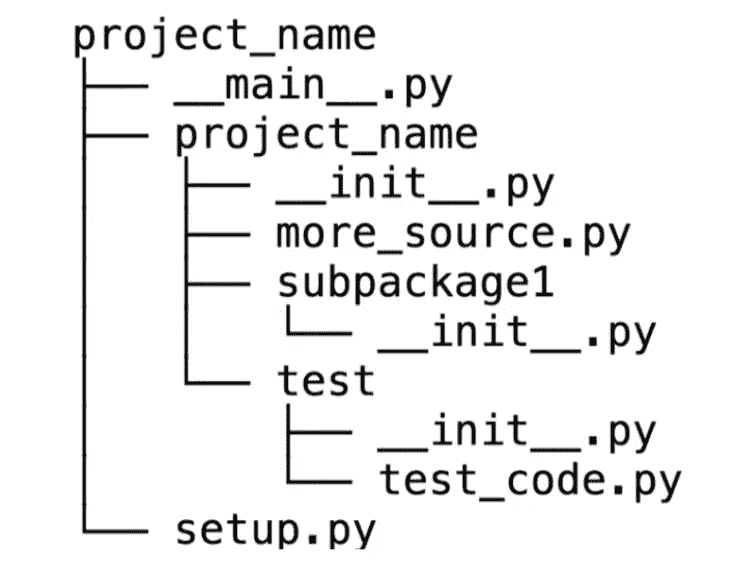

Recommended project structure

如果你喜欢这篇文章，欢迎你来[关注](https://medium.com/@agrawal-pulkit)，这样你就不会错过未来的新更新。