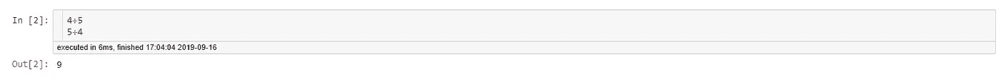

# 数据科学家使用 Jupyter 笔记本的 10 个技巧

> 原文：<https://towardsdatascience.com/10-tricks-for-data-scientists-using-jupyter-notebooks-f28387f73f77?source=collection_archive---------5----------------------->

## *5 分钟:提高*效率 x *简单性 x* 生产力


*当我开始使用 Python 进行数据分析时，我很快发现 Jupyter 笔记本是一个很好的工具，可以为我的代码提供更好的结构。然而，有些事情仍然很烦人。如果我为了更好的可读性而使用标题，较大的笔记本会很快变得混乱。如果我在一个单元格中计算多个值，我只会收到最后一个变量的输出，以此类推…
但是，我们使用的是 Python，其他人也遇到了同样的问题，并找到了很好的解决方案。我想分享其中的一些。*

目录:

1.两个数据集并排
2。打印特定单元格
3 的每个输出。改变屏幕宽度
4。Jupyter 扩展
4.1 代码折叠
4.2 可折叠标题
4.3 执行时间
4.4 便笺式存储器
4.5 内核空闲
4.6 Zenmode
4.7 表格美化器

## 1.两个数据集并排

有时我想并排比较两个较小的数据帧。使用下面的 css 代码片段，您可以调整输出:

```
CSS = """
.output {
flex-direction: row;
}
"""HTML('<style>{}</style>'.format(CSS))
```

现在，您可以在一个 Jupyter 单元格中对多个数据帧使用`display(df)`:


## 2.打印特定单元格的每个输出

假设您在一个单元格中计算两个变量(即使这不是最佳实践😉).通常只显示最后一个结果:



只需添加以下语法，每个结果都将被打印出来:

```
from IPython.core.interactiveshell import InteractiveShell
InteractiveShell.ast_node_interactivity = "all"
```


## 3.调整屏幕尺寸

按照标准配置，Jupyter 笔记本电脑可覆盖 60%的屏幕。用一个简短的 css 命令你可以调整宽度(这里是 80%):

```
from IPython.core.display import display, HTML
display(HTML("<style>.container { width:80% !important; }</style>"))
```

在下面的屏幕截图中，您可以看到结果:


## 4.Jupyter 扩展

现在我们来到一个非常有趣的话题:Jupyter 扩展。正如我已经提到的，很多人编写扩展来优化笔记本。我将向您展示一些真正有用的数据科学扩展。如果您使用的是 conda，只需键入:

```
conda install -c conda-forge jupyter_contrib_nbextensions
```

之后你就可以使用 Jupyter 扩展了。在您通常启动笔记本的菜单中，您也可以选择现在的扩展(红色标记的区域)。我将向您展示 7 个有用的扩展(绿色标记的区域)。您可以通过单击复选框来激活它们:


## 4.1 代码折叠

如果你写了很多代码，过一会儿读起来会很混乱。使用`Codefolding`你可以隐藏缩进的代码


如果你激活扩展`Codefolding`，一个小三角形会出现在每个单元格的左上角。你可以点击它，缩进的代码将被最小化。

## 4.2 可折叠标题

可折叠的标题将使每个项目可读性更好。之前的扩展帮助你构建单元格的内容。有了这个扩展，你可以给整个笔记本一个更好的结构:


在截图中，您可以看到我为本文创建的笔记本的第一部分。第一个标题由`#`创建，第二个标题由`##`创建。类似于`Codefolding`扩展，你可以使用左上角小三角形的`Collapsible heading`。你可以点击它，一个标题后的所有内容都会被隐藏:


这是一个分层系统，如果您单击 h1 标题的三角形，h2 标题也会被隐藏:


## 4.3 执行时间

一旦您熟悉了用于数据分析的 Python 包，您就会希望提高代码的性能。Jupyter magic 命令`%% timeit`对于获取一个单元的执行时间非常有用，因为它将被执行 100 或 1000 次，以获取执行时间的有效平均值。对于更快的检查，扩展`Execution time`非常有用，因为它将始终显示每个输出单元中所需的时间:


## 4.4 草稿栏

有时候想尝试笔记本里的东西。通常，我创建一个单元格，然后删除它。但是在更大的项目中，我有时会忘记删除一些垃圾，我的笔记本中会出现不必要的命令。更好的做法是使用`Scratchpad`。这个扩展允许创建“抛弃式”代码片段:


一旦你激活扩展，你就可以用右下角的小三角形打开你的`Scratchpad`。

## 4.5 内核空闲

较大的脚本有时需要几分钟甚至几小时来执行。使用扩展`Kernle idle`，当执行完成时，您将收到来自浏览器的通知:


您可以禁用通知或在笔记本顶部更改时间。如果您将时间更改为 30，您将只收到执行时间超过 30 秒的脚本的通知。

## 4.6 Zenmode

在下面的截图中，你可以看到一个干净的笔记本，没有不必要的菜单。我非常喜欢这个外观，您可以通过激活`zenmode`模式来获得它:


## 4.7 餐桌美化师

我认为学习 Python 代码是很重要的，并且我认为用语法记录你所做的一切总是更好。使用`Table beautifier`,您可以通过点击它来对列或索引进行排序。对于快速检查，这非常有用:


## 结论

Jupyter 笔记本非常适合分析，但仍有潜力让它们变得更好。作为数据科学家，有一些真正有用的 css 片段和扩展，让您的工作更加舒适。我希望你喜欢这篇文章。如果你知道任何其他有用的扩展，欢迎发表评论。

[如果您喜欢中级和高级数据科学，并且还没有注册，请随时使用我的推荐链接加入社区。](https://medium.com/@droste.benedikt/membership)