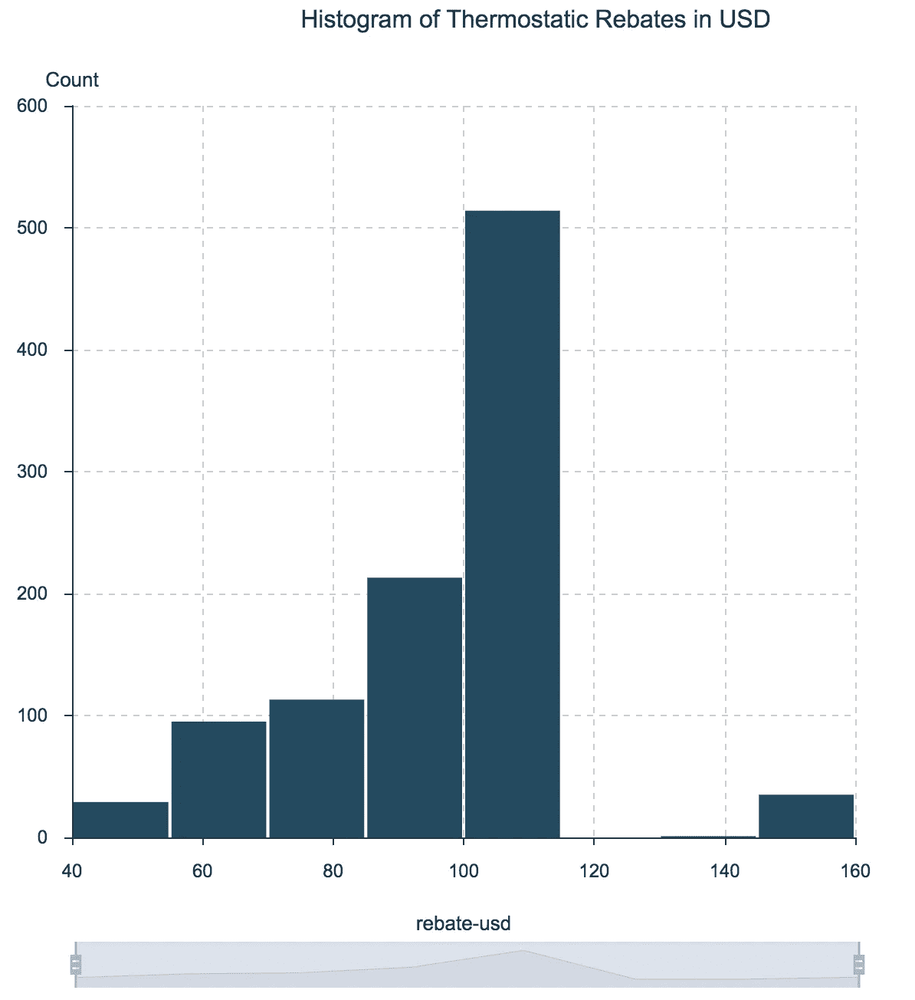
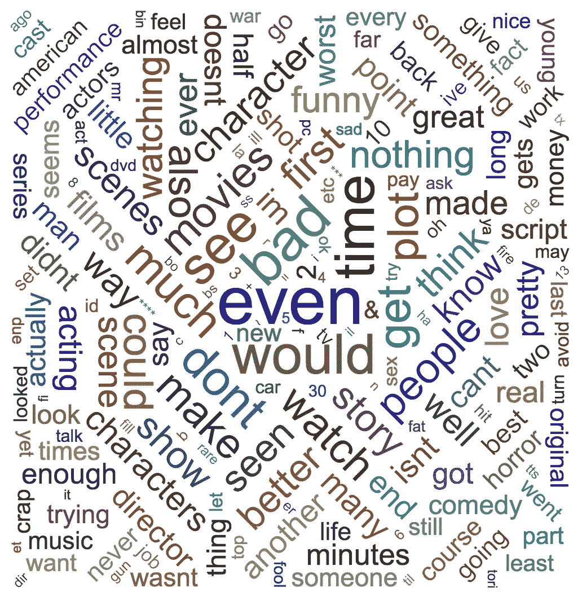

# 每个数据科学家都应该知道的 10 种可视化

> 原文：<https://towardsdatascience.com/10-viz-every-ds-should-know-4e4118f26fc3?source=collection_archive---------5----------------------->

## [现实世界中的数据科学](https://medium.com/towards-data-science/data-science-in-the-real-world/home)

## 一张图胜过一千句话

Photo by [Willian Justen de Vasconcellos](https://unsplash.com/@willianjusten?utm_source=medium&utm_medium=referral) on [Unsplash](https://unsplash.com?utm_source=medium&utm_medium=referral)

在对世界上被茂密丛林或巨大森林覆盖的地区进行多年调查后，有时会发现古代遗迹。考古学家在发现那一刻的感觉为科学家在通过可视化方式查看数据时经常拥有的感觉提供了一个窗口，这种感觉澄清了分析的一个关键方面。

> 对两者来说，这是一个 ***突然发现*** *的时刻！*

数据可视化扮演两个关键角色:

1.*向普通观众清楚地传达结果。*

2.*组织数据视图，提出新的假设或项目中的下一步。*

毫不奇怪，大多数人更喜欢视觉效果，而不是大量的数字表格。这就是为什么带有有意义解释的清晰标记的情节总是出现在学术论文的前面。

这篇文章着眼于你可以对数据进行的 10 种可视化处理——无论你是想让更广阔的世界相信你的理论，还是打开你自己的项目并采取下一步行动:

1.  直方图
2.  条形图/饼图
3.  散点图/线图
4.  时间序列
5.  关系图
6.  热图
7.  地理地图
8.  三维绘图
9.  更高维的图
10.  单词云

# 直方图

让我们从直方图开始，它给我们一个感兴趣的数值变量的所有可能值的概述，以及它们出现的频率。简单而强大，直方图有时被称为数据分布。

从视觉上来说，我们绘制了一个频率表，其中感兴趣的变量被分成 x 轴上的多个范围，我们在 y 轴上显示每个范围中的值的频率。

例如，想象一下，一家公司通过提供因邮政编码不同而异的折扣，使其智能恒温器对消费者更具吸引力。恒温折扣直方图有助于理解其值的范围，以及每个值的频率。

Histogram of Thermostatic Rebates in USD

请注意，大约一半的恒温器折扣在 100 美元到 120 美元之间。只有极少数的邮政编码有超过 140 美元或低于 60 美元的折扣。

数据来源[此处](https://ibm.box.com/s/6fltz5ilap8pbwzu2tt1yxil6ldosc9d)。

# 条形图和饼图

条形图(和饼图)对于分类变量就像直方图对于数值变量一样。条形图和饼图最适用于只能取固定数量值的变量分布，如低/正常/高、是/否或常规/电动/混合。

酒吧还是馅饼？重要的是要知道条形图在视觉上经常是不准确的。人类的大脑并不特别擅长处理饼状图(在[这篇文章](https://www.perceptualedge.com/articles/visual_business_intelligence/save_the_pies_for_dessert.pdf)中阅读更多关于这方面的内容)。

太多的类别会导致条形图或饼图淹没视觉效果。在这种情况下，考虑选择最高的 *N* 值，并且只可视化那些值。

下一个例子显示了病人血压的条形图和饼图，按类别分为低、正常和高。

Bar and Pie Charts for Patient’s Blood Pressure

数据来源[此处](https://ibm.box.com/s/vsfpvsyp9dwizkgqsjwggq8zce55631k)。

# 散点图和折线图

最简单的图表可能是散点图。它们在笛卡尔平面上显示数据的二维(x，y)表示，对于检查两个变量之间的关系特别有帮助，因为它们让查看者可以直观地探索任何相关性。折线图是散点图，但用一条线连接所有的点(当变量 y 连续时经常使用)。

例如，假设您想要研究房子的价格与其面积之间的关系。下图显示了一个散点图，y 轴表示房价，x 轴表示面积。请注意该图如何显示变量之间的线性相关程度，一般来说，平方英尺越多，价格越高。

我特别喜欢散点图，因为你可以用颜色和大小来扩展它们的维度。例如，我们可以根据每栋房子里卧室的数量给这些点上色，从而增加一种立体感。

将散点图扩展到 3 维或 4 维的一个简单方法是使用气泡的颜色和大小。例如，如果最后一个图中的每个泡泡都用每栋房子的房间数来着色，那么我们在图表中就有了第三个维度。

这里的数据源[是](https://ibm.box.com/s/36xezz643goha0t7zfdaex6ccirjac57)。

# 时间序列图

时间图是散点图，时间范围在 x 轴上，每个点形成一条线的一部分——提醒我们时间是连续的(尽管计算机不是)。

时间序列图非常适合直观地研究数据随时间变化的趋势、跳跃和转储，这使它们特别受金融和传感器数据的欢迎。

这里举个例子，y 轴代表 2015 年到 2017 年特斯拉股票的每日收盘价。

Time Series Plot of Tesla Stock Close Price from 2015–2017

数据来源[此处](https://ibm.box.com/shared/static/xpb2xfui8o73olu5ij8d2rxzkzwfqx29.csv)。

# 关系图

如果您的目标是开发一个全面的假设，那么直观地表示数据中的关系会特别有帮助。假设你是一家医疗保健公司的常驻科学家，从事一个数据科学项目，帮助医生加快他们的处方决策。假设有四种药物(A、C、X 和 Y ),医生给每个病人开一种且只有一种药物。您的数据集包括患者处方的历史数据，以及患者的性别、血压和胆固醇。

关系图是如何解读的？数据集中的每一列都用不同的颜色表示。图表中线条的粗细表示两列值之间的关系有多重要(频率计数)。我们来看例子深入解读一下。

药物处方的关系图提供了一些见解:

所有高血压患者的处方药物 A 和 y 大致相同。

药物 C 仅适用于低血压患者。

*   开了 X 药的病人没有一个表现出高血压。

有了这些有趣的见解，你可以开始制定一套假设，并开始新的研究领域。例如，机器学习分类器可能会准确地预测药物 A、C 以及 X 的用法，但由于药物 Y 与所有可能的特征值相关，因此您可能需要其他特征来开始进行预测。

Patient Drug Prescription Relationship Chart

数据来源[此处](https://ibm.box.com/s/vsfpvsyp9dwizkgqsjwggq8zce55631k)。

# 热图

另一种给二维图带来额外维度的酷而有趣的方法是通过热图，它在矩阵或地图显示中使用颜色来显示频率或浓度。大多数用户觉得热图特别直观，因为色彩浓度会引出趋势和特别感兴趣的区域。

下图显示了 IMDB 数据库中电影标题之间的 [Levenshtein](https://en.wikipedia.org/wiki/Levenshtein_distance) 距离。每部电影的片名离其他片名越远，它在图表中出现的颜色就越暗，例如(以 Levenshtein 距离计算)*超人*离*永远的蝙蝠侠*远，但接近*超人 2* 。

这一伟大的想象归功于迈克尔·扎格姆。

Heat Map of Distances Between Movie Titles

# 地图

像大多数人一样，我喜欢地图，可以花*小时*在使用地图可视化有趣数据的应用程序上:谷歌地图、Zillow、Snapchat 等等。如果您的数据包含经度和纬度信息(或另一种按地理位置组织数据的方式(邮政编码、区号、县数据、机场数据等)。)地图可以为您的可视化带来丰富的背景。

考虑前面**直方图**部分的恒温器折扣示例。回想一下，返点因地区而异。由于数据包括经度和纬度信息，我们可以在地图上显示折扣。一旦我指定了从最低折扣(蓝色)到最高折扣(红色)的色谱，我就可以将数据放到州地图上:

Thermostats Rebates in USD

数据来源[此处](https://ibm.box.com/s/6fltz5ilap8pbwzu2tt1yxil6ldosc9d)。

# 单词云

大量可供研究的数据以简单自由文本的形式出现。作为数据的第一步，我们可能希望可视化语料库中的词频，但直方图和饼状图确实最适合数字而非文字数据中的频率。所以我们可以转向单词云。

对于自由文本数据，我们可以从过滤掉像“a”、“and”、“but”和“how”这样的停用词开始，并将所有文本标准化为小写。我经常发现，根据您的目标，需要做额外的工作来清理和调整数据，包括删除变音符号、词干等等。一旦数据准备好了，很快就可以使用单词云可视化来了解语料库中最常见的单词。

在这里，我使用[大型电影评论数据集](http://ai.stanford.edu/~amaas/data/sentiment/)为正面评论和负面评论分别绘制了一个词云。

Word Cloud From Positive Movie Reviews

Word Cloud From Negative Movie Reviews

# 三维绘图

通过向散点图添加第三维来可视化三维数据变得越来越普遍。这些图表通常受益于交互性，因为旋转和调整大小可以帮助用户获得有意义的数据视图。下一个示例显示了一个二维高斯概率密度函数，以及一个用于调整视图的控件面板。

2D Gaussian Probability Density Function

这里的数据源[是](https://ibm.box.com/s/lgum6yhxus9kmr8dik72urvggtb0o81k)。

# 更高维的图

对于高维数据，我们希望将四个、五个或更多特征的影响可视化。要做到这一点，我们可以首先利用前面提到的任何可视化技术，投影到二维或三维空间。例如，想象一下在我们的恒温器折扣图上添加第三维，其中每个点延伸成一条垂直线，指示该位置的平均能耗。这样做将得到四个维度:经度、纬度、折扣金额和平均能耗。

对于高维数据，我们经常需要使用主成分分析(PCA)或 t-随机近邻嵌入(t-SNE)来降低维数。

最受欢迎的降维技术是 PCA，它基于找到使数据的*线性*变化最大化的新向量来降低数据的维度。当数据的线性相关性很强时，主成分分析可以在几乎不损失信息的情况下显著降低数据的维数。

相比之下，t-SNE 是一种*非线性*降维方法，它降低了数据的维度，同时近似保留了原始高维空间中数据点之间的距离。

考虑一下 MNIST⁴手写数字数据库的这个小样本。该数据库包含数千幅从 0 到 9 的数字图像，研究人员用这些图像来测试他们的聚类和分类算法。这些图像的大小是 28 x 28 = 784 像素，但是通过 t-SNE，我们可以将 784 个维度减少到两个:

t-SNE on MNIST Database of Handwritten Digits

数据来源[此处](https://ibm.box.com/s/94e4q8askq82owlnr6qxerworm6cx2sp)。

这里有十种最常见的可视化类型，每一种都有有意义的例子。这篇博客的所有可视化都是使用[沃森工作室桌面](https://www.ibm.com/products/watson-studio-desktop)完成的。除了 Watson Studio Desktop，一定要考虑像 R、Matplotlib、Seaborn、ggplot、Bokeh 和 plot.ly 这样的工具——仅举几例。

> 祝您好运，让您的数据成真！

[1]斯蒂芬很少。(2007 年 8 月)。“把馅饼留着当甜点”。[https://www . perceptual edge . com/articles/visual _ business _ intelligence/save _ the _ pies _ for _ dessert . pdf](https://www.perceptualedge.com/articles/visual_business_intelligence/save_the_pies_for_dessert.pdf)

[2]迈克尔·扎加姆和豪尔赫·卡斯塔尼翁(2017 年)。[基于物理学的数据科学协作方法](https://link.medium.com/FO706OvNpX)。*中等岗位*。

[3]安德鲁·马斯、雷蒙德·戴利、彼得·范、黄丹、安德鲁·吴和克里斯托弗·波茨。(2011).[学习用于情感分析的词向量。](http://ai.stanford.edu/~amaas/papers/wvSent_acl2011.pdf) *计算语言学协会第 49 届年会(ACL 2011)。*

[4] Yann LeCun 和 Corinna Cortes。(2010). [MNIST 手写数字数据库。](http://yann.lecun.com/exdb/mnist/)在 http://yann.lecun.com/exdb/mnist/[有售](http://yann.lecun.com/exdb/mnist/)

特别感谢[史蒂夫·摩尔](https://medium.com/u/c81f0352abb7?source=post_page-----4e4118f26fc3--------------------------------)对这篇文章的大力反馈。

***推特:***[@ castan](https://twitter.com/castanan) ***LinkedIn:***@[jorgecasta](https://www.linkedin.com/in/jorgecasta/)