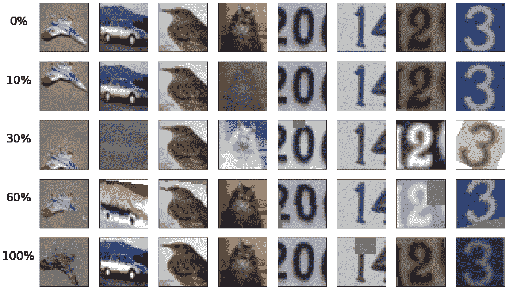
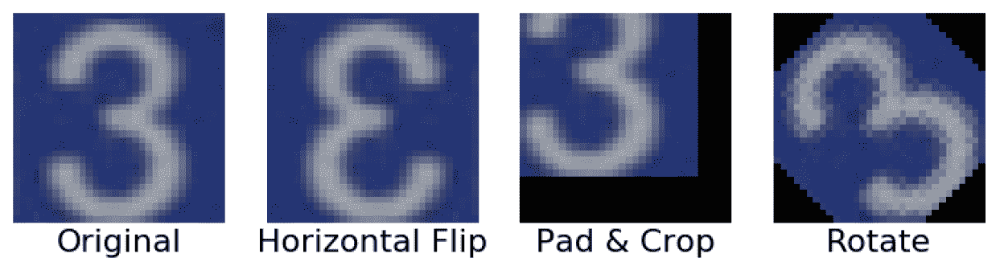
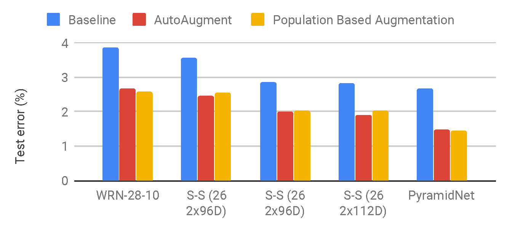
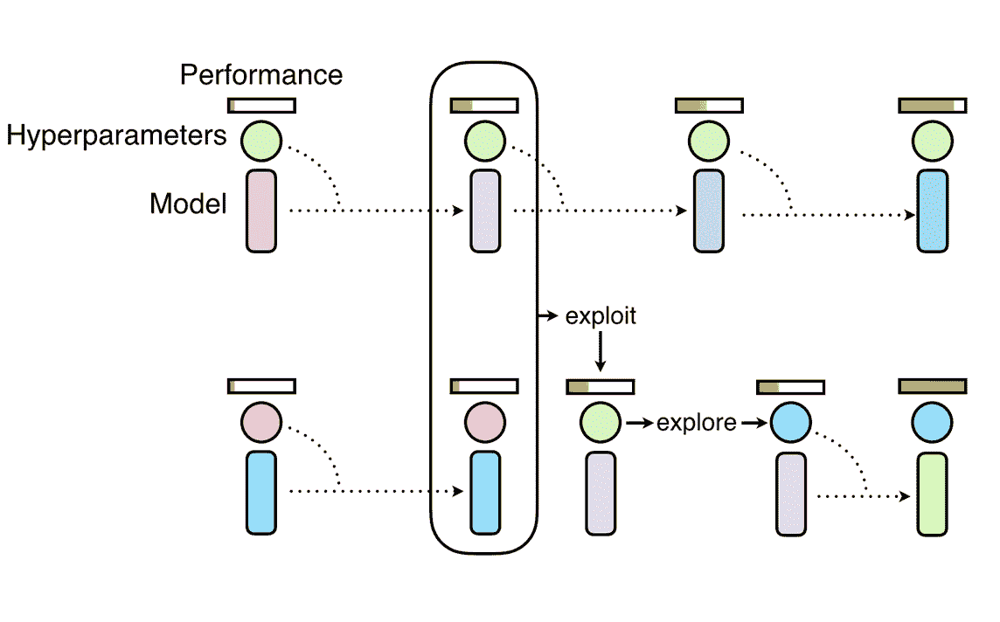

# 数据扩充速度提高 1000 倍

> 原文：<https://towardsdatascience.com/1000x-faster-data-augmentation-b91bafee896c?source=collection_archive---------11----------------------->

## 有效学习数据扩充策略以提高神经网络性能。

*Effect of* Population Based Augmentation *applied to images, which differs at different percentages into training.*

在这篇博客文章中，我们介绍了基于人口的增强(PBA)，这是一种快速有效地学习最先进的方法来增强神经网络训练数据的算法。PBA 与之前在 CIFAR 和 SVHN 上的最佳结果相匹配，但使用的 ***比计算*** 少一千倍，使研究人员和实践者能够使用单个工作站 GPU 有效地学习新的增强策略。你可以广泛使用 PBA 来提高图像识别任务的深度学习性能。

我们讨论来自我们[最近论文](https://arxiv.org/abs/1905.05393.pdf)的 PBA 结果，然后展示如何在 [Tune](https://ray.readthedocs.io/en/latest/tune.html) 框架中的新数据集上[轻松运行 PBA。](https://github.com/arcelien/pba)

# 为什么您应该关注数据增强？

深度学习模型的最新进展在很大程度上归功于近年来收集的数据的数量和多样性。数据扩充是一种策略，使从业者能够显著增加可用于训练模型的数据的多样性，而无需实际收集新数据。裁剪、填充和水平翻转等数据扩充技术通常用于训练大型神经网络。然而，用于训练神经网络的大多数方法仅使用基本类型的增强。虽然已经对神经网络体系结构进行了深入研究，但是很少关注发现强类型的数据扩充和捕获数据不变性的数据扩充策略。

*An image of the number “3” in original form and with basic augmentations applied.*

最近，谷歌已经能够通过一种新的自动化数据增强技术 [AutoAugment](https://arxiv.org/abs/1805.09501) 在 CIFAR-10 等数据集上推动最先进的准确性。自动增强已经表明，先前的工作仅使用一组固定的变换，如水平翻转或填充和裁剪，会在桌面上留下潜在的性能。AutoAugment 引入了 16 种基于几何和颜色的变换，并制定了一个增强*策略*，该策略在特定幅度级别选择最多两种变换应用于每批数据。这些更高性能的增强策略是通过使用强化学习直接在数据上训练模型来学习的。

## **有什么蹊跷？**

自动增强是一种非常昂贵的算法，它需要训练 15，000 个模型来收敛，以便为基于增强学习的策略生成足够的样本。样本之间没有共享计算，学习 ImageNet 增强策略需要花费 15，000 英伟达特斯拉 P100 GPU 小时，学习 CIFAR-10 策略需要花费 5，000 GPU 小时。例如，如果使用谷歌云按需 P100 GPU，发现一个 CIFAR 策略将花费大约 7500 美元，发现一个 ImageNet 策略将花费 37500 美元！因此，在新的数据集上进行训练时，一个更常见的用例是转移预先存在的已发布策略，作者显示这种方法效果相对较好。

# 基于人口的增长

我们的数据增强策略搜索公式，基于人口的增强(PBA ),在各种神经网络模型上达到类似的测试精度水平，同时利用三个数量级的较少计算。我们通过在 CIFAR-10 数据上训练一个小模型的几个副本来学习增强策略，这需要使用 NVIDIA Titan XP GPU 五个小时。当在较大的模型架构上使用 CIFAR-100 数据从零开始进行训练时，该策略表现出很强的性能。

相对于训练大型 CIFAR-10 网络收敛所需的几天时间，预先运行 PBA 的成本是微不足道的，并且显著提高了结果。例如，在 CIFAR-10 上训练金字塔网络模型需要在 NVIDIA V100 GPU 上超过 7 天，因此学习 PBA 策略仅增加 2%的预计算训练时间开销。对于 SVHN 来说，这个开销甚至会更低，不到 1%。

*CIFAR-10 test set error between PBA, AutoAugment, and the baseline which only uses horizontal flipping, padding, and cropping, on* [*WideResNet*](https://arxiv.org/abs/1605.07146)*,* [*Shake-Shake*](https://arxiv.org/abs/1705.07485)*, and* [*PyramidNet*](https://arxiv.org/abs/1610.02915)*+*[*ShakeDrop*](https://arxiv.org/abs/1802.02375) *models. PBA is significantly better than the baseline and on-par with AutoAugment.*

PBA 利用[基于群体的训练算法](https://deepmind.com/blog/population-based-training-neural-networks/)来生成增强策略*时间表*，该时间表可以基于当前的训练时期进行调整。这与独立于当前纪元编号应用相同变换的固定增强策略形成对比。

这允许普通工作站用户容易地试验搜索算法和增强操作。一个有趣的用例是引入新的增强操作，可能针对特定的数据集或图像模态，并能够快速产生定制的高性能增强时间表。通过消融研究，我们发现学习的超参数和调度顺序对于良好的结果是重要的。

## **增强计划是如何得知的？**

我们使用基于群体的训练，对 16 个小型广域网络模型进行群体训练。群体中的每个工人将学习不同的候选超参数计划。我们从零开始转移最佳执行时间表来训练更大的模型，从中我们得到我们的测试误差度量。

*Overview of Population Based Training, which discovers hyperparameter schedules by training a population of neural networks. It combines random search (explore) with the copying of model weights from high performing workers (exploit).* [Source](https://deepmind.com/blog/population-based-training-neural-networks/)

在感兴趣的目标数据集上训练群体模型，从所有设置为 0 的增强超参数开始(不应用增强)。在频繁的间隔中,“利用-探索”过程通过将高绩效工作者的模型权重复制给低绩效工作者来“利用”高绩效工作者，然后通过干扰工作者的超参数来“探索”。通过这个过程，我们能够在工人之间大量共享计算，并在不同的训练区域瞄准不同的增强超参数。因此，PBA 能够避免为了达到高性能而训练数千个模型来收敛的成本。

# 示例和代码

我们利用 Tune 内置的 PBT 实现来简化 PBA 的使用。

我们用自定义探索函数调用 Tune 的 PBT 实现。这将创建我们的 ResNet-40–2 模型的 16 个副本，并对它们进行时间复用训练。每个副本所使用的策略时间表被保存到磁盘上，并且可以在终止后被检索以用于训练新的模型。

您可以按照以下位置的自述文件运行 PBA:[https://github.com/arcelien/pba](https://github.com/arcelien/pba)。在 Titan XP 上，只需要一个小时就可以在 SVHN 数据集上学习一个高性能的增强策略时间表。在自定义数据集上使用 PBA 也很容易:只需定义一个新的数据加载器，其他一切就都就绪了。

非常感谢 Eric Liang、Richard Liaw、Daniel Rothchild、Ashwinee Panda、Aniruddha Nrusimha、Daniel、Joseph Gonzalez 和 Ion 在撰写本文时提供的有用反馈。请随时在 [Github](https://github.com/arcelien/pba) 上与我们联系！

[1]何大一，梁，杨，阿比尔，陈曦，[，《基于人口的增强:增强政策时间表的高效学习》](https://arxiv.org/abs/1905.05393) (2019)，机器学习国际会议(ICML) 2019