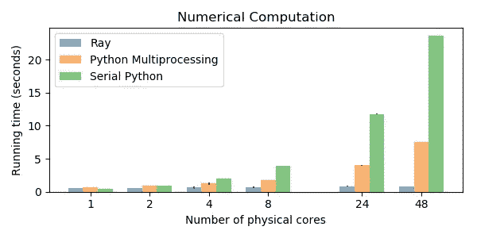
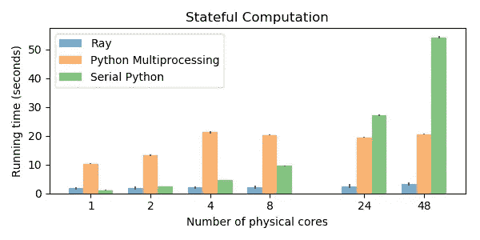
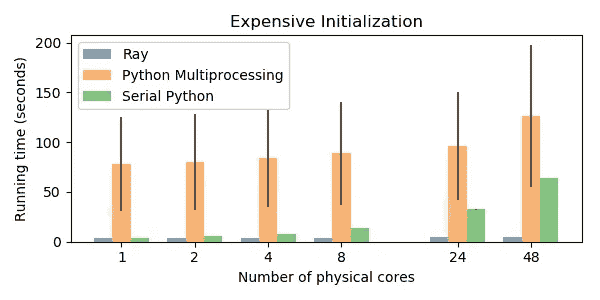

# 没有 Python 多重处理，并行 Python 速度快 10 倍

> 原文：<https://towardsdatascience.com/10x-faster-parallel-python-without-python-multiprocessing-e5017c93cce1?source=collection_archive---------0----------------------->

## 更快的 Python，无需重构代码

虽然 [Python 的多重处理库](https://docs.python.org/3/library/multiprocessing.html#module-multiprocessing)已经成功地用于广泛的应用程序，但在这篇博客文章中，我们发现它在几个重要的应用程序类别中表现不佳，包括数值数据处理、有状态计算和带有昂贵初始化的计算。有两个主要原因:

*   对数字数据的低效处理。
*   缺少有状态计算的抽象(例如，无法在独立的“任务”之间共享变量)。

[*Ray*](https://ray.io/) *是一个快速、简单的框架，用于构建和运行解决这些问题的分布式应用*。关于一些基本概念的介绍，请看[这篇博文](https://medium.com/@robertnishihara/modern-parallel-and-distributed-python-a-quick-tutorial-on-ray-99f8d70369b8)。Ray 利用 Apache Arrow 提供高效的数据处理，并为分布式计算提供 task 和 actor 抽象。

这篇博客文章对三个不容易用 Python 多处理表达的工作负载进行了基准测试，并比较了 [Ray](https://github.com/ray-project/ray) 、Python 多处理和串行 Python 代码。请注意[务必始终与优化的单线程代码](http://www.frankmcsherry.org/graph/scalability/cost/2015/01/15/COST.html)进行比较。

在这些基准测试中，[](https://ray.io/)**比串行 Python***快 10–30x，* ***比多处理快 5–25x****，比大型机器上的这两个*快 5–15x**。****

****

**On a machine with 48 physical cores, Ray is **9x** faster than Python multiprocessing and **28x** faster than single-threaded Python. Error bars are depicted, but in some cases are too small to see. Code for reproducing these numbers is available below. The workload is scaled to the number of cores, so more work is done on more cores (which is why serial Python takes longer on more cores).**

**基准测试使用 [m5 实例类型](https://aws.amazon.com/ec2/instance-types/m5/)在 EC2 上运行(m5.large 用于 1 个物理内核，m5.24xlarge 用于 48 个物理内核)。[运行所有基准测试的代码可从这里获得](https://gist.github.com/robertnishihara/2b81595abd4f50a049767a040ce435ab)。缩写片段包括在这篇文章中。主要区别在于，完整的基准测试包括 1)计时和打印代码，2)预热 Ray 对象存储的代码，以及 3)使基准测试适应较小机器的代码。**

# **基准 1:数字数据**

**许多机器学习、科学计算和数据分析工作负载大量使用大型数据阵列。例如，一个数组可能代表一个大型图像或数据集，应用程序可能希望有多个任务来分析该图像。高效处理数字数据至关重要。**

**下面 for 循环的每一遍使用 Ray 花费**0.84 秒**，使用 Python 多处理花费**7.5 秒**，使用串行 Python 花费**24 秒**(在 48 个物理核上)。这种性能差距解释了为什么可以在 Ray 上构建像 [Modin](https://github.com/modin-project/modin) 这样的库，而不能在其他库上构建。**

**用[射线](https://ray.readthedocs.io/en/latest/)看代码如下。**

**Code for a toy image processing example using Ray.**

**通过调用`ray.put(image)`，大数组被存储在共享内存中，并且可以被所有工作进程访问，而无需创建副本。这不仅适用于数组，也适用于包含数组的对象(如数组列表)。**

**当工人执行`f`任务时，结果再次存储在共享内存中。然后当脚本调用`ray.get([...])`时，它创建由共享内存支持的 numpy 数组，而不必反序列化或复制值。**

**这些优化之所以成为可能，是因为 Ray 使用了 [Apache Arrow](https://arrow.apache.org/) 作为底层数据布局和序列化格式，以及 [Plasma 共享内存对象存储](https://arrow.apache.org/docs/python/plasma.html)。**

**使用 [Python 多重处理](https://docs.python.org/3/library/multiprocessing.html)的代码如下所示。**

**Code for a toy image processing example using multiprocessing.**

**这里的区别是 Python 多处理在进程间传递大型对象时使用 pickle 来序列化它们。这种方法要求每个进程创建自己的数据副本，这增加了大量的内存使用和昂贵的反序列化开销，Ray 通过使用 [Apache Arrow](https://arrow.apache.org/) 数据布局和[零副本序列化](https://ray-project.github.io/2017/10/15/fast-python-serialization-with-ray-and-arrow.html)以及[等离子存储](https://arrow.apache.org/docs/python/plasma.html)来避免这种情况。**

# **基准 2:有状态计算**

**需要在许多小工作单元之间共享大量“状态”的工作负载是对 Python 多处理提出挑战的另一类工作负载。这种模式非常常见，我在这里用一个玩具流处理应用程序来说明它。**

****

**On a machine with 48 physical cores, Ray is **6x** faster than Python multiprocessing and **17x** faster than single-threaded Python. Python multiprocessing doesn’t outperform single-threaded Python on fewer than 24 cores. The workload is scaled to the number of cores, so more work is done on more cores (which is why serial Python takes longer on more cores).**

**状态通常封装在 Python 类中， [Ray](https://ray.readthedocs.io/en/latest/) 提供了一个 [actor 抽象](https://ray.readthedocs.io/en/latest/actors.html)，这样类就可以在并行和分布式环境中使用。相比之下，Python 多处理并没有提供并行化 Python 类的自然方法，因此用户经常需要在`map`调用之间传递相关状态。这种策略在实践中可能很难实现(许多 Python 变量不容易序列化),而且当它起作用时可能会很慢。**

**下面是一个玩具示例，它使用并行任务一次处理一个文档，提取每个单词的前缀，并在最后返回最常见的前缀。前缀计数存储在 actor 状态中，并根据不同的任务而变化。**

**这个例子用 Ray 的 **3.2s** ，Python 多处理的 **21s** ，串行 Python 的 **54s** (在 48 个物理核上)。**

**[射线](https://github.com/ray-project/ray)版本如下图。**

**Code for a toy stream processing example using Ray.**

**Ray 在这里表现得很好，因为 Ray 的抽象符合当前的问题。这个应用程序需要一种在分布式环境中封装和改变状态的方法，而 actors 符合这个要求。**

**[多重处理](https://docs.python.org/3/library/multiprocessing.html)版本如下。**

**Code for a toy stream processing example using multiprocessing.**

**这里的挑战是`pool.map`执行无状态函数，这意味着在一个`pool.map`调用中产生的任何变量，如果您想在另一个`pool.map`调用中使用，都需要从第一个调用中返回，并传递给第二个调用。对于小对象来说，这种方法是可以接受的，但是当需要共享大的中间结果时，传递它们的成本是令人望而却步的(注意，如果变量是在线程之间共享的，这就不正确了，但是因为它们是跨进程边界共享的，所以必须使用像 [pickle](https://docs.python.org/3/library/pickle.html) 这样的库将变量序列化为一个字节串)。**

**因为它必须传递如此多的状态，多处理版本看起来非常笨拙，最终只实现了比串行 Python 小的加速。实际上，您不会编写这样的代码，因为您不会使用 Python 多重处理进行流处理。相反，您可能会使用专用的流处理框架。这个例子表明 Ray 非常适合构建这样的框架或应用程序。**

**有一点需要注意，使用 Python 多处理有很多方法。在这个例子中，我们与`Pool.map`进行比较，因为它给出了最接近的 API 比较。在这个例子中，通过启动不同的进程并在它们之间设置多个[多重处理队列](https://docs.python.org/3/library/multiprocessing.html#exchanging-objects-between-processes)，应该可以获得更好的性能，但是这导致了复杂而脆弱的设计。**

# **基准 3:昂贵的初始化**

**与前面的例子相反，许多并行计算不一定需要在任务之间共享中间计算，但无论如何都会从中受益。当状态初始化代价很高时，甚至无状态计算也可以从共享状态中受益。**

**下面是一个例子，我们想从磁盘加载一个保存的神经网络，并用它来并行分类一堆图像。**

****

**On a machine with 48 physical cores, Ray is **25x** faster than Python multiprocessing and **13x** faster than single-threaded Python. Python multiprocessing doesn’t outperform single-threaded Python in this example. Error bars are depicted, but in some cases are too small to see. The workload is scaled to the number of cores, so more work is done on more cores. In this benchmark, the “serial” Python code actually uses multiple threads through TensorFlow. The variability of the Python multiprocessing code comes from the variability of repeatedly loading the model from disk, which the other approaches don’t need to do.**

**这个例子用 Ray 的 **5s** ，Python 多处理的 **126s** ，串行 Python 的 **64s** (在 48 个物理核上)。在这种情况下，串行 Python 版本使用许多内核(通过 TensorFlow)来并行化计算，因此它实际上不是单线程的。**

**假设我们已经通过运行以下代码创建了模型。**

**Code for saving a neural network model to disk.**

**现在，我们希望加载模型，并使用它来分类一堆图像。我们分批进行，因为在应用程序中，图像可能不会同时可用，图像分类可能需要与数据加载并行进行。**

**[射线](https://github.com/ray-project/ray)版本如下。**

**Code for a toy classification example using Ray.**

**加载模型非常慢，我们只想做一次。Ray 版本通过在 actor 的构造函数中加载一次模型来分摊成本。如果模型需要放在 GPU 上，那么初始化会更加昂贵。**

**多处理版本较慢，因为它需要在每次 map 调用中重新加载模型，因为映射的函数被假定为无状态的。**

**[多重处理](https://docs.python.org/3/library/multiprocessing.html)版本如下。请注意，在某些情况下，可以使用`initializer`到`multiprocessing.Pool`的参数来实现这一点。然而，这限于这样的设置，其中初始化对于每个过程是相同的，并且不允许不同的过程执行不同的设置功能(例如，加载不同的神经网络模型)，并且不允许不同的任务针对不同的工作者。**

**Code for a toy classification example using multiprocessing.**

**我们在所有这些例子中看到的是，Ray 的性能不仅仅来自于它的性能优化，还来自于拥有适合手头任务的抽象。有状态计算对许多应用程序都很重要，将有状态计算强制转换成无状态抽象是有代价的。**

# **运行基准测试**

**在运行这些基准测试之前，您需要安装以下软件。**

```
**pip install numpy psutil ray scipy tensorflow**
```

**然后[上面所有的数字都可以通过运行这些脚本来重现。](https://gist.github.com/robertnishihara/2b81595abd4f50a049767a040ce435ab)**

**如果你安装`psutil`有困难，那么尝试使用 [Anaconda Python](https://www.anaconda.com/distribution/#download-section) 。**

**最初的性能指标评测是在 EC2 上运行的，使用的是 m5 实例类型(1 个物理内核使用 m5.large，48 个物理内核使用 m5.24xlarge)。**

**为了使用正确的配置在 AWS 或 GCP 上启动一个实例，您可以使用[射线集群启动器](https://docs.ray.io/en/latest/cluster/cloud.html)并运行以下命令。**

```
**ray up config.yaml**
```

**这里提供的[就是一个`config.yaml`的例子](https://gist.github.com/robertnishihara/2b81595abd4f50a049767a040ce435ab#file-config-yaml)(用于启动一个 m5.4x 大型实例)。**

# **关于雷的更多信息**

**虽然这篇博客文章关注的是 [Ray](https://github.com/ray-project/ray) 和 Python 多处理之间的基准测试，但是苹果之间的比较是具有挑战性的，因为这些库不是非常相似。差异包括以下几点。**

*   **Ray 是为可伸缩性而设计的，可以在笔记本电脑和集群上运行相同的代码(多处理只能在单台机器上运行)。**
*   **Ray 工作负载会自动从机器和进程故障中恢复。**
*   **Ray 是以一种与语言无关的方式设计的，并且初步支持 [Java](https://github.com/ray-project/ray/tree/master/java) 。**

**更多相关链接在下面。**

*   **GitHub 上的[代码库。](https://github.com/ray-project/ray)**
*   **[射线文档](https://docs.ray.io/en/master/index.html)。**
*   **在[雷论坛](https://discuss.ray.io/)上提问。**
*   **Ray 包括用于[缩放强化学习](https://docs.ray.io/en/latest/rllib/index.html)、[缩放超参数调整](https://docs.ray.io/en/latest/tune/index.html)、[缩放模型服务](https://docs.ray.io/en/latest/serve/index.html)和[缩放数据处理](https://docs.ray.io/en/latest/data/dataset.html)的库。**
*   **Ray 包括一个[集群发射器](https://docs.ray.io/en/latest/cluster/cloud.html)用于在 AWS 和 GCP 上发射集群。**
*   **雷[网页](https://ray.io/)。**