# 数据科学家应该熟悉的 11 个评估指标——来自高级 Kagglers 新书的教训

> 原文：<https://towardsdatascience.com/11-evaluation-metrics-data-scientists-should-be-familiar-with-lessons-from-a-high-rank-kagglers-8596f75e58a7?source=collection_archive---------8----------------------->

## 《赢得 Kaggle 的数据分析技术》一书

## 是关于损失函数的，对吗？不，不是的。

Photo by [Andreas Wagner](https://unsplash.com/@waguluz_?utm_source=medium&utm_medium=referral) on [Unsplash](https://unsplash.com?utm_source=medium&utm_medium=referral)

这是一本新书*“赢得 Kaggle 的数据分析技术”*中介绍的技巧，由三位高级 Kaggle 作者撰写(不包括我自己，因此这不是个人推广！:) )

这本书的完整目录见我的[其他帖子](https://medium.com/@daydreamersjp/a-new-book-data-analysis-techniques-to-win-kaggle-is-a-current-best-and-complete-for-table-data-4af66a88388)。

# 目录:

## [评估指标与损失函数](#ad3e)

## [回归任务中使用的评估指标](#96c6)

[#1 — RMSE(均方根误差)](#a94a)

[#2 — RMSLE(均方根对数误差)](#5185)

[#3 —平均绝对误差](#2b4e)

[#4 — R 平方(R )](#ad72)

## [用于二进制分类任务中 0/1 预测的评估指标](#89e8)

[#5 —准确度和误差率](#c637)

[# 6——精度和召回](#a2e7)

[#7 — F1 分数和 Fbeta 分数](#0213)

[#8 — MCC(马修斯相关系数)](#9e24)

[#9 —平衡精度](#96e3)

[#10 —对数损失(或交叉熵或负对数似然)](#e1bc)

[#11 — AUCROC(受试者工作特性曲线下面积)](#bd6b)

# 评估指标与损失函数

*评估指标*，这个帖子的一个主题，对于 ML 初学者来说，是一个与另一个相关但独立的概念*损失函数*有些混淆的概念。它们在某种意义上是相似的，当我们足够幸运时，它们可能是相同的，但这不会每次都发生。

> *评估度量*是通过建模过程“我们想要”最小化或最大化的度量，而*损失函数*是通过模型训练“模型将”最小化的度量。

Photo by [AbsolutVision](https://unsplash.com/@freegraphictoday?utm_source=medium&utm_medium=referral) on [Unsplash](https://unsplash.com?utm_source=medium&utm_medium=referral)

举一个简单逻辑回归的例子:

*   **损失函数**是模型将在训练中最小化的量。它也被称为成本函数或目标函数。逻辑回归的非常基本的版本使用[负对数似然](#e1bc)作为损失函数。搜索模型的参数以最小化负对数似然性是在训练模型时完成的事情。
*   **评估指标**是我们希望模型最大化的指标。它独立于模型培训流程，并且*理想情况下，评估指标应该反映我们的业务需求*。根据业务应用，我们可能希望最大化 [AUC](#bd6b) ，或者我们可能关心[召回](#a2e7)有多好。

损失函数与模型紧密相关，通常模型具有损失函数候选的限制性列表，例如，逻辑回归的[ *负对数似然、带惩罚项的负对数似然][*]，因为损失函数的选择是模型算法创建者核心决定的一部分。

另一方面，评估指标可以是我们想要设置的任何值。最终，我们可以将“1”用于任何模型，尽管使用通用的“1”作为评估指标从来没有意义。评估指标有多高通常由训练中未使用的数据来衡量，如折叠外数据或测试数据。

评估分数广泛用于超参数调整，但对于更有经验的数据科学人员来说，理解损失函数和评估度量的区别的最有用的案例之一是**提前停止**。早期停止是一种通常用于确定何时停止训练的技术，以避免在增强类型的模型或神经网络类型的模型中过拟合。

> [提前停止]
> 
> 当模型基于**损失函数**的最小化来调整参数时，检查一次迭代对**评估度量**的改善程度，如果没有更多改善，则停止学习。

在 Kaggle 中，比赛参与者按“排行榜分数”进行排名。排行榜分数有两种类型，公开和私人，但这是另一个故事。排行榜分数可以归类为竞赛主持人为满足其业务目标或需求而设定的评估指标。

> 那么，了解评价得分，以及如何通过模型训练使其最大化，应该是赢得 Kaggle 比赛的一条道路。

所以，现在你明白了评价指标和损失函数的区别。接下来，我们将进一步了解常见的评估指标及其属性。

Photo by [Tierra Mallorca](https://unsplash.com/@tierramallorca?utm_source=medium&utm_medium=referral) on [Unsplash](https://unsplash.com?utm_source=medium&utm_medium=referral)

# 回归任务中使用的评估指标

## #1 — RMSE(均方根误差)

*(用于 Kaggle 比赛*[*【Elo 商家类别推荐】*](https://www.kaggle.com/c/elo-merchant-category-recommendation/overview/evaluation) *)*

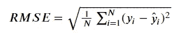

Formula of RMSE

*   当假设误差是正态分布时，RMSE 有相当于最大似然法的解。因此，当 y 的分布在一些基础结构周围是正态分布时是有利的。
*   RMSE 对异常值很敏感。因此，预先裁剪或移除异常值是很重要的。

## #2 — RMSLE(均方根对数误差)

*(用于 Kaggle 竞赛中的* [*招募餐厅访客预测*](https://www.kaggle.com/c/recruit-restaurant-visitor-forecasting/overview/evaluation)*)*

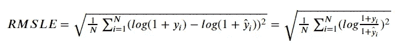

Formula of RMSLE

*   当 y 具有长尾分布，或者我们对真实值和预测值的比值感兴趣时，使用 RMSLE。
*   当 y 为零时，增加 1 以避免发散。

## #3 —平均绝对误差

*(用于 Kaggle 竞赛中)* [*Allstate 索赔严重程度*](https://www.kaggle.com/c/allstate-claims-severity/overview/evaluation)*)*

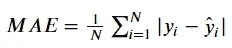

Formula of MAE

*   与 RMSE 相比，对异常值稳健。
*   在真 y =预测 y 处不是二阶可微的，因此 xgboost 等一些算法不允许 MAE 作为损失函数。
*   代替 MAE，诸如“公平函数”或“伪 Huber 函数”的近似函数可能是可用的。

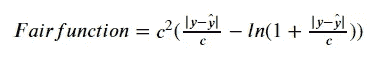

Fair Function

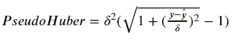

Pseudo-Huber Function

另见[这张由 Ioannis Dassios](https://www.researchgate.net/figure/On-the-left-a-comparison-between-the-1-norm-the-Huber-and-the-Pseudo-Huber-function-and_fig1_329477768) 发布的 MAE 与 Fair 函数和 Pseudo-Huber 函数的对比图。

## #4 — R 平方(R)

*(用于 Kaggle 比赛】* [*奔驰更环保制造*](https://www.kaggle.com/c/mercedes-benz-greener-manufacturing/overview/evaluation)*)*

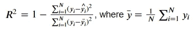

Formula of R-Squared

*   0≤R ≤1(通常情况下，但在一些最坏的情况下，您会看到负值)，R 越高越好，这意味着预测更接近数据。
*   分母不依赖于预测，并且一旦设定数据就固定不变。因此，**最大化 R 等价于最小化 RMSE** 。

Photo by [Riccardo Pallaoro](https://unsplash.com/@ricpalla?utm_source=medium&utm_medium=referral) on [Unsplash](https://unsplash.com?utm_source=medium&utm_medium=referral)

# 二元分类任务中 0/1 预测的评价指标

## #5 —精确度和误差率

*(用于 Kaggle 竞赛中的* [*文字规范化挑战——英语*](https://www.kaggle.com/c/text-normalization-challenge-english-language/overview/evaluation)*)*

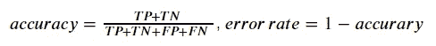

Formula of Accuracy and Error Rate

在这里，两个字母的字母表当然来自混淆矩阵。

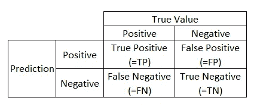

Confusion Matrix

*   **NG 用于不平衡数据**因为预测一切为正或为负的非常糟糕的模型很容易破解不平衡数据中的高精度。
*   **对于不平衡数据，使用 F1-score、Fbeta-score、MCC 或稍后介绍的平衡精确度**。

## #6 —精确度和召回率

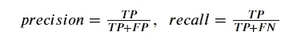

Formula of precision and recall

*   精确度和召回率分别表示混淆矩阵中第一水平行或第一垂直列上 TP 的比例。
*   介于 0 和 1 之间，越高越好。
*   当截止点(=根据概率确定预测是 0 还是 1 的阈值)移动时，精确度和召回率会向相反的方向移动。
*   **与正负互换**是不对称的，这意味着当我们改变哪个称之为“正”(无论 y=1 还是 0)时，精度和召回率都会改变。

## #7 — F1 分数和 Fbeta 分数

*(用于 Kaggle 比赛中)* [*Quora 言不由衷问题分类*](https://www.kaggle.com/c/quora-insincere-questions-classification/overview/evaluation)*)*

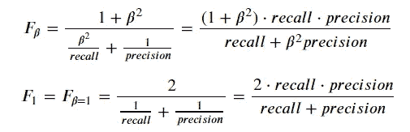

Formula of F1-Score and Fbeta-Score

*   它被称为精确度和召回率的“调和平均值”。
*   介于 0 和 1 之间，越高越好。
*   Fbeta-score 可以改变查全率和查准率之间的平衡，当 **β < 1 加权到查准率，β > 1 加权到查全率**。当我们更喜欢一个而不是另一个时，可能会有用，就像医学诊断通常更喜欢假阳性而不是假阴性，因为前者只会带来额外的成本，而后者会带来晚期治疗并可能导致死亡。
*   同样，**这些对于正负互换来说是不对称的**，就像精度和召回也不是一样。

## #8 — MCC(马修斯相关系数)

*(用于 Kaggle 竞赛的* [*博世生产线性能*](https://www.kaggle.com/c/bosch-production-line-performance/overview/evaluation)*)*

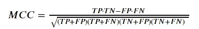

Formula of MCC

*   取-1 和 1 之间的值，越高越好。0 表示预测等同于随机。
*   最后，**这是对称正反互换！**

## #9 —平衡的精度

平衡精度是可用于二元分类和多类分类的度量。

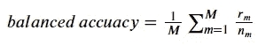

Formula of balanced accuracy

其中，M:类别数，n_m:数据大小属于类别 M，r_m:准确预测属于类别 M 的数据数。

这里，如果问题是二进制分类，

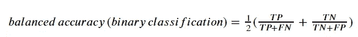

Balanced accuracy when binary classification

*   适用于多类分类和二类分类。
*   介于 0 和 1 之间的值，越高越好。
*   对较小类别的准确预测赋予较高的权重，因此**适用于不平衡数据**。

Photo by [Denys Nevozhai](https://unsplash.com/@dnevozhai?utm_source=medium&utm_medium=referral) on [Unsplash](https://unsplash.com?utm_source=medium&utm_medium=referral)

# 二元分类任务中概率预测的评价指标

## #10 —对数损失(或交叉熵或负对数可能性)

*(用于 Kaggle 比赛中的* [*Quora 问题对*](https://www.kaggle.com/c/quora-question-pairs/overview/evaluation)*)*

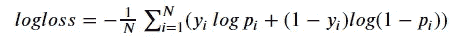

Formula of logloss

*   分类中常见的嫌疑人。
*   这是*损失*并且越高越糟糕。
*   当 p_i 较低而 y_i=1 时，意味着不是好的概率预测，或者相反，logloss 变高。
*   在许多模型的损失函数中也很常见。

## #11 — AUCROC(受试者操作特征曲线下的面积)

*(用于 Kaggle 竞赛中)* [*家庭信用违约风险*](https://www.kaggle.com/c/home-credit-default-risk/overview/evaluation)*)*

这通常也称为 AUC，但为了避免与 AUCPR(精确召回曲线下面积)混淆，我坚持使用 AUCROC。

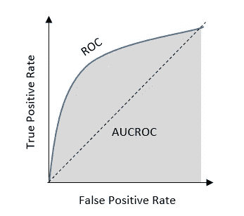

Illustration of AUCROC and ROC

*   从 0 到 1 的值。0.5 表示预测相当于随机的。
*   分类中的另一个常见疑点，但只针对二元分类而非多类分类。
*   与基尼系数的关系如下。AUCROC 的最大化相当于基尼系数的最大化。

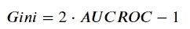

Relation with Gini and AUCROC

*   可以用以下形式等价地表示:

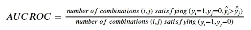

Alternative representation of AUCROC

*   因此，**只有预测概率的顺序与**有关，这意味着当四个记录的概率为[0.1，0.3，0.7，0.9]或[0.01，0.02，0.3，0.99]时，AUCROC 是相同的，只要顺序保持不变。
*   与原始定义相比，这种替代表示更容易知道模型预测改进对分数改进有多大贡献。
*   在不平衡数据的情况下(例如，正数据是小类到负数据)，正小类数据的概率始终很高对于 AUCROC 很重要，而负大类数据的概率对噪声不敏感。

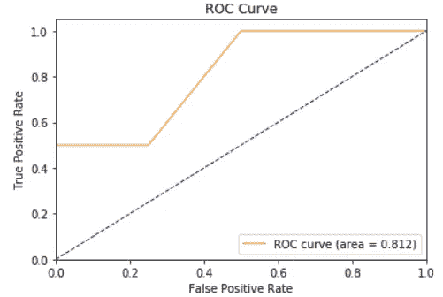

ROC curve and AUCROC visualized by code

Photo by [Kelly Sikkema](https://unsplash.com/@kellysikkema?utm_source=medium&utm_medium=referral) on [Unsplash](https://unsplash.com?utm_source=medium&utm_medium=referral)

# 结论

在 Kaggle 内部和外部，评估指标有许多可能的选择。每个评估指标都有它们的属性，当我们优化它们或者选择正确的评估指标时，理解它们的行为是很重要的。

在另一篇帖子中，我将讨论我们在多类分类和推荐中使用的评估指标，我们还将找到优化评估指标的技巧，同时通过最小化损失函数来调整模型。