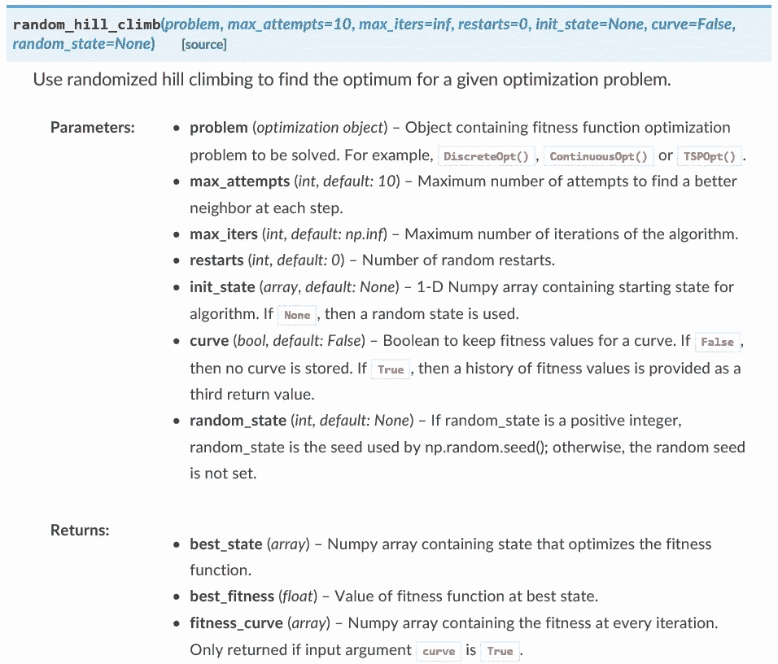

# 生产质量数据科学代码的 12 个步骤

> 原文：<https://towardsdatascience.com/12-steps-to-production-quality-data-science-code-35ae2f868003?source=collection_archive---------8----------------------->


有一个呆伯特漫画，呆伯特告诉他的老板，他不能接管一个同事的软件项目，除非他花一周时间唱衰这个同事的现有代码。如果你曾经接手维护过别人的代码，你会立刻发现其中的真相。

没有人喜欢接手维护或处理别人的代码。在最好的情况下，你会面临几个小时或几天的时间试图弄清楚前一个程序员在做某些决定时在想什么——即使代码被很好地注释了。

在最坏的情况下，你最终会盯着糟糕的代码看，以至于你开始考虑换一份职业来逃避它。

有一次，我从一位最近退休的同事那里继承了一段 40 多页的 SAS 代码，其中有太多的死角、不必要的变量，并且注释掉了一些垃圾，当我清理完之后，最终的代码还不到两页长。五年过去了，我仍然没有完全从那次经历中恢复过来。

我怀疑编写没有人会抱怨的代码是不可能的。然而，*有可能将代码中人们可以抱怨的事情的数量保持在最少。*

# 数据科学家甚至需要写好代码吗？

如果你的代码要投入生产，那么它应该是“生产质量”的。

进入“生产”的含义因工作而异，但是为了本文的目的，让我们将生产代码定义为一项工作的最终版本，它将使用真实数据在生产服务器上运行，或者作为一项分析的证据。

根据这一定义，以下是生产代码的所有示例:

*   包含在 Jupyter 笔记本最终版本中的代码详细描述了一项分析；
*   用于生成自动化月度报告或执行自动化数据提取/争论的代码；
*   用于运行机器学习管道或位于管道顶部的应用程序的最终版本的代码；和
*   用于以编程语言(如 Python 或 r)创建包的代码。

这些都是数据科学家经常需要执行的任务的示例，尽管大多数数据科学家并不参与软件工程，并且都是数据科学家生成的代码通常需要在未来共享和维护的情况。

因此，代码的最高质量是非常重要的。即“生产-质量”。

生产质量代码应该是:

*   可读；
*   没有错误；
*   对异常具有鲁棒性；
*   高效；
*   有据可查；和
*   可复制。

如果您想查看生产质量代码的示例，请查看您最喜欢的 Python 包的 GitHub 存储库(例如， [scikit-learn](https://github.com/scikit-learn/scikit-learn) 或 [NumPy](https://github.com/numpy/numpy/tree/master/numpy) )。但是，如何让您的代码达到产品质量标准呢？

下面是我在开发自己的 Python 包 [mlrose](https://github.com/gkhayes/mlrose) 时使用的 12 个步骤。

# 第一步:确定你想要达到的目标

在你写一行代码之前，先弄清楚*为什么*你要写这些代码。你希望实现什么？也就是你的代码的*目标*是什么？

如果你正在进行一项分析，你试图回答什么研究问题？

如果你正在建立一个机器学习模型，你希望产生什么样的输出，一旦你得到它们，你打算用它们做什么？

如果你正在为一种编程语言编写一个包，你希望这个包有什么功能？

一旦你得到了这个问题的答案，让你可能与之合作的任何客户或利益相关者来运行它，以确保每个人都在同一页上，并且你不会花费你生命中的几天/几周/几个月来生产实际上不想要的东西。

当每个人(或者至少是大多数人)都同意的时候，就是开始的时候了。

# 步骤 2:构建一个最小可行的产品

编写一段代码，实现您在步骤 1 中确定的目标。不要管它长什么样，也不要管它有没有效率。你的目标只是产生一段工作代码，做你想让它做的事情。您将在这个过程的后续步骤中提高代码的质量。

如果在实现第一步目标的过程中有任何问题，在你对代码投入太多时间之前，这是你想要识别它们(并解决它们)的地方。

# 第三步:减少重复

将 DRY(不要重复你自己)软件开发原则应用到你的代码中。

DRY 原则的目标是最大限度地减少代码中的重复，以使代码更具可读性，更易于维护，并降低出错的风险。

实践中应用 DRY 原理的最常见方式是通过函数的创建。如果您不止一次地编写本质上相同的代码段，请将其转换为一个或多个函数(理想情况下，每个函数应该只做一件事)。

例如，应用 DRY 原则，您可以重写:

```
import math 
area2 = math.pi*2**2 
area5 = math.pi*5**2 
area7 = math.pi*7**2 
area10 = math.pi*10**2
```

作为:

```
import math def circle_area(radius): 
    return math.pi*radius**2 area2 = circle_area(2) 
area5 = circle_area(5) 
area7 = circle_area(7) 
area10 = circle_area(10)
```

函数名和变量名可以重复多次。这是你不想重复的功能背后的逻辑。

# 步骤 4:创建单元测试

对于代码中的每个函数，编写一个或多个测试，以确保它在一系列不同的环境下做它应该做的事情。这样的测试被称为“单元测试”,它们可以像你希望的那样简单或复杂。

当编写我自己的单元测试时，我通常会想出足够简单的例子，我可以用手/计算器/Microsoft Excel 确定函数输出，然后围绕它们编写单元测试。

例如，对于步骤 3 中给出的 circle_area()函数，这可能涉及检查 circle_area(2)实际上是否输出 12.56637，以及 circle_area(0)是否输出 0。

在 Python 中，可以使用 unittest 包来自动化这些测试。

若要通过 unittest 包运行单元测试，请创建一个类，并将单元测试编写为位于该类中的方法(即函数)。例如，要测试 circle_area()函数，您可以编写:

```
import unittest class TestFunctions(unittest.TestCase): 
    def test_circle_area2(self): 
        assert abs(circle_area(2) - 12.56637) < 0.0001 def test_circle_area0(self): 
        assert circle_area(0) == 0 unittest.main(argv=[''], verbosity=2, exit=False)
```

在这个例子中，我将我的测试类命名为“TestFunctions”，但是如果这个类有 unittest，您可以随意命名它。TestCase 作为其父类。

在这个类中，我创建了两个单元测试，一个测试 circle_area()对半径 2 的作用，另一个测试半径 0 的作用。这些函数的名称并不重要，除了它们必须以 test_ 开头并带有参数 self。

代码的最后一行运行测试。

假设所有的测试都通过了，您的输出看起来会像这样，每一个已经通过的测试的顶行上都有一个点。

```
..
------------------------------------------------------------------
Ran 2 tests in 0.000sOK
```

或者，如果您的一个测试失败了，那么输出的顶行将为每个失败的测试包含一个“F ”,并且将提供进一步的输出，给出失败的细节。

```
F. ====================================================================FAIL: test_circle_area0 (__main__.TestFunctions) 
--------------------------------------------------------------------Traceback (most recent call last): 
    File "D:/Documents/Unit_Test_Examples.py", line 13, in test_circle_area0 
    assert circle_area(0) == 1 
AssertionError --------------------------------------------------------------------Ran 2 tests in 0.000s FAILED (failures=1)
```

如果您使用 Python 脚本编写代码(即。py 文件)，理想情况下，您应该将您的单元测试放在一个单独的测试文件中，将它们与您的主代码分开。但是，如果您使用 Jupyter 笔记本，您可以将单元测试放在笔记本的最后一个单元格中。

一旦你创建了你的单元测试并让它们工作，每当你对你的代码做任何(显著的)改变时，重新运行它们是值得的。

# 第五步:处理异常

当你写一个函数的时候，你通常期望函数参数只取某一类型或某一范围内的值。例如，在前面描述的 circle_area()函数中，隐含地假设参数输入将是非负整数或浮点数。

但是如果有人试图使用不属于预期类型或者不在预期范围内的参数值来运行函数，该怎么办呢？

最好的情况是，您的代码会出错，但是错误消息可能不清楚。

最坏的情况是，您的代码将运行并产生一个无意义的结果，您当时可能没有意识到这是无意义的，从而导致后续的流动问题。

为了解决这个问题，您可以在函数中添加异常测试，以检查参数输入是否符合预期，如果不符合，则输出定制的错误消息。

例如，我们可以扩展 circle_area()函数，以包含异常测试来验证 radius 的值是整数还是浮点数(第一个 if 语句)以及非负数(第二个 if 语句)。

```
def circle_area(radius): 
    if not isinstance(radius, int) and not isinstance(radius, float): 
        raise Exception("""radius must be an integer or float.""") if radius < 0: 
        raise Exception("""radius must be non-negative.""")    return math.pi*radius**2
```

如果某个参数值未通过异常测试，将打印异常消息(作为 exception()的参数给出),代码将停止。

# 第六步:最大化效率

仅仅拥有可读且没有错误的代码是不够的(尽管，这是一个好的开始)，您还希望它在时间和空间上都是高效的。毕竟，如果你的代码运行 27 年都没有错误，或者占用的空间超过了你电脑的内存，这真的有关系吗？

因此，有必要检查一下你的代码，看看有没有什么方法可以让它运行得更快或者占用更少的空间。

就 Python 而言，已经有很多关于性能优化的文章。然而，根据我的经验，简单地检查代码并使用 NumPy 对任何 for 循环进行矢量化，就足以显著提高代码的时间效率。这是因为很多 NumPy 是用 C 编写的，而且 C 是一种比 Python 快得多的语言。

例如，考虑对包含十亿个 1 的向量求和的问题，我们尝试用两种不同的方法来解决这个问题，第一种方法使用 For 循环，第二种方法使用 NumPy sum()函数。

```
import numpy as np 
import time x = np.ones(1000000000) # For loop version 
t0 = time.time() total1 = 0 for i in range(len(x)): 
    total1 += x[i] t1 = time.time()

print('For loop run time:', t1 - t0, 'seconds') # Numpy version 
t2 = time.time() total2 = np.sum(x) t3 = time.time() print('Numpy run time:', t3 - t2, 'seconds')
```

使用 for 循环，这个问题需要 275 秒(超过 4 . 5 分钟)才能解决。然而，使用 NumPy sum 函数，运行时间减少到 15.7 秒。也就是说，for 循环花费的时间是 NumPy 求和的 17.5 倍。

```
For loop run time: 275.49414443969727 seconds 
Numpy run time: 15.738749027252197 seconds
```

# 第七步:让名字有意义

你有没有读过这样的代码，其中每个变量都有一个类似“x”或“temp”的名字(更糟糕的是，变量名在整个代码中被重新定义和重用，只是为了最大限度地混淆)？

我见过这样的代码，我被迫猜测变量的定义，然后保留这些定义的手写列表，以便遵循代码。这并没有说明代码的可读性。

您可以通过检查您的代码并用更具描述性的替代名称替换任何无意义的变量或函数名称来解决这个问题。

例如，您可以重写:

```
def area(l, w):
    return l*w
```

作为:

```
def rectangle_area(length, width): 
    return length*width
```

# 第八步:对照风格指南进行检查

编码风格指南是一个文档，它列出了特定编程语言的所有编码约定和最佳实践。在 Python 中，风格指南是[PEP 8——Python 代码风格指南](https://www.python.org/dev/peps/pep-0008/),其中包括以下建议:

*   "将所有行限制在 79 个字符以内；"
*   函数名应该小写，单词之间用下划线分隔，以提高可读性和
*   “谨慎使用行内注释……行内注释是不必要的，事实上，如果它们陈述的是显而易见的事情，会分散注意力。”

PEP 8 是一个 27 页的文档，所以确保你的代码符合每一项可能是一件苦差事。幸运的是，有一些工具可以帮助你做到这一点。

如果您将代码编写为 Python 脚本，flake8 包将检查是否符合 PEP 8。

安装这个包(使用 pip install flake8)后，只需导航到包含您要检查的代码的文件夹，并在命令提示符下运行以下命令:

```
flake8 filename.py
```

输出将告诉您代码不符合的确切位置。

例如，此输出告诉我们 Python 脚本 Production_Examples.py 包含 8 个不合规的实例。第一个实例位于第 2 行第 1 列，其中包“numpy”已导入但未使用:

```
Production_Examples.py:2:1: F401 'numpy as np' imported but unused Production_Examples.py:66:1: E302 expected 2 blank lines, found 1 Production_Examples.py:76:14: E261 at least two spaces before inline comment 
Production_Examples.py:76:15: E262 inline comment should start with '# ' 
Production_Examples.py:79:1: E302 expected 2 blank lines, found 1 Production_Examples.py:86:1: W293 blank line contains whitespace Production_Examples.py:93:1: W293 blank line contains whitespace Production_Examples.py:96:1: E305 expected 2 blank lines after class or function definition, found 1
```

在 Jupyter 笔记本中，有几个扩展可以确保符合 PEP 8，包括 [jupyterlab-flake8](https://www.npmjs.com/package/jupyterlab-flake8) 和 [jupyter-autopep8](https://github.com/kenkoooo/jupyter-autopep8) 。

# 第九步:确保再现性

再现性意味着不同的东西，这取决于你试图执行的任务。

如果你开发的代码是定期由他人运行的(例如，定期报告或机器学习管道背后的代码)，那么可再现性就意味着建立一个你可以维护和他人可以利用的代码的主副本。例如，为您的项目创建一个 GitHub 存储库。

但是，如果您正在执行一项分析，那么您希望他人能够复制的不仅仅是您的分析背后的代码，还有您的分析的确切结果，这样您基于该分析做出的任何声明都可以得到独立的验证。

许多统计和机器学习过程涉及某种程度的随机化。例如，将数据集随机分成训练和测试子集，或者许多机器学习算法的随机优化方面。

这意味着每次重新运行这些流程时，即使输入数据完全相同，也会产生稍微不同的输出。

通过在程序开始时设置随机种子(例如，在 Python 中可以使用 NumPy np.random.seed()函数)，或者在任何涉及随机化的算法中作为参数(例如，许多 Python scikit-learn 函数为此包含可选的 random_state 参数)，可以避免这种情况。

这将保证，只要程序的输入保持不变，输出将总是相同的。

# 步骤 10:添加注释和文档

为所有函数、类和方法编写 docstrings，并添加块注释或行内注释(即以#开头的注释),以澄清代码中用途不明显的部分。

大多数程序员已经熟悉并使用了块注释和行内注释，如下例所示:

```
# This is a block comment 
def test_function(x): y = x + 5 # This is an inline comment 
    return y
```

但是，docstrings 不太常用。

docstring 是一个函数(或类或方法)的概要，用三重引号括起来。它通常包括以下内容(尽管最后两项是可选的):

*   对该功能的简要描述(一行)；
*   每个函数参数的描述(包括它们的预期类型和任何默认值)；和
*   每个函数输出的描述(包括类型)。

例如，我们的 circle_area()函数的 docstring(为了便于说明，我对它做了一些修改)可能如下所示:

```
def circle_area(radius=1): 
    """Calculate the area of a circle with a given radius. 
    Parameters 
    ---------- 
    radius: float, default: 1 
        The radius of the circle. Must be non-negative.     Returns 
    ------- 
    area: float 
        The area of the circle. 
    """ 
    area = math.pi*radius**2     return area
```

这个 docstring 示例中使用的格式约定是特意选择来与 Python sphinx 包集成的。

Sphinx 通常用于创建 Python 包的文档，并且已经用于创建许多流行包的文档，包括 NumPy、NLTK 和 scikit-learn)，并且可以将文档字符串转换成各种格式的文档，包括 HTML、pdf 和 ePub。

下面是一个使用 sphinx 创建的文档示例:



它还与 GitHub 和 [ReadtheDocs](https://readthedocs.org/) (一个文档托管平台)集成，这样每当您的代码更新被推送到 GitHub 时，您的文档就会自动重建，确保您的文档始终保持最新。

# 步骤 11:请求代码评审

如果你和其他程序员在一个环境中工作，那么在部署你的工作之前，你应该总是要求进行代码审查。除了能够发现代码中可能存在的任何错误之外，您还可以就各种问题向审阅者寻求反馈，包括:

*   你的文档有多清晰；
*   单元测试的覆盖率；
*   他们是否能看到你可能忽略的效率提升空间；和
*   你的代码是否达到了你最初的目标。

但是，如果你还处于职业生涯的早期，还没有在编程团队中工作，该怎么办呢？

您可以采用一些替代方法来审查您的代码，包括:

*   与处于类似或更高级编程生涯阶段的朋友分享你的代码，并要求他们评审你的代码(潜在地，作为交换，你在将来的某个时间评审他们的代码)；
*   利用在线论坛，用户可以从其他用户那里请求代码反馈，包括[代码评审栈交换](https://codereview.stackexchange.com/)和评审子条目: [/r/codereview/](https://www.reddit.com/r/codereview/) 、 [/r/reviewmycode/](https://www.reddit.com/r/reviewmycode/) 和[/r/critiquemycode/](https://www.reddit.com/r/CritiqueMyCode/)；或者
*   如果你真的绝望了，没有其他选择，把你的代码放在一边一段时间(比如一个月)，然后当你有时间忘记更好的细节时再回来，进行你自己的回顾。

这一步是开发过程中最重要的部分之一，因为通过代码评审，你将学会成为一名更好的程序员。

# 步骤 12:部署

一旦您完成了前面的所有步骤，您的代码就可以部署了。这并不意味着你的代码不会再次改变。这仅仅意味着你创作了一部作品，它的水准足以让你自豪。

事实上，一旦人们开始使用你的代码，或者它的输出，几乎可以肯定他们会带来你从未想过的改进，或者检测出你完全忽略的错误。

预计到这一点，现在安排一段时间到未来的一到六个月，在那里您将再次回顾您的代码，并整合您在部署后不可避免地收到的任何反馈。

一位名叫约翰·f·伍兹的智者曾经说过:

> “总是把维护你的代码的人当成一个知道你住在哪里的暴力精神病患者来编码。”

我之前从其他不知道如何编写产品级代码的程序员那里继承了代码，对此我完全同意。但是，即使你的生活不依赖于你的代码质量，产生高质量的代码也应该是一件值得骄傲的事情。

就像你不会把自己写的充满拼写或语法错误的报告交给老板或同事一样，你也不应该分享一段不符合某些最低编码标准的代码。

这就是成为一名专业数据科学家的意义所在。

*Genevieve Hayes 博士是数据科学家、教育家和人工智能及分析专家，拥有*[*Genevieve Hayes Consulting*](https://www.genevievehayes.com/)*。你可以在*[*LinkedIn*](https://www.linkedin.com/in/gkhayes/)*或者*[*Twitter*](https://twitter.com/genevievekhayes)*上关注她。她还是* [*价值驱动数据科学*](https://www.genevievehayes.com/episodes/) *的主持人，这是一个每月两次的播客，面向希望最大化其数据和数据团队价值的企业。*

*想要发掘企业数据的价值，但不知道从哪里开始？**[***下载免费的数据科学项目发现指南。***](https://www.genevievehayes.com/discovery-guide/)*