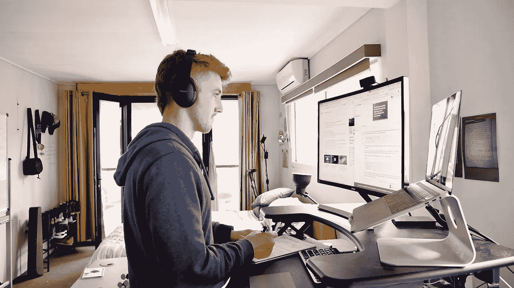
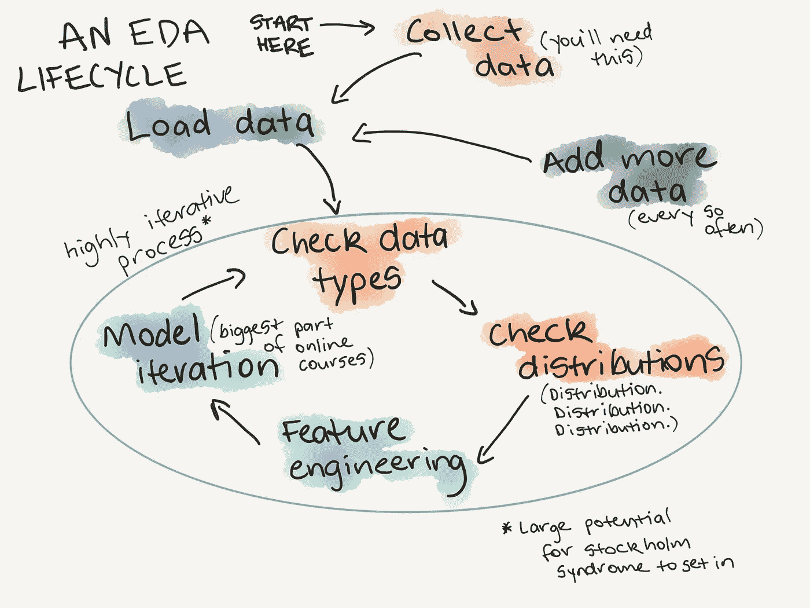

# 我作为机器学习工程师的第一年学到的 12 件事

> 原文：<https://towardsdatascience.com/12-things-i-learned-during-my-first-year-as-a-machine-learning-engineer-2991573a9195?source=collection_archive---------0----------------------->

## 成为你自己最大的怀疑者，尝试不可行的事情的价值，以及为什么沟通问题比技术问题更难。

The workstation, the home office and the art studio. Photo by the author.

机器学习和数据科学都是广义的术语。一位数据科学家的工作可能与另一位大相径庭。机器学习工程师也是如此。常见的是利用过去(数据)了解或预测(建立模型)未来。

为了将下面的观点放在上下文中，我将解释我的角色是什么。

我们有一个小型的机器学习咨询团队。从数据收集到操作，从模型构建到服务部署，你能想到的每个行业，我们都做到了。所以每个人都戴着许多帽子。

过去时是因为我已经离开了我作为机器学习工程师的角色，开始从事自己的业务。我为此制作了一个视频。

# 我的一天是什么样子的

上午 9 点，我会走进去，说早上好，把我的食物放在冰箱里，倒一杯咖啡，走到我的办公桌前。然后我会坐下来，看着前一天的笔记，打开松弛的部分。我会阅读消息，打开团队分享的论文或博客帖子的链接，会有一些，这个领域发展很快。

一旦信息被清除，我会浏览报纸和博客帖子，阅读那些留下的。通常有一些事情*可能*对我正在做的事情有所帮助。阅读需要一个小时，有时更长，这取决于它是什么。

为什么这么久？

阅读是终极元技能，如果有更好的方法来做我正在做的事情，我可以通过学习和实施它来节省时间和精力。

现在是上午 10 点。

如果截止日期临近，阅读会被缩短以推进项目。这是一天中最大的一块去了。我会回顾前一天的工作，检查我的记事本记录下接下来的步骤。

我的记事本是流动的日志。

“我已经将数据处理成正确的形状，现在我需要在模型中运行它，我将在开始时保持简短的训练，然后在取得进展时加快训练。”

如果我被困住了。

“出现了数据不匹配的情况。下一步将是在尝试新模式之前，修复组合匹配并获得基线。”

大部分时间都在确保数据处于可以建模的形式。

下午 4 点左右，是时候开始放松了。收尾工作包括清理我创建的混乱代码，使其清晰易读，添加注释，重组。如果别人不得不读这个呢？这是我想问的问题。通常是我。令人惊讶的是，一连串的想法很快就被遗忘了。

到了下午 5 点，我的代码出现在 GitHub 上，第二天的笔记出现在我的记事本上。

这是理想的一天，但不是每天。有时候，在下午 4:37，你会有一个美好的想法突然出现在你的脑海中，并遵循它。

现在你已经对每天发生的事情有了一个大概的了解，我们来具体说说。

# 1.它总是关于数据

如果你熟悉一些数据科学的基本原则，这似乎是老生常谈了。但令人惊讶的是我经常会忘记。太多时候，你会专注于构建一个更好的模型，而不是改进你正在构建的数据。

建立一个更大的模型和使用更多的计算能力可以提供令人兴奋的短期结果。然而，走了足够多的捷径，你最终会走捷径。

当第一次参与一个项目时，要花大量的时间来熟悉数据。我说不正常，是因为通常你不得不把你的第一次估计乘以 3。从长远来看，这会节省你的时间。

这并不意味着你不应该从小处着手。我们会谈到这一点。

对于任何新的数据集，你的目标应该是成为主题专家。检查分布，找到不同种类的特征，异常值在哪里，为什么是异常值？如果你不能讲述一个关于你正在处理的数据的故事，你怎么能期望你的模型呢？

An example exploratory data analysis lifecycle (what you’ll do every time you encounter a new dataset). More on this in [A Gentle Introduction to Exploratory Data Analysis](/a-gentle-introduction-to-exploratory-data-analysis-f11d843b8184).

# 2.沟通问题比技术问题更难

我遇到的大多数主要障碍都不是技术性的，而是交流性的。当然，总会有技术挑战，但解决技术挑战是工程师的职责。

永远不要低估内部和外部沟通的重要性。没有什么比解决一个错误的技术挑战更糟糕的了。

这是怎么发生的？

从外部来看，这是客户所追求的与我们能提供的不匹配，而是机器学习能提供的不匹配。

在内部，由于许多人身兼数职，很难确保每个人都有相同的目标。

这些挑战并非独一无二。机器学习看起来很神奇。在某些情况下的确如此。但如果事实并非如此，承认这一点很重要。

你如何修理它？

触底。定期。你的客户明白你能提供什么吗？你了解你客户的问题吗？他们明白机器学习能提供什么，不能提供什么吗？你可以用什么有用的方式来交流你的发现？

内部呢？

你可以根据试图解决内部沟通问题的软件工具的数量来判断这个问题有多难。Asana，吉拉，Trello，Slack，Basecamp，周一，微软团队。

我发现的最有效的方法之一是在一天结束时在相关的项目频道中进行简单的消息更新。

## **更新:**

*   3-4 分
*   关于我所做的
*   为什么

## *接下来:*

*   基于以上，我下一步要做的是

完美吗？不。但它似乎起作用了。这给了我一个机会，让我反思自己做了什么，想做什么，还有公开的额外好处，这意味着如果我的工作看起来不成功，可能会受到批评。

无论你是一名多么优秀的工程师，你保持和获得新业务的能力都与你传达你的技能及其带来的好处的能力相关。

# 3.稳定>最先进(总体而言)

我们有一个天生的语言问题。将文本分类成不同的类别。目标是让用户向服务发送一段文本，并让它自动分类到两个类别中的一个。如果模型对预测不自信，将文本传递给人类分类器。负载大约是每天 1000-3000 个请求。不庞大，也不小。

伯特曾是今年的热门人物。但是如果没有 Google scale compute，用 BERT 训练一个模型来做我们需要的事情需要太多的按摩。这还是在投入生产之前。

相反，我们使用了另一种方法， [ULMFiT，](https://arxiv.org/abs/1801.06146)，这种方法在理论上不是最先进的，但仍然产生了足够多的结果，而且更容易操作。

运送有用的东西比坐在你努力追求完美的东西上提供更多的价值。

# 4.机器学习的两个缺口

将机器学习付诸实践有两个缺口。从课程工作到项目工作的差距，以及从笔记本中的模型到生产中的模型(模型部署)的差距。

在互联网上搜索机器学习课程会返回大量结果。我用它们中的许多创造了[我自己的人工智能硕士学位](https://bit.ly/AIMastersDegree)。

但即使在完成了许多最好的课程之后，当我开始成为一名机器学习工程师时，我的技能也是建立在课程的结构化主干之上的。事实上，项目不是结构化的。

我缺乏具体的知识。课程中无法教授的技能。如何质疑数据，探索什么与利用什么。

> 特定知识:不能在课程中教授但可以学习的技能。

解决方法是什么？

我很幸运能和澳大利亚最优秀的人才在一起。但我也愿意学习，愿意犯错。当然，犯错不是目标，但是为了正确，你必须找出错在哪里。

如果你正在通过一门课程学习机器学习，那么继续学习这门课程，但是通过[在自己的项目中工作](/how-to-start-your-own-machine-learning-projects-4872a41e4e9c)将你所学的东西付诸实践，用特定的知识武装自己。

部署呢？

我还是不擅长这个。但是我注意到了一个趋势。机器学习工程和软件工程正在融合。有了像[塞尔顿](https://www.seldon.io/)、[库伯弗洛](https://www.kubeflow.org/)和[库伯内特斯](https://kubernetes.io/)这样的服务，机器学习很快就会成为堆栈的另一部分。

在 Jupyter 笔记本上建立一个模型是一回事，但是你如何让成千上万甚至数百万人使用这个模型呢？从最近在云原生事件上的演讲来看，大公司之外没有多少人知道如何做到这一点。

# 5.20%的时间

我们有一个规则。20%的时间。这意味着我们 20%的时间可以用来学习。事物是一个松散的术语，意思是机器学习世界中的事物。有很多。

这不止一次被证明是非常宝贵的。超过 BERT 的 ULMFiT 使用率是 20%时间的结果。

20%的时间意味着 80%将花在核心项目上。

*   80%在核心产品上(机器学习专业服务)。
*   20%用于与核心产品相关的新事物。

它并不总是像这样分裂，但它是一个很好的目标。

如果你的商业优势是在你现在做的事情上做到最好，那么未来的商业取决于你继续在你做的事情上做到最好。这意味着不断学习。

# 6.十分之一的论文被阅读，很少被使用

这是一个粗略的指标。但是探索任何数据集或现象，你很快就会发现它无处不在。是[齐夫定律](https://en.wikipedia.org/wiki/Zipf%27s_law)或者[普赖斯定律](https://en.wikipedia.org/wiki/Price%27s_model)，其中一个，都和我差不多。普莱斯定律表明，一半的出版物来自所有作者数量的平方根。

换句话说，在每年成千上万的投稿中，你可能会有 10 篇开创性的论文。在这 10 篇开创性的论文中，有 5 篇可能来自同一个机构或同一个人。

外卖？

你不可能跟上每一个新的突破。最好是把基本原理的基础打牢，并加以应用。这些经历了时间的考验。原始突破新突破指的是。

但是随之而来的是探索与开发的问题。

# 7.做你自己最大的怀疑者

你可以通过成为自己最大的怀疑者来处理探索与开发的问题。

探索与利用的问题是在尝试新事物和重新应用已有成果之间的两难选择。

## 剥削

很容易运行一个你已经使用过的模型，得到一个高精度的数字，然后作为一个新的基准向团队报告。但是如果你得到了一个好的结果，记得检查你的工作，一次又一次，让你的团队也这样做。你成为工程师兼科学家是有原因的。

## 探测

20%的时间有助于此。但 70/20/10 可能效果更好。也许你花 70%在核心产品上，20%在构建核心产品上，10%在兼职上，这些事情可能不会(也可能不会)奏效。

我从未在我的角色中练习过这个，但这是我正在努力的方向。

# 8.玩具问题第一件事起作用

玩具问题管用。尤其是为了帮助理解一个新概念。建造一些小东西。它可能是您的数据的一个小子集，也可能是不相关的数据集。

在一个小团队中，诀窍是让一些东西发挥作用，然后快速迭代。

# 9.橡皮鸭

罗恩教我这个。如果你困在一个问题上，坐着盯着代码可能会解决它，但可能不会。相反，与队友用语言交流。假装他们是你的橡皮鸭。

> “罗恩，我试图循环这个数组，在循环另一个数组的同时跟踪状态，然后我想把这些状态组合成一个元组列表。”
> 
> “循环中的循环？你为什么不把它矢量化呢？”
> 
> “我能做到吗？”
> 
> “让我们看看。”

# 10.从头开始构建的模型正在衰落(或者至少你不需要它们开始)

这又回到了机器学习工程与软件工程融合的问题上。

除非您的数据问题非常具体，否则许多主要问题都非常相似:分类、回归、时间序列预测、建议。

谷歌和微软的 AutoML 等服务正在让世界一流的机器学习对每个可以上传数据集和选择目标变量的人开放。时间还早，但它们的势头正在迅速增强。

在开发人员方面，你有像 [fast.ai](https://github.com/fastai/fastai) 这样的库，可以用几行代码提供最先进的模型，还有各种模型动物园(一个预建模型的集合)，像 [PyTorch hub](https://pytorch.org/hub) 和 [TensorFlow hub](https://www.tensorflow.org/hub) 提供同样的服务。

这意味着什么？

仍然需要了解数据科学和机器学习的基本原理。但是知道如何将它们应用于您的问题更有价值。

现在，你的基线没有理由不接近最先进的水平。

# 11.数学还是代码？

对于我处理的客户端问题，我们都是先编写代码的。所有的机器学习和数据科学代码都是 Python 编写的。有时我会通过阅读一篇论文并复制它来涉猎数学，但是 99.9%的时间，现有的框架已经涵盖了数学。

这并不是说数学是不必要的，毕竟，机器学习和深度学习都是应用数学的形式。

至少知道矩阵操作，一些线性代数和微积分，特别是链规则对从业者来说已经足够好了。

请记住，我的目标不是发明一种新的机器学习算法，而是向客户展示机器学习对他们的业务有(或没有)的潜力。

**边注:**在这篇文章的美好时机，fast.ai 刚刚发布了一门新课程，[从基础开始的深度学习](https://www.fast.ai/2019/06/28/course-p2v3/)，它从头开始讲述深度学习的数学和代码。它是为像我这样熟悉应用深度学习和机器学习，但缺乏数学背景的人设计的。为了解决这个问题，我正在浏览它，它立即被添加到我最喜欢的机器学习和数据科学资源列表中。有了坚实的基础，你可以建立自己的艺术状态，而不是重复以前的。

# 12.你去年做的工作明年可能会无效

这是已知的。并且由于软件工程和机器学习工程的融合而变得更加如此。

但这是你报名参加的。

什么保持不变？

框架会变，库会变，但底层的统计、概率、数学，这些东西没有截止日期(新的 fast.ai 课程甚至更好的时机)。

最大的挑战仍然是:你如何应用它们。

# 现在怎么办？

可能有更多，但 12 个足够了。

在 Max Kelsen 工作是我做过的最好的工作。问题很有趣，但人们更好。我学到了很多。

离开不是一个容易的选择，但我决定用我学到的东西来检验自己。你会发现我站在健康、科技和艺术的十字路口，并在 YouTube 上直播。

如果您有任何问题，[我的 Twitter DM 已开通](https://bit.ly/mrdbourketwitter)或[订阅我的时事通讯，了解我的最新动态](http://www.mrdbourke.com/newsletter)。