# 非数学家多臂 Bandit 问题的 13 种解决方案

> 原文：<https://towardsdatascience.com/13-solutions-to-multi-arm-bandit-problem-for-non-mathematicians-1b88b4c0b3fc?source=collection_archive---------9----------------------->

## 非数学家(比如我)多臂 bandit 问题的简单解决方案。

GIF from this [website](https://giphy.com/gifs/upvote-machine-upvotegifs-4eQFLKTo1Tymc)

**简介**

问题很简单，我们有一个有 n 个手臂的老虎机。我们对哪只手臂可以拉的试验次数有限，我们也不知道哪只手臂会给我们最多的钱。

假设概率分布不随时间变化(意味着这是一个平稳问题)…

> 我们应该拉哪只胳膊？我们应该拉过去给我们最多奖励的那只手臂，还是应该探索，希望得到更好的手臂？

这个问题有多种解决方案，通常，人们衡量后悔是为了给每个解决方案排名。(遗憾==简单地说，我们因为没有拉最佳臂而得到的惩罚量。).因此，为了减少遗憾，我们只需拉起最有可能给我们奖励的手臂。

但我想看看额外的测量，具体来说，我还会考虑每个算法对每个臂的概率分布估计得有多好。(他们给我们奖励的概率)。在更小的范围内，我们只有 12 只手臂，在更大的范围内，我们有 1000 只手臂。

最后，这篇文章的目的是为非数学家(比如我)提供每个解决方案的简单实现。因此，理论保证和证明没有讨论，但我提供了不同的链接，为人们谁希望更深入地研究这个问题。

下面是我们将要比较的方法列表…..

***1)矢量化
2)贪婪
3)e-贪婪
4)衰变 e-贪婪
5)线性奖励不作为(追踪方法)
6)线性奖励惩罚(追踪方法)
7)置信上限
8)置信上限调谐
9)汤普森采样(贝塔分布)
10)汤普森采样(均匀分布)
11)神经网络
12)玻尔兹曼探索(Softmax)【12】***

## 1.矢量化

请注意，这个方法实际上不是一个解决方案。多臂土匪问题背后的想法是如何在勘探和开发之间取得最佳平衡。

在这里，我们只是计算每只手臂能得到多少奖励，然后除以我们拉每只手臂的次数。(因此直接计算获得奖励的百分比。)

我只是想展示一个简单的方法来估计概率分布。

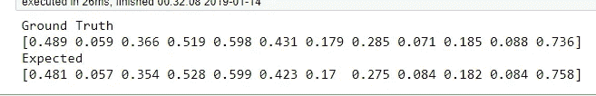

## 2. ***贪婪***

在这里，我们的策略是拉给我们最大回报的手臂。但是，最开始的问题是，我们不知道每个手臂的概率是如何分布的。

所以我决定通过从均匀分布初始化我们的估计分布来给出一些“信息性的”先验。(我猜这可能与“最佳初始化方案”有点关系，但这不是我的意图，在全零之前初始化我们也可以。).

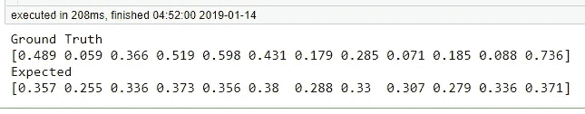

## 3.贪婪的

类似的概念，贪婪的方法，但有一些概率ε，我们探索和选择一个随机土匪，而不是选择手臂，我们认为有最高的概率。

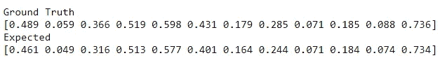

## 4.腐败贪婪

与 e-Greedy 方法的想法完全相同，但我们在这里慢慢降低ε。(我们探索的概率)。因此，随着时间的推移，这种方法将完全相同的贪婪方法。

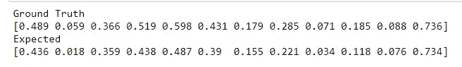

## 5.线性奖励无为(追求法)

追踪方法背后的一般思想是保持对盗匪的明确策略，并使用经验方法更新它们。开始时，概率分布是统一初始化的(意味着每个手臂都有同等的机会被选中)，但随着时间的推移，分布会发生变化。

因为对于追踪方法，估计值被归一化为和为 1，所以为了公平比较，重新调整可能是合适的。

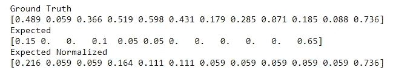

## 6.线性奖励惩罚(追踪法)

线性奖励惩罚扩展了线性奖励不作为背后的思想，在某种程度上，如果我们没有得到奖励，我们也在惩罚手臂。

对于线性奖励惩罚和不作为，我的朋友迈克尔写了一篇更详细的博文。

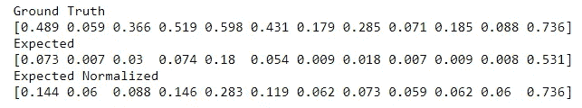

## 7. ***置信上限 1***

简而言之，UCB 遵循一个简单的原则，即“乐观面对不确定性”。理解这个概念的另一种方式是更喜欢拉得不太频繁的那只手臂，因此我们对那只手臂不太确定。(更多信息请阅读这篇[博文](https://lilianweng.github.io/lil-log/2018/01/23/the-multi-armed-bandit-problem-and-its-solutions.html)或观看这段[视频](https://www.youtube.com/watch?time_continue=24&v=fIKkhoI1kF4)。).

这种方法很有吸引力，因为它有强有力的理论保证。

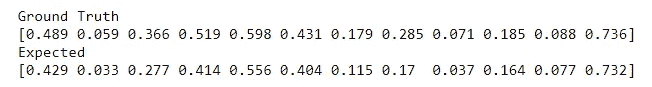

## 8.置信上限 1 已调整

在他们提出 UCB1 的同一篇论文中，Auer，Cesa-Bianchi & Fisher 提出了 UCB1-Tuned 算法。有趣的是，这个算法给出了更好的经验结果，但是作者自己不能给出理论上的后悔界限。

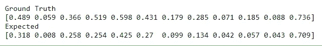

## 9. ***【汤普森抽样(贝塔分布)***

这种方法是一种贝叶斯推理方法，在这种方法中，我们在每条臂上都有一组先验分布，当我们观察到我们从每条臂获得了多少奖励时，我们就更新我们的后验分布。

有关此方法的更多信息，请点击[此处](https://eigenfoo.xyz/bayesian-bandits/)或[此处](https://peterroelants.github.io/posts/multi-armed-bandit-implementation/)。

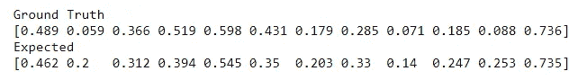

## 10.汤普森抽样(均匀分布)

请注意，这种方法纯粹是为了娱乐。均匀分布不是在伯努利分布到[之前的](https://en.wikipedia.org/wiki/Bernoulli_distribution)[共轭分布。我只是想尝试一下这种方法，总的来说，与贝塔分布相比，均匀分布倾向于探索更多。](https://en.wikipedia.org/wiki/Conjugate_prior)

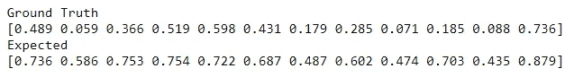

## 11.神经网络

这种方法也是为了娱乐目的，它没有任何理论上的保证。看了这篇[博文，很受启发。](https://www.michaelpacheco.net/blog/RL-multi-armed-bandit-3)不同的是，我使用了 KL 散度作为目标函数，并使用了 Adam 优化器。

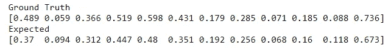

## 12. ***【玻尔兹曼探索(Softmax)***

Softmax 方法以与其平均奖励成比例的概率挑选每只手臂。因此，如果一只手臂给予较大的奖励，它被选中的概率就较高。

与这种方法相关的一个有趣的想法是，我们有一个控制探索程度的温度参数。

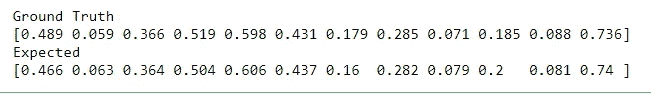

## 13.渐变强盗

梯度土匪使用梯度上升，以找到最佳的手臂拉。简而言之，我们有一个称为平均奖励的变量，它跟踪奖励的平均值，直到某个时间 t。如果我们拉的强盗给出的奖励高于平均值，我们就增加武器被选中的概率，反之亦然。

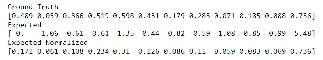

**实验/讨论**

执行两组实验
1)小:12 个强盗，20 集，每集 1000 次迭代
2)大:1000 个强盗，500 集，每集 1500 次迭代

> 小的

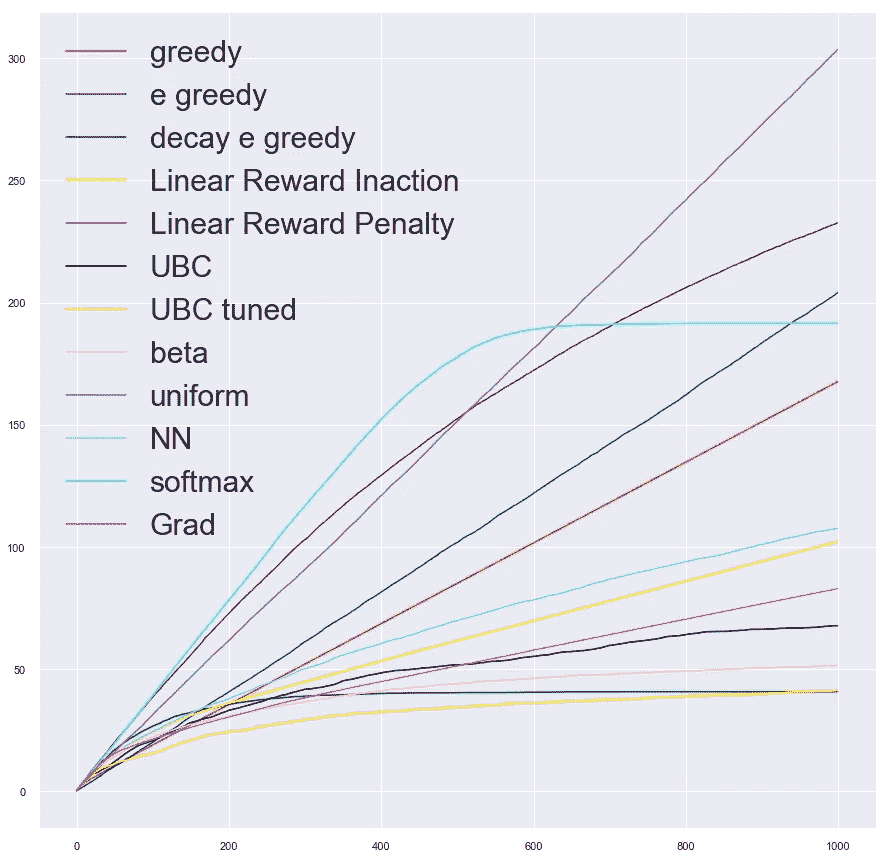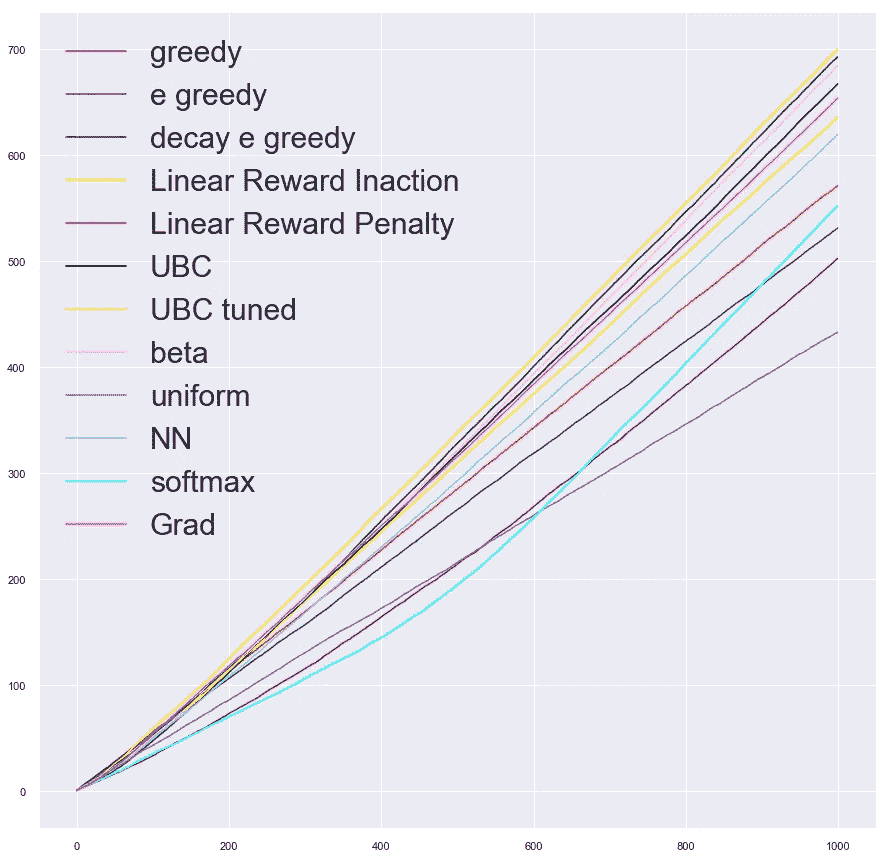

**左图** →每种方法一段时间后的遗憾
**右图** →每种方法一段时间后的累计奖励

当方法的后悔在对数时间内增长时，它被认为是对 bandit 问题的一种解决方案。从上面的图中，我们可以看到 UCB1 优化后的结果是最佳的。

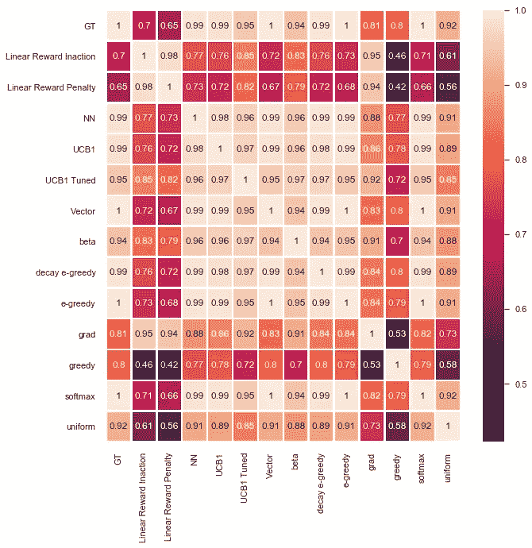

然而，当我们查看地面真实概率分布之间的相关矩阵时，我们可以看到 e-greedy 和 softmax 策略具有一对一的相关性。(向量方法不被认为是一种解决方案。).

> 大的

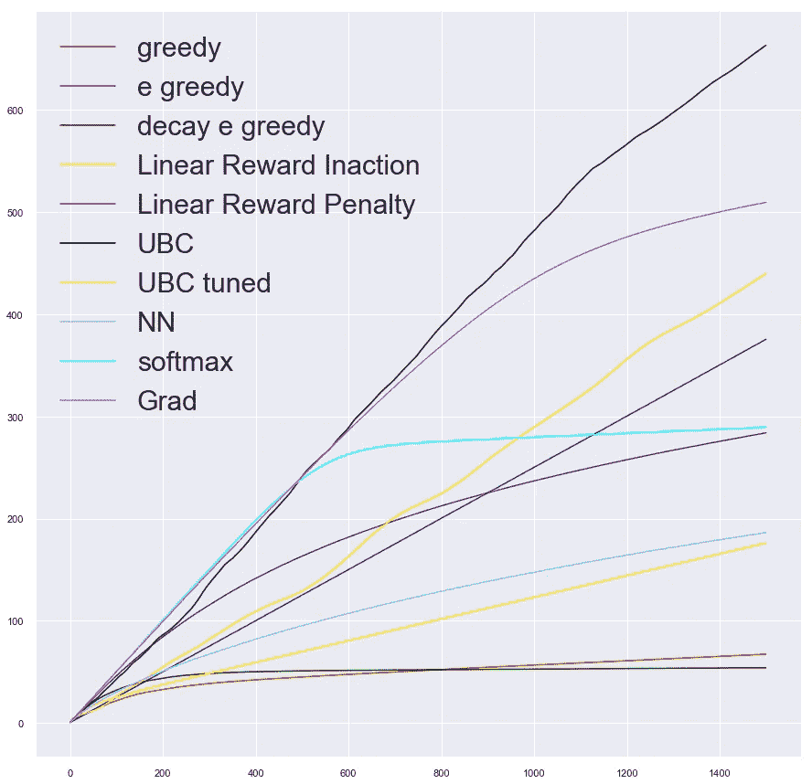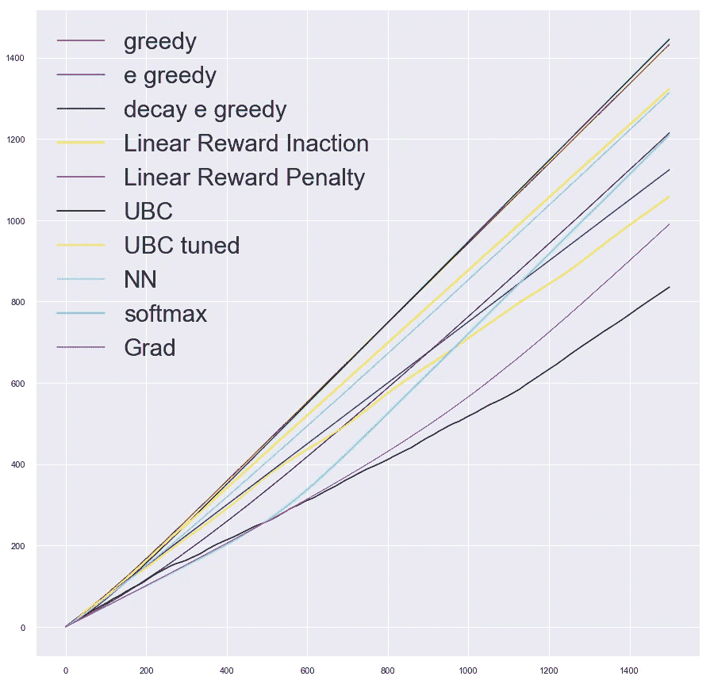

从上面可以看到一个非常令人惊讶的结果，我们可以马上注意到简单的方法，如贪婪和衰减贪婪方法能够胜过更先进的解决方案。(取样方法要花很多时间。)

看到神经网络方法表现良好，我感到非常惊讶。

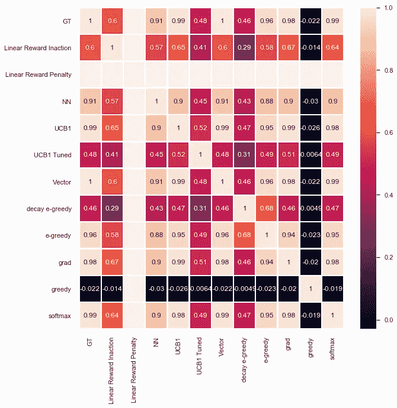

但是当涉及到估计 1000 个臂的概率分布时，我们可以看到 softmax 和 UCB1 方法给出了最精确的估计。

无论是在大型实验还是小型实验中，衰减贪婪方法似乎都是整体最优的解决方案。

**交互代码**

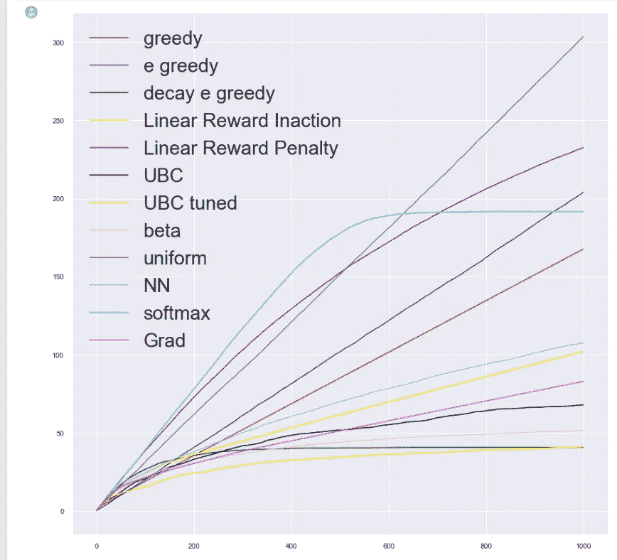

要获取更小实验的代码，请点击[这里](https://colab.research.google.com/drive/1k0CCyHZ2-KdLTLfUxom01mQiJwffHqy7)或[这里](https://github.com/JaeDukSeo/Daily-Neural-Network-Practice-2/blob/master/reinforcement_learning/bandit/z%20bandit%20blog%20.ipynb)。

要访问更大实验的代码，请点击[此处](https://colab.research.google.com/drive/1cHAs8BKEoP5viaSjeHawOZmC8YdrkS-E)或[此处](https://github.com/JaeDukSeo/Daily-Neural-Network-Practice-2/blob/master/reinforcement_learning/bandit/z%20bandit%20blog%20large.ipynb)。

**最后的话**

这个简单的问题仍在研究中，因此，存在许多更先进的解决方案，如需进一步阅读，请阅读这篇[博文。](http://banditalgs.com/)

从这篇[论文](https://www.cs.mcgill.ca/~vkules/bandits.pdf?fbclid=IwAR0zRTBvxp0Eam47JTABWDodxJtPcm8QtIID04RBfsaZATWFTkJeXMywQR4)中还可以看出，在传统的多臂 bandit 问题中，简单的策略(如 e-greedy 方法)可以胜过更先进的方法，并且在现实生活的临床试验中也能给出有竞争力的结果。

虽然理论上的保证非常重要，但令人惊讶的是，观察到其他更简单的方法也能得到更好的结果。

更多文章请访问我的[网站](https://jaedukseo.me/)。

**参考**

1.  (2019).Www-anw.cs.umass.edu。检索于 2019 年 1 月 13 日，来自[http://www-anw . cs . umass . edu/~ barto/courses/cs 687/Chapter % 202 . pdf](http://www-anw.cs.umass.edu/~barto/courses/cs687/Chapter%202.pdf)
2.  翁，L. (2018)。多臂土匪问题及其解决方案。lilian Weng . github . io . 2019 年 1 月 13 日检索，来自[https://lilian Weng . github . io/lil-log/2018/01/23/the-multi-armed-bandit-problem-and-its-solutions . html](https://lilianweng.github.io/lil-log/2018/01/23/the-multi-armed-bandit-problem-and-its-solutions.html)
3.  用多臂 Bandit 进行强化学习。(2018).ITNEXT。检索于 2019 年 1 月 13 日，来自[https://it next . io/reinforcement-learning-with-multi-arm-bandit-decf 442 e 02d 2](https://itnext.io/reinforcement-learning-with-multi-arm-bandit-decf442e02d2)
4.  多臂 Bandit 强化学习(下)。(2018).ITNEXT。检索于 2019 年 1 月 13 日，来自[https://it next . io/reinforcement-learning-with-multi-arm-bandit-part-2-831 a 43 f 22 a 47](https://itnext.io/reinforcement-learning-with-multi-arm-bandit-part-2-831a43f22a47)
5.  ankonzoid/LearningX。(2019).GitHub。检索于 2019 年 1 月 13 日，来自[https://github . com/ankonzoid/learning x/blob/master/classic _ RL/MAB/mab . py](https://github.com/ankonzoid/LearningX/blob/master/classical_RL/MAB/MAB.py)
6.  迈克尔·帕切科。(2019).Michaelpacheco.net。检索于 2019 年 1 月 13 日，来自[https://www.michaelpacheco.net/blog/RL-multi-armed-bandit-2](https://www.michaelpacheco.net/blog/RL-multi-armed-bandit-2)
7.  迈克尔·帕切科。(2019).Michaelpacheco.net。检索于 2019 年 1 月 13 日，来自[https://www.michaelpacheco.net/blog/RL-multi-armed-bandit-3](https://www.michaelpacheco.net/blog/RL-multi-armed-bandit-3)
8.  多武装匪徒。(2013).数据折纸。检索于 2019 年 1 月 13 日，来自[https://data origami . net/blogs/nappin-folding/79031811-multi-armed-土匪](https://dataorigami.net/blogs/napkin-folding/79031811-multi-armed-bandits)
9.  多臂土匪实现。(2019).peterroelants . github . io . 2019 年 1 月 13 日检索，来自[https://peterroelants . github . io/posts/multi-armed-bandit-implementation/](https://peterroelants.github.io/posts/multi-armed-bandit-implementation/)
10.  (2019).Cs.mcgill.ca 检索于 2019 年 1 月 13 日，来自[https://www.cs.mcgill.ca/~vkules/bandits.pdf](https://www.cs.mcgill.ca/~vkules/bandits.pdf)
11.  用多臂 Bandit 进行强化学习。(2018).ITNEXT。检索于 2019 年 1 月 13 日，来自[https://it next . io/reinforcement-learning-with-multi-arm-bandit-decf 442 e02d 2](https://itnext.io/reinforcement-learning-with-multi-arm-bandit-decf442e02d2)
12.  ankonzoid/LearningX。(2019).GitHub。检索于 2019 年 1 月 13 日，来自[https://github . com/ankonzoid/learning x/tree/master/classical _ RL/MAB](https://github.com/ankonzoid/LearningX/tree/master/classical_RL/MAB)
13.  迈克尔·帕切科。(2019).Michaelpacheco.net。检索于 2019 年 1 月 13 日，来自 https://www.michaelpacheco.net/blog/RL-multi-armed-bandit-3
14.  试用编辑器 3.6 版(2019)。W3schools.com。检索于 2019 年 1 月 13 日，来自[https://www.w3schools.com/html/tryit.asp?filename = try html _ lists _ intro](https://www.w3schools.com/html/tryit.asp?filename=tryhtml_lists_intro)
15.  bgalbraith/土匪。(2019).GitHub。检索于 2019 年 1 月 13 日，来自[https://github . com/bgalbraith/bottoms/blob/master/bottoms/policy . py](https://github.com/bgalbraith/bandits/blob/master/bandits/policy.py)
16.  (2019).Www-anw.cs.umass.edu。检索于 2019 年 1 月 13 日，来自[http://www-anw . cs . umass . edu/~ barto/courses/cs 687/Chapter % 202 . pdf](http://www-anw.cs.umass.edu/~barto/courses/cs687/Chapter%202.pdf)
17.  bgalbraith/土匪。(2019).GitHub。检索于 2019 年 1 月 13 日，来自[https://github . com/bgalbraith/bottoms/blob/master/bottoms/policy . py](https://github.com/bgalbraith/bandits/blob/master/bandits/policy.py)
18.  脱落神经网络(带 ReLU)。(2019).要点。检索于 2019 年 1 月 14 日，来自[https://gist.github.com/yusugomori/cf7bce19b8e16d57488a](https://gist.github.com/yusugomori/cf7bce19b8e16d57488a)
19.  NumPy . minimum—NumPy 1.15 版手册。(2019).Docs.scipy.org。检索于 2019 年 1 月 14 日，来自[https://docs . scipy . org/doc/numpy-1 . 15 . 1/reference/generated/numpy . minimum . html](https://docs.scipy.org/doc/numpy-1.15.1/reference/generated/numpy.minimum.html)
20.  matplotlib.pyplot，h .，& P，B. (2011 年)。如何用 matplotlib.pyplot 改变图例大小.堆栈溢出？检索于 2019 年 1 月 14 日，来自[https://stack overflow . com/questions/7125009/how-to-change-legend-size-with-matplotlib-py plot](https://stackoverflow.com/questions/7125009/how-to-change-legend-size-with-matplotlib-pyplot)
21.  seaborn . heat map-seaborn 0 . 9 . 0 文档。(2019).Seaborn.pydata.org。检索于 2019 年 1 月 14 日，来自[https://seaborn.pydata.org/generated/seaborn.heatmap.html](https://seaborn.pydata.org/generated/seaborn.heatmap.html)
22.  error，h .，& Cunningham，P. (2015)。热图 Seaborn fmt='d '错误。堆栈溢出。检索于 2019 年 1 月 14 日，来自[https://stack overflow . com/questions/31087613/heat-map-seaborn-fmt-d-error](https://stackoverflow.com/questions/31087613/heat-map-seaborn-fmt-d-error)
23.  皮奥特博士和洛杉矶大学(2017 年)。pivot 中 seaborn 热图的数据顺序。堆栈溢出。检索于 2019 年 1 月 14 日，来自[https://stack overflow . com/questions/43694368/data-order-in-seaborn-heat map-from-pivot](https://stackoverflow.com/questions/43694368/data-order-in-seaborn-heatmap-from-pivot)
24.  热图公司(2017 年)。自动调整 seaborn 热图中的字体大小。堆栈溢出。检索于 2019 年 1 月 14 日，来自[https://stack overflow . com/questions/33104322/auto-adjust-font-size-in-seaborn-heat map](https://stackoverflow.com/questions/33104322/auto-adjust-font-size-in-seaborn-heatmap)
25.  (2019).Homes.di.unimi.it 于 2019 年 1 月 14 日检索，来自[https://homes.di.unimi.it/~cesabian/Pubblicazioni/ml-02.pdf](https://homes.di.unimi.it/~cesabian/Pubblicazioni/ml-02.pdf)
26.  共轭先验。(2019).En.wikipedia.org。检索于 2019 年 1 月 14 日，来自[https://en.wikipedia.org/wiki/Conjugate_prior](https://en.wikipedia.org/wiki/Conjugate_prior)
27.  强盗算法。(2018).强盗算法。检索于 2019 年 1 月 14 日，来自[http://banditalgs.com/](http://banditalgs.com/)