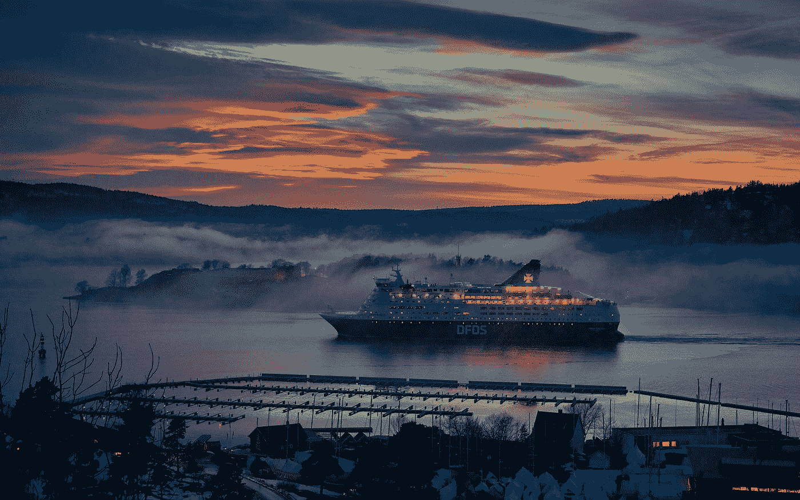
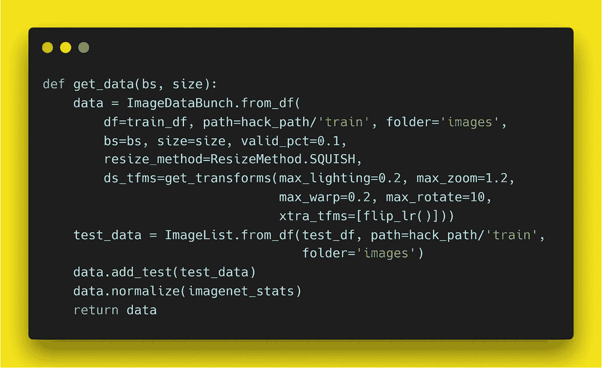

# 深度学习游戏的第 9 名解决方案/方法/旅程:计算机视觉黑客马拉松

> 原文：<https://towardsdatascience.com/13th-place-solution-approach-journey-for-game-of-deep-learning-computer-vision-hackathon-1d39fd16099e?source=collection_archive---------21----------------------->

## [由 Analytics Vidhya 主办](https://datahack.analyticsvidhya.com/contest/game-of-deep-learning/)

Photo by [Vidar Nordli-Mathisen](https://unsplash.com/@vidarnm?utm_source=medium&utm_medium=referral) on [Unsplash](https://unsplash.com?utm_source=medium&utm_medium=referral)

## 问题陈述

船舶或船只探测在海事安全、渔业管理、海洋污染、国防和海事安全、防止海盗、非法移民等领域具有广泛的应用。

牢记这一点，政府海事和海岸警卫队机构正计划部署基于计算机视觉的自动化系统，以仅从测量船拍摄的图像中识别船舶类型。你被聘为顾问，为这个项目建立一个高效的模型。

需要检测的船只分为以下 5 类:

## 数据集描述

在训练中有 6252 幅图像，在测试数据中有 2680 幅图像。数据集中的船舶类别及其对应的代码如下-

Categories of ships and their corresponding codes

*   提供了三个文件，即 train.zip、test.csv 和 sample_submission.csv，其结构如下。

Variable Definition

*   train.zip 包含对应于训练集和测试集的图像，以及 train.csv 中训练集图像的真实标签

## 评估指标

本次比赛的评估标准是加权 F1 分数。

## 公私分离

公共排行榜基于随机选择的 30%的测试图像，而私人排行榜将基于剩余的 70%的测试图像进行评估。

## 方法

我为这次黑客马拉松的准备工作在它被宣布为计算机视觉黑客马拉松的 3 周前就开始了。我想复习一下深度学习，特别是计算机视觉，所以我在网上搜索了最好的 DL 教程，无意中发现了一个金矿， [*fastai*](https://course.fast.ai/) ！

我花了整整 3 周的时间才完成了这 7 节长达 2 小时的课，在我上班的 2 小时通勤时间里，我试图零零碎碎地看着它们，中间的 2 个周末几乎没有练习。

## 黑客开始-1/3

黑客攻击的第一周是为了更深入地理解`fastai` API 中的细微差别。

我从内置的`resnet50`架构开始，用预先训练好的`ImageNet`权重来训练一个模型，很快就要实验各种内置的`resnet` 和`densenet`模型。在查看了`fastai`中可用的各种模型架构的性能后，我决定使用内置的`resnet152`和`densenet161`架构来构建初始模型。

仔细查看 get_transform 函数后，将默认值改为`get_transforms(max_lighting=0.4, max_zoom=1.2, max_warp=0.2, max_rotate=20, xtra_tfms=[flip_lr()]))`。我提交的作品从`0.92977`到`0.96650`不等。第一周结束时，我轻松进入了前 15 名。

## 黑客攻击加剧——2/3

在黑客生涯的第二周，我学到了很多，也收获了很多。我正在浏览 2018 年`fastai` 课程的[讲义](https://medium.com/@hiromi_suenaga/deep-learning-2-part-1-lesson-2-eeae2edd2be4)，了解了`TTA, lr_find()`和`learn.recorder.plot(suggestion=True)`功能以及渐进式图像大小调整技术，令人惊讶的是，这些在 2019 年版本的课程中没有涉及。使用这些新技巧，我可以获得一个最好的`0.974822`分数的`densenet161`模型。

我意识到我们可以使用这个伟大系列中预先训练好的模特，`fastai`中的[https://github.com/Cadene/pretrained-models.pytorch](https://github.com/Cadene/pretrained-models.pytorch)，并使用这个[教程](https://github.com/TheShadow29/FAI-notes/blob/master/notebooks/Using-Pretrained-Pytorch-Models.ipynb)来了解`fastai` 模特的头部和身体结构。但是当我想使用模型架构，比如使用 Kaggle 内核的`senet154, se_resnet152, polynet`时，我就用完了 GPU 内存。了解了`learn.to_fp16()`技巧，但它在 Kaggle 内核的 Tesla K80 上没有用，因为它没有张量内核来利用混合精度训练。

我决定创建一个 GCP 账户，使用更快的具有张量核的 GPU Tesla V100，并遵循这个[教程](https://course.fast.ai/start_gcp.html)。处理 GPU 配额增加请求大约需要 3 个小时。我在混合精度训练的帮助下运行了`senet154, se_resnet152` 模型。

到现在为止，我有大约 17 个模特，我决定让她们合奏。由于 output category 列中有离散的类，所以我对所有的提交使用了一个简单的模式，`mode(df, axis=1)[0]`给出了一个得分`0.980409`，帮助我突破了 0.98 分。

到第二周结束时，我已经建立了一个 GCP 环境，可以更快地探索更大的模型，在公共 LB 上排名第八，但几乎已经没有主意了。

## 黑客高潮——3/3

在比赛的第三周也是最后一周的一个清新的周一早上，在我浏览黑客新闻和数据科学网站的日常工作中，我看到 ImageNet 数据集上有一个[新的 SOTA 模型，即 **EfficientNet。**我很快搜索了 Pytorch 的实现，发现了这个惊人的](https://news.ycombinator.com/item?id=20050786) [GitHub repo](https://github.com/lukemelas/EfficientNet-PyTorch) ，里面有 B0-B3 的预训练模型。我还发现了这篇[文章](/1st-place-solution-for-intel-scene-classification-challenge-c95cf941f8ed)关于英特尔场景分类挑战赛第一名获胜者的方法。

我可以很快意识到我错过了混合增强技术和消除混乱图像的技术，这对于参与者达到最高点非常有帮助。所以在我的代码中加入了这些变化，当我在`fastai`文档页面上阅读`mixup()`的时候，我了解到了`ResizeMethod.SQUISH`的方法，它不是像`224*224,`那样将图像居中裁剪成特定的大小，而是将整个图像压缩成所需的大小。然后修剪了训练集中大约 100 幅最容易混淆的图像，并通过添加`valid_pct=0.1`来扩大训练集。

下面是我最后的 get_data 函数，

get_data.py

下面是`fastai,`中的高效网络 B3 模型

model.py

我用这条代码管道运行了 B0、B1、B2 和 B3 模型，其中 B3 的一个最佳模型在公共 LB 上给出了`0.981322`。取了这些模型给出的模式`0.98224`。使用`resnet152`和`densenet161`运行此管道，并使用公共 LB 上给出`0.979470`的最佳单 B3 模型来获取这些提交的模式。然后最终提交的让我在公众 LB 排名第五的是到目前为止的 3 个顶级提交的模式，给出的分数是`0.988798`。

最终的提交严重超过了公共 LB，把我排在了私人 LB 的第 9 位。我提交的`resnet152, densenet161`和`efficientnet-b3`模式在私人 LB 上表现最好，本可以让我获得第四名。这里是[链接](https://datahack.analyticsvidhya.com/contest/game-of-deep-learning/pvt_lb)到二等兵 LB。

Best Public and Best Private submissions

然而，这次黑客马拉松对我来说是一次非同寻常的经历。感谢[团队 AV](https://medium.com/u/c7c686fcd4b?source=post_page-----1d39fd16099e--------------------------------) 举办了如此精彩的黑客马拉松。希望在 [DataHack 峰会 2019](https://www.analyticsvidhya.com/datahack-summit-2019/) 与大家见面。✌️

**更新:**使用 FastAI 训练 EfficientNet 的代码发布[**此处**](https://www.kaggle.com/kirankunapuli/game-of-dl-efficientnet-kaggle) **。如果你觉得 Kaggle 内核有用，请投上一票。**

## 感谢阅读！如果你喜欢这篇文章，请随时通过 [LinkedIn](https://www.linkedin.com/in/kirankunapuli/) 或 [Twitter](https://twitter.com/kirankunapuli) 联系我。