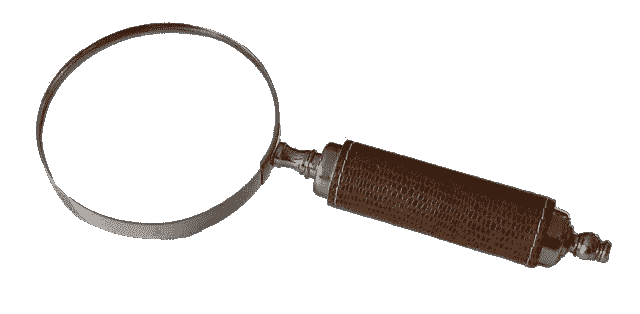

# 你应该知道的 15 个 Docker 命令

> 原文：<https://towardsdatascience.com/15-docker-commands-you-should-know-970ea5203421?source=collection_archive---------0----------------------->

## *第 5 部分学会足够有用的 Docker*

在这篇文章中，我们将看看你应该知道的 15 个 Docker CLI 命令。如果你还没有，看看这个系列的其余部分，关于 [Docker 概念](/learn-enough-docker-to-be-useful-b7ba70caeb4b)、[生态系统](/learn-enough-docker-to-be-useful-1c40ea269fa8)、[Docker 文件](/learn-enough-docker-to-be-useful-b0b44222eef5)和[保持你的图像苗条](/slimming-down-your-docker-images-275f0ca9337e)。在第 6 部分[中，我们将使用 Docker 探索数据。我也有一系列关于 Kubernetes 的作品，所以请关注我，确保你不会错过有趣的内容！](/pump-up-the-volumes-data-in-docker-a21950a8cd8)

大约有十亿个 Docker 命令(大约十亿个)。Docker 文档很广泛，但是当你刚刚开始的时候，会让人不知所措。在本文中，我将重点介绍运行 vanilla Docker 的关键命令。

Fruit theme

冒着让贯穿这些文章的食物隐喻线索走得太远的风险，让我们使用一个水果主题。蔬菜在关于减肥的文章中提供了营养。现在，当我们学习 Docker 命令时，美味的水果会给我们提供营养。

# 概观

回想一下，Docker 映像是由 Docker 文件+任何必要的依赖项组成的。还记得 Docker 容器是一个栩栩如生的 Docker 图像。要使用 Docker 命令，您首先需要知道您处理的是图像还是容器。

*   **码头工人形象要么存在，要么不存在。**
*   Docker 容器要么存在，要么不存在。
*   现有的 Docker 容器要么正在运行，要么没有运行。

一旦你知道你在做什么，你就能找到合适的命令。

## 命令共性

以下是关于 Docker 命令需要了解的一些事情:

*   Docker CLI 管理命令以`docker`开头，然后是一个空格，然后是管理类别，然后是一个空格，然后是命令。例如，`docker container stop`停止一个容器。
*   引用特定容器或映像的命令需要该容器或映像的名称或 id。

例如，`docker container run my_app`是构建和运行名为 *my_app* 的容器的命令。在整个示例中，我将使用名称`my_container`来指代通用容器。同样的道理也适用于`my_image`、`my_tag`等。

我将单独提供这个命令，然后在适用的情况下提供公共标志。前面有两个破折号的旗子是旗子的全名。带有一个破折号的标志是完整标志名称的快捷方式。例如，`-p`是`--port`旗的简称。

Flags provide options to commands

我们的目标是帮助您记住这些命令和标志，并将本指南作为参考。本指南适用于 Linux 和 Docker 引擎版本 18.09.1 以及 API [版本 1.39](https://docs.docker.com/engine/api/version-history/) 。

首先，我们将看看容器的命令，然后我们将看看图像的命令。卷将在下一篇文章中讨论。这里列出了 15 个需要知道的命令，外加 3 个额外的命令！

## 容器

使用`docker container my_command`

`create` —从图像创建容器。
`start` —启动现有容器。
`run` —创建一个新的容器并启动它。
`ls` —列出正在运行的容器。
`inspect` —查看关于容器的大量信息。
`logs` —打印日志。
`stop` —优雅地停止运行容器。
`kill`—突然停止容器中的主进程。
`rm` —删除已停止的集装箱。

## 形象

使用`docker image my_command`

`build` —建立形象。
`push` —将映像推送到远程注册表。
`ls` —列出图像。
`history` —见中间图像信息。
`inspect` —查看大量关于图像的信息，包括图层。
`rm` —删除图像。

## 混杂的

`docker version` —列出关于您的 Docker 客户端和服务器版本的信息。
`docker login` —登录 Docker 注册表。
`docker system prune` —删除所有未使用的容器、未使用的网络和悬挂图像。

# 容器

## 集装箱起点

术语创建、启动和运行在日常生活中都有相似的语义。但是每个都是创建和/或启动容器的单独的 Docker 命令。让我们先看看如何创建一个容器。

`**docker container create my_repo/my_image:my_tag**` —从图像创建容器。

在本文的其余部分，我将把`my_repo/my_image:my_tag` 缩短为`my_image`。

有很多可能的标志可以传递给`create`。

`**docker container create -a STDIN my_image**`

`-a`是`--attach`的简称。将容器附加到 STDIN、STDOUT 或 STDERR。

现在我们已经创建了一个容器，让我们开始吧。

`**docker container start my_container**` —启动现有容器。

请注意，可以通过容器的 ID 或容器的名称来引用容器。

`**docker container start my_container**`

Start

现在您已经知道了如何创建和启动容器，让我们转到可能是最常见的 Docker 命令。它将`create`和`start`合并成一个命令:`run`。

`**docker container run my_image**` — 创建一个新的容器并启动它。它也有很多选项。我们来看几个。

`**docker container run -i -t -p 1000:8000 --rm my_image**`

`-i`是`--interactive`的简称。即使未连接，也保持 STDIN 打开。

`-t`是`--tty`的简称。分配一个伪[终端](http://en.wikipedia.org/wiki/Pseudo_terminal)，它将您的终端与容器的标准输入和标准输出连接起来。

您需要指定`-i`和`-t`，然后通过终端外壳与容器交互。

`-p`是`--port`的简称。港口是与外界的接口。`1000:8000`将 Docker 端口 8000 映射到机器上的端口 1000。如果你有一个向浏览器输出内容的应用程序，你可以将浏览器导航到`localhost:1000`并查看它。

`--rm`停止运行时自动删除容器。

再来看一些`run`的例子。

`**docker container run -it my_image my_command**`

`sh`是一个可以在运行时指定的命令。`sh`将在您的容器内启动一个 shell 会话，您可以通过您的终端与之交互。对于高山图像，`sh`比`bash`更好，因为高山图像没有安装`bash`。键入`exit`结束交互式 shell 会话。

请注意，我们将`-i`和`-t`合并成了`-it`。

`**docker container run -d my_image**`

`-d`是`--detach`的简称。在后台运行容器。允许您在容器运行时使用终端执行其他命令。

## 检查容器状态

如果您有正在运行的 Docker 容器，并想知道与哪个容器进行交互，那么您需要列出它们。

`**docker container ls**` —列出正在运行的容器。还提供了有关容器的有用信息。

`**docker container ls -a -s**`

`-a`是`-all`的简称。列出所有容器(不仅仅是运行中的容器)。

`-s`是`--size`的简称。列出每个容器的尺寸。

`**docker container inspect my_container**` —查看大量关于集装箱的信息。

`**docker container logs my_container**` —打印集装箱日志。

Logs. Not sure how virtual logs are related. Maybe via reams of paper?

## 容器结尾

有时候你需要停止一个正在运行的容器。

`**docker container stop my_container**` —正常停止一个或多个正在运行的容器。在关闭容器以完成任何进程之前，默认设置为 10 秒。

或者如果你不耐烦:

`**docker container kill my_container**` —突然停止一个或多个正在运行的容器。就像拔掉电视插头一样。大多数情况下首选`stop`。

`d**ocker container kill $(docker ps -q)**` —杀死所有运行中的容器。

docker kill cockroach

然后，使用以下命令删除容器:

`**docker container rm my_container**` —删除一个或多个容器。

`**docker container rm $(docker ps -a -q)**` —删除所有未运行的容器。

这是 Docker 容器的八个基本命令。

概括地说，首先创建一个容器。然后，您启动容器。或者把那些步骤和`docker run my_container`结合起来。然后，您的应用程序运行。耶！

然后，你用`docker stop my_container`停止一个容器。最终你用`docker rm my_container`删除容器。

现在，让我们转到神奇的容器生产模具称为图像。

# 形象

以下是使用 Docker 图像的七个命令。

## 显影图像

`**docker image build -t my_repo/my_image:my_tag .**` —从位于指定路径或 URL 的 Docker 文件构建一个名为 *my_image* 的 Docker 映像。

`-t`是 tag 的简称。告诉 docker 用提供的标签标记图像。在这种情况下*我的 _ 标签。*

命令末尾的`.`(句号)告诉 Docker 根据当前工作目录下的 Dockerfile 构建镜像。

Build it

一旦你建立了一个映像，你想把它`push`到一个远程注册表，这样它就可以被共享，并在需要的时候被下载。假设你想使用 [Docker Hub](https://hub.docker.com/) ，进入你的浏览器并创建一个账户。它是免费的。😄

下一个命令不是图像命令，但是在这里看到它很有用，所以我会提到它。

`**docker login**` —登录 Docker 注册表。出现提示时，输入您的用户名和密码。

Push

`**docker image push my_repo/my_image:my_tag**` —将图像推送到注册表。

一旦你有了一些图像，你可能想要检查它们。

## 检查图像

Inspection time

`**docker image ls**` —列出您的图片。也向您显示每个图像的大小。

`**docker image history my_image**` —显示图像的中间图像及其大小和创建方式。

`**docker image inspect my_image**` —显示图像的大量细节，包括构成图像的图层。

有时你需要清理你的图像。

## 移除图像

`**docker image rm my_image**` —删除指定的图像。如果图像存储在远程存储库中，该图像在那里仍然可用。

`**docker image rm $(docker images -a -q)**` —删除所有图像。小心这个！请注意，已经被推送到远程注册中心的图像将被保留——这是注册中心的好处之一。😃

现在你知道最基本的 Docker 图像相关命令。我们将在下一篇文章中讨论与数据相关的命令。

Commands are like fruit — nutritious and delicious. Err. Yeah. — Image by [silviarita](https://pixabay.com/users/silviarita-3142410/?utm_source=link-attribution&utm_medium=referral&utm_campaign=image&utm_content=2305192) from [Pixabay](https://pixabay.com/?utm_source=link-attribution&utm_medium=referral&utm_campaign=image&utm_content=2305192)

# 混杂的

`**docker version**` —列出关于您的 Docker 客户端和服务器版本的信息。

`**docker login**` —登录 Docker 注册表。出现提示时，输入您的用户名和密码。

在下一篇文章中出现。推特[和红迪网](https://twitter.com/Docker/status/1093233051906134016)[上的读者建议加入这个列表会很好。我同意，所以我在补充。](https://www.reddit.com/r/docker/comments/anh1se/15_docker_commands_you_should_know_part_5_of/)

`**docker system prune**`—删除所有未使用的容器、未使用的网络和悬挂图像。

`**docker system prune -a --volumes**`

`-a`是`--all`的简称。删除不用的图片，[不只是悬空的](https://stackoverflow.com/a/45143234/4590385)。

`--volumes`移除未使用的卷。我们将在下一篇文章中更多地讨论卷。

## 2019 年 2 月 7 日更新:管理命令

在 CLI 1.13 中，Docker 引入了经过逻辑分组和一致命名的管理命令名称。旧的命令仍然有效，但是新的命令使 Docker 更容易上手。这篇文章的原始版本列出了老名字。我已经更新了文章，根据读者的建议使用管理命令名。请注意，这一更改只引入了两个命令名的更改——在大多数情况下，这只是意味着在命令中添加了`container`或`image`。命令的映射是[这里是](http://blog.arungupta.me/docker-1-13-management-commands/)。

# 包装

如果您刚刚开始使用 Docker，这是三个最重要的命令:

`**docker container run my_image**` —创建一个新容器并启动它。你可能需要一些旗子。

`**docker image build -t my_repo/my_image:my_tag .**` —建立形象。

`**docker image push my_repo/my_image:my_tag**` —将图像推送到远程注册表。

以下是基本 Docker 命令的较大列表:

## 容器

使用`docker container my_command`

`create` —从图像创建容器。
`start` —启动现有的容器。
`run` —创建一个新的容器并启动它。
`ls` —列出正在运行的容器。
`inspect` —查看一个容器的大量信息。
`logs` —打印日志。
`stop` —优雅地停止运行容器。
`kill`—突然停止容器中的主进程。
`rm` —删除停止的容器。

## 形象

使用`docker image my_command`

`build` —建立形象。
`push` —将映像推送到远程注册表。
`ls` —列出图像。
`history` —见中间图像信息。
`inspect` —查看图像的大量信息，包括图层。
`rm` —删除一幅图像。

## 混杂的

`docker version` —列出关于您的 Docker 客户端和服务器版本的信息。
`docker login` —登录一个 Docker 注册表。
`docker system prune` —删除所有未使用的容器、未使用的网络和悬挂图像。

要在使用 Docker 时查看 CLI 参考，只需在命令行中输入命令`docker`。你可以在这里看到 Docker 文档。

现在你真的可以用 Docker 构建东西了！正如我女儿可能会用表情符号说的:🍒 🥝 🍊 🍋 🍉 🍏 🍎 🍇。我想可以翻译成“酷！”所以去和 Docker 一起玩吧！

如果您错过了本系列的早期文章，请查看它们。这是第一个:

 [## 学习足够的码头工人是有用的

### 第 1 部分:概念景观

towardsdatascience.com](/learn-enough-docker-to-be-useful-b7ba70caeb4b) 

在本系列的最后一篇文章中，我们将讨论 Docker 中的数据。跟着我，保证你不会错过！

我希望这篇文章对你有所帮助。如果你有，请在你最喜欢的社交媒体频道上给它一些爱。

我写关于数据科学、云计算和其他技术的东西。关注我，在这里阅读更多。

码头上！👏