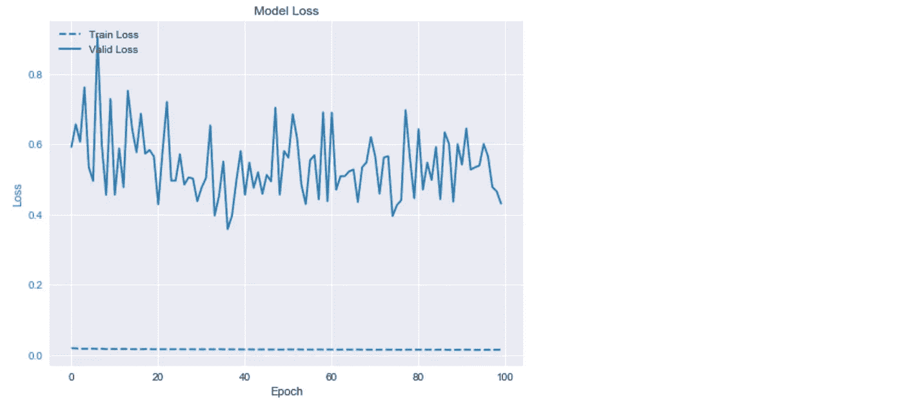

# 构建神经网络的经验法则

> 原文：<https://towardsdatascience.com/17-rules-of-thumb-for-building-a-neural-network-93356f9930af?source=collection_archive---------5----------------------->

## 在本文中，我们将获得一个构建初始神经网络的起点。我们将学习经验法则，例如隐藏层数、节点数、激活等。，并查看 TensorFlow 2 中的实现。

<<download the="" free="" book="" class="ae lb" href="https://www.understandingdeeplearning.com" rel="noopener ugc nofollow" target="_blank">了解深度学习，了解更多> ></download>


Photo by [Dewang Gupta](https://unsplash.com/@dewang?utm_source=unsplash&utm_medium=referral&utm_content=creditCopyText) on [Unsplash](https://unsplash.com/search/photos/rules-of-thumb?utm_source=unsplash&utm_medium=referral&utm_content=creditCopyText)

深度学习提供了各种各样的模型。有了它们，我们可以建立极其精确的预测模型。然而，由于设置参数种类繁多，要找到一个起点可能会令人望而生畏。

在本文中，我们将找到一个构建神经网络的起点，更具体地说是一个多层感知器的例子，但它的大部分是普遍适用的。

**这里的想法是回顾经验法则来建立第一个神经网络模型。如果第一个模型的性能合理(最低可接受的精度)，则对其进行调优和优化。否则，最好从问题、数据或不同的方法中寻找。**

在下面，我们有，

*   构建神经网络的经验法则，以及
*   它们在 TensorFlow 2 中用于二进制分类的实现代码。

# 神经网络

神经网络随着 CNN、RNNs 等有了巨大的进步。随着时间的推移，每种疾病又发展出几种亚型。随着每一项发展，我们都成功地提高了我们的预测能力。

但与此同时，我们成功地让寻找模型构建的起点变得更加困难。

每个模型都有自己的天价索赔。周围有这么多广告牌，很容易分心。

在接下来的内容中，我们将通过使用一些经验法则来构建第一个模型。

# 经验法则

我们有各种各样的神经网络。其中，一个多层感知器就是深度学习的“hello world”。因此，当你学习或开发深度学习的新模型时，这是一个很好的起点。

以下是建造 MLP 的经验法则。然而，它们中的大多数在其他深度学习模型上是适用的。

1.  **层数**:从两个隐藏层开始(不包括最后一层)。
2.  **中间层的节点数(大小)**:来自 2 的几何级数的数，如 4，8，16，32，…第一层应该是输入数据要素数量的一半左右。下一层的大小是上一层的一半。
3.  **用于分类的输出层的节点数(大小):**如果是二进制分类，则大小为 1。对于多类分类器，大小是类的数量。
4.  **回归输出层的大小**:如果是单个响应，则大小为 1。对于多响应回归，大小是响应的数量。
5.  **中间层激活**:使用`relu`激活。
6.  **输出层激活:**使用`sigmoid`进行二元分类，`softmax`进行多类分类器，使用`linear`进行回归。对于自动编码器，如果输入数据是连续的，最后一层应该是`linear`，否则，对于二进制或多级分类输入应该是`sigmoid`或`softmax`。
7.  **Dropout layers:** 在除输入层(如果单独定义输入层)以外的每一层后添加 Dropout。将**辍学率设置为 0.5** 。辍学率> 0.5 是适得其反的。如果您认为 0.5 的比率会正则化太多的结点，则增加图层的大小，而不是将辍学率降低到 0.5 以下。我更喜欢不在输入层设置任何下降。但是如果你觉得必须这么做，把辍学率设为 0.2。
8.  **数据预处理**:我假设您的预测值 *X* 是数值型的，并且您已经将任何分类列转换为 one-hot-encoding。在使用数据进行模型定型之前，请执行数据缩放。使用`sklearn.preprocessing`中的`MinMaxScaler`。如果这样做效果不好，请将`StandardScaler`放在同一个库中。回归中的 *y* 需要缩放。
9.  **分割数据至训练，有效，测试**:使用`sklearn.model_selection`中的`train_test_split`。参见下面的例子。
10.  **类别权重:**如果您有不平衡的数据，那么设置类别权重以平衡您的`model.fit`中的损失。对于二元分类器，权重应为:{ 0:1 的数量/数据大小，1:0 的数量/数据大小}。对于极度不平衡的数据(罕见事件)，类权重可能不起作用。谨慎添加。
11.  **优化器**:使用默认学习率的`adam`。
12.  **分类丢失:**对于二元分类使用`binary_crossentropy`。对于多类，如果标签是一个热编码，使用`categorical_crossentropy`，否则如果标签是整数，使用`sparse_categorical_crossentropy`。
13.  **回归损失**:使用`mse`。
14.  **分类标准:**使用`accuracy`显示正确分类的百分比。对于不平衡数据，还包括`tf.keras.metrics.Recall()`和`tf.keras.metrics.FalsePositives()`。
15.  **回归度量**:使用`tf.keras.metrics.RootMeanSquaredError()`。
16.  **历元**:从 20 开始，查看模型训练是否显示损失减少和精度提高。如果 20 个时代没有最小的成功，继续前进。如果你取得了一些微小的成功，把 epoch 设为 100。
17.  **批量**:从 2 的几何级数中选择批量。对于不平衡的数据集有更大的值，如 128，否则从 16 开始。

## 高级从业者的额外费用很少

1.  **振荡损耗**:如果你在训练时遇到振荡损耗，那么就有收敛问题。尝试降低学习率和/或更改批量大小。
2.  **过采样和欠采样**:如果数据不平衡，使用`[imblearn.over_sampling](https://imbalanced-learn.readthedocs.io/en/stable/api.html#module-imblearn.over_sampling)`中的`SMOTE`。
3.  **曲线移动:**如果你必须进行移动预测，例如早期预测，使用曲线移动。下面显示了一个实现`curve_shift`。
4.  **自定义度量**:不平衡二进制分类的一个重要度量是误报率。如下面的`class FalsePositiveRate()`实现所示，您可以构建这个以及类似的其他定制指标。
5.  **卢瑟激活** : `selu`激活被认为优于所有其他现有激活。我并不总是注意到这一点，但是如果你想使用`selu`激活，那么就使用`kernel_initializer=’lecun_normal’`和`AlphaDropout`。在`AlphaDropout`中使用速率为 0.1，`AlphaDropout(0.1)`。示例实现如下所示。

# TensorFlow 2 中的多层感知器(MLP)示例

我已经在我以前的文章中使用的纸张断裂数据集上实现了 MLP 神经网络(参见[使用 Keras](/extreme-rare-event-classification-using-autoencoders-in-keras-a565b386f098) 中的自动编码器进行极端罕见事件分类)。

在这个实现中，我们将看到我们在上面的经验法则中提到的元素的例子。

实现在 TensorFlow 2 中完成。如果还没有迁移到 TensorFlow 2，我强烈推荐迁移到 tensor flow 2。它具有 Keras 的所有简单性和显著更好的计算效率。

按照[分步指南安装 Tensorflow 2](/step-by-step-guide-to-install-tensorflow-2-0-67bc73e79b82) 进行安装。

在下文中，我并不试图找到最佳模式。想法是学习实现。为了简洁，没有跳过任何步骤。相反，这些步骤是冗长的，以帮助读者直接应用它们。

## 图书馆

```
%matplotlib inline
import matplotlib.pyplot as plt
import seaborn as snsimport pandas as pd
import numpy as np
from pylab import rcParamsfrom collections import Counterimport tensorflow as tffrom tensorflow.keras import optimizers
from tensorflow.keras.models import Model, load_model, Sequential
from tensorflow.keras.layers import Input, Dense, Dropout, AlphaDropout
from tensorflow.keras.callbacks import ModelCheckpoint, TensorBoardfrom sklearn.preprocessing import StandardScaler, MinMaxScaler, RobustScaler
from sklearn.model_selection import train_test_split
from sklearn.metrics import confusion_matrix, precision_recall_curve
from sklearn.metrics import recall_score, classification_report, auc, roc_curve
from sklearn.metrics import precision_recall_fscore_support, f1_scorefrom numpy.random import seed
seed(1)SEED = 123 #used to help randomly select the data points
DATA_SPLIT_PCT = 0.2rcParams['figure.figsize'] = 8, 6
LABELS = ["Normal","Break"]
```

要测试您是否使用了正确的 TensorFlow 版本，请运行以下命令，

```
tf.__version__
```


## 读取和准备数据

在这里下载数据[。](https://docs.google.com/forms/d/e/1FAIpQLSdyUk3lfDl7I5KYK_pw285LCApc-_RcoC0Tf9cnDnZ_TWzPAw/viewform)

```
'''
Download data here:
[https://docs.google.com/forms/d/e/1FAIpQLSdyUk3lfDl7I5KYK_pw285LCApc-_RcoC0Tf9cnDnZ_TWzPAw/viewform](https://docs.google.com/forms/d/e/1FAIpQLSdyUk3lfDl7I5KYK_pw285LCApc-_RcoC0Tf9cnDnZ_TWzPAw/viewform)
'''
df = pd.read_csv("data/processminer-rare-event-mts - data.csv") 
df.head(n=5)  # visualize the data.
```


## 将分类列转换为一次性编码

```
hotencoding1 = pd.get_dummies(df['x28'])  # Grade&Bwt
hotencoding1 = hotencoding1.add_prefix('grade_')
hotencoding2 = pd.get_dummies(df['x61'])  # EventPress
hotencoding2 = hotencoding2.add_prefix('eventpress_')df=df.drop(['x28', 'x61'], axis=1)df=pd.concat([df, hotencoding1, hotencoding2], axis=1)
```

## 曲线移动

这是一个时间序列数据，其中我们必须提前预测事件(y = 1)。在此数据中，连续的行相隔 2 分钟。我们将把列`y`中的标签移动 2 行，进行 4 分钟预测。

```
sign = lambda x: (1, -1)[x < 0]def curve_shift(df, shift_by):
    '''
    This function will shift the binary labels in a dataframe.
    The curve shift will be with respect to the 1s. 
    For example, if shift is -2, the following process
    will happen: if row n is labeled as 1, then
    - Make row (n+shift_by):(n+shift_by-1) = 1.
    - Remove row n.
    i.e. the labels will be shifted up to 2 rows up.

    Inputs:
    df       A pandas dataframe with a binary labeled column. 
             This labeled column should be named as 'y'.
    shift_by An integer denoting the number of rows to shift.

    Output
    df       A dataframe with the binary labels shifted by shift.
    '''vector = df['y'].copy()
    for s in range(abs(shift_by)):
        tmp = vector.shift(sign(shift_by))
        tmp = tmp.fillna(0)
        vector += tmp
    labelcol = 'y'
    # Add vector to the df
    df.insert(loc=0, column=labelcol+'tmp', value=vector)
    # Remove the rows with labelcol == 1.
    df = df.drop(df[df[labelcol] == 1].index)
    # Drop labelcol and rename the tmp col as labelcol
    df = df.drop(labelcol, axis=1)
    df = df.rename(columns={labelcol+'tmp': labelcol})
    # Make the labelcol binary
    df.loc[df[labelcol] > 0, labelcol] = 1return df
```

上移两行，

```
df = curve_shift(df, shift_by = -2)
```

现在删除时间列。从这里开始就不需要了。

```
df = df.drop(['time'], axis=1)
```

## 将数据分为训练、有效和测试

```
df_train, df_test = train_test_split(df, test_size=DATA_SPLIT_PCT, random_state=SEED)
df_train, df_valid = train_test_split(df_train, test_size=DATA_SPLIT_PCT, random_state=SEED)
```

把 X 和 y 分开。

```
x_train = df_train.drop(['y'], axis=1)
y_train = df_train.y.valuesx_valid = df_valid.drop(['y'], axis=1)
y_valid = df_valid.y.valuesx_test = df_test.drop(['y'], axis=1)
y_test = df_test.y
```

## 数据缩放

```
scaler = MinMaxScaler().fit(x_train)
# *scaler = StandardScaler().fit(x_train)*
x_train_scaled = scaler.transform(x_train)
x_valid_scaled = scaler.transform(x_valid)
x_test_scaled = scaler.transform(x_test)
```

## MLP 模型

**自定义指标:false position verate()**

我们将开发一个`FalsePositiveRate()`指标，用于下面的每个模型。

```
class FalsePositiveRate(tf.keras.metrics.Metric):
    def __init__(self, name='false_positive_rate', **kwargs):
        super(FalsePositiveRate, self).__init__(name=name, **kwargs)
        self.negatives = self.add_weight(name='negatives', initializer='zeros')
        self.false_positives = self.add_weight(name='false_negatives', initializer='zeros')

    def update_state(self, y_true, y_pred, sample_weight=None):
        '''
        Arguments:
        y_true  The actual y. Passed by default to Metric classes.
        y_pred  The predicted y. Passed by default to Metric classes.

        '''
        # Compute the number of negatives.
        y_true = tf.cast(y_true, tf.bool)

        negatives = tf.reduce_sum(tf.cast(tf.equal(y_true, False), self.dtype))

        self.negatives.assign_add(negatives)

        # Compute the number of false positives.
        y_pred = tf.greater_equal(y_pred, 0.5)  # Using default threshold of 0.5 to call a prediction as positive labeled.

        false_positive_values = tf.logical_and(tf.equal(y_true, False), tf.equal(y_pred, True)) 
        false_positive_values = tf.cast(false_positive_values, self.dtype)
        if sample_weight is not None:
            sample_weight = tf.cast(sample_weight, self.dtype)
            sample_weight = tf.broadcast_weights(sample_weight, values)
            values = tf.multiply(false_positive_values, sample_weight)

        false_positives = tf.reduce_sum(false_positive_values)

        self.false_positives.assign_add(false_positives)

    def result(self):
        return tf.divide(self.false_positives, self.negatives)
```

**自定义性能绘图功能**

我们将编写两个绘图函数来可视化损失进度和准确性度量。我们将在下面构建的模型中使用它们。

```
def plot_loss(model_history):
    train_loss=[value for key, value in model_history.items() if 'loss' in key.lower()][0]
    valid_loss=[value for key, value in model_history.items() if 'loss' in key.lower()][1]fig, ax1 = plt.subplots()color = 'tab:blue'
    ax1.set_xlabel('Epoch')
    ax1.set_ylabel('Loss', color=color)
    ax1.plot(train_loss, '--', color=color, label='Train Loss')
    ax1.plot(valid_loss, color=color, label='Valid Loss')
    ax1.tick_params(axis='y', labelcolor=color)
    plt.legend(loc='upper left')
    plt.title('Model Loss')plt.show()def plot_model_recall_fpr(model_history):
    train_recall=[value for key, value in model_history.items() if 'recall' in key.lower()][0]
    valid_recall=[value for key, value in model_history.items() if 'recall' in key.lower()][1]train_fpr=[value for key, value in model_history.items() if 'false_positive_rate' in key.lower()][0]
    valid_fpr=[value for key, value in model_history.items() if 'false_positive_rate' in key.lower()][1]fig, ax1 = plt.subplots()color = 'tab:red'
    ax1.set_xlabel('Epoch')
    ax1.set_ylabel('Recall', color=color)
    ax1.set_ylim([-0.05,1.05])
    ax1.plot(train_recall, '--', color=color, label='Train Recall')
    ax1.plot(valid_recall, color=color, label='Valid Recall')
    ax1.tick_params(axis='y', labelcolor=color)
    plt.legend(loc='upper left')
    plt.title('Model Recall and FPR')ax2 = ax1.twinx()  # instantiate a second axes that shares the same x-axiscolor = 'tab:blue'
    ax2.set_ylabel('False Positive Rate', color=color)  # we already handled the x-label with ax1
    ax2.plot(train_fpr, '--', color=color, label='Train FPR')
    ax2.plot(valid_fpr, color=color, label='Valid FPR')
    ax2.tick_params(axis='y', labelcolor=color)
    ax2.set_ylim([-0.05,1.05])fig.tight_layout()  # otherwise the right y-label is slightly clipped
    plt.legend(loc='upper right')
    plt.show()
```

**型号 1。基线。**

```
n_features = x_train_scaled.shape[1]
mlp = Sequential()
mlp.add(Input(shape=(n_features, )))
mlp.add(Dense(32, activation='relu'))
mlp.add(Dense(16, activation='relu'))
mlp.add(Dense(1, activation='sigmoid'))
mlp.summary()mlp.compile(optimizer='adam',
            loss='binary_crossentropy',
            metrics=['accuracy', tf.keras.metrics.Recall(), FalsePositiveRate()]
           )history = mlp.fit(x=x_train_scaled,
                  y=y_train,
                  batch_size=128,
                  epochs=100,
                  validation_data=(x_valid_scaled, y_valid),
                  verbose=0).history
```

查看模型拟合损失和精确度(召回和 FPR)进度。

```
plot_loss(history)
```


```
plot_model_recall_fpr(history)
```


**型号 2。等级权重。**

根据经验法则定义类别权重。

```
class_weight = {0: sum(y_train == 1)/len(y_train), 1: sum(y_train == 0)/len(y_train)}
```

现在，我们将训练模型。

```
n_features = x_train_scaled.shape[1]mlp = Sequential()
mlp.add(Input(shape=(n_features, )))
mlp.add(Dense(32, activation='relu'))
mlp.add(Dense(16, activation='relu'))
mlp.add(Dense(1, activation='sigmoid'))mlp.summary()mlp.compile(optimizer='adam',
            loss='binary_crossentropy',
            metrics=['accuracy', tf.keras.metrics.Recall(), FalsePositiveRate()]
           )history = mlp.fit(x=x_train_scaled,
                  y=y_train,
                  batch_size=128,
                  epochs=100,
                  validation_data=(x_valid_scaled, y_valid),
                  class_weight=class_weight,
                  verbose=0).historyplot_loss(history)
```


```
plot_model_recall_fpr(history)
```


**型号 3。退学正规化。**

```
n_features = x_train_scaled.shape[1]mlp = Sequential()
mlp.add(Input(shape=(n_features, )))
mlp.add(Dense(32, activation='relu'))
mlp.add(Dropout(0.5))
mlp.add(Dense(16, activation='relu'))
mlp.add(Dropout(0.5))
mlp.add(Dense(1, activation='sigmoid'))mlp.summary()mlp.compile(optimizer='adam',
            loss='binary_crossentropy',
            metrics=['accuracy', tf.keras.metrics.Recall(), FalsePositiveRate()]
           )history = mlp.fit(x=x_train_scaled,
                  y=y_train,
                  batch_size=128,
                  epochs=100,
                  validation_data=(x_valid_scaled, y_valid),
                  class_weight=class_weight,
                  verbose=0).historyplot_loss(history)
```


```
plot_model_recall_fpr(history)
```


**型号 4。过采样-欠采样**

使用 SMOTE 重采样器。

```
from imblearn.over_sampling import SMOTE
smote = SMOTE(random_state=212)
x_train_scaled_resampled, y_train_resampled = smote.fit_resample(x_train_scaled, y_train)
print('Resampled dataset shape %s' % Counter(y_train_resampled))
```


```
n_features = x_train_scaled.shape[1]mlp = Sequential()
mlp.add(Input(shape=(n_features, )))
mlp.add(Dense(32, activation='relu'))
mlp.add(Dropout(0.5))
mlp.add(Dense(16, activation='relu'))
mlp.add(Dropout(0.5))
mlp.add(Dense(1, activation='sigmoid'))mlp.summary()mlp.compile(optimizer='adam',
            loss='binary_crossentropy',
            metrics=['accuracy', tf.keras.metrics.Recall(), FalsePositiveRate()]
           )history = mlp.fit(x=x_train_scaled_resampled,
                  y=y_train_resampled,
                  batch_size=128,
                  epochs=100,
                  validation_data=(x_valid, y_valid),
                  class_weight=class_weight,
                  verbose=0).historyplot_loss(history)
```


```
plot_model_recall_fpr(history)
```


**模型 5。卢瑟激活。**

我们使用`selu`激活，这种激活因其自规范化特性而流行起来。

注意:

*   我们用了一个`kernel_initializer=’lecun_normal’`，
*   作为`AlphaDropout(0.1)`辍学。

```
n_features = x_train_scaled.shape[1]mlp = Sequential()
mlp.add(Input(shape=(n_features, )))
mlp.add(Dense(32, kernel_initializer='lecun_normal', activation='selu'))
mlp.add(AlphaDropout(0.1))
mlp.add(Dense(16, kernel_initializer='lecun_normal', activation='selu'))
mlp.add(AlphaDropout(0.1))
mlp.add(Dense(1, activation='sigmoid'))mlp.summary()mlp.compile(optimizer='adam',
            loss='binary_crossentropy',
            metrics=['accuracy', tf.keras.metrics.Recall(), FalsePositiveRate()]
           )history = mlp.fit(x=x_train_scaled,
                  y=y_train,
                  batch_size=128,
                  epochs=100,
                  validation_data=(x_valid, y_valid),
                  class_weight=class_weight,
                  verbose=0).historyplot_loss(history)
```



```
plot_model_recall_fpr(history)
```


# 结论

*   凭借深度学习提供的所有预测建模能力，开始也可能会令人不知所措。
*   本文中的经验法则提供了构建初始神经网络的起点。
*   由此构建的模型应该进一步调整以提高性能。
*   如果用这些经验法则构建的模型性能没有一些最低性能。进一步调优可能不会带来太大的改善。尝试另一种方法。
*   本文展示了在 TensorFlow 2 中实现神经网络的步骤。
*   如果您没有 TensorFlow 2，建议迁移到它，因为它带来了(keras)实施的简易性和高性能。参见此处的说明，[安装 Tensorflow 2](/step-by-step-guide-to-install-tensorflow-2-0-67bc73e79b82) 的分步指南。

***阅读我的其他文章以获得更深入的学习理解、模型和实现*** 。

使用 Keras 中的自动编码器进行极端罕见事件分类。

[理解辍学背后的简化数学](/simplified-math-behind-dropout-in-deep-learning-6d50f3f47275)。

[LSTM 用于 Keras 极端罕见事件分类的自动编码器](/lstm-autoencoder-for-extreme-rare-event-classification-in-keras-ce209a224cfb)。

[逐步了解 LSTM 自动编码器图层](/step-by-step-understanding-lstm-autoencoder-layers-ffab055b6352)。

[构建正确的自动编码器——使用 PCA 原理进行调整和优化。第一部分](/build-the-right-autoencoder-tune-and-optimize-using-pca-principles-part-i-1f01f821999b)。

[构建正确的自动编码器——使用 PCA 原理进行调整和优化。第二部分](/build-the-right-autoencoder-tune-and-optimize-using-pca-principles-part-ii-24b9cca69bd6)。