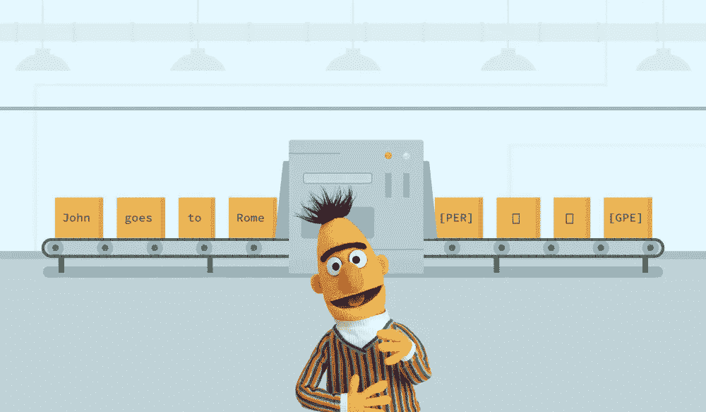
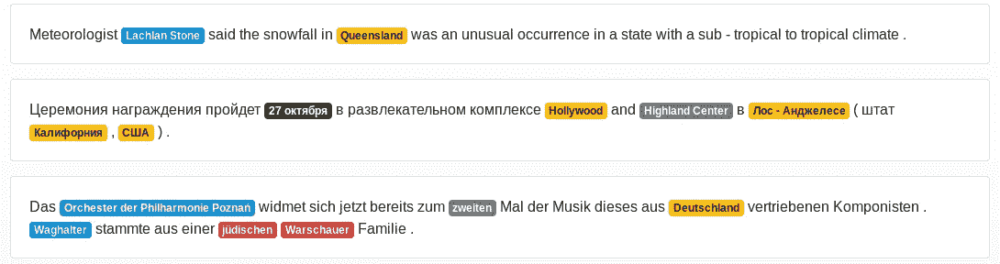

# 19 个实体对应 104 种语言:NER 的新时代

> 原文：<https://towardsdatascience.com/19-entities-for-104-languages-a-new-era-of-ner-with-the-deeppavlov-multilingual-bert-1bfa6d413ea6?source=collection_archive---------4----------------------->



世界数据科学界几乎没有人不同意 [BERT](https://arxiv.org/abs/1810.04805) 的发布是 NLP 领域最激动人心的事件。

对于那些还没有听说过的人来说:BERT 是一种基于 transformer 的技术，用于预处理上下文单词表示，能够在各种自然语言处理任务中实现最先进的结果。伯特论文被公认为[最好的长篇论文](https://syncedreview.com/2019/04/11/naacl-2019-google-bert-wins-best-long-paper/)👏计算语言学协会北美分会颁发的年度大奖。Google Research】发布了几个预训练的 BERT 模型，包括多语言、中文和英文的 BERT。

我们开发了[DeepPavlov](https://deeppavlov.ai/?utm_source=medium&utm_medium=article&utm_campaign=bert)——一个对话式人工智能框架，包含了构建对话系统所需的所有组件。在 BERT 发布之后，我们惊讶于它可以解决的各种各样的任务。

我们决定将 BERT 集成到三个流行的 NLP 任务的解决方案中:[文本分类](/the-bert-based-text-classification-models-of-deeppavlov-a85892f14d61)，标记和[问题回答](https://medium.com/towards-data-science/bert-based-cross-lingual-question-answering-with-deeppavlov-704242c2ac6f)。在本文中，我们将详细告诉你如何在 DeepPavlov 中使用基于 BERT 的命名实体识别(NER)。

# NER 简介

**命名实体识别** ( **NER)** 是自然语言处理中最常见的任务之一，我们可以把它表述为:

> 给定一个标记序列(单词，可能还有标点符号)，为序列中的每个标记提供预定义标记集中的一个标记。

下面带标签的句子是我们的[演示](https://demo.ipavlov.ai/)中 NER 的输出，其中蓝色代表人物标签，绿色代表位置，黄色代表地理位置，灰色代表日期时间。


DeepPavlov NER 模型支持 19 个标签:ORG(组织)、GPE(国家、城市、州)、LOC(位置)、EVENT(命名的飓风、战役、战争、体育赛事)、DATE、CARDINAL、MONEY、PERSON 等。迪普巴洛夫的 NER 模型在命令行中处理的句子如下所示。

```
>> Amtech , which also provides technical temporary employment services to aerospace , defense , computer and high - tech companies in the Southwest and Baltimore - Washington areas , said its final audited results are due in late November .
['B-ORG', 'O', 'O', 'O', 'O', 'O', 'O', 'O', 'O', 'O', 'O', 'O', 'O', 'O', 'O', 'O', 'O', 'O', 'O', 'O', 'O', 'O', 'B-LOC', 'O', 'B-GPE', 'O', 'B-GPE', 'O', 'O', 'O', 'O', 'O', 'O', 'O', 'O', 'O', 'O', 'B-DATE', 'I-DATE', 'O']
```

为了区分具有相同标签的相邻实体，使用生物标记方案，其中“B”表示实体的开始，“I”代表“内部”并且用于组成该实体的除第一个词之外的所有词，而“O”表示不存在实体。

NER 有各种各样的商业应用📈。例如，NER 可以通过从简历中提取重要信息来帮助人力资源部门评估简历。此外，NER 可用于识别客户请求中的相关实体，如产品规格、部门或公司分支机构的详细信息，以便对请求进行相应分类并转发给相关部门。

# 如何在 DeepPavlov 中使用基于 BERT 的 NER 模型

任何预先训练的模型都可以通过命令行界面(CLI)和 Python 进行推理。在使用该模型之前，请确保使用以下命令安装了所有必需的软件包:

```
python -m deeppavlov install ner_ontonotes_bert_multpython -m deeppavlov interact ner_ontonotes_bert_mult [-d]
```

其中 **ner_ontonotes_bert_mult** 表示配置文件的名称。

您可以通过 Python 代码与模型进行交互。

此外，DeepPavlov 包含一个基于 [RuBERT 的模型](https://github.com/deepmipt/DeepPavlov/blob/0.3.0/deeppavlov/configs/ner/ner_rus_bert.json)，用于处理俄语数据。总的来说，基于 BERT 的模型比[基于 bi-LSTM-CRF 的模型](https://arxiv.org/abs/1709.09686)有实质性的改进。在这里，您可以看到基于英语和俄语的模型的性能。

The performance of the DeepPavlov’s NER models.

# 多语言零镜头传输

多语言 BERT 模型允许执行从一种语言到另一种语言的零转换。模型 [ner_ontonotes_bert_mult](https://github.com/deepmipt/DeepPavlov/blob/0.3.1/deeppavlov/configs/ner/ner_ontonotes_bert_mult.json) 在 ontonotes 语料库(英语)上训练，该语料库在标记模式中具有 19 种类型。您可以在不同的语言上测试模型。



在德语、俄语、汉语和越南语的四个 NER 测试集上评估了多语言模型的性能。这些是转让的结果。

The performance of the Multilingual model while tested on four test sets

# 如何为 NER 配置 BERT

DeepPavlov NLP 管道在 config/faq 文件夹下的单独的[配置文件](https://medium.com/deeppavlov/simple-intent-recognition-and-question-answering-with-deeppavlov-c54ccf5339a9)中定义。配置文件由四个主要部分组成:**数据集 _ 读取器**、**数据集 _ 迭代器**、**链接器**和**训练器**。

所有基于 BERT 的模型的公共元素是配置文件的**链接器**部分中的 BERT 预处理器(在 ner 的情况下是 **bert_ner_preprocessor** 类)块。未处理的文本(即*“Alex goes to Atlanta”*)应该被传递到 **bert_ner_preprocessor** 用于标记化成子标记，用它们的索引编码子标记，并创建标记和段掩码。 **tokens** 参数本身包含一个语句记号列表( *['Alex '，' goes '，' to '，' Atlanta ']【T11])， **subword_tokens** 是 **tokens** 带特殊记号( *['[CLS]'，' Alex '，' goes '，' to '，' Atlanta '，'[SEP]'] 【T19)。 **subword_tok_ids** 包含记号 id， **subword_masks** 是一个列表，0 表示特殊记号，1 表示句子的记号(*[0 1 1 1 1 0】*)。**

```
{
 "class_name": "bert_ner_preprocessor",
 "vocab_file": "{BERT_PATH}/vocab.txt",
 "do_lower_case": false,
 "max_seq_length": 512,
 "max_subword_length": 15,
 "token_maksing_prob": 0.0,
 "in": ["x"],
 "out": ["x_tokens", "x_subword_tokens", 
         "x_subword_tok_ids", "pred_subword_mask"]
 }
```

所以，这就是我们想告诉你的关于我们多语言的伯特 NER 的一切。我们希望这是有帮助的，你会渴望使用迪普帕洛夫 NER 模型😃你可以在这里阅读更多关于他们的信息。也可以使用我们的[演示](http://demo.ipavlov.ai)来测试我们基于 BERT 的模型。别忘了 DeepPavlov 有一个[论坛](https://forum.ipavlov.ai/?utm_source=medium&utm_medium=article&utm_campaign=bert)——只要在这里问我们任何关于框架和模型的问题，我们会尽快与您联系。敬请期待！

