# 19 种在各种领域使用信息可视化的创新方法

> 原文：<https://towardsdatascience.com/19-innovative-ways-to-use-information-visualization-across-a-variety-of-fields-edba0613136d?source=collection_archive---------14----------------------->

当大量的数据以数字的形式出现在电子表格中时，在房间里听到呻吟声并不罕见。如果有大量的变量和时间框架，情况会更糟。

信息可视化可以带来巨大的不同。

将数字、百分比、统计、差异、比率和其他类型的无聊的数字数据转化为创造性的可视化数据，可以立即使任何*信息看起来更有趣。*

*在本文中，您将找到一系列创造性的可视化信息，如图表、图表、图解、地图和其他用于您的下一个项目的想法。*

# *1.流图*

*流图是堆积面积图的变体。*

*但是这些值不是沿着直轴，而是沿着中心线移动，该中心线随着值的形状而变化。它的目的是可视化不同类别的数据。*

*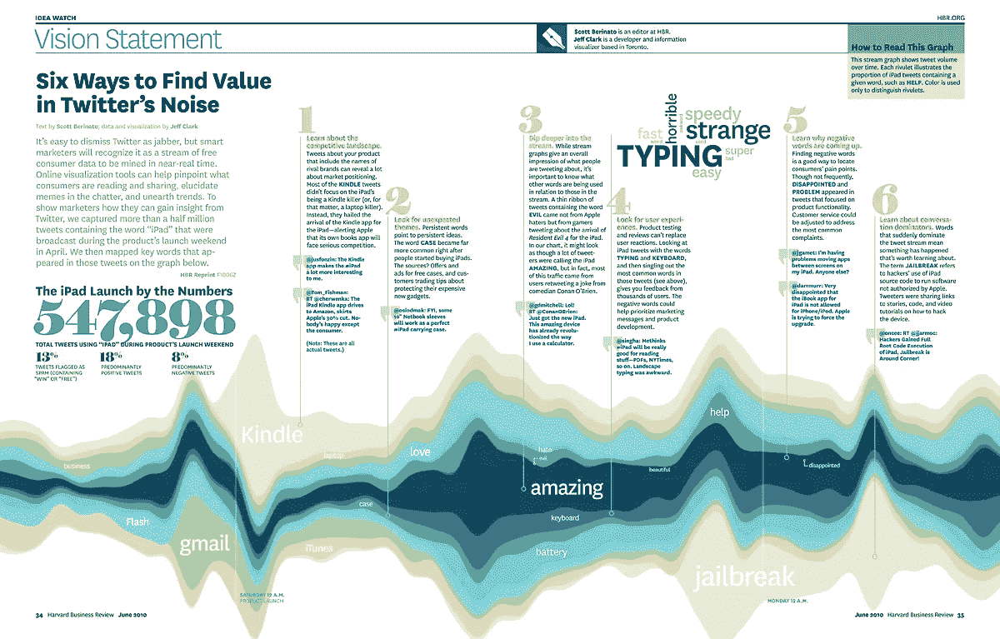*

*[Image Source](https://hbr.org/2010/06/vision-statement-six-ways-to-find-value-in-twitters-noise)*

*数值的不同形状和大小使图形看起来像一条流动的河流。注意每个值或溪流是如何用不同的颜色来使图表更容易阅读的。*

*上面的蓝色和蓝绿色流图显示了 iPad 发布后的一个周末。[这一可视化结果发表在《哈佛商业评论》上](https://hbr.org/2010/06/vision-statement-six-ways-to-find-value-in-twitters-noise)，它很好地展示了推文中使用的每个词的价值，并更好地理解了用户的反应。*

*这种信息可视化的第二个例子是有史以来最大的流图之一。这是一个发表在《纽约时报》上的互动可视化。*

*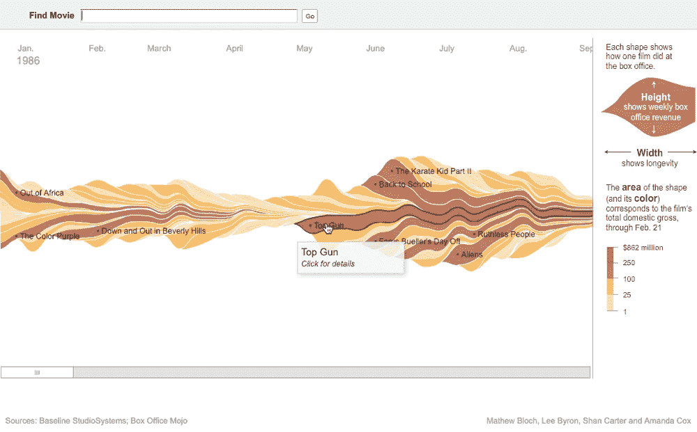*

*[Image Source](http://archive.nytimes.com/www.nytimes.com/interactive/2008/02/23/movies/20080223_REVENUE_GRAPHIC.html)*

*这个流图中的数据是根据电影上映日期从票房收入中提取的。它是交互式的，所以用户可以点击哪怕是最小的溪流，看看它们代表什么。*

*[点击这里体验一下。](http://archive.nytimes.com/www.nytimes.com/interactive/2008/02/23/movies/20080223_REVENUE_GRAPHIC.html)*

# *何时使用流图*

*由于流图没有固定的 x 轴，过多的数据会使事情变得复杂。它们最适合有限的类别，因此重叠不会影响数据的可读性。*

*使用对比色或互补色，让图表看起来更漂亮。如果你能增加互动性，那就去做吧！这将使你的流图更加有趣和有效。*

*请记住，流图是用来可视化随时间变化的数据的。如果你经营一家电子商务公司，你可以使用流图来显示一种款式的服装在一年中特定时间的销售情况。*

*你可以使用像 [Displayr](https://www.displayr.com/create-a-streamgraph/) 这样的工具来创建一个流图或者雇佣一个数据设计师。*

# *2.桑基图*

*桑基图用于可视化定量流及其相互之间的比例。线条的粗细取决于流量的大小。*

*这些可以被视为箭头或线条，当它们穿过图表时，可以根据它们前进的方向分开或合在一起。*

*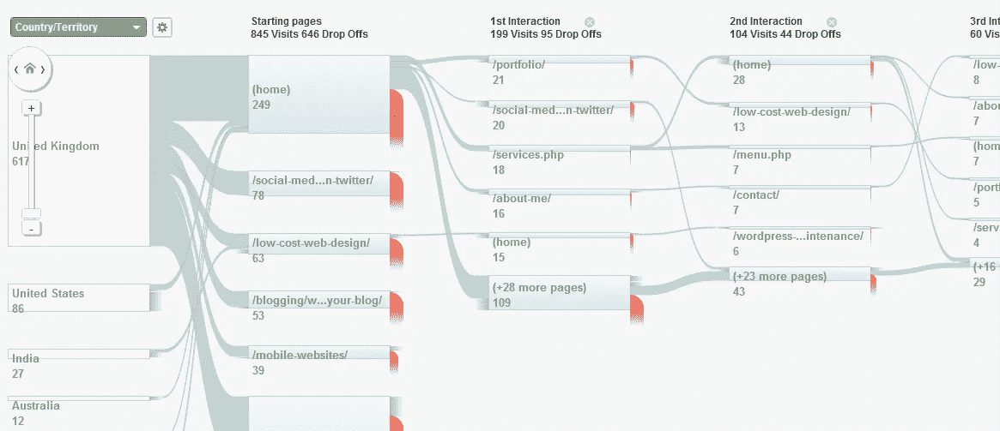*

*[Image Source](https://appsfortableau.com/extensions/create-sankey-diagrams-in-tableau/)*

*你可能认识这种风格的图表，因为它在你的谷歌分析中使用。Google Analytics Sankey 图直观地显示了访问者如何在你的网站中移动，以及他们停留在哪些页面上。*

*桑基图对于可视化用户、金钱或能量所走的路径非常有用。它可以被创建为一个大图或一组小图。*

*以下是桑基图的更多例子。*

*第一个是概念仪表板，使用 Sankey 图来可视化电子邮件驱动的导航。这个 Sankey 概念有不同的部分，指定不同的电子邮件流程。*

*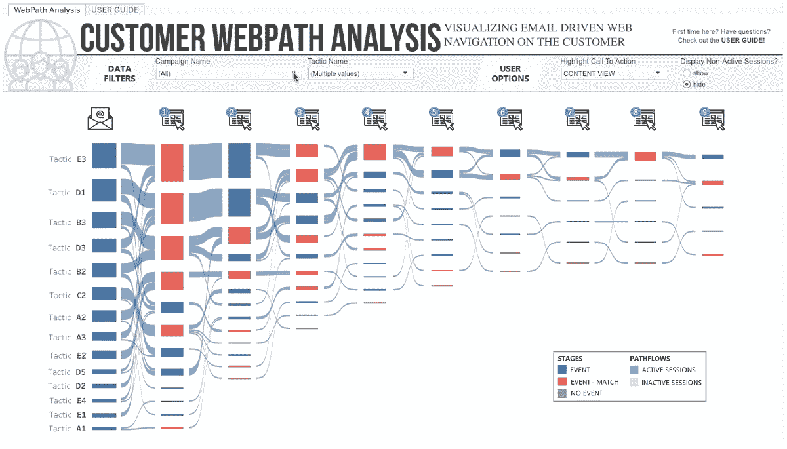*

*[Image Source](https://public.tableau.com/profile/brianhalloran#!/vizhome/CUSTOMER_WEBPATH_ANALYSIS_MASKED/WebPathAnalysis)*

*[点击此链接](https://public.tableau.com/profile/brianhalloran#!/vizhome/CUSTOMER_WEBPATH_ANALYSIS_MASKED/WebPathAnalysis)查看设计师如何解释读图的正确方法。如果您有一个 [Tableau](https://www.tableau.com/) 帐户，您可以使用此工作簿创建自己的桑基图。*

*另一个交互式桑基图的例子是用来自【2018 年福布斯 NFL 估值的数据创建的。下面可以快速看一下。*

*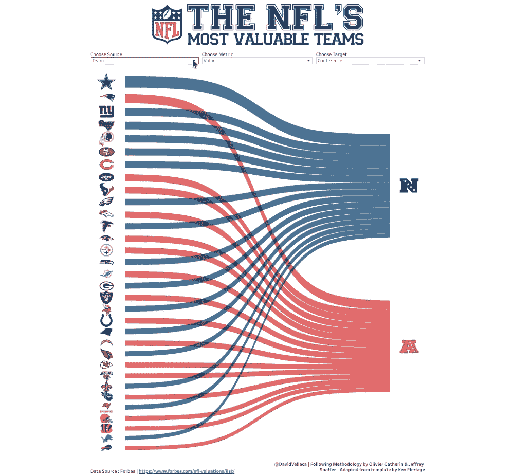*

*[点击此处查看互动版。](https://public.tableau.com/views/TheNFLsMostValuableTeams/NFLsMostValuableTeams?:embed=y&:showVizHome=no)*

# *何时使用桑基图*

*就像其他类型的信息可视化一样，如果有太多的数据需要显示，桑基图会非常混乱。知道你是否需要桑基图的最好方法是分析你的数据是关于一个过程还是价值流。*

*例如，它将用于可视化预算或利润如何再投资。您还可以选择使用 Sankey 图来可视化机场中的乘客活动数据。*

*创建 Sankey 图有几种不同的工具，Tableau 就是其中之一。但是您也可以尝试使用[桑基图生成器](http://sankey-diagram-generator.acquireprocure.com/)为自己创建一个。*

# *3.弦图*

*和弦图用于可视化不同组之间的相互关系。*

*组或实体的值组织在一个圆中，它们之间的关系用不同颜色的曲线创建和显示。*

*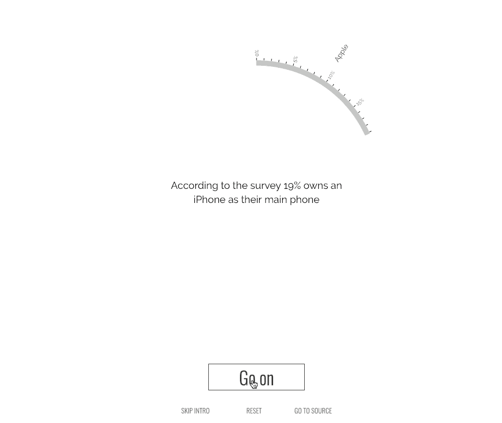*

*[Image Source](https://www.visualcinnamon.com/2014/12/using-data-storytelling-with-chord.html)*

*弦图有利于可视化大量数据，但是如果有太多的变量，就会在视觉上变得混乱。这可以通过使用交互性来最小化，交互性允许观众选择变量或区域，使所有其他变量或区域消失或设置在覆盖图后面。*

*上面的和弦图是我们最喜欢的艺术家之一 Nadieh Bremer 的例子。它可视化了一大群荷兰国民以及他们选择智能手机的相关数据。*

*连接曲线显示了从一个手机品牌到另一个品牌的变化，而小山则表示没有任何变化。[点击此处查看和弦图如何工作](https://www.visualcinnamon.com/2014/12/using-data-storytelling-with-chord.html)以及她是如何创建这个和弦图的。*

# *何时使用和弦图*

*和弦图通常看起来很漂亮，但对于不理解复杂数据可视化的人来说可能会感到困惑。只有当你能够解释它是如何工作的，以及你的观众如何阅读和理解它时，你才应该选择这种类型的信息可视化。*

*一如既往，使用交互性是实现这一点的好方法。对于上面的例子，Nadieh 围绕可视化创建了一个故事，以便观众可以更好地理解正在发生的事情。*

*如果你想让你的数据看起来很漂亮，就使用弦图。*

*请记住，这些图表是关于组或实体之间的相互关系。一组关于一段时间内某样东西是如何被使用的数据在弦图上是不起作用的。*

# *4.等值区域图*

*choropleth 是与地图中的区域相关的数据的地理信息可视化。*

*choropleth 地图上显示的区域可以代表您想要的任何东西，如国家、县、城市或社区。这完全取决于需要可视化什么。*

*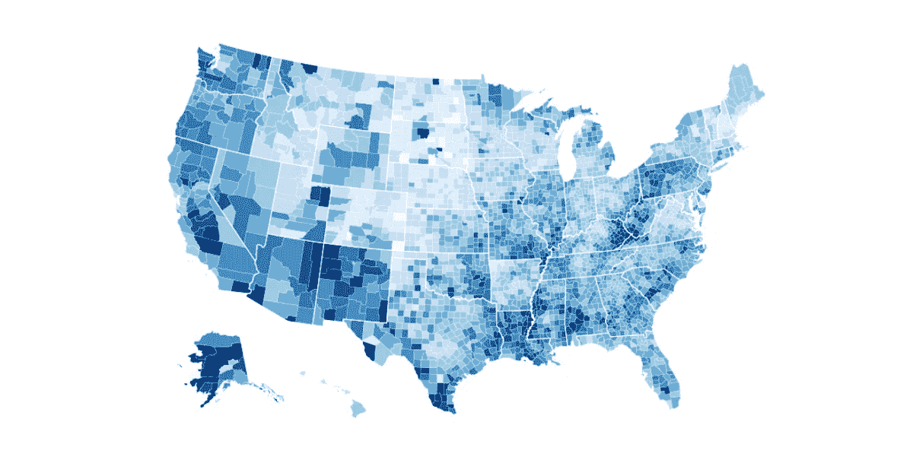*

*[Image Source](https://medium.com/@hudsonb/lets-make-a-visualization-choropleth-map-f2a90a82f9b6)*

*这些颜色被设置为相同色调或不同颜色的渐进性颜色强度。如果颜色太醒目或令人不快，数据将难以理解。*

*上面的 choropleth 地图是由 Mike Bostock 根据 2016 年美国的[失业率数据制作的。颜色部分由每个州内的县定义。他只使用白线来分隔各州，这样就不会使可视化更加拥挤。](https://www.bls.gov/lau/#tables)*

# *何时使用 choropleth 地图*

*当您需要可视化地理数据时，请使用 choropleth 地图。用于这种类型的信息可视化的最准确的数据类型应该是标准化的，而不是原始的。*

*例如，与其简单地用每个地区的人口数量，不如用每平方公里的人口密度来代表每个地区。*

*Choropleth 地图也最好与适用于所有地区的单一类型的值一起使用。如果使用不同的数据值，choropleth 可能不是最好的可视化方式。*

*您可以使用地图引擎用 Visme [制作一个 choropleth。](https://www.visme.co/map-generator/)*

*在 Visme 中，只需选择需要可视化的区域，插入数据并自定义颜色。您也可以从 Excel 或 Google 工作表导入数据，然后调整颜色和标签。*

*看看这个关于在 Visme 中制作交互式地图的视频。*

*或者[使用本指南](https://blog.datawrapper.de/choroplethmaps/)更好地了解如何创建令人惊叹的 choropleth 地图。*

# *5.十六进制地图*

*六边形地图类似于 choropleth，但是这些区域在视觉上变成了六边形。目的是均衡区域的大小，这样就不会有区域看起来比其他区域更重要。*

*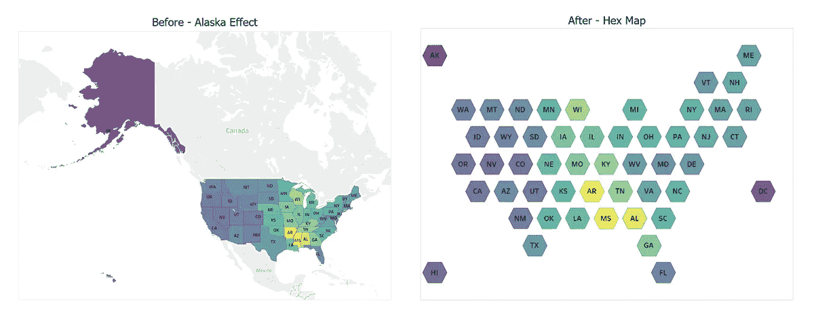*

*[Image Source](/ways-to-improve-a-map-visualization-ba3dc083b3cb)*

*保持你正在观察的主要区域的原始形状是很重要的，这样观众才知道他们在看什么。*

# *何时使用十六进制地图*

*使用 choropleth 的原因同样适用于使用十六进制映射。用于这种可视化的最佳数据集应该简单且没有变量。*

*每个区域应该只显示一个值，这将赋予它特定的颜色。*

*您可以将多种类型的值应用于地理区域，这意味着十六进制地图可以极大地丰富您的内容。*

# *6.交互式多边形地图*

*地理数据信息可视化的另一种创新形式是交互式多边形地图。不同之处在于，这一个在每个区域可以有三个值。*

*它遵循六边形贴图的前提，在六边形贴图中，每个区域都是一个形状，并且大小都相同。不同之处在于形状是三维的，每条边代表一个值。*

*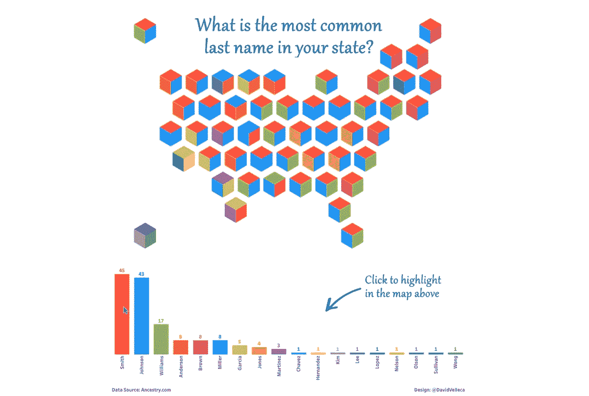*

*[Image Source](https://davidvelleca.com/posts/archive/20181104%20The%20Viz%20That%20Almost%20Wasnt)*

*另一个区别是，所使用的值既不是百分比也不是标准化值，而是设置描述性的值，如上例所示。*

*上面的例子是由 David Velleca 创建的，是 Tableau 中的一个公共工作簿。他设计它来可视化每个州最常见的姓氏，使用前三个作为显示在形状两侧的值。*

*地图下方是一个条形图，显示地图中包含的所有姓氏。您可以使用他的工作簿创建交互式多边形地图来可视化您自己的数据。*

*[点击这里体验互动版。](https://davidvelleca.com/posts/archive/20181104%20The%20Viz%20That%20Almost%20Wasnt)*

# *何时使用交互式多边形地图*

*当您有大量的值，但希望显示每个地区的三个主要值时，可以使用这种信息可视化样式。*

*正如我们之前提到的，用于多边形地图的数据类型应该设置为描述性值，而不是整体的百分比。*

*例如，您可以使用“前三名”或“最少三名”这样的值增加交互性只会让阅读和理解地图变得更加愉快。*

# *7.脊线图*

*Rigdeline 地块过去被称为“joyplots ”,因为它们类似于 1979 年 Joy Division 专辑《未知的快乐》中的插图。这个术语后来被改成了“山脊线地块”，因为 Joy Division 最初用他们的名字“T1”来指代它。*

*撇开音乐和纳粹历史不谈，脊线图是一种密度图。它的主要目的是显示一段时间内几个组的值的分布。*

*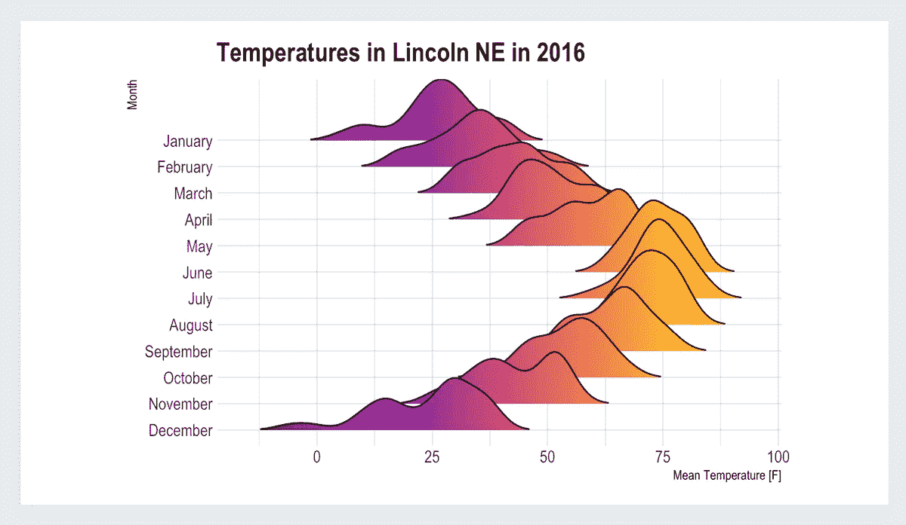*

*[Image Source](https://www.data-to-viz.com/graph/ridgeline.html)*

*脊线中的“脊”重叠，从而产生脊线效果。用于这种可视化风格的最佳数据是在特定时期具有高值的数据。*

*上面的例子是一个山脊线图，显示了 2016 年内布拉斯加州林肯市的气温。根据数值变量而不是类别给脊着色。要查看更多具有其他颜色变化的脊线图，请单击下图旁边的链接。*

# *何时使用脊线图*

*使用脊线图的最佳时机是希望数据易于阅读且视觉效果丰富的时候。*

*山脊线图是非常直观的图表，其目的并不完全独特。其他图表可以很好地显示相同的数据。山脊线的独特之处在于它看起来有多酷。*

*但要让它看起来像这样，数据必须以某种方式排序，这样最终结果乍一看是可以理解的。这是因为有些值隐藏在前面的脊后面。*

*在轴的特定部分需要有高值数据点，以便形成脊。如果数据变量少于六个，视觉效果就不会那么强烈。在这种情况下，最好选择另一种类型的密度图。*

# *8.箱形图*

*箱线图是一种可视化数据分布和可变性的图表。箱线图有不同的部分，代表数据集的特定部分。这是一个箱线图的例子。*

*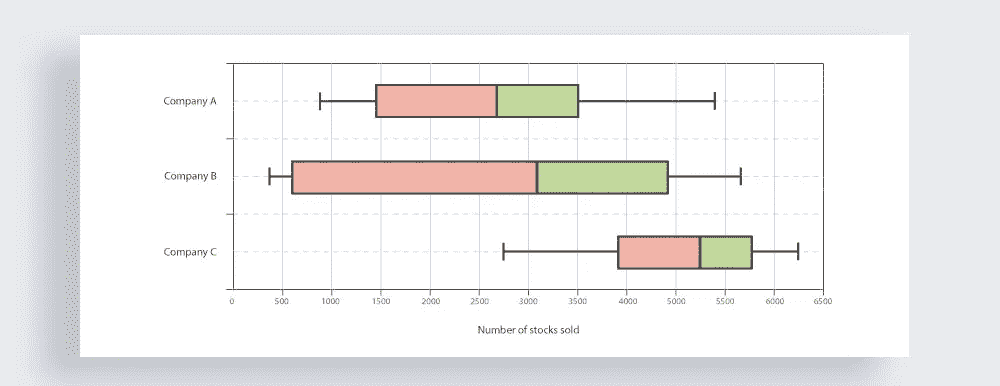*

*[Image Source](https://datavizcatalogue.com/methods/box_plot.html)*

*实际方框代表两个部分的四分位数范围。*

*两个四分位之间的线是中间值。中位数左边是第 25-50 百分位，右边是第 50-75 百分位。*

*从盒子中延伸出来的是触须，它将上下四分位数中的变量可视化。胡须边缘的线条是数据集的最小值和最大值。如果有任何异常值，它们将被标绘为最小值和最大值之外的点。*

*请记住，箱形图可以是水平的，也可以是垂直的。选择使用哪一个将取决于您需要可视化多少数据集。*

# *何时使用箱线图*

*如果您必须可视化数据分布和可变性，箱线图是一个不错的选择。如果你想为一个统一的主题比较不同的数据集，它是完美的。*

*此外，箱线图以一种显示数据是对称还是偏斜的方式来可视化数据。它在以一种容易理解的方式显示异常值方面也做得很好。*

# *9.交互式决策树*

*拥有大量信息的网站有时会让人不知所措。使用交互式决策树可以帮助你的访问者决定他们需要从你的内容中得到什么。*

*决策树基本上是一个流程图，但与其静态对应物略有不同。决策树的独特之处在于它是完全交互式和直观的。*

*下面是一个交互式决策树的例子。*

*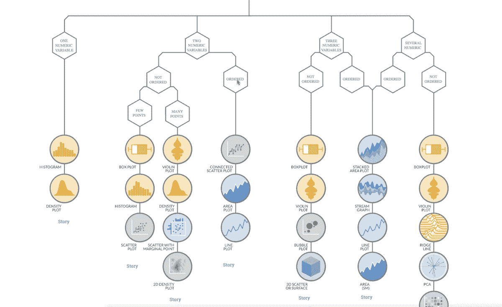*

*[Image Source](https://www.data-to-viz.com/index.html)*

*上面的例子显示了 Viz 网站的[数据中的交互决策树。Data to Viz 是一个关于数据可视化的在线百科全书，交互式决策树帮助用户为他们的项目选择正确的信息可视化。](http://www.data-to-viz.com)*

*[点击这里查看交互式决策树的运行。](https://www.data-to-viz.com/index.html)*

# *何时使用交互式决策树*

*交互式决策树的最佳用途是让别人更容易浏览您的数据。这些数据需要用关键词和描述来索引。*

*例如，考虑一个关于一个国家不同地区的水健康的复杂实验室实验。结果和研究可以被索引，以便学生或读者可以根据水体或另一个值(如一种细菌)来浏览数据。*

# *10.树形图*

*树形图是一种分层图表，用于显示不同类别中事物的值。这些值被可视化为较大矩形内的正方形和矩形。*

*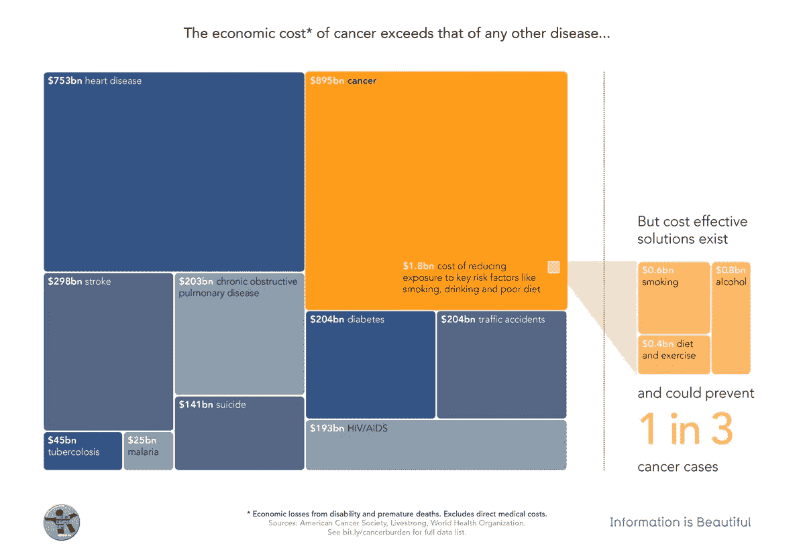*

*[Image Source](https://datavizproject.com/data-type/treemap/)*

*最大值放在左上角，递减值按时钟方向显示，最小值放在右下角。*

*这是另一个更复杂的树形图设计的例子。*

*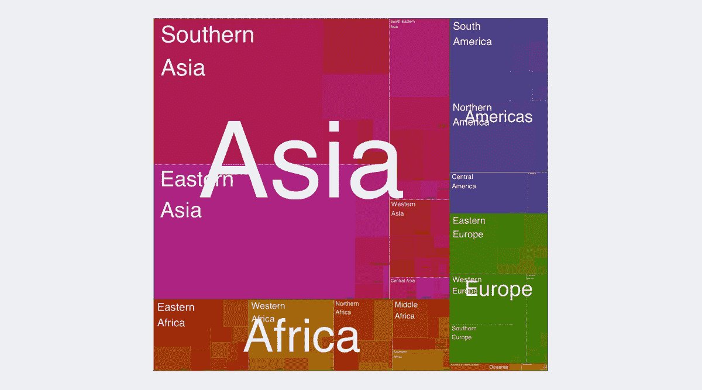*

*[Image Source](https://www.data-to-viz.com/story/SevCatOneNumNestedOneObsPerGroup.html)*

# *何时使用树形图*

*树状图是一种有用的信息可视化类型，可以包含在文章、博客帖子、年度报告和其他关于给定数据集的长篇出版物中。*

*正如你在上面的树状图中所看到的，它们与颜色搭配起来会更好。用像 [Vizzlo](https://vizzlo.com/create/treemap) 这样的树状图制作工具制作树状图很容易。*

# *11.圆形包装*

*圆形包装可视化类似于树形图，因为它显示分层关系。*

*较大的圆圈包含较小但相关的值。在每一部分内，圆圈由大到小按顺时针螺旋排列。*

*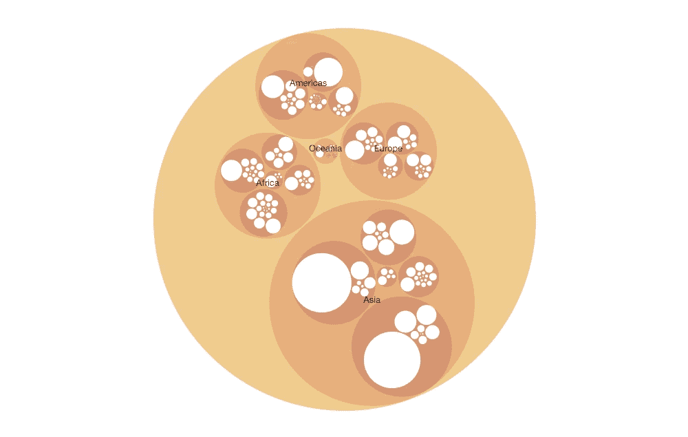*

*[Image Source](https://www.data-to-viz.com/graph/circularpacking.html)*

*圆圈的大小代表一个值，但可能发生的情况是，实际的数值无法从完整的可视化中辨别出来。圆形包装更像是一种解释性的层次可视化，而不仅仅是一种数字数据可视化。*

*上面的圆形包装示例显示了世界人口在 250 个国家的重新分配。它首先按洲，然后按地区，最后按国家来划分国家。*

*[点击这里体验互动版。](https://www.data-to-viz.com/graph/circularpacking.html)*

# *何时使用圆形包装可视化*

*当您需要演示一组具有强层次值的数据时，请使用圆形包装可视化。如果有大量的值需要可视化，那么让图表具有交互性是个不错的主意。圆圈的大小取决于数据的数值。*

*您可以使用 [Visme](http://visme.co) 轻松创建圆形包装可视化。如果有必要，您还可以为其添加交互性，甚至一些音频旁白。以下是你如何做到这一点。*

*在编辑器中，简单地添加不同大小的圆形。然后，用特定的颜色对它们进行定制，并根据数据进行排列。你可能需要做一些数学计算来知道圆圈的确切大小。完成后，添加互动链接和悬停效果。*

# *12.三维散点图*

*散点图是沿 y 轴和 x 轴显示相关数据的常用可视化工具。3D 散点图通过添加 z 轴更进一步。*

*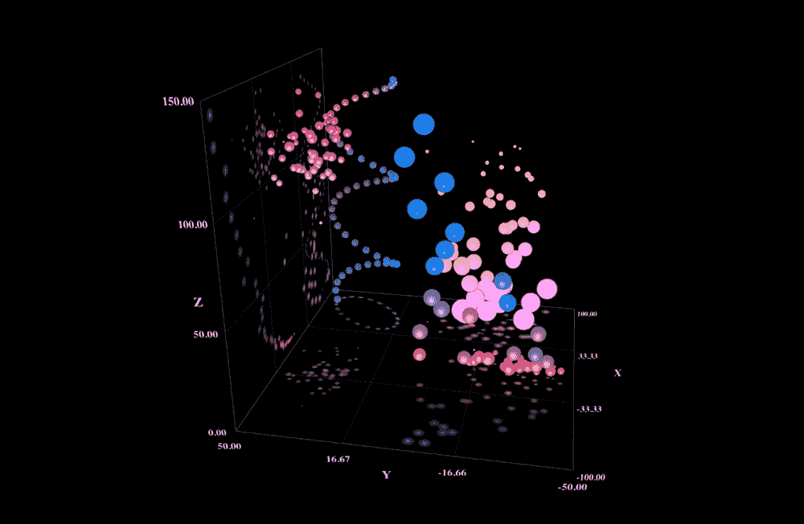*

*[Image Source](http://miabellaai.net/scatterplot3d.html)*

*如果点有颜色，那么另一个值也可以添加到数据中。这种类型的信息可视化最适合交互，因此您可以从不同的角度查看图表。*

*上面的例子是用人工智能工具创建的交互式 3D 散点图的屏幕截图。[这个链接会带你去数据示例](http://miabellaai.net/scatterplot3d.html)，你可以用它来制作你自己的数据示例。*

# *何时使用三维散点图*

*3D 散点图最适用于包含大量变量的大量数据集。*

*请记住，与散点图一样，用于 3D 散点图的数据需要是相关数据。当数据有两个或三个以上的相关值时，使用三维散点图。*

# *13.网络图*

*网络图有时被称为网络图，但我们不要把它与计算机功能图相混淆。网络图信息可视化的目的是借助节点和链接来显示事物之间的联系。*

*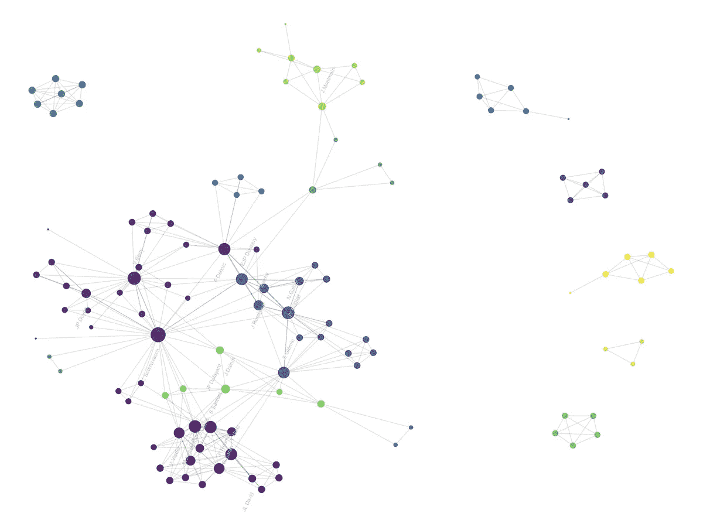*

*[Image Source](https://www.data-to-viz.com/story/AdjacencyMatrix.html)*

*需要仔细计算节点和链接的数量。如果太多，图表将开始看起来像一个毛球，变得无法阅读。*

*像其他类型的可视化一样，这种方式在交互时效果最好。*

*上面的网络图是研究人员如何出现在其他研究人员的科学论文中的可视化。研究人员是节点，线是相互联系的纽带。*

*点击此处了解更多关于这个可视化项目的信息。*

# *何时使用网络图*

*当您想要显示不同类别中的事物之间的联系以及这些类别如何相互联系时，请使用这种类型的信息可视化。*

*例如，您可以使用网络图来显示文学人物之间的联系，或者像迪士尼皮克斯世界中的人物那样更有趣的东西。*

# *14.小提琴情节*

*小提琴图类似于箱线图，但可以更深入地理解变量的分布。在这种类型的数据可视化中，每个“小提琴”代表一个组或变量，小提琴的形状显示了该特定变量中数据点的密度。*

*这里有一个小提琴情节的例子。*

*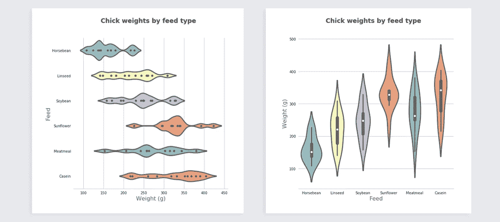*

*[Image Source](https://mode.com/blog/violin-plot-examples)*

*上面的例子显示了小鸡体重和饲料类型之间的关系。你可以在这里找到更多关于小提琴的情节和这个特定的。*

*箱线图和小提琴图的主要区别在于，后者显示了更多的信息，例如几个组或变量的分布和排名。*

# *何时使用小提琴情节*

*尽管小提琴图比箱线图显示更多的信息，但它并不常用。*

*当您处理非常大的数据集并需要可视化单个观察值和分布时，这种类型的信息可视化特别有用。*

*Violin 图可以垂直和水平形状创建，这取决于您的数据类型和数据集的大小。*

# *15.实时跟踪器*

*实时可视化数据是为任何项目增添活力的好方法。任何类型的正在进行的数据都可以通过实时跟踪器可视化。*

*天气模式、空气质量、体育比分、列车时刻表延误和交通状况是一些可以使用实时跟踪器可视化的数据类型。*

*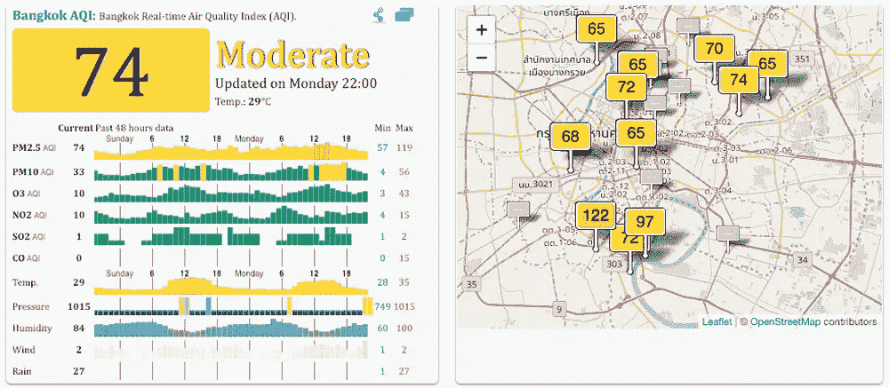*

*[Image Source](https://aqicn.org/city/bangkok/)*

*上面的例子是一个实时追踪器，显示了泰国曼谷市的空气质量和污染指数。每个住在曼谷的人都使用这个追踪器来查看他们那天是否真的需要外出，以及他们可能需要使用哪种类型的呼吸面罩。*

*在 177 分的一天，学校取消室外体育课，有呼吸问题的人被建议留在室内。*

*[点击这里查看这个交互式实时追踪器。](https://aqicn.org/city/bangkok/)*

# *何时使用实时追踪器*

*实时追踪器非常适合为公众提供服务的实用应用和网站。它非常适合显示不断变化的数据，这些数据会影响决策和结果。*

*[Visme 图形引擎](https://www.visme.co/graph-maker/)有许多图表、图形和数据小部件，可以可视化实时数据。尝试一个，看看对你的项目有没有帮助。*

*您可以使用 Visme 编辑器中的任何数据图表创建实时信息可视化。只需从 Excel 或 Google 工作表中上传您的数据，并展示实时或现场数据。你可以把它用在图表上，甚至是地图上。*

# *16.视觉年度报告*

*如果你的公司有一个强大的创意团队，那么你可能已经在发布可视化的年度报告了。但是，如果你每年都发布一大堆螺旋装订的电子表格和冗长乏味的文本，也许是时候改变一下了。*

*下面的视觉年度报告是由凤凰传媒为透明媒体设计的。*

**

*[Image Source](https://www.creativebloq.com/graphic-design/annual-report-design-2131905)*

*每年最好的视觉年度报告通常由创意人员和惊讶的客户在网上发布。有些甚至赢得了设计奖。现在，这是一个营销渠道，我敢打赌，你甚至没有想到！*

*上面的年度报告获得了一个通信设计红点奖。他们使用激光切割方法，重建了一个剧院舞台，将公司的愿景和价值观可视化。*

# *制作自己的可视化年度报告*

*一份出色的可视化年度报告可以遵循一本书或一本电子书的经典格式。*

*使用 Visme，您可以创建许多不同种类的视觉丰富的图表和图形，以包括在您的年度报告中。尝试在有趣的形状作物和彩色字体中加入摄影。*

*在 Visme 中创建可视化年度报告不需要成为设计师。但是如果真的没有时间自己做，也可以请设计师或者设计机构帮你做。*

*Visme 有许多漂亮的[年度报告模板](https://www.visme.co/templates/reports/)，你可以为自己的公司定制。在演示文稿、信息图表和可打印文档之间进行选择。只需将您的内容插入到模板中，您就可以获得一份直观且富有创意的年度报告！*

# *17.亲笔文件*

*2014 年，微软创建了一个交互式数字表格，其屏幕可以以 3D 形式显示数据。*

*它非常类似于全息投影的样子，但仍然显示在 2D 表面上。这种类型的可视化仍在增长，并将在未来几年继续增长。*

*从 2014 年的第一批全息桌子开始，微软现在有了 Hololens，这是一套 VR 护目镜，让用户以全息形式看到数据。*

*在下面的视频中，你已经看到了全息桌子的作用。如你所见，它适用于许多类型的数据，从地图到星球大战纪念品。*

# *何时使用全息可视化*

*作为博物馆展览的一部分，全息摄影桌将是令人惊讶的，让参观者发现数据。关于科学、地理或医学的教育项目也可以使用这种类型的可视化。*

*对于小数据集或者如果你需要一篇文章的视觉效果，它可能不是合适的工具。这种类型的信息可视化绝对适用于大规模的情况。*

# *18.虚拟现实*

*另一个将数据可视化的创新想法是使用虚拟现实。几乎每一种信息可视化都可以变成虚拟现实体验。*

*看看这个由 Ogilvy CommonHealth Worldwide 和 Patient Connect 合作创建的很酷的虚拟现实可视化患者数据。*

# *何时使用虚拟现实可视化*

*在会议和研讨会上，虚拟现实仍然很受欢迎。不管你在哪个领域，给你的客人一副虚拟现实护目镜和一个指针，炫耀你的数据。*

*让他们发现你的信息，让他们惊叹这一切看起来有多神奇！*

# *19.增强现实*

*增强现实是这些年来悄悄进入我们生活的东西之一。*

*虚拟现实和现实生活的混合，增强现实所做的是将你的周围环境和数字信息混合在一起。这可以通过特殊的 AR 护目镜实现。*

*这是一位艺术家对增强现实将如何发展的描绘。*

**

*[Image Source](https://hackernoon.com/can-augmented-reality-solve-mobile-visualization-f06c008f8f84)*

*有人试图让这成为一种趋势，比如几年前的谷歌眼镜。实际上，新的谷歌眼镜现在使用人工智能，并开始融入增强现实。*

*可视化和增强现实之间的联系是，可以显示用户正在查看的任何数据。想法和用途真的是无穷无尽的。从超市货架上展示的即时饮食信息到查看公交车时的交通和天气信息。*

*微软最近发布了 Hololens，这是一套看起来像巨大太阳镜的 AR 镜头，适用于需要一次显示大量数据的大企业，就像在工厂车间一样。*

**

*[Image Source](https://mspoweruser.com/microsoft-research-talks-about-holograph-an-interactive-3-d-data-visualization-research-platform/)*

*点击此处了解更多关于微软 Hololens 的信息。*

*我们迫不及待地想看到所有这些技术如何发展，这样我们就可以用它来创建更好的数据可视化！*

# *何时使用增强现实可视化*

*随着增强现实越来越受欢迎，大多数大公司应该考虑将它纳入他们的剧目。由于几乎任何类型的数据都可以使用增强现实来显示，所以首先需要弄清楚可以创建什么来帮助消费者。*

*增强现实可视化是作为应用程序创建的，然后加载到 AR 镜头上。*

*例如，一个艺术画廊可以创建关于展出艺术品的增强现实可视化。显示的数据可以是历史性的、信息性的或娱乐性的。一幅名画可以展示艺术家的原始草图来展示创作过程。*

# *你是如何使用信息可视化的？*

*信息可视化的使用是多种多样和创造性的。*

*有这么多不同的选择，很难做出选择。我们希望这篇文章已经帮助你看到了新的和创新的方法来可视化你的数据和信息。*

*上面的许多信息可视化想法都可以用 Visme 中的[工具来创建。试试](http://visme.co)[地图引擎](https://www.visme.co/map-generator/)、[图形引擎](https://www.visme.co/graph-maker/)或者[直观数据小工具。](https://visme.co/blog/visual-statistics/)可以免费报名！*

*我们错过了任何类型的创造性信息可视化吗？我们希望收到您的来信！请在下面的评论区告诉我们您的建议、反馈和问题。*

**本帖* [*原版*](https://visme.co/blog/information-visualization/) *最早出现在 Visme 的* [*视觉学习中心*](http://blog.visme.co/?source=post_page---------------------------) *。**