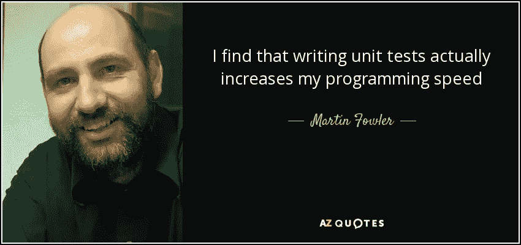
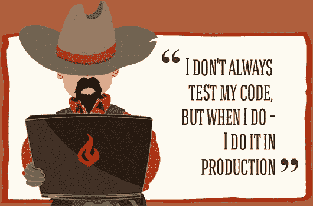

# 开发人员避免编写测试的两个原因

> 原文：<https://towardsdatascience.com/2-reasons-why-developers-avoid-writing-tests-7e55515776e9?source=collection_archive---------11----------------------->

Photo by [Kevin Ku](https://unsplash.com/@ikukevk?utm_source=medium&utm_medium=referral) on [Unsplash](https://unsplash.com?utm_source=medium&utm_medium=referral)

编写测试代表了软件开发中经常被忽视的几个阶段之一，尽管它可能是最重要的阶段之一。开发人员提到它，通常要么不舒服，不喜欢为他们的代码编写测试，要么有很多借口根本不编写测试。

Therac-25 放射治疗机[中的一个软件错误导致](https://www.newscientist.com/gallery/software-bugs/)五名患者在接受大剂量 X 射线照射后死亡。骑士资本[在半小时内损失了 5 亿美元，原因是一个软件漏洞允许计算机在无人监管的情况下买卖数百万股股票。](https://www.newscientist.com/gallery/software-bugs/)

这些和其他许多故事讲述了看似不重要的错误实际上如何导致如此多的悲剧灾难。

当我们知道有多少计算机程序正在广泛地成为我们生活的每一个领域的一部分，并且它们的安全性、稳定性和正确性在我们的生活中具有至关重要的意义时，问题就出现了:为什么开发人员仍然避免编写测试？

测试是一个开发领域，其中软件的特定功能根据设定的标准进行测量。可能有很多原因可以解释为什么不强调写作，尤其是在小项目中，但是我们会提到两个最常见的原因。

# 1.只是太花时间了

编写测试似乎比直接进入实现部分花费了太多的时间，尤其是当你应用测试驱动开发(TDD)的时候。这在短期内是正确的，但是如果我们考虑到你可能需要的时间来修复所有可能通过编写测试来避免的错误，那么编写测试实际上可以节省时间甚至金钱。

测试不能消除错误，但是可以极大地减少错误。它们甚至让您更有信心，因为您最近的更改和您必须做的重构不会破坏任何现有的功能。

您还节省了时间，并且保护了您现有的实现免受最近加入您的团队的没有经验的程序员的影响，仅仅因为他们的更改可能导致测试失败。当测试失败时，你就会意识到出了问题。

没有编程相关背景的项目经理，以及对可能突然出现的编程复杂性了解不多的项目经理，往往对他们团队中的开发人员有很高的期望。他们想要快速的实现和快速的生产就绪代码，并且认为推迟严格的截止日期是不合理的。

尽管这些情况可能会让你陷入在遵循最佳实践或经历*快速且肮脏的*模式之间的艰难境地，但你应该尝试一些无论如何都要坚持的专业原则。你应该尽最大努力让你的经理相信良好实践的重要性，以及从长远来看它们是如何带来回报的。如果他不服气，那么你可以考虑随时换个工作场所。

# 2.写测试的恐惧

毫不奇怪，软件开发人员将大部分工作时间花在阅读、写作或讨论如何通过代码解决问题上。因此，他们对它有着非常强烈的情感依恋，更愿意把它当作自己的宝贵财产。

他们相信自己已经有了足够的经验，能够不费力地应对各种可能的情况。然而，他们通常可能有内在的不安全感，这困扰着他们编写测试。他们很快将他们的代码更改推到主分支，因为他们想通过快速完成任务在经理面前看起来像一个有生产力的员工，现在担心编写测试实际上可能会暴露他们代码中的错误。他们害怕被暴露为不能写出无错误代码的普通 T2 程序员。

你不应该让这种自我意识命令你放弃编写测试。虽然你可能会觉得不舒服，不聪明，以及所有那些怕丢脸的混账感觉，但最终，你还是要为自己的工作负责。这是避免无数病毒的唯一方法，这些病毒可能会夺走数百万人的生命，并导致其他大规模的 havocs。

测试允许您快速地对代码进行大的修改，因为您确信一切都正常工作。当你习惯于为你的代码编写测试时，你通常能够更快地完成你的工作，因为当你看到红灯时，你会有即时的视觉反馈。因此，你也能写出更好的代码，感受到更少的压力，并最终得到提升，因为你正在做的工作带来了更多的价值。

编写测试并不意味着您必须编写两倍的代码。这通常意味着你只是在反复检查每件事情是否正常工作，而不是让客户发现边缘情况的错误。

你应该有勇气克服你对写测试的恐惧，改变你对这个非常重要的过程的情绪。你应该充满热情和活力，仅仅因为你正在遵循软件开发的一些最佳实践，并帮助你的团队构建稳定的项目。

# 腾出时间进行测试

可能有些项目不需要测试，但是在大多数情况下，测试是非常受欢迎的。

当你在编写好的测试时，你也在为你的代码准备好文档。

不要误解我的意思:有很多开发人员编写测试，仔细分析并确保他们覆盖了每一种边缘情况。这篇文章的目的是提高意识，并邀请更多的开发人员使用他们自己的测试工具。此外，我希望它能让项目经理们大开眼界，他们经常忽视推迟代码实现中人力不可能达到的最后期限的需要。

虽然编写测试可能不是避免每个软件错误出现的最终方法，但它仍然是增加拥有更稳定软件项目的机会的一个非常强大的方法。

感谢您抽出时间阅读。

**请关注我的** [**推特**](https://www.twitter.com/fatosmorina/)