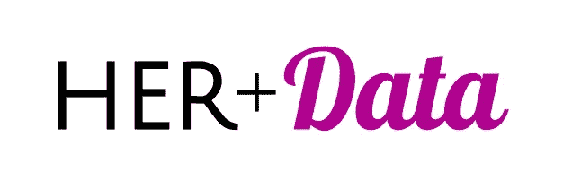
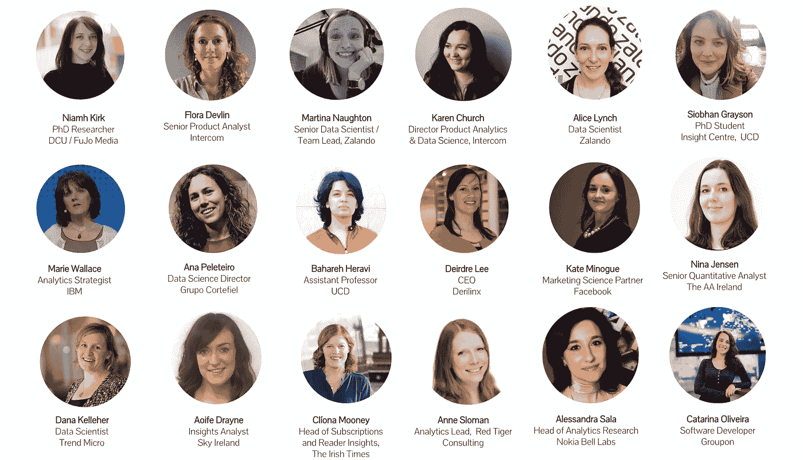
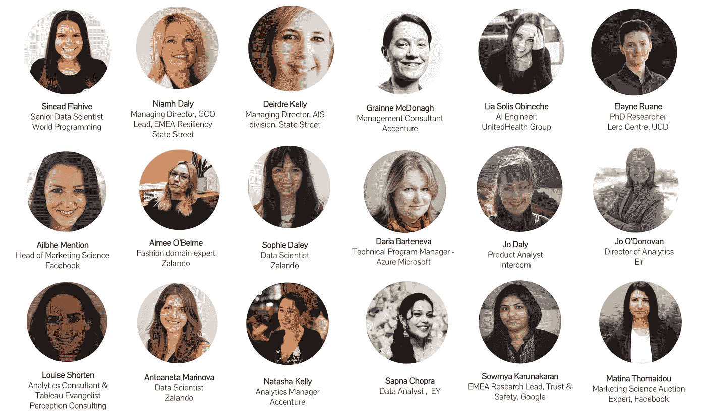
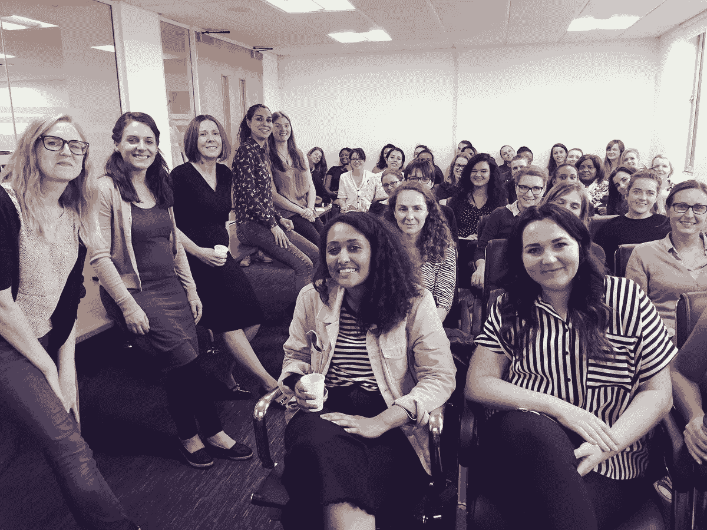

# 2 年后——创建她的+数据

> 原文：<https://towardsdatascience.com/2-years-on-founding-her-data-14989747b12e?source=collection_archive---------29----------------------->

2017 年 2 月，我创建了[HER+Data](http://herplusdata.org/)——一个为女性或那些认为自己是女性并热爱数据的人服务的社区。我的目标是把从事数据工作或喜欢从事数据工作的女性聚集在一起——互相支持和促进，分享经验和知识，谈论数据。我渴望创造一个空间，让从事分析、数据科学和机器学习的女性能够建立真正有意义的联系，并相互激励。

这个社区已经发展到在都柏林有 600 名注册会员，在 T4 曼彻斯特有一个欣欣向荣的姐妹分会，由出色的 Rachael Ainsworth 组织。我们与都柏林一系列优秀的公司合作举办了 13 场精彩的活动，并与 36 位鼓舞人心的女性进行了交谈！

*Our inspiring HER+Data Speakers to date — Note the title(s) above may not represent the current role/company for some of the speakers.*

有人多次问我当初为什么创建这个社区，我对其他社区建设者有什么建议，特别是关于他们如何吸引更多女性参与者和演讲者参加他们的活动。

以下是我个人对这段旅程的一些反思！

# #1 从任务开始

在外生活了 8 年后，我回到了爱尔兰，在都柏林，我注意到了科技领域的一个缺口。虽然有很多与数据相关的聚会，但很少有人关注女性，而那些关注女性的聚会都是围绕编码展开的。这就是她+数据的最初想法的来源。

我想创建一个专注于彼此分享经验和知识的社区。在我的职业生涯中，我一直抽出时间与他人联系、学习和分享经验，我总是惊讶于倾听他人如何解决问题和应对挑战的力量。

我还想创建一个社区，帮助解决数据科学行业面临的一些多样性挑战。作为技术领导者和数据团队的构建者，我非常关心多样性。研究一次又一次地表明，多元化的团队[更具创新性](https://www.fastcompany.com/40515712/want-a-more-innovative-company-simple-hire-a-more-diverse-workforce)，[更聪明](https://www.nytimes.com/2015/01/18/opinion/sunday/why-some-teams-are-smarter-than-others.html?_r=1)，他们最终导致[更好的表现](https://www.mckinsey.com/business-functions/organization/our-insights/why-diversity-matters)。然而，据估计，只有 15%-25%的数据科学家是女性。

分析、数据科学和机器学习正被用于推动战略业务决策、推动行动以及构建跨各种领域的创新产品和解决方案。然而，在绝大多数情况下，女性并没有发挥重要作用。我愿意帮助改变那个*。*

所以我的目标是创建一个社区，在那里从事数据工作的女性可以真正地相互联系和学习；一个真正支持和提升分析和数据科学领域女性的社区；一个有望鼓励更多女性从事数据相关职业的社区。

*请注意，虽然 HER+Data 的核心目标是提升女性在数据科学和分析领域的地位，但我们也欢迎任何支持我们事业的人，无论性别或技术背景如何。*

# #2 选择一个包容的名字

当我第一次创建 HER+数据社区时，我称之为 XX+数据，其中“XX”是一个生物学参考。我选择这个名字是因为它短小精悍，而且我认为它听起来很巧妙。我没有意识到我无意中选择了一个没有完全包含所有女性的名字。

感谢社区和潜在成员的反馈，我意识到 XX+Data 是一个排斥跨性别的名字，对我们的跨性别盟友是一种伤害。虽然我们的核心使命是关注女性，但我希望它能包容所有女性，因此我们决定将社区更名为 HER+Data。

如果你正在考虑建立一个本地社区或聚会，你会想“名字有什么意义？”，答案是很多。名字很重要，如果你的核心目标是创造一个包容的空间，有一个包容的、代表你的事业的名字是很重要的。

# #3 设定基调，让人们感到舒适

当我建立她的+数据时，我承诺会有很棒的内容、笑声和一屋子来自不同背景的数据女性。我希望我们的活动是有趣的、非正式的、受欢迎的和吸引人的。我希望人们真正期待这些活动，我希望他们回来。主要是我希望与会者感到舒适。

我们决定首先将重点放在由不同的演讲者分享他们鼓舞人心的职业故事的简短演讲上。我热衷于强调，进入数据相关职业有多种途径，通常是非线性的。

我们在 2017 年 5 月的第一次活动充满了兴奋、笑声和交谈。我们的演讲者组合——一些人处于职业生涯的早期，另一些人处于终身职位——似乎真的引起了共鸣，我们的演讲者分享的各种故事似乎真的触动了我们社区的神经。

在第一次活动和之后的每一次活动中，我都努力做一些事情来帮助设定基调，为每个人创造一个舒适的环境。

*   我欢迎大家。我自我介绍。我对别人有真正的兴趣。
*   我们倾向于提供饮料和小吃，所以像任何一个好的主人一样，给人们指出正确的方向，并鼓励人们自己动手是一个很好的起点！
*   我重复社区的核心使命和历史，以便参与者知道我们在努力做什么。
*   除了坚定的使命之外，我们还有一套行为准则来帮助阐明对社区成员的期望。网上有很多精彩的行为准则。我们使用一个改编自 [Plone Foundation](http://plone.org/foundation/materials/foundation-resolutions/code-of-conduct) 并在[知识共享署名-同样分享 3.0 非授权许可下授权的软件](http://creativecommons.org/licenses/by-sa/3.0/)。这同样有助于为你的活动和社区定下基调。
*   我提醒与会者，如果他们有建议；愿意以任何方式贡献、主持或帮助；或者如果想在未来的聚会上发言，请联系我们或在活动结束后与我们交流。
*   最后，我试着做我自己，我试着展示我对社区的热情。如果你心不在焉，人们会看出来的。

# #4 记住，这需要一支军队

第一次 HER+Data 活动上发生了两件事，都同样史诗！

(1)[Rachael ains worth](https://twitter.com/rachaelevelyn?lang=en)——当时是都柏林高级研究所的博士后研究员——参加了我们的启动仪式。她非常喜欢这个活动，所以她渴望参与其中。关键是她在几周内就搬到了曼彻斯特，在 Jodrell Bank 天体物理中心从事射电天文学的研究助理。雷切尔和我决定边喝咖啡边见面，把事情谈清楚。喝完那杯咖啡后，雷切尔主动提出在曼彻斯特领导并组织一个名为“她+数据”的姐妹分会。

Rachael 于 2017 年 9 月在曼彻斯特科学园举办了第一届 HER+Data MCR 活动。15 次聚会和近 600 名会员之后，曼彻斯特分会继续壮大。

我能说的就是谢谢你，雷切尔，你太棒了！

HER+Data MCR 1 Year Anniversary Event in Sep 2018 — hosted [@intechnica](https://twitter.com/intechnica) — Rachael invited me to give a talk at the 1 year anniversary event :) Witnessing what she’s has built in Manchester and the impact she’s had on others was really inspiring!

(2)[Martina Naughton](https://twitter.com/mnaughton_ire)——Zalando 的高级数据科学家和团队负责人——欣然同意在我们的 HER+Data 启动活动上做一次演讲，并很快同意与我共同领导和组织 HER+Data 都柏林社区！

我们坚持举办活动，每 1 或 2 个月举办一次，每次聚会通常会有 3 位新的演讲者。组织和协调这些活动需要时间和精力:寻找场地、赞助商和新的发言人、传播活动信息和发展社区。我一个人做所有这些会非常困难，而且我们会冒着缺乏多元化视角和技能的风险，以使社区和我们的活动取得成功。我非常幸运有像 Martina 这样的人在她的+数据上合作。非常感谢 Martina——你太棒了！

除了出色的联合组织者，我们还得到了主办和赞助我们活动的公司的大力支持，包括 Intercom、Zalando、Groupon、埃森哲、脸书、谷歌、Statestreet、微软和 Sky Ireland。Intercom 和 Zalando 实际上已经举办了多次活动！没有这样的公司，像 HER+Data 这样的社区是不可能的，所以非常感谢我们的盟友。

# #5 寻找演讲者是一项挑战

后来有 36 位出色的女性演讲者，我希望我可以说这变得更容易了，但总的来说，我认为找到优秀的演讲者是她+数据中最具挑战性的部分之一。以下是我发现的一些有用的东西:

*   我亲自接触潜在的演讲者，与他们分享我们的使命，并告诉他们为什么我对让他们发言感兴趣。
*   我有明确的目标和期望。在我们的情况下，我们的会谈很短(10 分钟)，我们的活动是非正式的，所以我强调这一点。在我们的活动开始之前，我会给所有的演讲者发一封电子邮件，给他们一组示例主题来帮助启发他们。
*   我利用每次聚会/活动提醒与会者，我一直在寻找发言人，如果有人愿意自愿，请来找我。我在每个事件的开始和结束时都会提到这一点。
*   我伸出手，依靠我的专业网络推荐潜在的演讲者。
*   我一定要感谢那些在活动前后都做志愿者的了不起的演讲者
*   我在社交媒体——Twitter 和 LinkedIn——上分享详细信息，以帮助宣传和提升那些友好地同意在我们的活动中发表演讲的演讲者。

# #6 最后，会有高潮和低谷。

工作确实忙的时候。当我累了或者有压力的时候。当我蹒跚学步的孩子拒绝睡觉时。或者平衡一切感觉不可能的时候，我有时候会质疑她的+数据是不是我花时间去做的正确的事情。

但是后来我们有了另一个活动，我认识了更多了不起的女人。我可以联系、学习和分享。我看到熟悉的面孔回来参加另一个活动。我第一次见到新来的人，想知道会发生什么。对话开始了，嗡嗡声开始了，我准备好了！

我们收到了来自社区的积极反馈，这真的很有帮助——知道她的+数据促进了联系，帮助女性找到了自己的路，并鼓励更多女性追求或推动数据职业真的很有价值。

所以我的建议是——随遇而安:)

> 非常感谢所有帮助她实现+数据的人们。特别是我的协办单位 [***玛蒂娜***](https://twitter.com/mnaughton_ire) ***、HER+Data MCR 章节导语***[***Rachael******、主办我们活动的优秀公司以及 36 位出色的演讲者！***](https://twitter.com/rachaelevelyn)

*Karen 是* [*Intercom*](https://www.intercom.com/home) *的产品分析&数据科学总监，她领导着一个由产品分析师、数据科学家和数据工程师组成的团队，帮助设计、开发和衡量我们的产品是否成功。她的团队使用数据来推动战略决策，为产品路线图提供信息，并构建新的数据产品。在 Intercom 之前，Karen 在工业研究实验室(湾区的雅虎研究和巴塞罗那的 Telefonica 研究)工作了 8 年，在移动人机交互(HCI)、数据科学和应用机器学习的交叉领域进行了一系列科学研究。Karen 拥有 Dublin 大学(UCD)的计算机科学博士学位和 Blanchardstown 理工学院(ITB)的理学学士学位。她是* [*WiDS*](https://www.widsconference.org/) *都柏林大使兼*[*HER+Data*](https://www.meetup.com/HER-Data/)*创始人。*