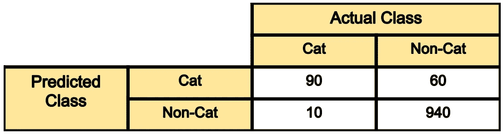
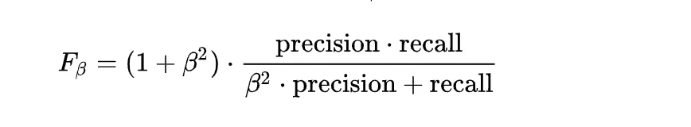
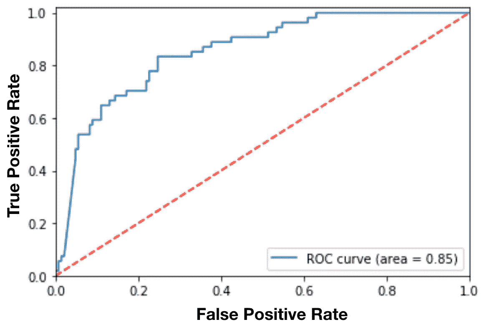
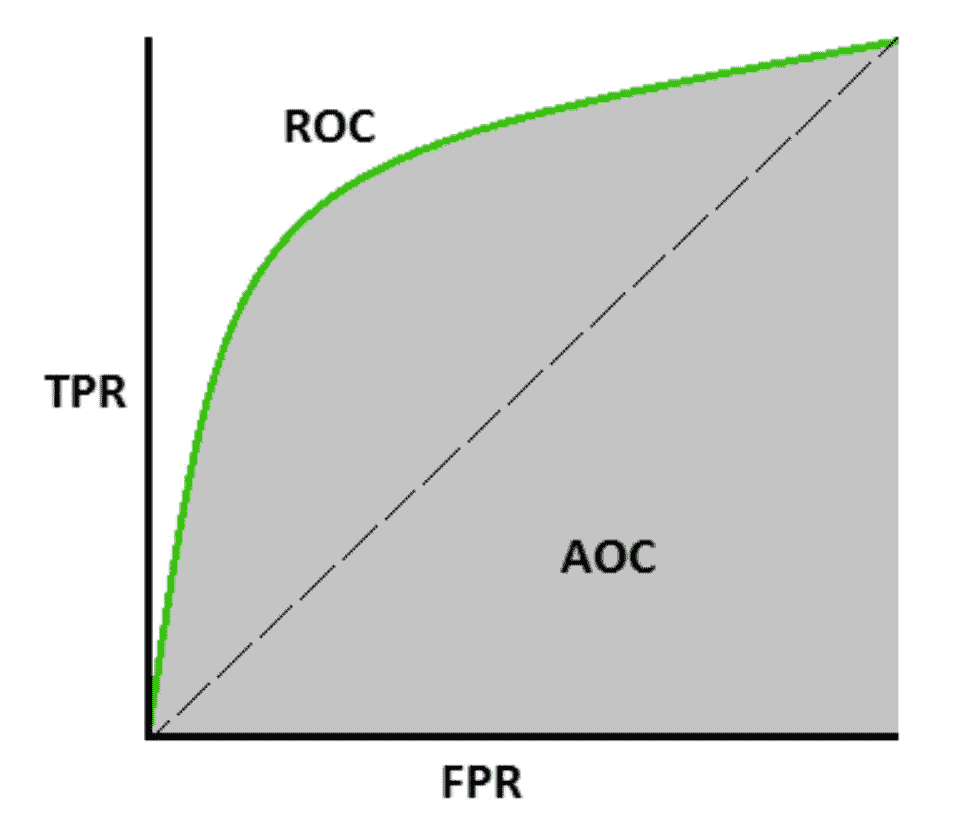

# 20 个流行的机器学习指标。第 1 部分:分类和回归评估指标

> 原文：<https://towardsdatascience.com/20-popular-machine-learning-metrics-part-1-classification-regression-evaluation-metrics-1ca3e282a2ce?source=collection_archive---------1----------------------->

## 介绍评估分类、回归、排名、视觉、NLP 和深度学习模型的最重要指标。

***注:*** 本帖分两部分。**在第一部分**(当前帖子)中，我将谈论 10 个广泛用于评估分类和回归模型的度量标准。在第二部分中，我将谈论用于评估排名、计算机视觉、NLP 和深度学习模型的 10 个指标。

# 介绍

在评估机器学习(ML)模型时，选择正确的指标至关重要。提出了各种度量来评估不同应用中的 ML 模型，我认为在这里提供流行度量的总结可能会有所帮助，以便更好地理解每个度量以及它们可以用于的应用。在一些应用程序中，查看单个指标可能无法提供您正在解决的问题的全貌，您可能希望使用本文中讨论的指标的子集来对您的模型进行具体评估。

**在这里，我总结了 20 个用于评估机器学习模型的指标**。我根据这些指标主要用于的 ML 模型/应用将它们分成不同的类别，并涵盖了在以下问题中使用的流行指标:

*   *分类指标(准确度、精确度、召回率、F1 分数、ROC、AUC 等)*
*   *回归度量(MSE，MAE)*
*   *排名指标(MRR、DCG、NDCG)*
*   *统计指标(相关性)*
*   *计算机视觉指标(PSNR、SSIM、IoU)*
*   *NLP 指标(困惑度，BLEU 评分)*
*   *深度学习相关指标(初始得分、Frechet 初始距离)*

不需要提及的是，在一些应用程序中使用了各种其他度量(FDR、FOR、hit@k 等。)，这里我就跳过了。

**作为旁注**，同样值得一提的是**度量不同于损失函数**。损失函数是显示模型性能的度量的函数，并且用于训练机器学习模型(使用某种优化)，并且通常在模型的参数中是可微分的。另一方面，度量用于监控和测量模型的性能(在训练和测试期间)，并且不需要可区分。然而，如果对于某些任务，性能度量是可微分的，那么它既可以用作损失函数(可能添加了一些正则化)，也可以用作度量，例如 MSE。

> 这里讨论的一些指标可能非常琐碎，但是为了本文的完整性，我决定涵盖它们。因此，请随意跳过你熟悉的内容。没有任何进一步的原因，让我们开始我们的旅程。

# 分类相关指标

分类是各种工业应用中机器学习中最广泛使用的问题之一，从人脸识别、Youtube 视频分类、内容审核、医疗诊断到文本分类、Twitter 上的仇恨言论检测。

支持向量机(SVM)、逻辑回归、决策树、随机森林、XGboost、卷积神经网络、递归神经网络等模型是一些最流行的分类模型。

有各种各样的方法来评估一个分类模型，下面我将介绍一些最流行的方法。

## 1-混淆矩阵(不是一个指标，但知道它很重要！)

让我们首先确保我们知道分类问题中使用的基本术语，然后再详细了解每个指标。**如果你已经熟悉这些术语，你可以跳过这一节。**

分类性能中的一个关键概念是**混淆矩阵**(又名误差矩阵)，它是模型预测与真实标签的表格可视化。混淆矩阵的每一行代表预测类中的实例，每一列代表实际类中的实例。

让我们用一个例子来说明这一点。让我们假设我们正在构建一个二元分类来将猫图像与非猫图像进行分类。假设我们的测试集有 1100 张图片(1000 张非猫图片，100 张猫图片)，混淆矩阵如下。

Figure 1\. A sample confusion matrix

*   在 100 张猫图片中，模型已经正确预测了其中的 90 张，并且错误分类了其中的 10 张。如果我们将“猫”类称为阳性，将非猫类称为阴性，那么预测为猫的 90 个样本被认为是**真阳性**，预测为非猫的 10 个样本是**假阴性**。
*   **在 1000 张非猫图片**中，模型已经正确分类了其中的 940 张，并且错误分类了其中的 60 张。940 个正确分类的样本称为**真阴性**，60 个称为**假阳性**。

如我们所见，该矩阵的对角线元素表示不同类别的正确预测，而非对角线元素表示错误分类的样本。

现在我们对混淆矩阵有了更好的理解，让我们进入实际的度量。

## 2-分类准确性

分类准确度也许是人们能想象到的最简单的度量，它被定义为正确预测的数量除以预测的总数，再乘以 100 T2。因此，在上述示例中，1100 个样本中的 1030 个被正确预测，导致分类准确度为:

**分类准确率**=(90+940)/(1000+100)= 1030/1100 = 93.6%

## 三精度

在许多情况下，分类精度并不是模型性能的良好指标。其中一种情况是当你的班级分布不平衡时(一个班级比其他班级更频繁)。在这种情况下，即使您将所有样本预测为最频繁的类，您也会获得很高的准确率，这根本没有意义(因为您的模型没有学习任何东西，只是将所有东西预测为顶级类)。例如，在我们上面的猫与非猫分类中，如果模型预测所有样本都是非猫，则结果将是 1000/1100= 90.9%。

因此，我们还需要查看特定于类的性能指标。精度是这样的度量之一，它被定义为:

**精度=真 _ 正/(真 _ 正+假 _ 正)**

上述示例中的 Cat 和非 Cat 类的精度可以计算如下:

**Precision _ cat**= #样本正确预测 cat/#样本预测 cat = **90/(90+60) = 60%**

**Precision _ NonCat = 940/950 = 98.9%**

我们可以看到，与猫相比，该模型在预测非猫样本时具有更高的精度。这并不奇怪，因为 model 在训练中看到了更多非猫图像的例子，这使得它能够更好地对该类进行分类。

## 4-召回

召回是另一个重要的指标，它被定义为模型正确预测的一类样本的比例。更正式地说:

**召回=真 _ 正/(真 _ 正+假 _ 负)**

因此，对于我们上面的例子，猫和非猫类的召回率可以被发现为:

**Recall_cat= 90/100= 90%**

**Recall _ NonCat = 940/1000 = 94%**

## 5- F1 分数

根据应用的不同，您可能希望给予更高的召回或精度优先级。但是在许多应用中，召回率和精确度都很重要。因此，很自然会想到将这两者结合成一个单一指标的方法。**一个结合了精确度和召回率的流行指标被称为 F1 分数**，它是精确度和召回率的调和平均值，定义为:

**F1-得分= 2 *精度*召回/(精度+召回)**

因此，对于我们在图 1 中使用混淆矩阵的分类示例，F1 分数可以计算为:

**F1 _ cat = 2 * 0.6 * 0.9/(0.6+0.9)= 72%**

F-score 的通用版本定义如下。正如我们所看到的 F1-score 是 F_ℬ的特例，当时ℬ=为 1。

值得一提的是，在模型的精确度和召回率之间总是有一个权衡，如果你想让精确度太高，你最终会看到召回率下降，反之亦然。

## 6-敏感性和特异性

灵敏度和特异性是医学和生物学相关领域中最常用的另外两个流行指标，定义如下:

敏感度=召回率= TP/(TP+FN)

特异性=真阴性率= TN/(TN+FP)

## 7- ROC 曲线

绘制了**接收器工作特性曲线**，其显示了二元分类器的性能作为其截止阈值的函数。**它本质上显示了不同阈值下的真阳性率(TPR)与假阳性率(FPR)的对比。再来解释一下。**

许多分类模型是概率性的，即它们预测样本是猫的概率。然后，他们将输出概率与某个截止阈值进行比较，如果它大于该阈值，则他们预测其标签为 cat，否则为 non-cat。例如，您的模型可以预测 4 个样本图像的以下概率:**【0.45，0.6，0.7，0.3】**。然后根据下面的阈值，您将获得不同的标签:

截止值= 0.5:预测标签= [0，1，1，0](默认阈值)
截止值= 0.2:预测标签= [1，1，1，1]
截止值= 0.8:预测标签= [0，0，0，0]

如你所见，通过改变阈值，我们将得到完全不同的标签。可以想象，这些场景中的每一个都会导致不同的精确度和召回率(以及 TPR、FPR)。

ROC 曲线基本上找出了各种阈值的 TPR 和 FPR，并绘制了 TPR 对 FPR 的曲线。图 2 显示了一个样本 ROC 曲线。

Figure 2\. A sample ROC curve.

从这个例子中我们可以看出，阳性类别的截止阈值越低，越多的样本被预测为阳性类别，即更高的真阳性率(召回)和更高的假阳性率(对应于该曲线的右侧)。因此，在召回率可能有多高与我们希望限制错误的程度之间有一个权衡(FPR)。

ROC 曲线是一种流行的曲线，用于查看整体模型性能并为模型选择一个好的截止阈值。

## 8- AUC

曲线 (AUC)下的**面积是二元分类器在所有可能的阈值上的性能的综合测量值(因此它是阈值不变的 **)** 。**

AUC 计算 ROC 曲线下的面积，因此它介于 0 和 1 之间。解释 AUC 的一种方法是将模型对随机正例的排序高于随机负例的概率。

Figure 3\. The gray area in this ROC curve denotes the AUC.

在高层次上，模型的 AUC 越高越好。但有时独立于阈值的度量并不是您想要的，例如，您可能关心您的模型召回，并要求它高于 99%(尽管它有一个合理的精度或 FPR)。在这种情况下，您可能希望调整您的模型阈值，使其满足您对这些指标的最低要求(即使您的模型 AUC 不太高，您也可能不在乎)。

因此，为了决定如何评估您的分类模型性能，您可能希望很好地理解业务/问题需求以及低召回率与低精确度的影响，并决定优化什么指标。

从实践的角度来看，输出概率的分类模型优于单个标签输出，因为它提供了调整阈值的灵活性，从而满足您的最低召回率/精确度要求。然而，并不是所有的模型都提供这种很好的概率输出，例如，SVM 不提供简单的概率作为输出(虽然它提供了可用于调整决策的余量，但它不像具有输出概率那样直接和可解释)。

# 回归相关指标

回归模型是另一类机器学习和统计模型，用于预测连续的目标值。它们具有广泛的应用，从房价预测、电子商务定价系统、天气预报、股票市场预测到图像超分辨率、通过自动编码器的特征学习和图像压缩。

线性回归、随机森林、XGboost、卷积神经网络、递归神经网络等模型是一些最流行的回归模型。

用于评估这些模型的度量应该能够处理一组连续的值(具有无限的基数)，因此与分类度量略有不同。

## 9 毫秒

“均方误差”可能是回归问题中最常用的度量标准。它实际上找到了预测值和实际值之间的平均平方误差。

假设我们有一个回归模型来预测西雅图地区的房价(用ŷᵢ来表示)，假设我们有每栋房子的实际售价(用 yᵢ).来表示)则 MSE 可计算如下:

有时人们使用 RMSE 来得到一个以标度为目标值的度量，它本质上是 MSE 的平方根。

看看房价预测，RMSE 基本上显示了你的模型预测房价与目标值(房屋售价)的平均偏差。

## 10 月中旬

平均绝对误差(或平均绝对偏差)是另一个度量标准，用于计算预测值和目标值之间的平均绝对距离。MAE 定义如下:

众所周知，MAE 比 MSE 对异常值更稳健。主要原因是，在通过平方误差的 MSE 中，异常值(通常比其他样本具有更高的误差)在最终误差中得到更多的关注和支配，并影响模型参数。

同样值得一提的是，在 MSE 和 MAE 指标背后有一个很好的最大似然(MLE)解释。如果我们假设特征和目标之间的线性相关性，那么通过分别假设模型误差的高斯和拉普拉斯先验，MSE 和 MAE 对应于模型参数的 MLE。

## 内层比率指标:

还有另一个用于评估回归模型的指标，称为 inlier ratio，它实际上是预测误差小于某个界限的数据点的百分比。该指标主要用于 RANSAC⁴模型及其扩展(稳健估计模型家族)。

# 摘要

在这篇文章中，我们介绍了用于评估分类和回归模型性能的 10 个流行的 ML 指标。在这篇文章的下一部分，我们将介绍用于评估排名、统计、计算机视觉、NLP 和深度学习模型性能的 10 个更高级的指标。

# 参考

[1]伊恩·古德费勒，约舒阿·本吉奥和亚伦·库维尔。”**《深度学习》，**麻省理工出版社，2016 年。

[2] Christopher M. Bishop，**《模式识别与机器学习》，** springer，2006。

[3]杰罗姆·弗里德曼、特雷弗·哈斯蒂和罗伯特·蒂布拉尼。**《统计学习的要素》，**斯普林格统计丛书，2001。

[4] Tilo Strutz，“**数据拟合和不确定性:加权最小二乘法的实用介绍及其他”，** Vieweg 和 Teubner，2010 年。