# 关于 2020 年软件发展趋势的 20 个预测

> 原文：<https://towardsdatascience.com/20-predictions-about-software-development-trends-in-2020-afb8b110d9a0?source=collection_archive---------0----------------------->

## 云、容器、编程、数据库、深度学习、软件架构、Web、App、批处理、流、数据湖、字节码、无代码

Photo by [h heyerlein](https://unsplash.com/@heyerlein?utm_source=unsplash&utm_medium=referral&utm_content=creditCopyText) on [Unsplash](https://unsplash.com/s/photos/future?utm_source=unsplash&utm_medium=referral&utm_content=creditCopyText)

再过几周，2019 年就要结束了，我们将迎来新的一年 **2020** 。对于软件开发行业来说，2019 年是伟大的一年，因为**软件和数字化正在影响每个行业**。这一趋势将持续下去，并将在 2020 年对世界产生更大的影响。

预测未来是困难的。预测软件开发的未来更加具有挑战性和风险性。我没有水晶球。但是我可以用我的**人类学习**来预测 2020 年的软件发展趋势。

我将预测软件开发最重要的栈:**从云到字节码**。

# 1.基础设施:条条大路通云

Photo by [Patrick Tomasso](https://unsplash.com/@impatrickt?utm_source=unsplash&utm_medium=referral&utm_content=creditCopyText) on [Unsplash](https://unsplash.com/s/photos/roads?utm_source=unsplash&utm_medium=referral&utm_content=creditCopyText)

2019 年对于云厂商来说是很棒的一年。不仅初创公司在使用云，保守和关注安全的公司，如**政府组织、医疗保健、采矿、银行、保险甚至五角大楼**也在向云迁移。这一趋势将持续到 2020 年，各种规模和类型的公司都将迁移或至少计划迁移到云。 **Gartner** 最近发布了以下 2020 年的数据:

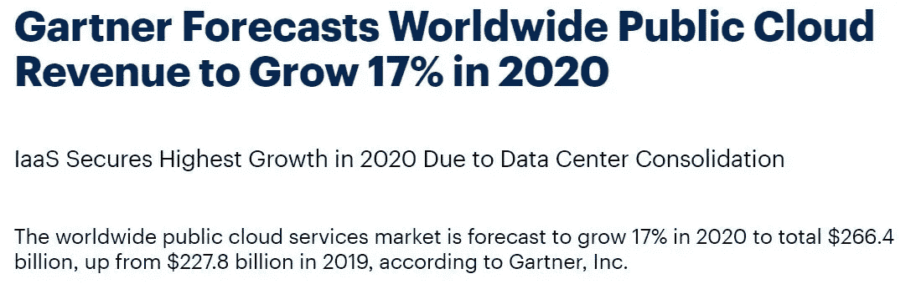

Source: [Gartner](https://www.gartner.com/en/newsroom/press-releases/2019-11-13-gartner-forecasts-worldwide-public-cloud-revenue-to-grow-17-percent-in-2020)

因此，如果你是一名决策者**仍在考虑向云迁移**，也许你应该重新考虑你的策略。如果你是个人开发者，还没有尝试过云计算，2020 年将是一个尝试的绝佳时机。大多数大型云提供商(**亚马逊、微软、谷歌**)都提供免费积分，让用户体验云计算。谷歌在这方面最为慷慨:它提供一年 300 美元的免费信用额度。

[Google Cloud Free Tier](https://cloud.google.com/free/)

# 2.云:AWS 很棒，但其他人会赶上来的

作为第一家云提供商，亚马逊 **AWS** 统治了 2019 年。凭借最广泛的服务组合，亚马逊 AWS 也将在 2020 年继续占据统治地位。正如**科纳仕公司**公布的 2019 年第三季度数据:大型云提供商( **AWS、Azure、GCP** )占有 56%的市场份额，而 AWS 一家占有 32.6%的市场份额:

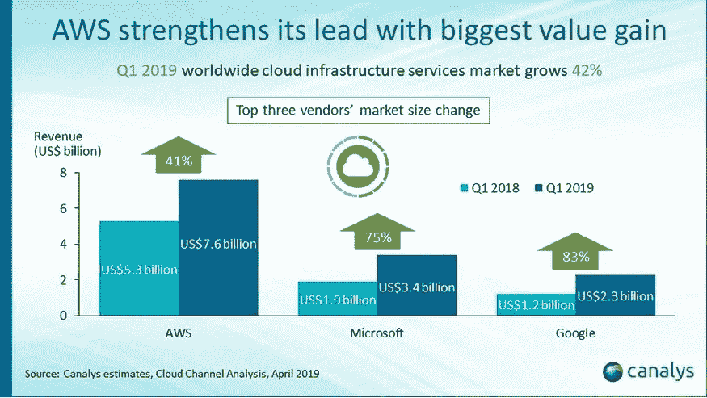

Source: [Canalys](https://www.canalys.com/newsroom/global-cloud-market-Q3-2019)

但其他云提供商也在积极计划缩小与 AWS 的差距。微软专门针对大型企业。最近，微软击败了亚马逊，从五角大楼获得了 100 亿美元的云项目“ **JEDI** ”。这笔交易可以提高 Azure 的声誉，并同样削弱 AWS 的装甲:

Source: [Marketwatch](https://www.marketwatch.com/story/microsoft-fairly-and-squarely-beat-amazon-in-10-billion-pentagon-cloud-contract-2019-12-03)

谷歌正在推动**云本地计算基金会**标准化云操作。谷歌的长期目标是让云迁移变得更容易，以便公司以后可以从 AWS 迁移到 GCP。 **IBM** 最近斥资 360 亿英镑收购了 **RedHat** ，以期在云市场占有一席之地:

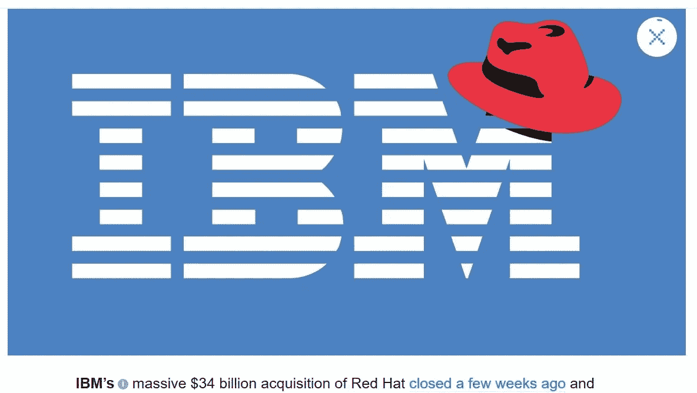

Source: [TechCrunch](https://techcrunch.com/2019/08/01/with-the-acquisition-closed-ibm-goes-all-in-on-red-hat/)

2020 年将会看到更多的收购和合并。此外，许多初创公司会带来新的想法和创新，例如多云服务。在云供应商的激烈竞争中，公司只能从降低价格和更多创新中获利。

# 3.集装箱化:库伯内特斯将会更凉爽

在容器编排领域，曾经有过 **Kubernetes、Docker Swarm、Mesos** 之间的争斗。Kubernetes 已经成为这场斗争的明显赢家，并且变得更加强大。Cloud 是分布式系统，Kubernetes 是 it 操作系统(**分布式 Linux** )。在 kube con+CloudNativeCon North America 2019 中，有 12000 名与会者参加，与 2018 年的同一活动相比,**增长了 50%**。以下是 Kubecon + CloudNativeCon 在过去四年中的指数增长:

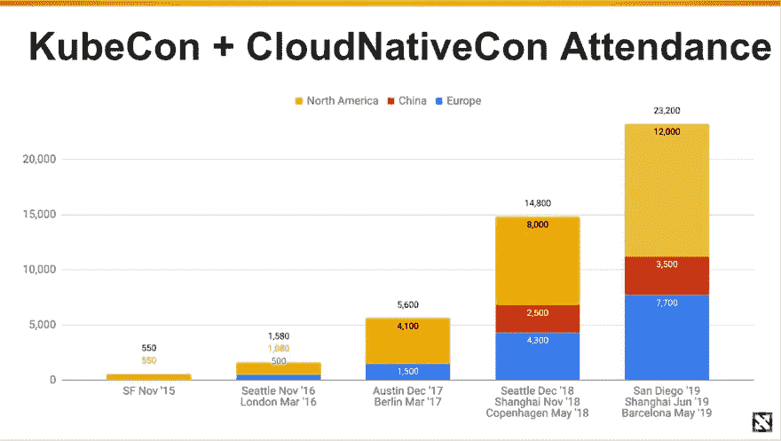

Source: CNCF/Linux Foundation

在不久的将来, **Kubernetes** 不会减速，只会在 2020 年变得更强。你可以在 2020 年将 Kubernetes 作为云原生运动的中坚力量。顺便提一下， **Docker Enterprise** 最近被出售给 **Mirantis** ，交易金额未披露:

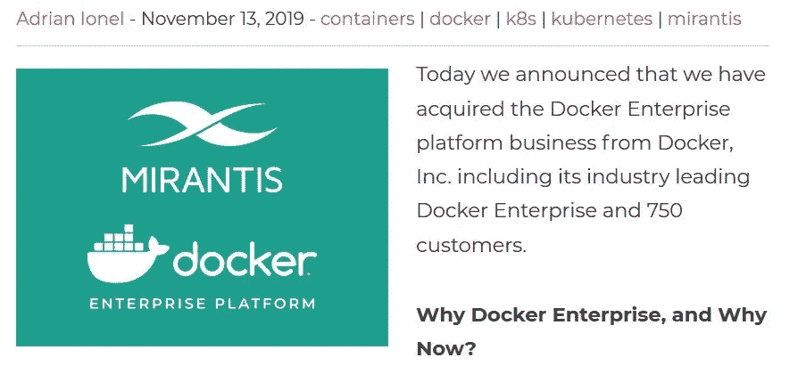

Source: [Migrantis](https://www.mirantis.com/blog/mirantis-acquires-docker-enterprise-platform-business/)

仅在几年前，它是所有关于 Docker，但现在它是所有关于 Kubernetes。Docker 在其全盛时期未能赚钱，几年后当该行业已经离开时，它试图赚钱。另一个例子是，在现代科技世界中，时间就是一切。

# 4.软件架构:微服务将成为主流

在软件架构范式中，向**微服务架构**的转变在 2019 年继续，如谷歌趋势所示:

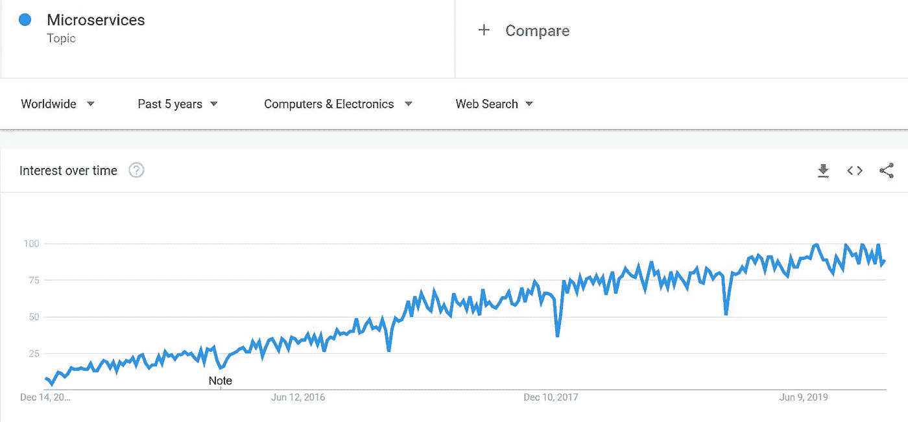

[Google](https://trends.google.com/trends/explore?cat=5&date=today%205-y&q=%2Fm%2F011spz0k) Trends: Microservices

随着行业在 2020 年及以后向云发展，微服务架构将更加占据主导地位。微服务架构兴起的主要原因之一是它**与云原生的快速软件开发**完美契合。在之前的一篇博文中，我解释了微服务架构的基本原理及其优缺点:

 [## 微服务架构:简要概述以及为什么您应该在下一个项目中使用它

### 微服务架构的背景以及微服务架构相对于整体架构的优势

towardsdatascience.com](/microservice-architecture-a-brief-overview-and-why-you-should-use-it-in-your-next-project-a17b6e19adfd) 

我认为还会有一种回归**单片软件**架构的趋势，因为对于许多用例来说，微服务架构是多余的，设计微服务架构具有挑战性。设计微服务架构的最佳实践是什么？我之前在博客上写过一篇总结，可能会有帮助:

 [## 有效的微服务:10 个最佳实践

### 正确实施微服务架构的 10 个技巧

towardsdatascience.com](/effective-microservices-10-best-practices-c6e4ba0c6ee2) 

# 5.编程(整体):Python 将吃掉世界

Photo by [Sharon McCutcheon](https://unsplash.com/@sharonmccutcheon?utm_source=unsplash&utm_medium=referral&utm_content=creditCopyText) on [Unsplash](https://unsplash.com/s/photos/python?utm_source=unsplash&utm_medium=referral&utm_content=creditCopyText)

无论是机器学习、数据分析、数据处理、Web 开发、企业软件开发还是拍摄黑洞 的 [**照片:Python 无处不在。**](http://www.blog.pythonlibrary.org/2019/04/11/python-used-to-take-photo-of-black-hole/)

此外，流行编程语言排名网站 **TIOBE** 将 Python 列为继 **Java 和 C** 之后的第三大流行编程语言:

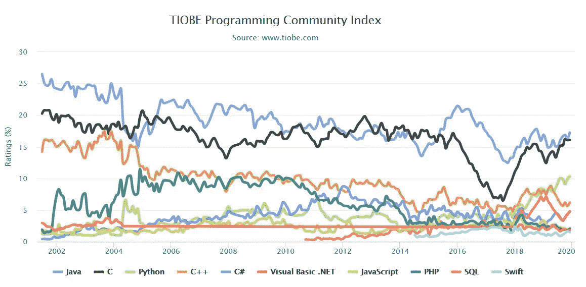

[Source: TIOBE](https://www.tiobe.com/tiobe-index/)

更有意思的是，2019 年 Python 的热度翻了一番(从 5%到 10%)。我知道 TIOBE 索引有很多限制和缺陷，但它是最广泛接受的编程语言排名。我写过一篇文章，列出了十大热门编程语言，Python 名列榜首:

 [## 2020 年最受欢迎的 10 种编程语言

### 针对求职者和新开发人员的顶级编程语言的深入分析和排名

medium.com](https://medium.com/@md.kamaruzzaman/top-10-in-demand-programming-languages-to-learn-in-2020-4462eb7d8d3e) 

**Python** 的崛起将在 2020 年继续，它将缩小与 Java 和 c 的差距，另一种无所不在的编程语言 **JavaScript** 正面临下滑趋势(JavaScript 疲劳？).为什么 Python 会出现这样的热潮？它降低了编程的门槛，拥有优秀的社区，深受数据科学家和新一代开发人员的喜爱。

# 6.编程(企业):Java 和 JVM 将占统治地位

By 22Kartika — Java Island, Source: [Wikipedia](https://commons.wikimedia.org/w/index.php?curid=22898435)

如前一段的 **TIOBE** 索引所示，Java 仍然是这个星球上最占主导地位的编程语言，并将在 2020 年占据主导地位。Java 的运行时， **JVM** 是软件工程中最好的部分之一，为 Java 提供了坚实的基础。许多流行的语言如 Kotlin、Scala、Clojure、Groovy 都使用 JVM 作为它们的运行时。最近，Oracle 更改了 JVM 的许可证:

[Source: Infoworld](https://www.infoworld.com/article/3284164/oracle-now-requires-a-subscription-to-use-java-se.html)

许可证的改变意味着所有使用 Java、Kotlin、Scala 或任何其他 JVM 语言的公司都将受到影响，需要支付巨额订阅费。幸运的是，有 OpenJDK 倡议，它仍将保持 JVM 免费。几家公司将为 JVM 提供企业支持:

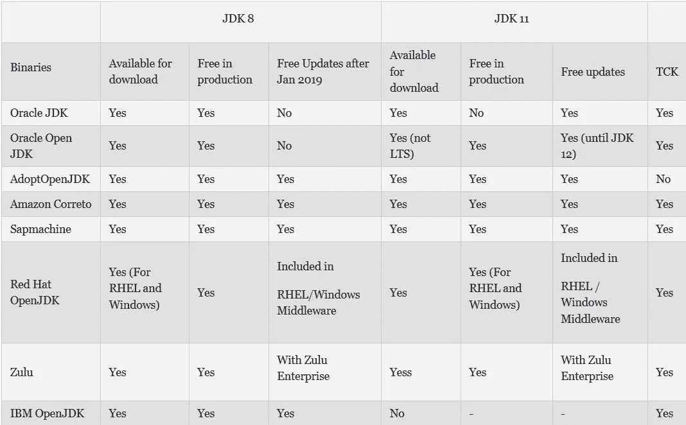

Source: [Java Code Geeks](https://dzone.com/articles/an-overview-on-jdk-vendors)

由于它的大小和速度，JVM 语言并不适合今天的无服务器计算。甲骨文正在推动“ **GraalVM** ”计划，让 Java 变得灵活、快速，更好地适应无服务器世界。由于**除了 Java 没有其他替代品能提供企业级的稳定性和信任**，它将在 2020 年及以后继续统治。

# 7.Java 企业:春天来了

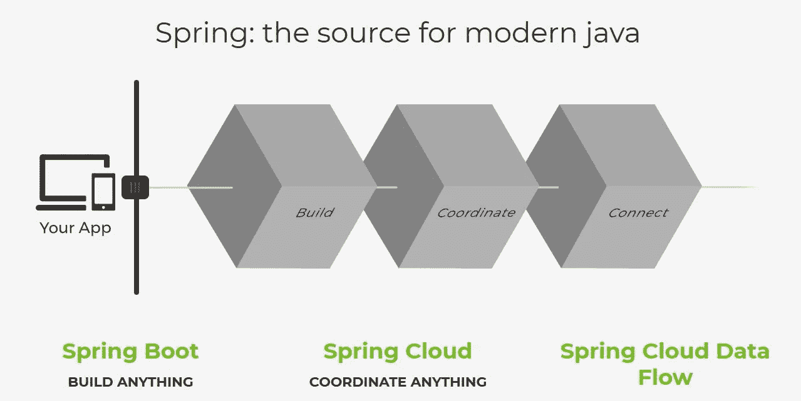

Source: [spring.io](https://spring.io/)

曾几何时，在企业软件开发中有一场 **Spring 框架和 Java 企业版(JavaEE)** 的巨大竞争。但是甲骨文在 JavaEE 中的**不活跃让它在竞争中轻而易举。这引发了“ [**微概要**](https://microprofile.io/) ”倡议的形成，并最终形成了[**JakartaEE**](https://jakarta.ee/)**其中 Oracle 开源了其 Java EE 源代码。****

**当所有的政治和运动都围绕着 JavaEE 发生的时候， **Spring Framework** 凭借非常活跃的开发和对不断变化的环境(例如云原生支持)的快速反应赢得了 **JVM Enterprise framework 大战**。同样在 2020 年， **Spring 框架将成为 JVM 生态系统中的头号框架**。**

**两个非常有吸引力的项目正在开发中，它们将使 Java 变得更小更灵活，从而使 Java 成为无服务器计算的好选择。**

**一个框架是 **Micronaut** :**

****

**Source: [Micronaut](https://micronaut.io/)**

**另一个框架是 Quarkus:**

**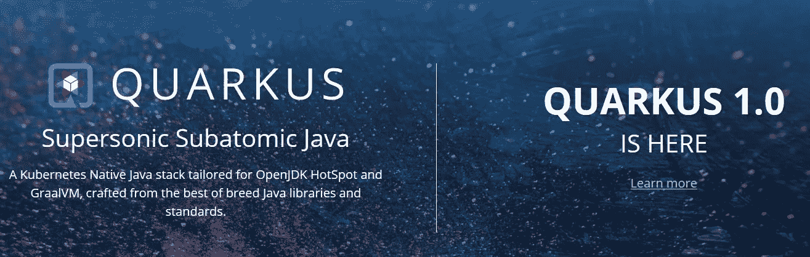**

**Source: [Quarkus](https://quarkus.io/)**

**Micronaut 和 Quarkus 的目标都是使用 **GraalVM** ，并将在 2020 年吸引更多的 Java 社区。**

# **8.编程:Rust，Swift，Kotlin，TypeScript 将会取得突破**

**在 2000 年，编程语言领域出现了停滞。大多数人认为不需要新的编程语言，因为 Java、C、C++、JavaScript 和 Python 已经满足了所有的需求。谷歌通过创造 **Go** 打开了新编程语言的大门。在过去的十年里，出现了许多有趣的编程语言，如 **Rust、Swift、Kotlin、TypeScript** 。这种发展的一个原因是**现有的编程语言通常无法**利用硬件的最新变化(例如多核、更快的网络、云)。另一个因素是现代语言特别关注**开发人员人机工程学**，即更快更容易的开发。在 **Stackoverflow 开发者调查**中，大部分现代语言占据榜首位置( **Rust 连续 4 年**占据首位):**

**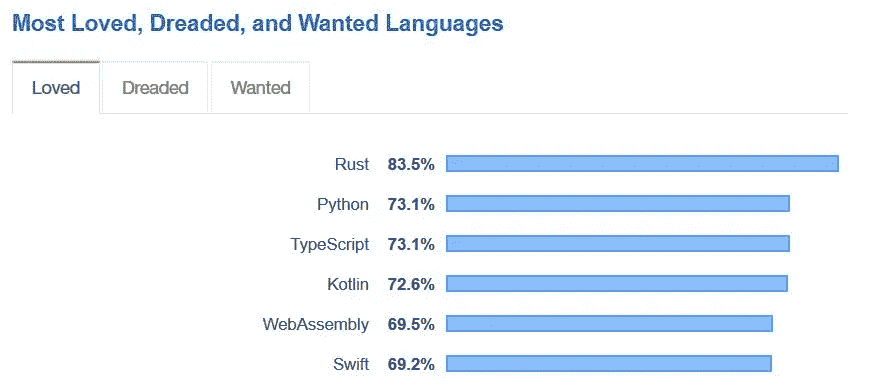**

**Source: [Stackoverflow](https://insights.stackoverflow.com/survey/2019#most-loved-dreaded-and-wanted)**

**在另一篇博文中，我深入讨论了为什么值得学习 Rust、Go、Kotlin、TypeScript、Swift、Julia、Dart 等现代编程语言，以及它们如何为现有编程语言提供更好的替代方案:**

** [## 现在要学习的 7 大现代编程语言

### Rust、Go、Kotlin、TypeScript、Swift、Dart、Julia 如何促进您的职业发展并提高您的软件开发技能

medium.com](https://medium.com/@md.kamaruzzaman/top-7-modern-programming-language-to-learn-now-156863bd1eec) 

最近，微软宣布他们正在大力探索 Rust 编程，以开发如下所示的安全软件:

Source: [Techbeacon](https://techbeacon.com/security/rust-steals-cs-crown-microsoft-secure-code-project)

此外，亚马逊最近宣布他们正在赞助 Rust:

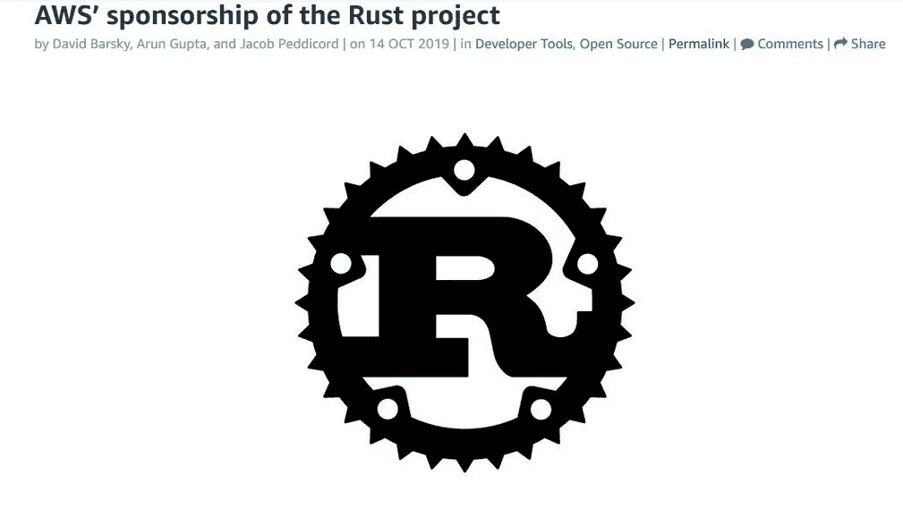

Source: [Techbeacon](https://techbeacon.com/security/rust-steals-cs-crown-microsoft-secure-code-project)

随着谷歌宣布在 Android 中正式支持 Kotlin，编程语言 Kotlin 也成为 Java 在 JVM 世界中的主要竞争对手:

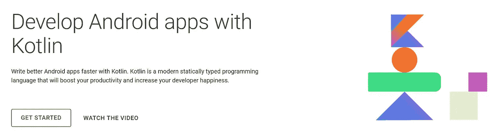

Source: [Android](https://developer.android.com/kotlin)

Angular 支持将 TypeScript 作为主要的编程语言，而不是使用普通的 JavaScript。其他 JavaScript 框架，例如 **React 和 Vue** 也开始为 TypeScript 提供更多支持。

这种趋势将在 2020 年继续，许多其他可能正在深入研究新一代编程语言的大公司，如 **Rust、Swift、TypeScript、Kotlin** 将站出来公开宣布支持他们。

# 9.Web: JavaScript 将继续占据主导地位

Photo by [Pankaj Patel](https://unsplash.com/@pankajpatel?utm_source=unsplash&utm_medium=referral&utm_content=creditCopyText) on [Unsplash](https://unsplash.com/s/photos/javascript?utm_source=unsplash&utm_medium=referral&utm_content=creditCopyText)

曾几何时， **JavaScript** 不是一种足够强大的编程语言，前端主要是使用后端框架开发的，如 **JSF、Ruby on Rails、Django、Laravel** 并从服务器呈现。自从《T4》在 2014 年上映后，情况就永远改变了。从那以后，出现了更多的 JavaScript Web 框架 **(Angular 2+，React，Vue.js，meteor . js)**JavaScript 是现在主流的 Web 开发框架。随着 JavaScript 框架的大量创新和微服务架构的兴起，JavaScript 框架将在 2020 年主导前端开发

# 10.JavaScript Web 框架:反应岩石

虽然是在 AngularJS 之后，但在过去十年里， **React** 对网络发展的影响最大，并且**在与 Google+** 的斗争中拯救了脸书。React 为前端开发带来了一些**新鲜和创新的想法，例如事件源、虚拟 Dom、单向数据绑定、基于组件的开发**等等。它对社区的影响如此严重，以至于谷歌放弃了 AngularJS，并通过借鉴 React 的想法彻底重写了 Angular2+。React 是迄今为止最占优势和最稳定的 JavaScript Web 框架，如下图 NPM 下载统计所示:

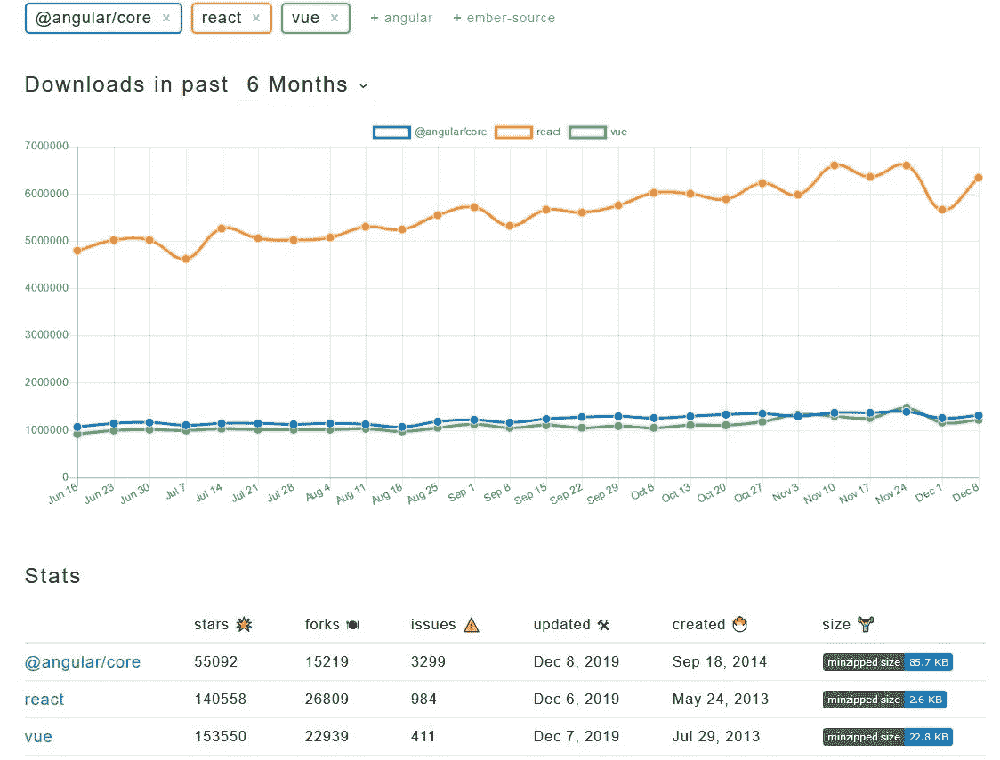

Source: [npm trends](https://www.npmtrends.com/@angular/core-vs-react-vs-vue)

最近，脸书宣布了 **React-Fiber** 项目，完全重写 React 核心算法，以获得**更好的并发性和用户体验**:

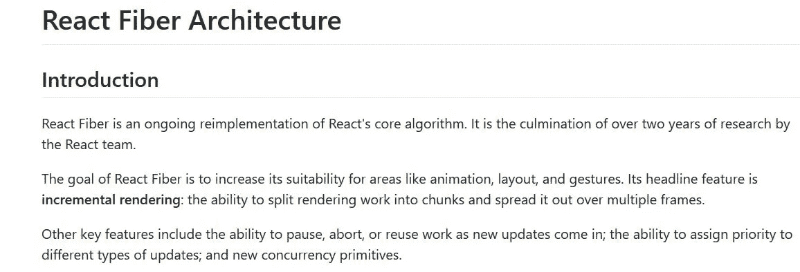

Source: Github

同样在 2020 年，React 应该成为你新项目的首选网络框架。在另一篇文章中，我对 JavaScript 前端框架进行了深入分析，React 成为第一名:

 [## 2020 年前端开发的五大热门 JavaScript 框架

### 为前端开发人员、求职者和其他人提供的顶级 JavaScript 框架的深入分析和排名

medium.com](https://medium.com/@md.kamaruzzaman/top-5-in-demand-javascript-frameworks-for-front-end-development-in-2020-a59c4340d082) 

其他前端 Web 框架比如 **Angular (Angular2+)** 和 **Vue** 呢？Angular 还是一个特别适合企业的可靠的 Web 开发框架。我确信谷歌将在未来几年大力投资 Angular。Vue 是另一个非常受欢迎的网络框架，由社区和几个中国大公司支持。**如果你已经在用 Angular 或者 Vue，2020 年不需要迁移反应**。

# 11.应用开发:面向企业的原生应用

Photo by [Rodion Kutsaev](https://unsplash.com/@frostroomhead?utm_source=unsplash&utm_medium=referral&utm_content=creditCopyText) on [Unsplash](https://unsplash.com/s/photos/mobile?utm_source=unsplash&utm_medium=referral&utm_content=creditCopyText)

在移动应用程序开发方面，围绕混合应用程序开发或跨平台原生应用程序开发的宣传已经有所放缓。混合应用开发/跨平台原生应用开发给了**更快的开发速度**，因为你只需要一个团队，而不是两个。但是原生应用给了**更好的用户体验和更好的性能**。此外，在混合/跨平台应用程序开发中，应用程序总是需要调整**以拥有高级功能。对于企业来说，原生应用程序开发仍然是首选的解决方案，这一趋势将在 2020 年继续。 **Airbnb** 发表了一篇详细的博文，解释了他们放弃领先的混合应用开发平台“React Native”的原因:**

 [## 日落反应自然

### 由于各种技术和组织问题，我们将日落反应原生和把我们所有的…

medium.com](https://medium.com/airbnb-engineering/sunsetting-react-native-1868ba28e30a) 

尽管脸书正在努力改进原生应用(React Native ),谷歌也在努力推进自己的应用开发平台(Flutter ),但它们主要适用于原型应用、概念验证应用、MVP 应用或特色应用，而原生应用开发将在 2020 年继续占据主导地位。

原生应用开发中一个有趣的事实是**谷歌正在推广 Kotlin，而苹果正在推广 Swift** 作为主要的编程语言，因为这些语言具有开发人员友好和现代化的特点。谷歌最近重申了对 Kotlin 的支持，这对 Kotlin 的采用者来说是个好消息:

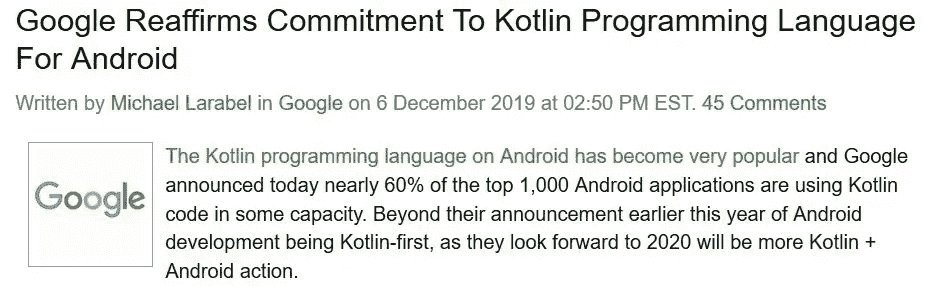

Source: [Phoronix](https://www.phoronix.com/scan.php?page=news_item&px=Kotlin-Android-2020)

# 12.混合/跨平台应用程序开发:React Native

在许多用例中，**混合/跨平台应用**是一个实用的选择。在这个领域，有许多选择:已经存在的 **Xamarin、Ionic** 和更新的 **React Native、Flutter。脸书基于非常成功和成熟的 Web 框架 React 建立了 React Native。像它的 Web 对应物一样， **React Native 也是混合/跨平台应用程序开发中的主要**框架，如下所示:**

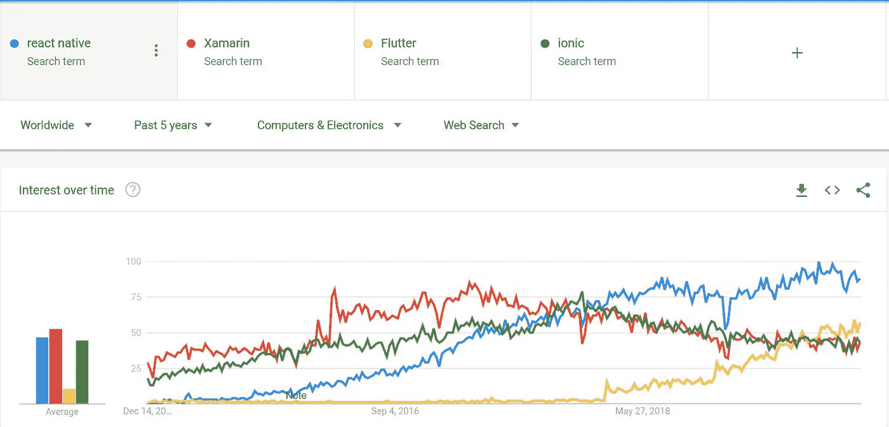

Source: Google Trends

由于 React Native 和 React 共享相同的基础，它们提供了高度的代码可重用性，并提供了选项:**“编写一次，到处运行”**。使用 React Native(或其他脸书框架)的另一个额外优势是**脸书使用 React Native 开发自己的移动应用**。谷歌在这个领域起步较晚，但去年凭借自己的跨平台原生应用框架**获得了巨大的吸引力。Flutter 提供了更好的性能，但需要另一种尚未成为主流的编程语言 **Dart** 。考虑到 React 生态系统中发生的所有变化，React Native 也将在 2020 年继续在该领域占据主导地位。**

# 13.API:安息吧

Image by [S. Hermann & F. Richter](https://pixabay.com/users/pixel2013-2364555/?utm_source=link-attribution&utm_medium=referral&utm_campaign=image&utm_content=3798371) from [Pixabay](https://pixabay.com/?utm_source=link-attribution&utm_medium=referral&utm_campaign=image&utm_content=3798371)

**REST** 就像是 **API 领域**中 800 磅的大猩猩。在基于 API 的服务间通信中，这是事实上最广泛使用的技术。在这个领域还有一些其他的选择。如果你已经仔细阅读了这篇文章，你可能已经猜对了:来自谷歌的 gRPC 和来自脸书的 GraphQL。

它们都是有趣的技术，但是提供不同的功能。谷歌已经开发了 gRPC ,作为远程过程调用技术(例如 SOAP)的再生，但是基于类固醇。它使用 **Protobuf** 而不是 JSON 作为消息格式。另一方面，脸书开发了 GraphQL 作为聚合层，以避免喋喋不休和频繁的 REST 调用。gRPC 和 GraphQL 都取得了成功，并在它们适合的地方表现出色。同样在 2020 年，REST 将成为最主要的 API，而 GraphQL 和 gRPC 将作为补充技术。

# 14.人工智能:Tensorflow 2.0 将占据主导地位

Image by [Gerd Altmann](https://pixabay.com/users/geralt-9301/?utm_source=link-attribution&utm_medium=referral&utm_campaign=image&utm_content=4469138) from [Pixabay](https://pixabay.com/?utm_source=link-attribution&utm_medium=referral&utm_campaign=image&utm_content=4469138)

同样在深度学习/神经网络领域，**谷歌和脸书**是主要玩家。谷歌给了我们 **TensorFlow** ，它基于一个流行的深度学习框架**the no。**它迅速成为深度学习/神经网络计算的主库。谷歌甚至推出了一款特别设计的 GPU ( **TPU** )来加速张量流的计算。

**脸书**在深度学习领域并不落后，因为他们可能拥有最大的图像和视频集合。脸书发布了深度学习库 **PyTorch** ，它基于另一个流行的深度学习库 **Torch** 。这两个框架的工作方式有一个微妙的区别。 **TensorFlow 使用静态图**进行计算，而 **PyTorch 使用动态图**进行计算。使用动态图的优点是它可以动态地自我修正。此外，PyTorch 对 Python 更加友好，是数据科学中的主要编程语言。

随着 PyTorch 越来越受欢迎，谷歌在 2019 年 10 月发布了 **TensorFlow 2.0** ，它使用了动态图形，对 Python 更加友好:

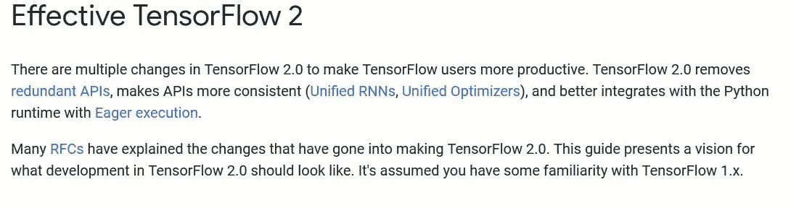

Source: [TensorFlow](https://www.tensorflow.org/guide/effective_tf2)

2020 年，TensorFlow 2 和 PyTorch 将并肩作战。考虑到 TensorFlow 更大的社区，我假设 TensorFlow 2 将成为深度学习的主导库。

# 15.数据库:SQL 至高无上，但分布式 SQL 将是圣杯

在 NoSQL 大肆宣传的日子里，许多人嘲笑 SQL 并指出它的局限性。许多帖子都在解释 NoSQL 如何变得更好，并将取代 SQL。但是宣传结束后，人们很快意识到这个世界离不开 SQL 数据库。以下是最受欢迎的数据库排名:

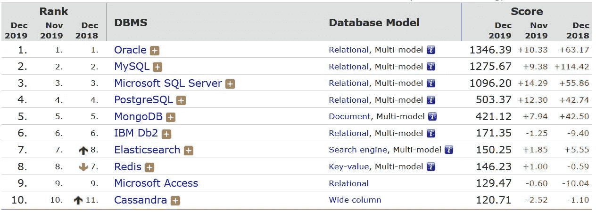

Source: [DB Engines](https://www.tensorflow.org/guide/effective_tf2)

从上图中我们可以看到， **SQL** 数据库保存了 t **op 4 点**。SQL 占主导地位的原因是它提供了可持续的跨国保证，这是业务应用程序最基本的需求。NoSQL 数据库提供水平扩展，但代价是损害了 ACID 保证。

网络规模的公司正在寻找“**主数据库**”，即像 SQL 数据库一样提供 **ACID 保证，并像 NoSQL 数据库一样提供横向扩展的数据库**。此时此刻，有两个解决方案部分满足了“主数据库”的要求:**亚马逊的 Aurora** 和**谷歌的 Spanner。Aurora** 提供了几乎所有的 SQL 特性，但没有水平写入扩展，而 **Spanner** 提供了水平写入扩展，但不支持许多 SQL 特性**。**

在 2020 年，这两个数据库将有望更加接近，或者其他人将提出一个“**分布式 SQL** ”。如果发生这种情况，他可能会获得图灵奖。

# 16.数据湖:MinIO 将崛起

Photo by [Tom Gainor](https://unsplash.com/@its_tgain?utm_source=unsplash&utm_medium=referral&utm_content=creditCopyText) on [Unsplash](https://unsplash.com/s/photos/lake?utm_source=unsplash&utm_medium=referral&utm_content=creditCopyText)

如前所述，**现代数据平台是复杂的**。公司通常有 **OLTP** 数据库(SQL)来支持 ACID 事务，有 **OLAP** 数据库(NoSQL)用于分析目的。此外，企业还有其他类型的数据存储，例如用于搜索(Solr，弹性搜索)或计算(Apache Spark)的**。公司基于数据湖构建其**数据平台，即数据从 OLTP 数据库复制到数据湖。所有其他类型的数据应用程序(例如 OLAP、搜索)都使用数据湖作为它们的黄金来源。****

****Hadoop 分布式文件系统(HDFS)** 是事实上的数据湖，直到亚马逊推出**对象存储 S3** 。可扩展且廉价，S3 很快成为许多公司事实上的数据湖。唯一的问题是**使用 S3 将数据平台与亚马逊 AWS 云**紧密绑定。虽然微软 Azure 有 Blob 存储，谷歌有类似的对象存储，但它们与 AWS S3 不兼容。**

**一种新的笔源——S3 兼容的对象存储 MinIO——可能会拯救许多公司。MinIO 提供企业级支持，专为云原生环境打造，可提供云中性数据湖:**

**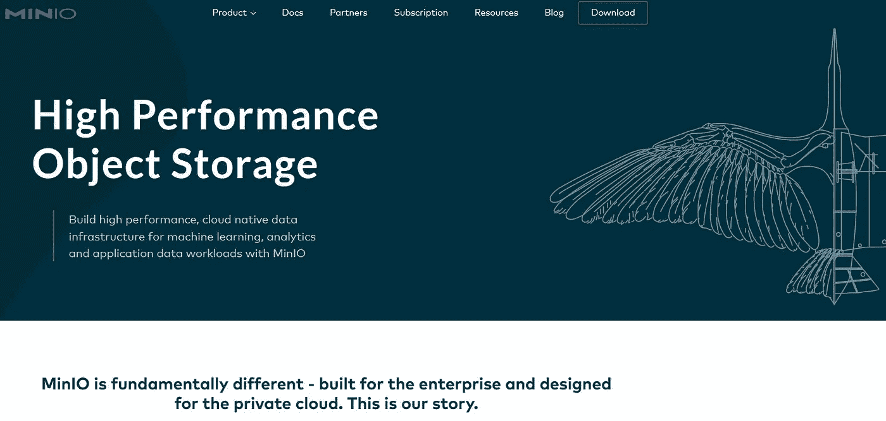**

**Source: [MinIO](https://min.io/)**

**微软最近在 Azure Marketplace 中宣布了 MinIO，口号是:“**为 Azure Blob 存储服务提供亚马逊 S3 API 兼容的数据访问**”。如果谷歌 GCP 和其他公司也提供 MinIO，那么这可能是促进多云化的一大进步。**

# **17.大数据计算:火花将继续闪耀**

****

**Image by [Gerd Altmann](https://pixabay.com/users/geralt-9301/?utm_source=link-attribution&utm_medium=referral&utm_campaign=image&utm_content=1307227) from [Pixabay](https://pixabay.com/?utm_source=link-attribution&utm_medium=referral&utm_campaign=image&utm_content=1307227)**

**在现代，企业通常需要在他们的大规模数据集上运行一次计算，这需要**分布式批处理作业**。Hadoop Map-Reduce 是第一个分布式批量计算平台。最近 **Apache Spark** 已经取代 Hadoop 成为批处理之王。Apache Spark 如何提供比 Hadoop 更好的性能？我之前写过一篇博文，对现代数据平台进行了深入分析:**

** [## 控制数据密集型(大数据+快速数据)框架的编程语言。

### 大数据框架概述

towardsdatascience.com](/programming-language-that-rules-the-data-intensive-big-data-fast-data-frameworks-6cd7d5f754b0) 

Spark 专门针对 Hadoop Map-Reduce 的限制，即在每次代价高昂的操作后处理内存中的所有内容，而不是将数据保存在存储中。尽管 Spark 使用 CPU 和内存饥渴的 JVM 进行批处理，但它将在 2020 年及以后统治批处理框架。我希望有人能用 **Rust、**开发一个更高效的批处理框架，它可以取代 Spark 和**节省公司的巨额云账单**。

# 18.大数据流:面向未来的链接

Photo by [Hendrik Cornelissen](https://unsplash.com/@the_bracketeer?utm_source=unsplash&utm_medium=referral&utm_content=creditCopyText) on [Unsplash](https://unsplash.com/s/photos/stream?utm_source=unsplash&utm_medium=referral&utm_content=creditCopyText)

几年前，**实时流处理**是不可能的。通常，像 **Spark Streaming** 这样的微批处理框架被用来给**提供“近”实时**流处理。然而， **Apache Flink** 通过提供**实时流处理**功能改变了这一局面。

直到 2019 年，Apache Flink 都无法获得足够的牵引力，因为它无法与 **Spark 的营销**竞争。2019 年 1 月，中国科技巨头**阿里巴巴**收购 Data Artisan(Apache Flink 背后的公司)后，情况发生了转变:

Source: [TechCrunch](https://techcrunch.com/2019/01/08/alibaba-data-artisans/)

**如果一家公司想在 2020 年及以后处理**实时流处理**，Flink 应该是第一选择**。虽然 Flink 也和 Spark 一样，通过使用 CPU 饥渴的重量级 JVM，把一大笔云账单交给它的用户来承受。

# 19.字节码:WebAssembly 将被大量采用

Photo by [Mārtiņš Zemlickis](https://unsplash.com/@mzemlickis?utm_source=unsplash&utm_medium=referral&utm_content=creditCopyText) on [Unsplash](https://unsplash.com/s/photos/run?utm_source=unsplash&utm_medium=referral&utm_content=creditCopyText)

我是从 JavaScript 的创造者**布兰登·艾希的采访中得知 **WebAssembly** 的。现代 JavaScript(在 **es5** 之后)是一种优秀的编程语言。但是和其他语言一样，它也有局限性。JavaScript 的最大限制是速度慢，因为 JavaScript 引擎需要读取、解析和处理 JavaScript 文本“抽象语法树”。JavaScript 的另一个问题是**单线程**，无法利用**现代硬件**(例如多核、GPU)。因此，许多计算密集型应用程序(如游戏、3d 图形)无法在浏览器上运行。**

几家公司(以 **Mozilla** 为首)开发了 **WebAssembly，这是浏览器**的低级字节码格式，可以在 Web 上运行任何支持的编程语言。web assembly MVP 发布，支持近金属编程语言(如 **C++，Rust** ):

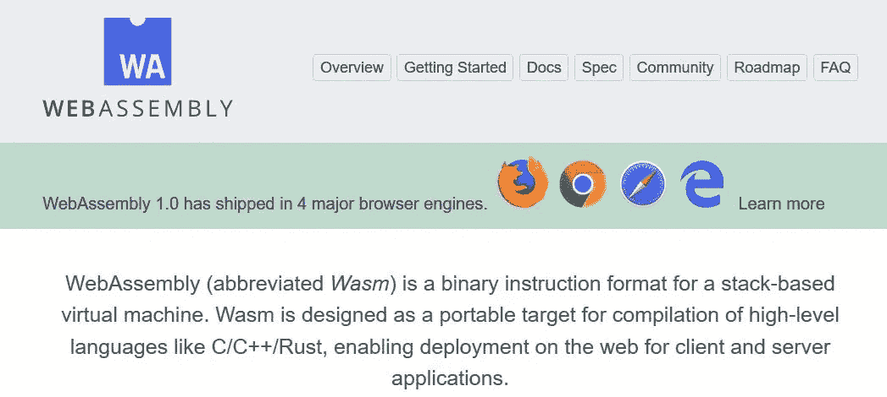

Source: [WebAssembly](https://webassembly.org/)

WebAssembly 使游戏和 Autocad 等计算密集型应用程序能够在浏览器上运行。**web assembly 的目标甚至更大**，并且要在浏览器之外运行。WebAssembly 还提供固有的**安全性和沙箱**，因为它支持 Web。这也意味着 WebAssembly 可以用在以下“浏览器外的**”场景中:**

*   **移动设备上的混合本地应用。**
*   ****无服务器**计算没有**冷启动**问题(**云**)**
*   **不可信代码的服务器端计算( **CDN** )**

**在我的预测中，2020 年可能是 WebAssembly 的突破之年，许多大公司(包括 T2 的云供应商)和社区将会接受它。**

# **20.编码:低编码/无编码将获得动力**

****

**Source: [pixabay](https://pixabay.com)**

**快速的**数字化和工业 4.0** 革命意味着软件开发商的供需缺口巨大。因此，许多人或公司因为缺乏开发人员而无法实现他们的想法。为了降低软件开发的门槛，人们试图用无代码(无代码)或最少代码(低代码)进行软件开发。这一努力被称为 **LCNC(低代码无代码)**，并在 2019 年取得了一些成功:**

**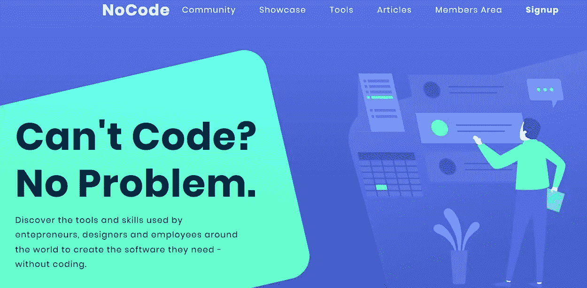**

**Source: [no code](https://www.nocode.tech/)**

**这个运动的目标是**任何人都可以开发软件**，如果他/她有一个很酷的想法，没有编码经验。**

**尽管我仍然对在生产中使用 LCNC 框架持怀疑态度，但是它们可以为其他框架奠定基础。像亚马逊，谷歌这样的公司可以在这个基础上建立一个坚实的产品(**就像 AWS Lambda 在谷歌应用引擎**的基础上蓬勃发展一样)。**

**值得一看的是 LCNC**机芯，它将在 2020 年获得更大的牵引力。****

**如果你觉得这很有帮助，请在你最喜欢的论坛(Twitter、脸书、LinkedIn)上分享。高度赞赏评论和建设性的批评。感谢阅读！**** 

# ****结论:****

****现代软件开发是相当大的、复杂的和多样化的。我的预测清单绝不是包罗万象的。我只是试图预测我最不擅长的领域的趋势，我认为这些领域非常重要。此外，在许多情况下，决策的余地是最小的，我可能在 2020 年底被证明是错误的。此外，技术堆栈的选择总是取决于用例。因此，如果你想选择一个特定领域的技术堆栈，那么请做你自己的分析，不要从字面上理解我提到的要点。****

****我的目标是简要概述 2020 年的软件发展趋势。我希望你有一个成功和充满乐趣的 2020 年。****

****如果你觉得这很有帮助，请分享到你最喜欢的论坛 **(Twitter，LinkedIn)。******

****如果你对软件发展趋势感兴趣，你也可以阅读以下文章:****

**** [## 2020 年最受欢迎的 10 种编程语言

### 针对求职者和新开发人员的顶级编程语言的深入分析和排名

medium.com](https://medium.com/@md.kamaruzzaman/top-10-in-demand-programming-languages-to-learn-in-2020-4462eb7d8d3e)  [## 现在要学习的 7 种现代编程语言

### Rust、Go、Kotlin、TypeScript、Swift、Dart、Julia 如何促进您的职业发展并提高您的软件开发技能

towardsdatascience.com](/top-7-modern-programming-language-to-learn-now-156863bd1eec)  [## 2020 年前端开发的五大热门 JavaScript 框架

### 为前端开发人员、求职者和其他人提供的顶级 JavaScript 框架的深入分析和排名

medium.com](https://medium.com/javascript-in-plain-english/top-5-in-demand-javascript-frameworks-for-front-end-development-in-2020-a59c4340d082)******