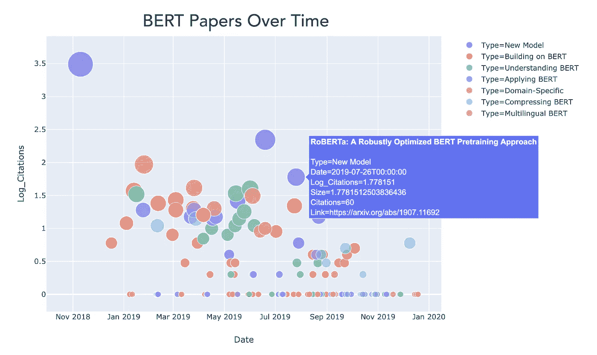
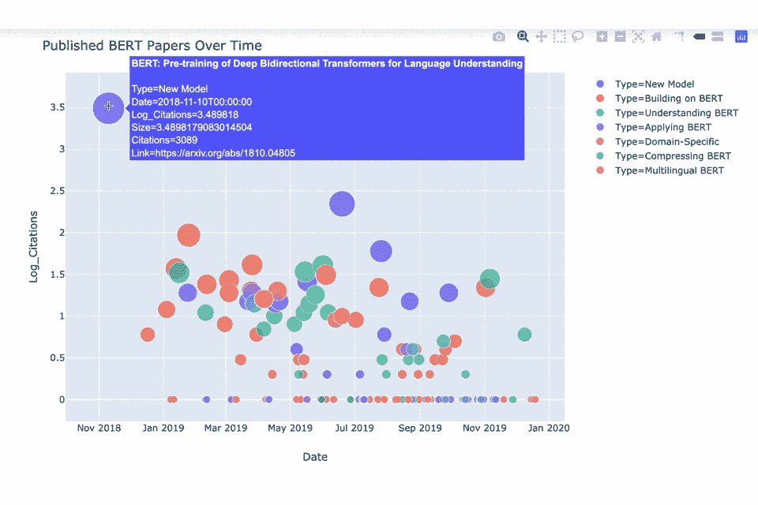
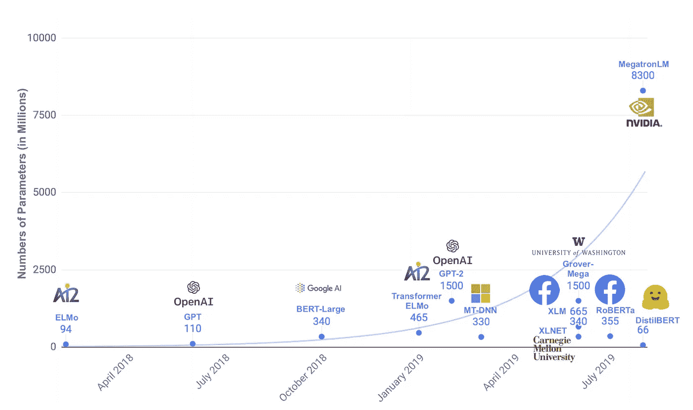

# 2019 年:伯特之年

> 原文：<https://towardsdatascience.com/2019-the-year-of-bert-354e8106f7ba?source=collection_archive---------7----------------------->

## 自然语言处理中深度迁移学习的兴起

当我们结束 2019 年时，反思语言机器学习领域最近的主要趋势很有意思。2019 年是 NLP 具有里程碑意义的一年，从阅读理解到情感分析，各种重要任务都创造了新纪录。突出的关键研究趋势是 NLP 中**迁移学习的兴起，它指的是使用大量预先训练的模型，并根据你特定的语言相关任务对它们进行微调。迁移学习允许您重用以前构建的模型中的知识，这可以提高性能和泛化能力，同时需要更少的标签化训练数据。**

**预训练**模型，然后**针对特定任务进行微调**的想法本身并不新鲜——计算机视觉从业者经常使用在 ImageNet 等大型数据集上预训练的模型，在 NLP 中，我们多年来一直在通过重用单词嵌入来进行“浅层”迁移学习。

> 但是在 2019 年，通过像 BERT 这样的模型，我们看到了向更深层次的知识转移的重大转变，即将整个模型转移到新的任务中——本质上是使用大型预训练语言模型作为可重复使用的语言理解特征提取器。

这在去年被称为“ [NLP 的 ImageNet moment](https://ruder.io/nlp-imagenet/) ”，在 2019 年，研究继续建立在这一趋势上。 **BERT** 在使自然语言处理中的迁移学习变得容易方面非常出色，并且在这个过程中，以最小的适应性为 11 个句子级和单词级的自然语言处理任务产生了最先进的结果。从实用的角度来看，这是令人兴奋的，但 BERT 和相关模型可能更有趣，因为它们推进了我们对如何向计算机表示语言的基本理解，以及哪些表示最能让我们的模型解决具有挑战性的语言问题。

> 新出现的范式是:当你可以重用 BERT 对语言的扎实掌握时，为什么要不断地从零开始学习语言语法和语义？

这一核心概念，加上简单的微调程序和开源代码，意味着 BERT 迅速传播开来-最初于 2018 年底发布，BERT 在 2019 年变得非常受欢迎。直到我试图收集去年发表的与 BERT 相关的论文，我才意识到它有多受欢迎。我收集了 **169 篇与 BERT 相关的论文**，并手动将这些论文标注到几个不同的研究类别中(例如，构建特定领域版本的 BERT，理解 BERT 的内部机制，构建多语言 BERT，等等)。).

这是所有这些文件的图表:

A collection of BERT-related papers published between November 2018 and December 2019\. The y axis is the log of the citation count (as measured by Google Scholar), but with a floor of 0\. The majority of these papers were found by searching for BERT in the title of arXiv papers.

这类信息通常具有更好的交互性，所以这里有一个 GIF。你也可以[查阅 Jupyter 笔记本](https://github.com/nslatysheva/BERT_papers/blob/master/Plotting_BERT_Papers.ipynb)自己玩剧情，原始数据[这里](https://raw.githubusercontent.com/nslatysheva/BERT_papers/master/BERT_Papers.csv)。

Mousing over a mass of BERT papers.

现在有很多伯特论文。此图的一些注释:

*   观察 2018 年 11 月原始论文发表和 2019 年 1 月左右论文泛滥之间的(相当短的)滞后是很有趣的。
*   第一波 BERT 论文倾向于关注核心 BERT 模型(红色、紫色和橙色点)的**直接扩展和应用**，如将 BERT 用于推荐系统、情感分析、文本摘要和文档检索。
*   然后，从 4 月份开始，一系列探索 BERT 内部机制的论文**发表了(绿色)，比如理解 BERT 如何模拟[层级语言现象](https://arxiv.org/abs/1906.01698)以及分析[注意头之间的冗余](https://arxiv.org/abs/1905.10650)。特别有趣的是论文*[*BERT 重新发现了经典的 NLP 流水线*](https://arxiv.org/abs/1905.05950)*，其中作者发现 BERT 的内部计算反映了传统的 NLP 工作流程(首先进行词性标注，然后进行依存解析，然后进行实体标注等)。).****
*   **9 月份左右，一批集中于**压缩 BERT 的模型尺寸**的论文被发布(青色)，像 [DistilBERT](https://arxiv.org/abs/1910.01108) 、 [ALBERT](https://arxiv.org/abs/1909.11942) 和 [TinyBERT](https://arxiv.org/abs/1909.10351) 论文。例如，HuggingFace 的 DistilBERT 模型是 BERT 的压缩版本，参数数量减少了一半(从 1.1 亿减少到 6600 万)，但在重要的 NLP 任务上性能却提高了 95%(参见 [GLUE 基准](https://gluebenchmark.com/))。最初的 BERT 模型并不完全是轻量级的，这在计算资源不充足的地方(比如手机)是一个问题。**
*   **这个伯特论文列表很可能是不完整的。如果与 BERT 相关的论文的真实数量是我的两倍，我也不会感到惊讶。作为一个粗略的上限，引用原始 BERT 论文的论文数量是[目前超过 3100 篇](https://scholar.google.com/scholar?um=1&ie=UTF-8&lr&cites=3166990653379142174)。**
*   **如果你对其中一些模型的名字感到好奇，自然语言处理研究人员基本上被芝麻街的角色弄得晕头转向。我们可以责怪[埃尔默论文](https://www.google.com/search?q=elmo+paper&oq=elmo+paper&aqs=chrome..69i57j0l5j69i61j69i60.1625j1j7&sourceid=chrome&ie=UTF-8)让整个事情开始，这使得后来的模型像伯特和厄尼是不可避免的。我急切地等待一个大鸟模型——让我们称压缩版为小鸟？**

# **伯特文学的几点启示**

**通过查阅这些文献，出现了一些一般性的概念:**

*   ****开源机器学习模型的价值。**作者免费提供了 BERT 模型和相关代码，并提供了一个简单的、可重复使用的微调过程。这种类型的开放对于加速研究至关重要，如果作者不那么直率，我怀疑这种模式会如此受欢迎。**
*   ****认真对待超参数调整的重要性。**RoBERTa 的论文引起了轰动，它提出了一种更具原则性的训练 BERT 的方法，包括优化的设计选择(如改变训练任务)和更广泛的超参数调整。这种更新的训练机制，加上在更多数据上对模型进行更长时间的训练，再次将性能推至各种 NLP 基准的破纪录水平。**
*   ****关于模特身材的思考。**最初的 BERT 作者很感兴趣地观察到，简单地增加模型的大小可以显著提高性能，即使是在非常小的数据集上。也许这意味着在某种意义上你“需要”数以亿计的参数来代表人类语言。2019 年的其他几篇论文发现，简单地扩大 NLP 模型的规模就能带来改善(著名的是 OpenAI 的 GPT-2 模型)。而且有新的技巧来训练大得离谱的 NLP 模型，比如 NVIDIA 的 80 亿参数庞然大物。但也有证据表明，随着模型规模的增加，回报会减少，类似于计算机视觉研究人员在添加更多卷积层时遇到的问题。关于模型压缩和参数效率的论文的成功表明，可以从给定大小的模型中获得显著更高的性能。**

****

**Our NLP models are getting bigger and bigger. [From DistilBERT paper.](https://arxiv.org/pdf/1910.01108.pdf)**

# **伯特到底是什么？**

**让我们后退几步，讨论一下伯特到底是什么。 **BERT** (来自变形金刚的双向编码器表示)是谷歌研究人员建立的一个预先训练好的**语言模型** (LM)。语言模型在激励模型学习对语言的深刻理解的任务上被训练；LMs 的一个常见训练任务是下一个单词预测(“猫坐在 __”上)。**

**BERT 基于一种相对较新的神经网络架构——**变形金刚**，它使用一种叫做**自我关注**的机制来捕捉单词之间的关系。在变形金刚中没有卷积(如在 CNN 中)或递归运算(如在 RNNs 中)。已经有[一些](http://nlp.seas.harvard.edu/2018/04/03/attention.html) [优秀的](http://www.peterbloem.nl/blog/transformers) [教程](https://jalammar.github.io/illustrated-transformer/)发表讲解变形金刚和自我关注，这里就不多赘述了。但简单来说:**

*   **自我关注是一种**序列到序列的操作**，它通过将每个单词的上下文烘焙到其表示中来更新输入令牌嵌入。这使得它可以同时对所有输入单词之间的关系进行建模——与 RNNs 形成对比，在 RNNs 中，输入标记被依次读入和处理。自我关注使用点积计算单词向量之间的相似性，并且所得到的关注权重通常被可视化为**关注权重矩阵**。**
*   **注意力权重捕捉单词之间关系的强度，我们允许模型通过使用多个**注意力头来学习不同类型的关系。**每一个注意力头往往捕捉到一种特定类型的词与词之间的关系(带有一些冗余)。其中一些关系可以直观地解释(比如主语和宾语的关系，或者跟踪相邻的词)，而一些则相当难以理解。你可以将注意力头视为类似于卷积网络中的过滤器，其中每个过滤器从数据中提取特定类型的特征——无论哪个特征都将最有助于神经网络的其余部分做出更好的预测。**
*   **这种自我关注机制是《变形金刚》中的核心操作，但只是把它放在上下文中:变形金刚最初是为机器翻译开发的，它们有一个**编码器-解码器**结构。转换器编码器和解码器的构建模块是一个**转换器模块**，它本身通常由一个自我关注层、一定量的标准化和一个标准前馈层组成。每个模块对输入向量执行这一系列操作，并将输出传递给下一个模块。在变压器中，深度是指变压器块的数量。**

**使用这个转换器设置，BERT 模型在 2 个无监督的语言任务上被训练。关于 BERT 训练最重要的一点是，它只需要未标记的数据——任何文本语料库都可以使用，不需要任何特殊的标记数据集。BERT 论文使用维基百科和一本书的语料库来训练模型。与“正常”语言模型一样，数据很便宜，这是一个巨大的优势。**

## **伯特是怎么训练的？**

**但是伯特接受了哪些任务的训练来鼓励它学习如此好的、普遍有用的语言理解呢？未来的工作调整了学习策略，但是最初的论文使用了两个任务:**

1.  ****假面语言模型(MLM)任务。**这项任务鼓励模型学习单词级和句子级的良好表征(因为句子是单词表征的总和)。简而言之，一个句子中 15%的单词是随机选择的，并用<掩码>标记隐藏(或“屏蔽”)。该模型的工作是预测这些隐藏单词的身份，利用<掩码>之前和之后的单词——因此，我们试图从损坏的输入中重建文本，并且左右上下文都用于进行预测。这允许我们建立考虑所有上下文的单词表示。BERT 同时学习其双向表示，与 ELMo(一种基于 RNN 的语言模型，用于生成上下文感知的单词嵌入)等方法相反，在 ELMo 中，从左到右和从右到左的表示由两个语言模型独立学习，然后连接。我们可以说 ELMo 是一个“浅层双向”模型，而 BERT 是一个“深层双向”模型。**
2.  ****下一句预测(NSP)任务。如果我们的模型将被用作语言理解的基础，那么对它来说，拥有一些句子间连贯性的知识将是有益的。为了鼓励模型学习句子之间的关系，我们添加了下一个句子预测任务，在这个任务中，模型必须预测一对句子是否相关，即一个句子是否有可能出现在另一个句子之后。正训练对是语料库中真实的相邻句子；从语料库中随机抽取负训练对。这不是一个完美的系统，因为随机抽样的配对实际上可能是相关的，但这已经足够好了。****

**该模型必须学会同时做这两项任务，因为实际的训练损失是这两项任务的损失的组合(即它是平均 MLM 和 NSP 可能性的总和)。**

**如果你发现了掩蔽方法的一点问题:你是对的。由于在一个片段中随机有 15%的单词被屏蔽，你很可能有多个<mask>出现。这很好，但是 BERT 将这些屏蔽的令牌彼此独立地对待，这有点限制，因为它们很容易相互依赖。这是 XLNet 论文提出的观点之一，有些人认为这是 BERT 的继任者。</mask>**

## **微调伯特**

**一旦训练了基本的 BERT 模型，通常可以分两步进行微调:首先，继续对未标记的数据进行“无监督的”训练，然后通过添加额外的层和对新目标进行训练来学习实际任务(使用不太多的标记示例)。这种方法源于谷歌的戴&乐【2015 年的 LM 论文。**

**BERT 微调实际上会更新模型的所有参数，而不仅仅是新任务特定层中的参数，因此这种方法不同于完全冻结转移层参数的技术。**

**在实践中，使用 BERT 转移学习，通常只有经过训练的编码器堆栈会被重用，您可以砍掉模型的解码器部分，而只使用编码器转换块作为特征提取器。因此，我们不关心转换器的解码器部分会对它最初被训练的任何语言任务做出的预测，我们只是对模型已经学会在内部表示文本输入的方式感兴趣。**

**BERT 微调可能需要几分钟或几小时，这取决于您的任务、数据大小和 TPU/GPU 资源。如果你有兴趣尽快尝试 BERT 微调，你可以在 Google Colab 上使用[这个现成的代码](https://colab.research.google.com/github/tensorflow/tpu/blob/master/tools/colab/bert_finetuning_with_cloud_tpus.ipynb)，它提供了一个免费的 TPU。**

## **伯特之前有什么？**

**[原创 BERT 论文](https://arxiv.org/abs/1810.04805)写得很好，推荐去看看；以下要点总结了本文对语言模型预训练和微调领域先前主要方法的描述:**

*   ****无监督的基于特征的方法**(如 ELMo)，使用预先训练的表示作为**输入特征**，但使用特定于任务的架构(即，它们为每个新任务改变模型的结构)。所有你喜欢的单词嵌入(word2vec to GLoVe to FastText)、句子嵌入和段落嵌入都属于这一类。ELMo 还提供单词嵌入，但是是以上下文敏感的方式进行的— —标记的嵌入/表示是从左到右和从右到左语言模型隐藏状态向量的串联。**
*   ****无监督微调方法**(类似于 OpenAI 的 GPT 模型)**、**，这些方法**对受监督的下游任务的所有预训练参数**进行微调，并且仅通过引入一些特定于任务的参数来最小程度地改变模型结构。预训练是在未标记的文本上进行的，学习任务通常是从左到右的语言建模或文本压缩(就像自动编码器一样，它将文本压缩成矢量表示，并从矢量中重建文本)。然而，这些方法对上下文建模的能力受到限制，因为它们通常是单向的、从左到右的模型——对于给定的单词，没有能力将所有后来的单词合并到它的表示中。**
*   ****从监督数据中转移学习。**在转移从具有大量训练数据的监督任务中学习到的知识方面也有一些工作，例如，使用来自机器翻译模型的权重来初始化不同语言问题的参数。**

## **问题或需要考虑的事情**

*   **计算机视觉的一些工作表明，预训练和微调最有助于加快模型收敛。**

## **结论**

**我希望这篇文章提供了对 BERT 现象的合理概括，并展示了这个模型在 NLP 中变得多么流行和强大。该领域正在快速发展，我们现在从最先进的模型中看到的结果甚至在 5 年前都是不可信的(例如[问答中的超人表现](https://rajpurkar.github.io/SQuAD-explorer/))。最近 NLP 进展的两个关键趋势是迁移学习和变形金刚的兴起，我很想看看这些在 2020 年将如何发展。**

****

**Happy holidays!**

**—**

***Welocalize 是自然语言处理和翻译技术的行业领导者。要与我们团队中的某个人谈论你的 NLP 项目，请发电子邮件给 david.clark@welocalize.com 的戴夫。***