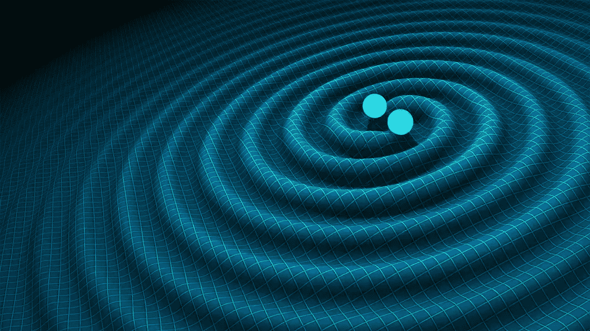
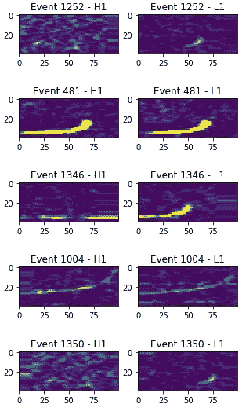
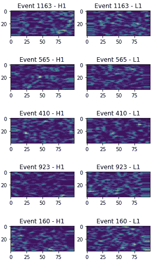
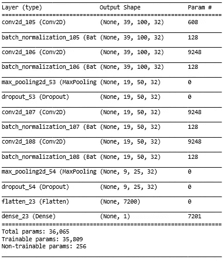
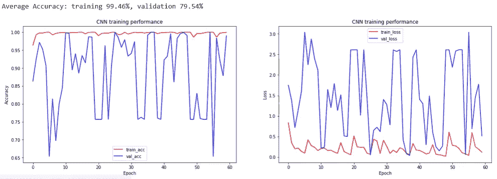
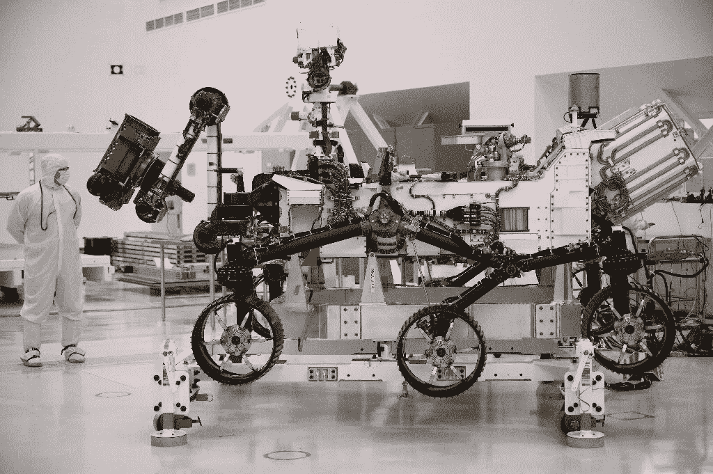

# 用卷积神经网络对引力波进行分类

> 原文：<https://towardsdatascience.com/2020-how-a-i-could-help-astronomers-sorting-big-data-811571705707?source=collection_archive---------32----------------------->

## Python 和 Keras 信号处理实用指南。

在这篇文章中，我们展示了机器学习如何帮助天文学家对太空探索中记录的大数据进行排序。实践策略和可行的 Python 代码在从太空运来的真实数据集上提供了现场体验。具体来说，我们训练一个卷积神经网络来识别来自太空的引力波。

> 2020 太空年:人工智能如何帮助天文学家整理大数据

gravitational waves generated by binary neutron stars

我们都在一些常见的图像数据集(如 MNIST 或 CIFAR10)上构建、训练、评估和检查了神经网络。类似的人工智能技术已经被用于识别 YouTube 频道上的猫视频，检测癌症肿瘤或理解气候变化如何影响事物。

现在是时候在太空探索的真实世界数据集上尝试机器学习了。

我们邀请你考虑使用来自两个探测器的图像将图像分类为引力波或非探测事件的问题。

# 什么是引力波？

> 引力波是空间的拉伸和压缩，因此可以通过测量两个物体之间的长度变化来发现。

 [## 引力波解释了

### 一种在电磁波谱之外观察宇宙的新方法。

medium.com](https://medium.com/swlh/gravitational-waves-explained-83ce37617ab2) 

LIGO(激光干涉引力波天文台)，世界上最大的引力波天文台，能够极其精确地记录它们。目前，数据归档保存了超过 4.5 的数据。预计它将以每年 800 的速度增长。我们得到了两个包含 NumPy 对象形式的数据的文件，由[pav los proto papas](https://iacs.seas.harvard.edu/people/pavlos-protopapas)教授的团队准备:

*   GW_aug.npy(关于 1568 次引力波事件的数据)
*   ND_aug.npy(关于 1216 个未检测事件的数据)

每个事件由 39 个频率分量描述。每个频率分量进一步由 100 个时间分量表示。时间分量代表在给定时间给定频率分量的归一化功率，记录在两个位置:LIGO 汉福德(H1)和 LIGO 利文斯顿(L1)。

一个事件看起来像是在 H1 和 L1 记录的信号的照片或图像。这是因为频谱图不仅在 Y 轴上绘制频率，在 X 轴上绘制时间，而且还使用颜色在 Z 轴上传达信号强度，颜色越亮，信号能量越高。因此，声谱图解释了信号强度如何分布在信号中的每个频率上。

Spectrograms of gravitational waves

Spectrograms of non-gravitational waves

如上所示，如果我们将位置视为光谱图图像的通道，分类器在处理同一事件的不同特征时应该不会有太多问题。事实上，它们可以是互补的，就像 RGB 图像中的通道一样。

# 用 Keras 分类引力波

每天处理 4.5 千兆字节的数据，并从非引力波中整理出引力波是一个有趣的挑战。在本节中，我们构建一个卷积神经网络(CNN)来自动将事件分类为 GW 或 ND。

CNN 的一个强大的方面是它允许图像堆叠或附加，这样网络读取汉福德数据(H1)，紧接着是利文斯顿数据(L1)。下面，在组合我们的数据集后，我们创建一个数值响应变量，GWs 为 1，nd 为 0。我们还将数据分为训练集和测试集。

我们发现，使用与分类 MNIST 或 CIFAR-10 类似的网络架构也能提供可接受的结果。下面我们创建一个灵活的 CNN 架构:

*   Conv2D 添加了一个具有可变数量的过滤器和过滤器大小的卷积层。
*   L2 正则化用于避免过拟合。这意味着在每次更新之前，大的权重被罚以略小于 1 的因子。
*   批量标准化将小批量的平均活化度保持在接近 0，活化度标准偏差保持在接近 1，以解决内部协变量偏移。这使得我们的网络能够更快地融合。
*   MaxPooling2D 图层对要素地图进行下采样，以识别最重要的要素。
*   Dropout 的工作原理是随机忽略一些节点，并强制剩余的节点学习其他功能。这提高了我们网络的泛化能力。

验证准确性是确保模型运行良好的重要方法。经过短暂的训练，CNN 模型对未知事件的分类准确率已经达到了 79.54%。

# 结论

2020 年将会看到中国和其他国家竞相前往火星，包括 T2、美国和 T3。这是欧洲和俄罗斯的联合行动，也是阿拉伯联合酋长国的首次火星任务。所有的希望都寄托在将人工智能作为现场天才研究助理的等价物上。

[NASA Just Unveiled Its 2020 Mars Rover](https://www.sciencealert.com/mars-2020-rover-will-to-prepare-for-human-exploration)

在本文中，我们通过说明探索性数据分析和深度学习技术如何应用于天文学，使空间探索更接近数据科学家。我们用 LIGO 探测器记录的引力波事件训练了一个卷积神经网络。该网络能够正确识别与中子星或黑洞相关的事件，准确率接近 80%。

想要更多吗？你可以参考下面我们关于深度学习和计算机视觉基本工作机制的文章。

 [## 深度学习为什么有效:解决一个农民的问题

### 在开始是神经元:梯度下降，反向传播，回归，自动编码器，细胞神经网络…

towardsdatascience.com](/why-deep-learning-works-289f17cab01a) 

感谢阅读。