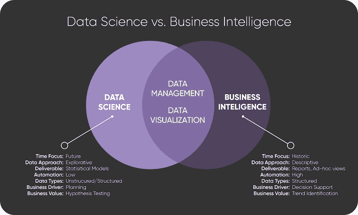
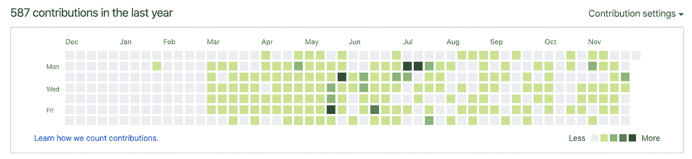

# 2020 年即将到来:获得第一份数据工作的实用技巧

> 原文：<https://towardsdatascience.com/2020-is-coming-practical-tips-for-landing-your-first-data-job-13f77aab1333?source=collection_archive---------22----------------------->

Source: [Pixabay at Pexels](https://www.pexels.com/@pixabay) — free stock images

## [办公时间](https://towardsdatascience.com/tagged/office-hours)

## 记住 5 件重要的事情

数据科学是一个非常广阔的领域。一开始，数据科学家是一个包罗万象的职位。你必须了解工程和机器学习。做一个优秀的数据分析师，对云很流利。作为开发人员，编写 SQL 和一些编程语言。或者更好，做一个合适的开发者！这是压倒性的。随着领域的发展，所有这些需求都获得了各自的角色。

当我们谈论该领域的扩展时，请记住，我们不是指商业智能和统计的合并。关于这一点已经说了很多，尽管人们常说数据科学是从领域知识、统计和商业智能的融合中诞生的，但我个人认为不同，可能是我见过的最好的图形解释来自博客 [Upside](https://tdwi.org/pages/upside.aspx) :

这张图片本身非常清晰，显示了商业智能和数据科学是两个完全不同的领域，因此后者的扩展来自不同角色下任务的个性化，而不是从商业智能职位到数据科学角色的某种转换。如今，你可以在数据工程师、数据科学家或数据分析师等职位上找到相同数量的职位。之后还在全面扩展中扮演其他角色，如机器学习工程或数据翻译。

所有这些都让来自不同领域的人——比如我——被对越来越多专业人士的指数级需求所吸引，也因为有机会涉足一个相对较新的领域。如果你一直喜欢数据和与数字打交道，并且喜欢试图理解事情发生的原因，这将是一个非常令人兴奋的事情。

如果你对上面的描述感同身受，并且你正在考虑进入数据科学行业，或者也许你已经走了一半，在下一篇技巧文章中，我将尝试与你分享一些我从自己的经历中学到的东西，那时我不久前决定完全进入这条道路。如果你想在 2020 年进入数据科学领域，希望它对你也有用🙂。

# 1.了解你自己

随着这个领域的成长，角色的多样化使得人们更容易进入这个行业，在所有可用的角色下工作。所以要做的第一件重要的事情是了解我现在已经准备好扮演哪种角色，以及几年后我想扮演哪种角色。

现在网上比较常见的三个角色可能是:

*   **数据科学家**:通常负责构建机器学习模型的家伙，通常包括它要使用的大部分功能。他们负责不断改进模型的性能，并尝试新的模型以改进预测。
*   **数据工程师:**这家伙可能更擅长编程和计算机科学。他们负责所有的数据流，以便从数据科学家构建的模型中获取数据。
*   **:数据分析师的工作可能是这个领域中最容易被误解和混淆的工作。当我在找工作时，不断发现招聘数据分析师的职位，要求只知道和使用 Excel，不需要任何统计或数学知识，要求为商业或管理团队找到、描述和可视化见解。理想的自动化过程。这些角色我的朋友，以我的理解，是商业智能的位置。同样，在我看来，数据分析师是一个不断进行特别分析的人，对分布、概率或代数等概念有着深刻的理解，定期探索模式，以改善机器学习模型和整个公司对它们如何工作的理解。有时为数据工程设计需要哪些数据以及如何获得这些数据。**

**作为一名数据科学家、工程师或分析师，如果有人觉得上面的一些描述不准确，请不要怪我🙃。正如我所说的，这个领域发展得太快了，以至于无法跟上，所以可能会有一些组合，以相同或不同的角色名称出现。**

**如果你现在还不清楚哪一个应该是你现在和未来的角色，不要担心，我花了很长时间来理解地雷。比如我自称是数据分析师，会做机器学习。这两样我都喜欢，但我知道我现在能为数据分析师这个角色提供更多。我将来会成为全职数据科学家吗？谁知道呢。另一方面，你可能有很强的计算机科学和编程背景，能够从数据工程师做起，但知道自己最终想成为数据科学家。以我的理解，场内学习和枢转的可能性非常高。**

**实用提示:**

*   **制定个人品牌宣言。这听起来可能很傻，但是用文字写下你的职业历程、你的主要技能、你的成就、目标以及为什么你会对公司有价值，这对了解你自己会很有帮助。是的，我确实说了 4 行或者 5 行。我知道这很少，但这种约束有助于你只追求最重要的东西。**
*   **写下你的职业经历:因为对专业人士的需求很大，所以提供的机会也很大。意味着你将和一些充满激情的小伙子们竞争。因此，如果你和我一样，或者你可能来自不同的行业或有着不同的经历，一定要能够解释你的职业故事，以及你是如何和为什么进入数据科学的。**

# **2.准备找工作:最重要的工具**

**之前我开始找工作，当我在找工作的时候，我听说了几个网站和一些我需要牢记在心才能成功的东西。然而，在实践中，我发现这些工具中很少是真正需要的，对我找工作有用的。更重要的是，在每天至少 6 个小时全身心投入找工作的过程中，我发现为了应对一切，在头脑中记住有限的事情是非常重要的。**

****天佑王者 LinkedIn** :不仅是找工作的最佳地点，根据工作岗位的数量和寻找员工的人的活跃程度来看，它也是一个建立关系网和展示自己的好地方。**

****

**Source: [geralt at Pixabay](https://pixabay.com/es/users/geralt-9301/) — free stock images**

**我想给刚入门的人的主要建议是:**

*   ***建立你的个人资料*:漂亮的照片、完整的职业经历和教育背景，以及良好的拼写/语法是最基本的。从那里你可以定制你的网址——而不是使用 LinkedIn 给你的默认网址，选择一个合适的背景图片，写下一个漂亮的标题，显示你更新的联系信息，包括一个好的和可靠的总结(可以来自你的品牌声明),并尽可能填写 LinkedIn 包括的所有其他部分，如技能，成就或推荐。**
*   ***保持活跃*:努力在网络中保持活跃，向你的数据科学相关内容的联系人展示自己，同时不断添加和跟进该领域的人员，以增加你的人脉。如果他们发布任何机会，或者在他们工作的一些公司找到工作，他们可能会有用。**
*   ***调整您的设置*:当您的个人资料 100%完成时，就该打开“让招聘人员知道您是开放的”选项，以及使用 Premium 的免费试用。顺便说一下，就我个人而言，这是我全力推荐的东西，因为它给了你更多搜索和跟踪的机会。接下来几周，你可能会在 LinkedIn 上做得最多的两件事。**
*   ***接触合适的受众*:与你所在城市的人联系，最好是在你感兴趣的特定行业。不要浪费时间添加来自高级组织的首席技术官或首席执行官。这些人甚至不会接近你感兴趣的招聘过程。相反，添加高级数据科学家、领导甚至人力资源部门的人员，他们可能会根据您的个人资料更多地参与流程。最后但同样重要的是——**这可能是我在找工作时收到的最好的建议**，加上目前在该领域工作的贵校校友。他们已经经历了这一切，他们中的许多人会很乐意帮助你推荐，或者至少是一条好的建议。**

**这是[我在 LinkedIn 上的简介](https://www.linkedin.com/in/gferreirovolpi/)，如果你想看的话。**

**注意你的 Github:Github 不仅仅是一个在线分享和个人项目的地方，它也展示了你的一些东西。它显示了你有多活跃，你如何编码，你喜欢做的事情以及对你自己的基本描述。一定要推广各种各样的项目，展示不同的技能和兴趣。此外，理想情况下，尽可能频繁地推送至 GitHub。在数据科学领域寻找第一份工作的一部分就像学习一项运动:你不能暂时停止这项运动，否则，你会忘记东西。所以一定要坚持不懈地推进你的日常工作，这样你才能显示出你的积极和提高你的技能。例如，这是[我的简介](https://github.com/gonzaferreiro)。**

****

**我自己在 GitHub 上的活动面板的例子。**

****你的简历很重要:**如今，简历仍然非常重要，尽管我不会给出关于风格和设计的建议，因为这可能非常主观，但我会给你一些我听过的最好的建议:**

*   ***保持简短*:理想情况下 1 页，最多 2 页。即使你有 8 年的工作经验和博士学位。人们只是不读更多。**
*   ***联系方式*:包含你所有的联系方式，并且要包含正确。仔细检查你的电话、电子邮件和所有网址。**
*   **介绍自己:开头的个人简历很重要。人力资源人员和招聘经理会收到数百份求职简历。给他们一个快速的理由继续阅读你的全部课程。**
*   **包含你的技能:不要让别人从你以前的工作描述和教育中解读你的整套技能，让他们更容易明白这些技能。此外，一些公司使用软件来识别课程中的关键词并进行过滤。所以确保重要的东西在你的简历中至少被提到一次。**
*   **细节很重要:好的拼写、文本对齐、可扫描性、你要发送的文件的名称……所有这些都是关于你自己的。所以要比以前更整洁。**

# **3.去哪里找**

**我们的任务是尽可能有效地利用我们的时间。很多招聘网站甚至在开始搜索和申请他们的职位之前就要求你填写一份很长很长的简历。此外，许多公司会在几个地方发布招聘信息，所以你看到的许多工作岗位会在不同的站点之间重复出现。所以，明智地利用你的时间，不要花几个小时在几个求职网站上寻找工作岗位，而是选择几个并关注它们。**

**对我来说，前面提到的主要工作板块是 LinkedIn。第二个可能取决于你住在哪里或者你感兴趣的公司类型。在英国，玻璃门或的确都是不错的选择。但如果你想加入一家初创公司，安吉尔可能是你的选择。**

**不过最重要的一点是:**不要浪费时间**。每天你应该用不到 50%的专属求职时间寻找合适的职位，其余的时间去申请，包括填写大量公司简介的数据和写漂亮的求职信。这听起来可能需要很多时间，但请记住，你还应该做一些兼职项目，在 LinkedIn 上保持活跃，最终准备面试，还要有自己的生活，所以你可以明白为什么我们不想浪费任何时间，如果不值得工作的话。**

# **4 应用策略并跟踪所有**

**找一份全职工作可能比人们通常认为的压力更大。这就是为什么保持条理对你来说很重要:**

*   ***从分解你的一周开始。周一和周五通常是申请或接触他人的糟糕日子。所以，利用这些日子做你的兼职项目，写求职信，学习一些东西或者寻找周围的人。***
*   **应用，应用，应用。当我在找工作时，学校的人告诉我们要争取每周提交 10 到 20 份申请。不知道这个数字是从哪里来的，但是在实践中，这感觉像是一个激进而迫切的目标，但是完全可行且富有成效。**
*   **记录每件事。你发申请了吗？在 LinkedIn 上加了个人？给在聚会上认识的人写了封邮件？不管是什么事情，找一个你觉得舒服的工具或方法，并把它写下来。在我的例子中，这个工具是一个简单的谷歌表单。每次我联系某人或申请职位时，我都会写下我联系的人、我是如何联系的、发生的日期以及一些对我自己更有用的数据。这一点尤其重要，如果我到那时还没有得到通知的话，**会在整整一周之后跟进每个行动。不要害怕这样做，人们通常不会太在意。****
*   ***多做一点。*无论你是通过求职公告板还是公司网站申请职位，一定要在之后写好封面(简短而甜蜜:两段……一段关于你，一段关于机会和公司)，最好通过电子邮件或 LinkedIn 直接发给公司里的某个人。而你在后者没有溢价，不用担心，一条用词恰当的短信会比什么都没有强。**

**关于求职信已经说了很多，但是以我的经验来看，即使没人看，如果你花时间完整地写了一些关于你申请的机会的东西，它也显示了你的一些东西。**

# **5.准备你的面试**

****

**Source: [Startup Stock Photos at Pexels](https://www.pexels.com/@startup-stock-photos) — free stock images**

**不为面试做准备就像根本不去一样。在我看来，这些是你总是需要准备的主要东西:**

1.  ****技术问题**:数据科学领域有一系列基本问题，尤其是在初次面试时会被问到。我们不会一一列举这个故事，但是我推荐 Nitin Panwar 的这个故事，你可以很容易地在谷歌上找到几个列出所有这些问题的网站。**
2.  ****能力问题**:这更多的是关于你自己……以前的经历、教育、技能、优势、劣势、动机等。同样，许多在线网站都有这些问题的例子供你准备，尽管我发现这个网站特别好。**
3.  **公司和角色:雇主希望员工积极主动，对公司感兴趣，所以一定要尽可能多地研究，并在面试中展示你的知识**

**如前所述，所有这些观点和建议试图总结我在自己求职过程中发现的所有有用的东西，但也是从我的几个同学的求职中发现的。然而，我敢肯定，许多其他人可能对我在这篇文章中提到的一些事情有不同的体验，或者他们可能有一些额外的东西添加到我在这里试图编译的求职工具包中。如果是这样的话，请一定要在评论中分享你的经验，这样我们都可以从中学习！**

**请记住，数据科学是一个不断变化的领域。在过去的一年里，它发生了很大的变化，你可以肯定，在未来的几年里，它将继续变化。所以继续前进！听播客，参加聚会，尽可能多的阅读书籍，不断学习新的东西，当然，在 Medium 中保持关注…这是一个让你保持消息灵通的神奇来源。**

**如果你喜欢这个故事，别忘了看看我最近的一些文章，比如 [9 本与数据科学相关的书向圣诞老人索要圣诞礼物](/9-data-science-related-books-to-ask-santa-for-christmas-37a1036478e9?source=friends_link&sk=089c71e8d8be1977dfe8a1b490501191)和[一篇 NLP 介绍和 5 个提高游戏技巧](/an-introduction-to-nlp-and-5-tips-for-raising-your-game-639636188ddf?source=friends_link&sk=1321f771e73a2de8ad8b3dfc1f8f0655)。在[我的媒体简介](https://medium.com/@g.ferreiro.volpi)中可以找到所有这些和更多🙂。**

**还有**如果你想直接在你的邮箱里收到我的最新文章，只需** [**订阅我的简讯**](https://gmail.us3.list-manage.com/subscribe?u=8190cded0d5e26657d9bc54d7&id=3e942158a2) **:)****

**感谢您的阅读，媒体上见！**