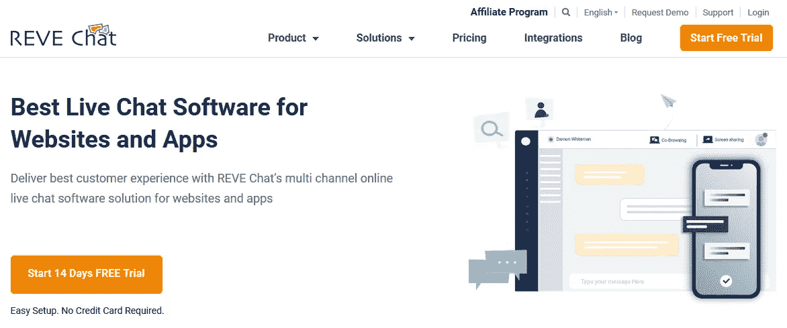

# 您可以使用的 21 种最流行的实时聊天软件解决方案

> 原文：<https://towardsdatascience.com/21-of-the-most-popular-live-chat-software-solutions-you-can-use-f0c5c53ec77e?source=collection_archive---------39----------------------->

您知道吗，使用实时聊天软件的企业中有 49%的企业在实施两年内转化率有所提高。

此外，使用它不到一年的 30%的企业声称，由于他们的实时聊天软件，收入增加了 5-10%。这些统计数据凸显了实时聊天对企业日益增长的重要性。

它有助于客户获得对其查询的即时响应。此外，企业主可以将他们的 CRM 数据库与他们的实时聊天软件相集成，以了解客户行为。这反过来可以帮助他们做出更明智的商业决策。总体来说，这是一个双赢的局面。

# 最佳实时聊天软件

如果你还没有利用实时聊天软件，是时候加入了。毕竟，你想比你的竞争对手更胜一筹。为了帮助你做出明智的决定，我整理了一份最好的实时聊天软件清单，你应该看看。

# 直播聊天软件#1: [直播聊天](https://www.livechatinc.com/)

LiveChat 的客户遍布 150 个国家的 27，000 多家公司，显然非常受欢迎。它最大的优点在于简单。

它干净、整洁、易于使用。您可以将它与 130 多种工具无缝集成，包括 Shopify、WordPress、MailChimp 等。因此，您可以在同一个平台上与潜在客户聊天，同时将他们的详细信息添加到您的 CRM 软件中。

根据所提供的功能，它们的价格从每月 16 美元到 50 美元不等。

*图片 via* [*LiveChat*](https://www.livechatinc.com/)

# 直播聊天软件#2: [Olark](https://www.olark.com/)

Olark 面向那些希望利用数据来了解客户行为的人。它允许你参与并认同那些看起来最有希望的线索。

这款实时聊天软件提供定制的聊天前调查、实时聊天记录、自动消息传递、访客洞察和详细报告等功能。

Olark 的另一个有趣的特性是，它允许你调整你的实时聊天框的外观，以匹配你的品牌颜色。他们的计划从每月 12 美元开始，一直涨到 17 美元。

*图像通过* [*Olark*](https://www.olark.com/)

# 直播聊天软件#3: [对讲机](https://www.intercom.com/live-chat)

想要在您的实时聊天中增加乐趣吗？使用表情符号和 gif。

Intercom 的现代实时聊天旨在引发对话，帮助您与目标受众建立联系，同时保持轻松。它允许您自定义实时聊天，还可以为 web、Android 和 iOS 配置不同的设置。

这款实时聊天软件的定价较高。从 87 美元开始，根据你选择的计划，价格可以超过每月 150 美元。

*图像通过* [*对讲机*](https://www.intercom.com/live-chat)

# 实时聊天软件#4: [伽椰子](https://www.kayako.com/live-chat-software)

如果提供实时聊天支持是你的最终目标，伽椰子是最好的方式。您可以轻松地将实时聊天功能添加到您的移动应用程序、网站或帮助中心。

即使您的团队离线，伽椰子也允许客户发送他们的问题。另一方面，如果客户走开了，错过了你的信息，这个软件会自动向他们发送一封电子邮件，这样你就可以继续交谈。

他们的计划从每月 15 美元到 60 美元不等。

*图片经由* [*伽椰子*](https://www.kayako.com/live-chat-software)

# 实时聊天软件#5: [获取](https://acquire.io/)

实时聊天完全是为了延长即时[客户服务](https://shanebarker.com/blog/improve-customer-service/)。有时，通过文本聊天可能还不够。在这种时候，Acquire 的视频和语音通话功能就派上了用场。它可以创造奇迹，提高你与客户的转换质量。

Acquire 的基本月套餐起价为每月 40 美元。他们还为企业制定了单独的计划，附带了许多额外的功能，如支持机器人、视频录制、智能建议等。

*图像通过* [*采集*](https://acquire.io/)

# 实时聊天软件#6: [LiveHelpNow](https://www.livehelpnow.net/)

LiveHelpNow 旨在通过其实时聊天服务、常见问题仪表板、短信支持和其他无缝集成的工具来简化客户支持。

最棒的是，你可以用一个账户支持无限数量的品牌。因此，您可以从一个平台管理您的所有网站。

他们的聊天、支持票和 FAQ 服务每个月都要花费 21 美元。对于电话管理，他们每月收费 9 美元。

*图片通过*[*LiveHelpNow*](https://www.livehelpnow.net/)

# 实时聊天软件#7: [Tawk](https://www.tawk.to/)

要让这个实时聊天软件工作，你所要做的就是复制一个简单的 Javascript 行，并将其粘贴到你的网站的 HTML 中。不到一分钟，它就开始运行了。

最棒的是 Tawk 是完全免费的。如果你不想自己回答客户的问题，你可以从他们那里雇一个聊天代理，每小时 1 美元。

*图像经*[图克 ](https://www.tawk.to/)

# 直播聊天软件#8: [OCC 直播帮助](https://www.onlinechatcenters.com/)

OCC 是在线聊天中心的缩写。他们的软件旨在迎合所有层次的网站所有者。对于刚创业的人，他们有一个运营商一个网站的免费基础聊天。

这个免费的包允许你监控访问，无限制聊天，上传自定义聊天图标，邀请访问者聊天，等等。对于更高级的功能，他们也有每月 5 美元和 50 美元的其他计划。

*图像通过*[*OCCLiveHelp*](https://www.onlinechatcenters.com/)

# 实时聊天软件#9: [用户型](https://www.userlike.com/en/)

Userlike 的最终目的是帮助你与客户建立关系。使用该软件，您可以使用粘性聊天创建个性化消息。

它的作用是，如果客户第二次回来聊天，他们会将他们连接到之前交谈过的接线员。通过这种方式，他们想在谈话中建立一种连贯性。

他们有一个基本的免费计划，但对于高级功能，你可以选择从€29 到€299 不等的计划。

*图片经由* [*用户喜欢的*](https://www.userlike.com/en/)

# 实时聊天软件#10: [我的实时聊天](https://www.mylivechat.com/)

想免费和你的网站访问者聊天吗？使用我的 LiveChat 的浮动聊天按钮。要在你的网站上获得它，你只需要插入一个 HTML 代码。它不会干扰你的网站设计，所以你不需要为此烦恼。

其他计划每月从 19 美元开始，直到 99 美元。

*图片 via* [*我的 LiveChat*](https://www.mylivechat.com/)

# 实时聊天软件#11: [谁的](https://www.whoson.com/)

谁知道千篇一律的实时聊天软件并不适用于所有人。因此，他们为那些需要一个适合他们需求的软件的人提供了一个解决方案。他们经验丰富的团队可以帮助你应对你面临的任何挑战。

使用 WhosOn，您可以在内部保存您的聊天数据，并在不同品牌之间定制您的聊天。他们的基本计划是免费的，而最高级的计划每月收费 46 美元。

*图片 via* [*WhosOn*](https://www.whoson.com/)

# 直播聊天软件#12: [纯聊天](https://purechat.com/)

Pure Chat 的免费实时聊天软件包括可定制的小工具、原生 iOS 和 Android 应用程序、无限制聊天和强大的操作员仪表板等功能。他们允许在这个套餐中免费提供 3 个运营商。

你也可以使用他们免费的自动聊天机器人来捕捉线索、安排约会和完成支付。

*图片经由* [*纯聊天*](https://purechat.com/)

# 实时聊天软件#13: [Comm100](https://www.comm100.com/platform/livechat/)

Comm10 允许您通过传统的消息、音频、视频联系客户，还提供共同浏览和远程浏览器控制。为了更快地解决问题，你还可以在它的平台上共享[URL](https://shanebarker.com/blog/url-structure/)和文件。

他们的套餐价格从 29 美元起，超过 49 美元。

*图片经由* [*Comm100*](https://www.comm100.com/platform/livechat/)

# 实时聊天软件#14: [JivoChat](https://www.jivochat.co.in/)

这种一体化的业务管理器确保您可以在所有可能的平台上与您的客户取得联系。您可以在一个屏幕上接收电话、电子邮件和聊天。

它还可以选择与 Weebly、Wix、 [BigCommerce](https://shanebarker.com/blog/woocommerce-vs-bigcommerce/) 等平台集成。你可以免费使用基础版，而专业版每月收费 30 美元。

*图片经由*[*JivoChat*](https://www.jivochat.co.in/)

精选的相关内容:

*   [人工智能在数字营销中的未来](https://shanebarker.com/blog/ai-digital-marketing/)

# 实时聊天软件#15: [新鲜事](https://www.freshworks.com/live-chat-software/what-is-live-chat-software/)

转化、支持或入职——无论你的目标是什么，Freshworks 都有适合你的东西。通过所有阶段，Freshworks 实时聊天选项可以确保客户体验的连贯性。

虽然他们的基本型号是免费的，但最高级的每月费用超过 70 美元。

*形象经由*[新鲜出炉 ](https://www.freshworks.com/live-chat-software/what-is-live-chat-software/)

# 实时聊天软件#16: [REVE Chat](https://www.revechat.com/live-chat-software-solution/)

这款全渠道实时聊天软件允许您使用共同浏览功能与客户进行互动和协作。

它们还允许屏幕共享以及语音和视频通话，以确保客户获得最佳体验。标准套餐每月 13.50 美元，而企业套餐每月 45 美元。

*图像通过* [*查看聊天*](https://www.revechat.com/live-chat-software-solution/)

# 实时聊天软件#17: [ZaZaChat](https://www.zendesk.com/chat/)

使用 ZaZaChat，您可以向您的客户发送基于行为的消息。不要等他们问你问题，你可以根据他们的行动直接发出信息。

甚至在开始聊天之前，您就可以使用他们的预表单功能来收集他们的联系信息。

他们的基本包对所有人都是免费的，而其他的价格范围是每月 14-59 美元。

*图片经由*[*ZaZaChat*](https://www.zendesk.com/chat/)

# 实时聊天软件#18: [Zoho SalesIQ](https://www.zoho.com/salesiq/live-chat-software.html)

Zoho SalesIQ 相信在客户支持方面采取积极主动的方法。因此，他们的实时聊天功能允许你甚至在访问者键入查询之前就向他们发送消息。基于他们的聊天知识库，你可以嵌入链接到流行的常见问题或其他文章。

当你的员工不在的时候，佐霍会代替你。您可以设置一个离线代理为您处理问题。

*图片经由* [*Zoho*](https://www.zoho.com/salesiq/live-chat-software.html)

# 实时聊天软件#19: [LiveAgent](https://www.liveagent.com/)

LiveAgent 让您可以轻松地在多个平台上与客户取得联系。在其实时聊天软件上，你可以为你的社交媒体提及、电子邮件、聊天和电话创建一个通用收件箱。

其他功能包括强大的票务系统、呼叫中心和支持中心。他们的套餐价格在每月 15-39 美元之间。

*图片 via*[*live agent*](https://www.liveagent.com/)

# 20 号实时聊天软件: [Happyfox](https://happyfoxchat.com/)

Happyfox 很容易安装，只需几分钟就能安装完毕。一旦完成，你就可以将其与你的品牌审美相匹配。你不需要成为编码专家。这是一个简单的过程，需要你遵循几个步骤。

对于那些想要使用实时聊天来获得支持的人和那些想要使用它来[增加销售](https://shanebarker.com/blog/sales-and-lead-generation/)的人，它们有不同的功能。他们的月计划从 29.99 美元到 99.99 美元不等。

*图像通过*[*happy fox*](https://happyfoxchat.com/)

# 直播聊天软件#21: [Netrox SC](https://www.netroxsc.com/)

Netrox SC 是为那些想要使用实时聊天来提高销售额的人准备的。他们的实时聊天有一个独特的功能，叫做“聊天区”，允许你跟踪你的网站访问者，对他们进行分类，并开始与他们交谈。

他们的精简版是免费的，而专业版每月收费 14 美元。

*图片 via*[*net rox SC*](https://www.netroxsc.com/)

# 结论

实时聊天可以让您的客户支持更上一层楼。它可以让您在几秒钟内回复客户的查询。在某些情况下，你可以在他们问你之前主动给他们一个答案。

不仅如此，还能提高客户满意度，让你获得更多的转化。我希望你能从上面提到的工具中找到最适合你业务的实时聊天软件。

***本文发表在*** [***谢恩巴克***](https://shanebarker.com/blog/live-chat-software/) ***的博客上。***

**关于作者**

谢恩·巴克是[内容解决方案](https://contentsolutions.io/)和[礼品公司](http://gifographics.co/)的创始人兼首席执行官。你可以在[推特](https://twitter.com/shane_barker)、[脸书](https://www.facebook.com/ShaneBarkerConsultant/)、 [LinkedIn](https://www.linkedin.com/in/shanebarker/) 、 [Instagram](https://www.instagram.com/shanebarker/) 、 [iTunes](https://podcasts.apple.com/us/podcast/shane-barkers-marketing-madness-podcast/id1472142690) 上和他联系。