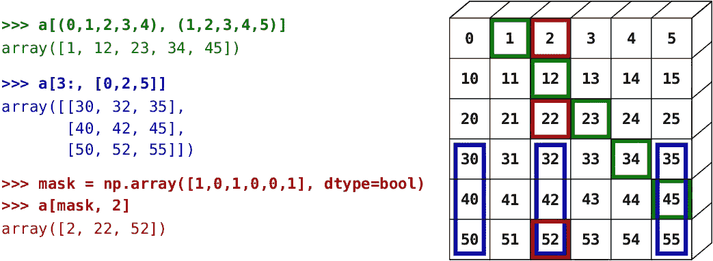

# 适用于初学者的 27 种数字操作

> 原文：<https://towardsdatascience.com/27-things-that-a-beginner-needs-to-know-about-numpy-edda217fb662?source=collection_archive---------10----------------------->

## 初学者的数据操作。



Source: scipy-lectures.org

## **简介**

在我之前的一篇关于 [21 熊猫绝对初学者操作](https://medium.com/me/stats/post/5653e54f4cda?source=main_stats_page)的文章中，我讨论了一些重要的操作，可以帮助新手开始数据分析。这篇文章应该为 NumPy 提供类似的目的。简单介绍一下，NumPy 是一个非常强大的库，可以用来执行各种操作，从寻找数组的平均值到快速傅立叶变换和信号分析。从这个意义上说，它非常类似于 MATLAB。

您需要将 NumPy 作为“np”导入，然后使用它来执行操作。

## **操作:**

1.  **将列表转换为 n 维 NumPy 数组**

```
numpy_array = np.array(list_to_convert)
```

**2。np.newaxis 和 np.reshape 的使用**

np.newaxis 用于创建大小为 1 的新维度。例如

```
a = [1,2,3,4,5] is a list
a_numpy = np.array(a)
```

如果你打印`a_numpy.shape`，你会得到`(5,)`。为了使其成为行向量或列向量，可以这样做

```
row_vector = a_numpy[:,np.newaxis] ####shape is (5,1) now
col_vector = a_numpy[np.newaxis,:] ####shape is (1,5) now
```

类似地，np.reshape 可以用来整形任何数组。例如:

```
a = range(0,15) ####list of numbers from 0 to 14
b = a.reshape(3,5) 
b would become:
[[0,1,2,3,4],
 [5,6,7,8,9],
 [10,11,12,13,14],
 [15,16,17,18,19]]
```

**3。将任何数据类型转换为 NumPy 数组**

用 np.asarray .作 eg

```
a = [(1,2), [3,4,(5)], (6,7,8)]
b = np.asarray(a)
b::
array([(1, 2), list([3, 4, (5, 6)]), (6, 7, 8)], dtype=object)
```

**4。得到一个 n 维的零数组。**

```
a = np.zeros(shape,dtype=type_of_zeros)
type of zeros can be int or float as it is required
eg.
a = np.zeros((3,4), dtype = np.float16)
```

**5。获取 1 的 n 维数组。**

类似于 np.zeros:

```
a = np.ones((3,4), dtype=np.int32)
```

**6。np.full 和 np.empty**

np.full 用于用一个特定值填充数组，而 np.empty 通过用随机值初始化它们来帮助创建数组。例如。

```
**1.** np.full(shape_as_tuple,value_to_fill,dtype=type_you_want)
a = np.full((2,3),1,dtype=np.float16)a would be:
array([[1., 1., 1.],
       [1., 1., 1.]], dtype=float16)**2.** np.empty(shape_as_tuple,dtype=int)
a = np.empty((2,2),dtype=np.int16)
a would be:array([[25824, 25701],
       [ 2606,  8224]], dtype=int16) The integers here are random.
```

7。用 np.arrange 和 np.linspace 得到一个等间距值的数组

两者都可以用于排列，以创建元素间距均匀的数组。

林空间:

```
np.linspace(start,stop,num=50,endpoint=bool_value,retstep=bool_value)**endpoint specifies if you want the stop value to be included and retstep tells if you would like to know the step-value.'num' is the number of integer to be returned where 50 is default Eg,**np.linspace(1,2,num=5,endpoint=False,retstep=True)This means return 5 values starting at 1 and ending befor 2 and returning the step-size.output would be:
(array([1\. , 1.2, 1.4, 1.6, 1.8]), 0.2) ##### Tuple of numpy array and step-size
```

阿兰格:

```
np.arange(start=where_to_start,stop=where_to_stop,step=step_size)
```

如果只提供了一个数字作为参数，它被视为一个停止，如果提供了两个，它们被假定为开始和停止。注意这里的拼写。

8。寻找 NumPy 数组的形状

```
array.shape
```

9。知道 NumPy 数组的维数

```
x = np.array([1,2,3])
x.ndim will produce 1
```

10。寻找 NumPy 数组中元素的个数

```
x = np.ones((3,2,4),dtype=np.int16)
x.size will produce 24
```

11。获取一个 n 维数组所占用的内存空间

```
x.nbytesoutput will be 24*memory occupied by 16 bit integer = 24*2 = 48
```

**12。查找 NumPy 数组中元素的数据类型**

```
x = np.ones((2,3), dtype=np.int16)x.dtype will produce
dtype('int16')It works better when elements in the array are of one type otherwise typecasting happens and result may be difficult to interpret.
```

**13。如何创建 NumPy 数组的副本**

使用 np.copy

```
y = np.array([[1,3],[5,6]])
x = np.copy(y)If,
x[0][0] = 1000Then,
x is
100 3
5 6y is
1 3
5 6
```

**14。获取 n-d 数组的转置**

使用 array_name。T

```
x = [[1,2],[3,4]]
x
1 2
3 4x.T is
1 3
2 4
```

15。展平 n-d 数组得到一维数组

使用 np.reshape 和 np.ravel:

np.reshape:这真是一个又好又甜的把戏。在整形时，如果您提供-1 作为维度之一，那么它是从元素的数量中推断出来的。例如，对于一个大小为`(1,3,4)`的数组，如果它被整形为`(-1,2,2),`，那么第一维的长度被计算为`3`。所以，

```
If x is:
1 2 3
4 5 9
Then x.reshape(-1) produces:
array([1, 2, 3, 4, 5, 9])
```

np .拉威尔

```
x = np.array([[1, 2, 3], [4, 5, 6]])x.ravel() produces
array([1, 2, 3, 4, 5, 6]) 
```

16。改变 n-d 数组的轴或交换维度

使用 np.moveaxis 和 np.swapaxes。

```
x = np.ones((3,4,5))
np.moveaxis(x,axes_to_move_as_list, destination_axes_as_list)
For eg.x.moveaxis([1,2],[0,-2])This means you want to move 1st axis to 0th axes and 2nd axes to 2nd last axis. So,the new shape would be.(4,5,3)
```

转换没有到位，所以不要忘记将它存储在另一个变量中。

np.swapaxes。

```
x = np.array([[1,2],[3,4]])x.shape is (2,2) and x is
1 2
3 4np.swapaxes(x,0,1) will produce
1 3
2 4If x = np.ones((3,4,5)), and
y = np.swapaxes(0,2)
y.shape will be
(5,4,3)
```

**17。将 NumPy 数组转换为列表**

```
x = np.array([[3,4,5,9],[2,6,8,0]])
y = x.tolist()
y will be
[[3, 4, 5, 9], [2, 6, 8, 0]]
```

NumPy 文档提到，如果 x 是一维数组，使用`list(x)`也可以。

**18。更改 NumPy 数组中元素的数据类型。**

使用 ndarray.astype

```
x = np.array([0,1,2.0,3.0,4.2],dtype=np.float32)x.astype(np.int16) will producearray([0, 1, 2, 3, 4], dtype=int16)x.astype(np.bool) will produce 
array([False,  True,  True,  True,  True])
```

**19。获取非零元素的索引**

使用 n-dim_array .非零()

```
x = np.array([0,1,2.0,3.0,4.2],dtype=np.float32)
x.nonzero() will produce(array([1, 2, 3, 4]),) It's important to note that x has shape (5,) so only 1st indices are returned. If x were say,x = np.array([[0,1],[3,5]])
x.nonzero() would produce (array([0, 1, 1]), array([1, 0, 1]))So, the indices are actually (0,1), (1,0), (1,1). 
```

20。排序 NumPy 数组

使用 NP . ndarray . sort(axis = axis _ you _ want _ to _ sort _ by)

```
x = np.array([[4,3],[3,2])
x is
4 3
3 2x.sort(axis=1) #sort each row3 4
2 3x.sort(axis=0) #sort each col3 2
4 3
```

**21。将 NumPy 数组与值进行比较**

比较将产生布尔类型的 n 维数组。例如

```
x = np.array([[0,1],[2,3]])x==1 will produce
array([[False,  True],
       [False, False]])
```

如果你想数 x 中的数字 1，你可以这样做

```
(x==1).astype(np.int16).sum()
```

它应该输出`1`

**22。将两个数字矩阵相乘**

使用 numpy.matmul 获取二维矩阵的矩阵乘积:

```
a = np.eye(2) #identity matrix of size 2
a
1 0
0 1b = np.array([[1,2],[3,4]])
b
1 2
3 4np.matmul(a,b) will give
1 2
3 4
```

如果我们提供一个一维数组，那么输出可能会非常不同，因为将使用广播。我们将在下面进行讨论。此外，还有另一个名为`np.multiply`的函数，它执行元素到元素的乘法。对于前两个矩阵，`np.multiply(a,b)`的输出为。

```
1 0
0 4
```

**23。两个数组的点积**

np.dot(矩阵 1，矩阵 2)

```
a = np.array([[1,2,3],[4,8,16]])
a:
1 2 3
4 8 16b = np.array([5,6,11]).reshape(-1,1)b:
5
6
11np.dot(a,b) produces
38
160
Just like any dot product of a matrix with a column vector would produce.
```

行向量与列向量的点积将产生:

```
if a is array([[1, 2, 3, 4]])
and b is:

array([[4],
       [5],
       [6],
       [7]])np.dot(a,b) gives:array([[60]])a's shape was (1,4) and b's shape was (4,1) so the result will have shape (1,1)
```

24。获取两个 numpy 向量的叉积

从物理学上回忆向量[叉积](https://www.mathsisfun.com/algebra/vectors-cross-product.html)。它是关于一点的力矩的方向。

```
x = [1,2,3]
y = [4,5,6]z = np.cross(x, y)z is:
array([-3,  6, -3]) 
```

25。获取数组的梯度

使用 np.gradient. NumPy 使用泰勒级数和中心差分法计算梯度。你可以在这篇[文章](https://stackoverflow.com/questions/24633618/what-does-numpy-gradient-do)中读到更多。

```
x = np.array([5, 10, 14, 17, 19, 26], dtype=np.float16)np.gradient(x) will be:
array([5\. , 4.5, 3.5, 2.5, 4.5, 7\. ], dtype=float16)
```

**二十六。NumPy 数组怎么切片？**

```
For single element:
x[r][c] where r,c are row and col number of the element.For slicing more than one element.x:
2 4 9
3 1 5
7 8 0and you want 2,4 and 7,8 then dox[list_of_rows,list_of_cols] which would bex[[0,0,2,2],[0,1,0,1]] producesarray([2, 4, 7, 8])If one of the rows or cols are continuous, it's easier to do it:x[[0,2],0:2] producesarray([[2, 4],
       [7, 8]])
```

**二十七。广播**

任何关于 NumPy 的文章如果不包括广播都是不完整的。这是一个重要的概念，有助于 NumPy 向量化操作，从而加快计算速度。理解一些规则将有助于你更好地剖析广播。

来自 NumPy 文档:

> 当操作两个数组时，NumPy 按元素比较它们的形状。它从尾部维度开始，向前推进。在以下情况下，二维是兼容的
> 
> 1.他们是平等的，或者
> 
> 2.其中一个是 1

另一件要记住的事情是，

> 如果尺寸匹配，输出将具有每个尺寸的最大长度。如果其中一个维度的长度为 1，则该维度中的值将重复

假设有两个数组 A 和 B，维度分别为`**(3,4,5)**`和`**(4,1)**` ，你想把这两个数组相加。由于它们没有相同的形状，NumPy 将尝试广播这些值。它开始比较最后一个维度的长度:5 和 1，这两个值不相等，但因为其中一个是 1，所以它将重复，最终输出在最后一个维度的长度为 5。

两者的倒数第二个尺寸具有相同的长度`4`。

A 中倒数第三个维度或第一个维度的长度为`3`，而 B 没有任何长度。**当一个向量中缺少一个维度时，NumPy 会在向量前加 1。**于是，B 变成了`**(1,4,1)**` **。**现在，长度匹配为 3 和 1，值在 b 中重复 3 次。最终输出将具有形状`**(3,4,5)**` **。**

```
a :3 5 8
4 5 6
9 7 2b :b = [2,3,4]a's shape: (3,3)
b's shape: (3,)Last dimension has same length 3 for the two and then 1 is prepended to the the dimension of b as it doesn't have anything in that dimension. So, b becomes [[2,3,4]] having shape (1,3). Now, 1st dimension match and values are repeated for b. Finally, b can be seen as2 3 4
2 3 4
2 3 4So, a+b produces5 8 12
6 8 10
11 10 6
```

查看更多广播上的这些帖子:[第一](https://docs.scipy.org/doc/numpy/user/basics.broadcasting.html)和[第二](https://www.tutorialspoint.com/numpy/numpy_broadcasting.htm)

## **总结**

感谢您的阅读。希望这篇文章对需要入门 NumPy 的人有所帮助。我发现这些操作非常有用，把它们放在我们的提示中总是好的。这些操作非常基本，在 NumPy 中可能有不同的方法来实现相同的目标。除了一些其他的帖子，我大部分时候使用 NumPy 文档作为参考，这些帖子的链接已经提供了。此外，如果你有兴趣，可以看看我关于绝对初学者的 [21 熊猫操作](https://medium.com/me/stats/post/5653e54f4cda?source=main_stats_page)和 [Spark](/installing-pyspark-with-java-8-on-ubuntu-18-04-6a9dea915b5b) 装置的帖子。

## 接触

如果你喜欢这篇文章，请分享给其他可能会觉得有用的人。我真的很喜欢数据科学，如果你也对它感兴趣，让我们在 [LinkedIn](https://www.linkedin.com/in/parijatbhatt/) 上联系，或者在这里关注我走向数据科学平台。