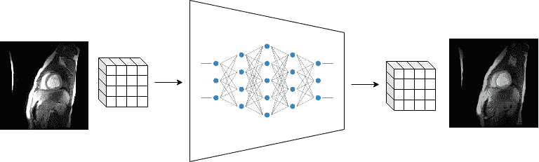
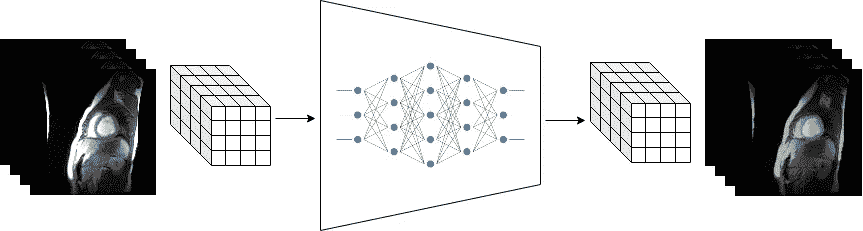
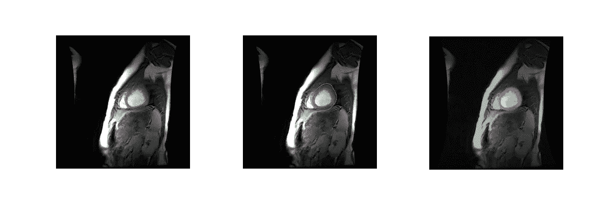
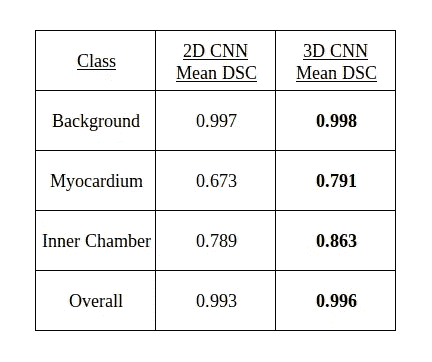
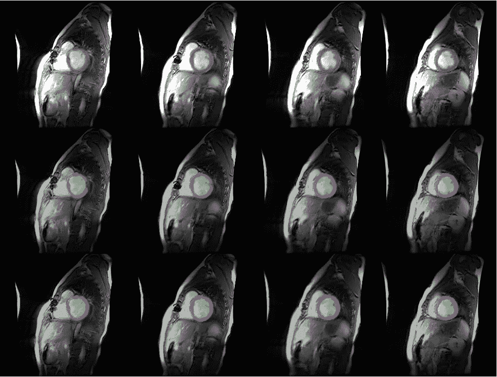

# 2D 还是 3D？用于心脏图像自动分割的卷积神经网络的简单比较

> 原文：<https://towardsdatascience.com/2d-or-3d-a-simple-comparison-of-convolutional-neural-networks-for-automatic-segmentation-of-625308f52aa7?source=collection_archive---------1----------------------->

卷积神经网络(CNN)已经显示出对大量计算机视觉任务的承诺。这些应用中包括自动分割。医学成像的分割在研究环境中用于计算建模、定量研究和基于人群的分析的发展。此外，医学成像分割在从诊断到患者专用设备开发的行业中都有应用。根据应用的不同，单个扫描体积的手动分割可能需要几个小时。另一方面，训练有素的 CNN 可以在几秒钟内准确地分割扫描的结构。因此，CNN 有可能补充传统的医学成像工作流程，降低相关成本。

用于分割的 CNN 可以基于所使用的卷积核的维度来分类。2D CNN 使用 2D 卷积核来预测单个切片的分割图。通过一次对一个切片进行预测，对整个体积的分割图进行预测。2D 卷积核能够利用切片的高度和宽度来进行预测。然而，由于 2D CNN 采用单个切片作为输入，它们本质上无法利用来自相邻切片的上下文。来自相邻切片的体素信息对于分割图的预测可能是有用的。

2D CNNs predict segmentation maps for MRI slices in a single anatomical plane.

3D CNNs 通过使用 3D 卷积核对扫描的体积块进行分割预测来解决这个问题。利用片间上下文的能力可以提高性能，但是由于这些 CNN 使用的参数数量增加，因此会带来计算成本。

3D CNNs use 3D convolutional kernels to predict segmentation maps for volumetric patches of an MRI volume.

那么，3D CNNs 到底好到什么程度，值得付出额外的代价吗？在这篇文章中，我通过一个简单的实验来探究这个问题。我在心脏成像数据集上比较了 2D 和 3D CNNs 的性能。由此产生的度量产生关于这两种类型的 CNN 之间的性能差距的直觉。

2D 和 3D CNNs 被训练用于从磁共振成像(MRI)中自动分割心脏的任务。来自[1]的数据集被用于此。该数据集包含 33 名患者的磁共振成像，其中每名患者与 20 个不同的体积相关联，在不同的时间步骤拍摄。前 25 名患者用于训练(5920 个轴向切片)。剩余的扫描被保留用于测试(2060 个切片)。数据集提供了心内膜和心外膜的注释轮廓。这些注释用于创建具有 3 个类别的分割图:背景、心肌和内腔。

Original slice, annotated contours, and resulting ground truth segmentation map used in the experiments.

一个完全卷积的 2D CNN [2]被训练用于扫描的分段。切片保持原始分辨率(256×256 像素),并且使用 8 的批量大小来训练模型。使用完整的 2D 切片来训练该模型。

一个 3D CNN [3]被训练来完成同样的任务。用于训练 2D CNN 的设置对于 3D CNN 保持相同，除了输入大小和批量大小。3D CNN 在来自训练集的尺寸为 256×256×8、批量为 1 的 3D 面片上进行训练。

这两个 CNN 在训练期间都增加了两个辍学层[4]和深度监督[5]，我几乎总是用它来训练深度学习模型，不管应用程序如何。模型训练 50k 次迭代，学习率 5e-6；每种模式都需要大量的训练。没有使用数据扩充。

通过在每个测试扫描上取分割预测的平均骰子相似性系数(DSC ),在测试扫描上评估模型。这有助于将 DSC 视为“准确性”的更具鉴别力的版本。2D 有线电视新闻网通过扫描每一片进行推断，一次一片。利用 3D CNN 的推断是通过从扫描中迭代采样 3D 片来执行的，直到扫描中的所有体素都具有与其相关联的预测。

Classwise and overall DSC results for each CNN

当查看 DSC 时，它有助于检查分割图上较小结构(即，非背景)的特定于类别的 DSC，因为 DSC 度量对于类别频率不是不变的。看起来 3D CNN 的表现更好。这两种型号之间的性能差距比我预期的要大得多。以下是预测的一些定性结果。确实有一些 3D CNN 明显更胜一筹的例子。

Some qualitative results: Original slice (top row), 2D CNN predictions (middle), 3D CNN predictions (bottom). Notice the first two columns, where the 3D CNN performed much better.

有一些考虑要讨论。2D CNN 在单个 1080 Ti GPU 上训练，批量大小为 8 个切片，尺寸为 256x256。另一方面，3D CNN 需要 2 个 GPU，批量大小为 1，面片尺寸为 256x256x8。此外，我最初使用更小的补丁(94x94x8)来训练 3D CNN，以便在训练期间增加批量大小，但这导致了非常差的结果。因此，当训练 3D CNNs 时，在切片平面上保持大视野可能是有益的。训练的速度是另一个考虑因素。2D CNN 的训练迭代每次耗时约 0.5 秒(我在实际训练步骤的同时执行了所有批处理预处理)。3D CNN 的训练步骤持续 3 秒钟；大约 6 倍长！这就是训练一个神经网络一天和训练一个神经网络差不多一周的区别！另一个注意事项:因为 3D 面片的深度为 8，而 3D CNN 的输出步幅为 16，所以最大池层会有一些复杂情况。对于最大池层，我对高度和宽度维度使用了步幅 2，但对深度维度保持了步幅 1。如果不这样做，批的深度尺寸将在正向传递过程中变为零。

那么 3D CNNs 值得努力吗？在我看来，是的！但是要放聪明点。如果你是第一次处理一个新问题，从 2D CNN 开始，这样你就可以快速重复实验。在你认为你已经把所有的旋钮都调好之后，再升级到 3D CNNs。此外，对于您的 3D CNNs，您可以通过使用更小的补丁或下采样训练实例来开始训练，以便在训练结束时微调到所需的分辨率之前加快训练步骤！

[Source](https://memegenerator.net/instance/72296984/waiting-skeleton-near-computer-still-waiting-for-my-neural-network-to-train)

想聊聊深度学习？在 LinkedIn 上联系我或者在下面留言。

**参考文献**

[1] Andreopoulos A，tsos JK。用于心脏 MRI 分析的形状和外观的有效且可概括的统计模型。

[2] Ronneberger O，Fischer P，Brox T. U-net:用于生物医学图像分割的卷积网络。

[3]米莱塔里·F·纳瓦卜·N·艾哈迈德·萨 V-net:用于体积医学图像分割的全卷积神经网络。

[4] Srivastava N，Hinton G，Krizhevsky A，Sutskever I，Salakhutdinov R. Dropout:防止神经网络过拟合的简单方法。

[5]李振宇，谢，张，涂.深度监督网.