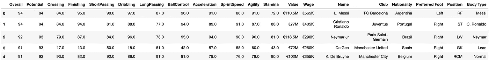
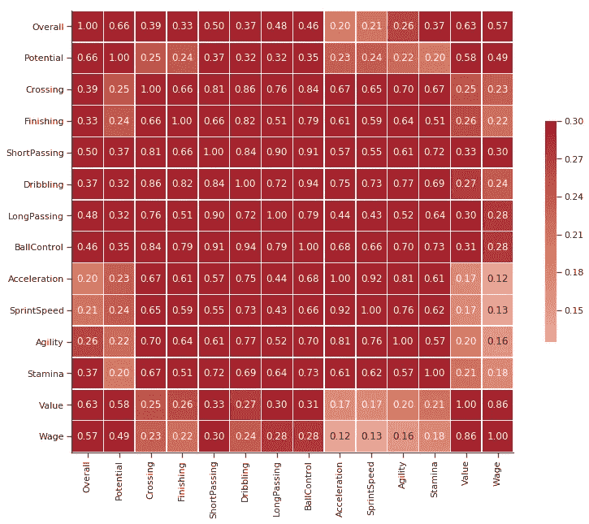
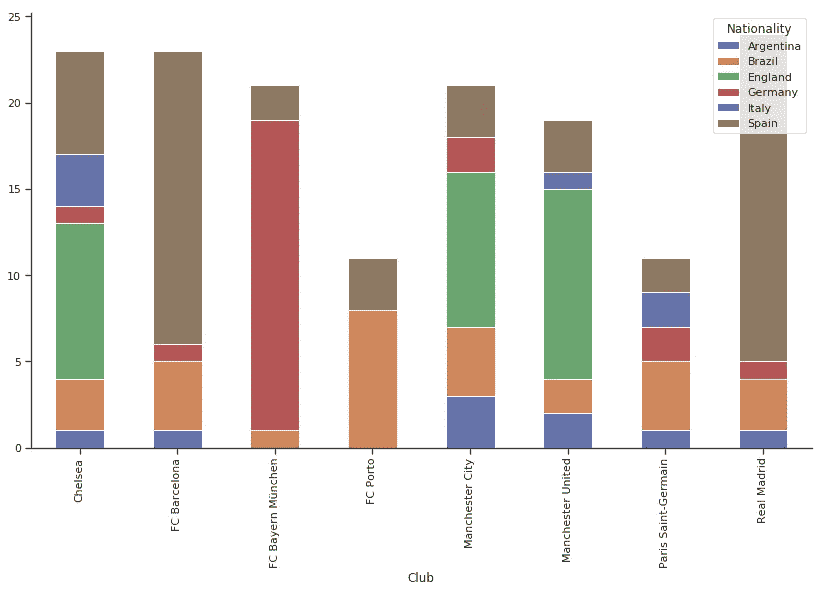
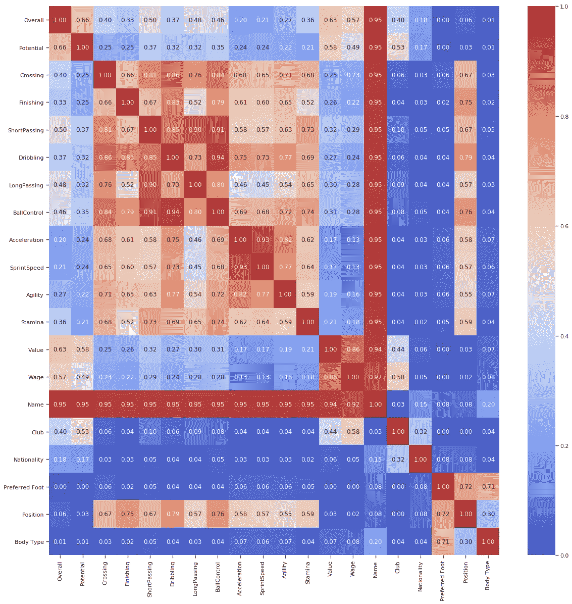
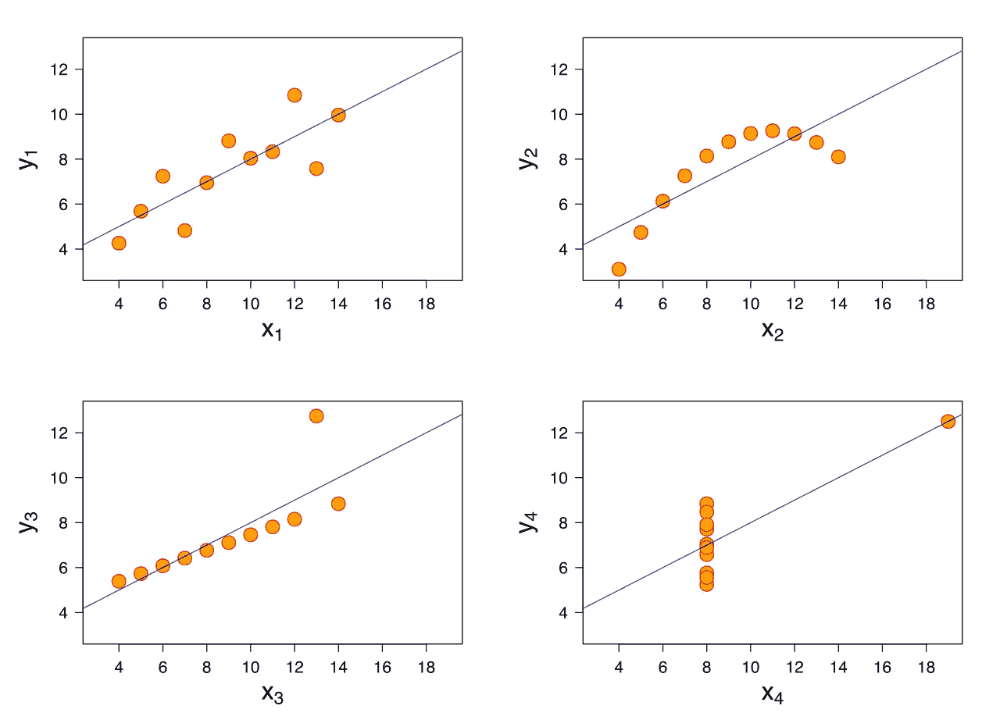
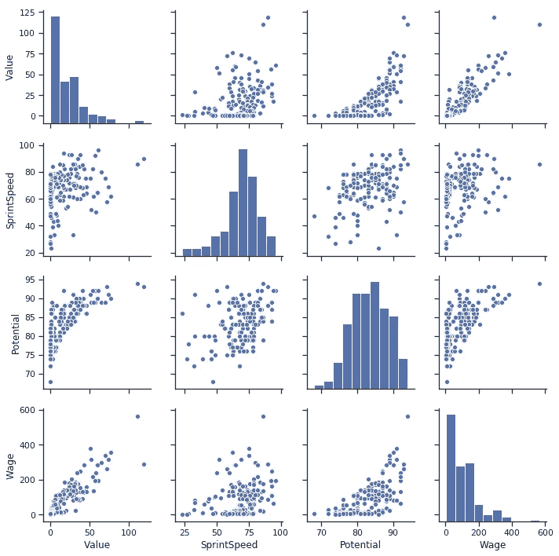
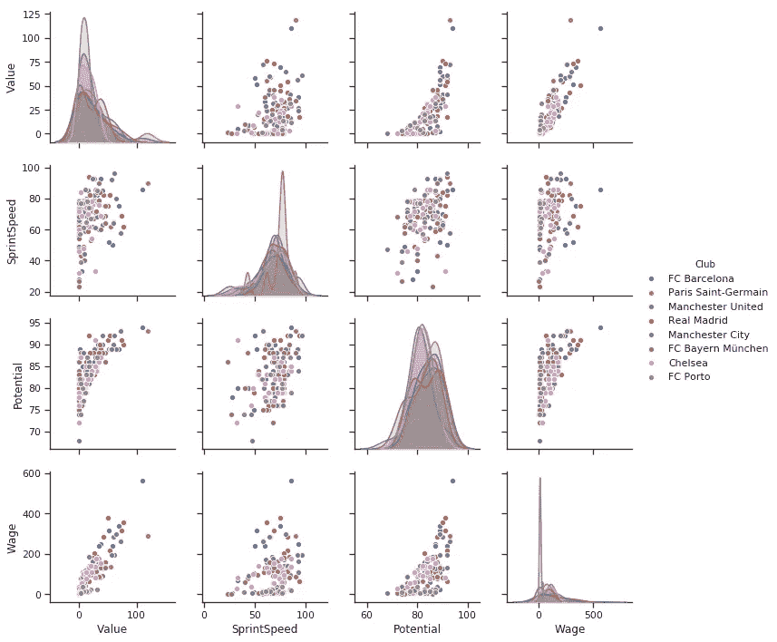
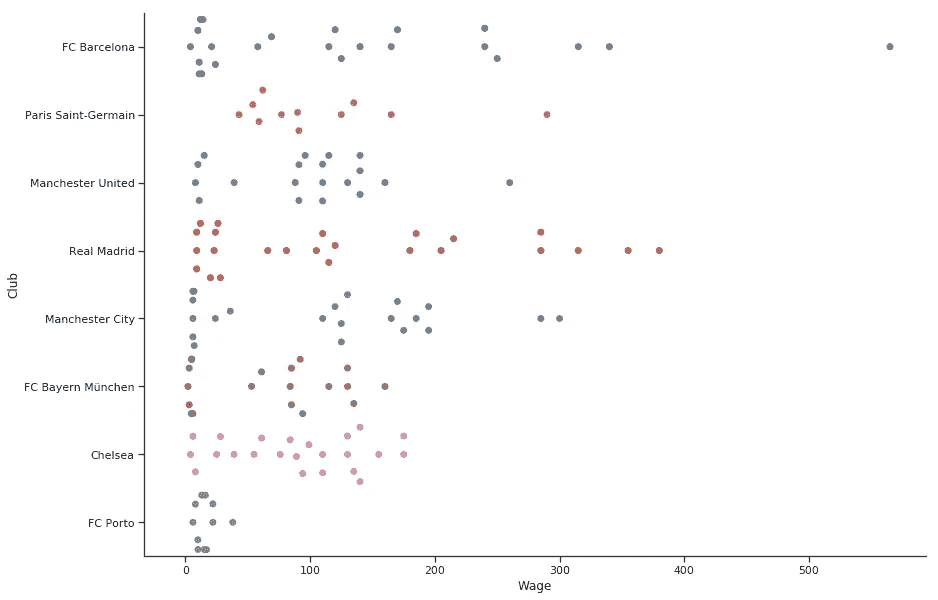
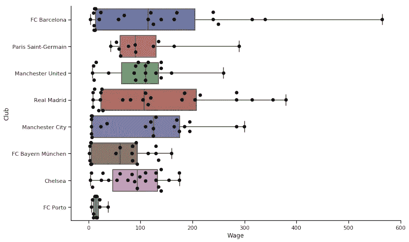
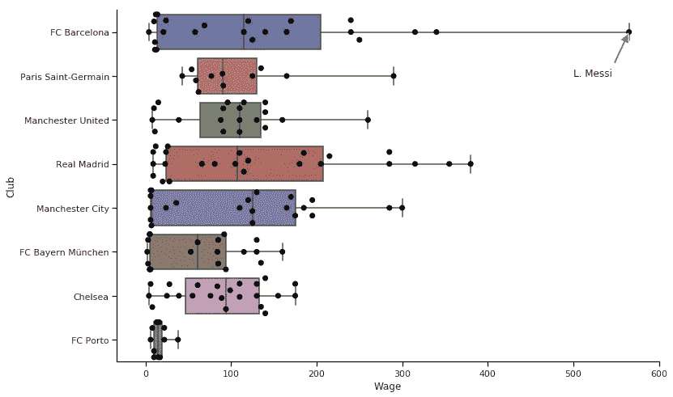

# 针对每个数据集的 3 种出色的可视化技术

> 原文：<https://towardsdatascience.com/3-awesome-visualization-techniques-for-every-dataset-9737eecacbe8?source=collection_archive---------4----------------------->

## 同时学习一些关于足球的知识

可视化很棒。然而，一个好的视觉化很难实现。

此外，向更多的观众展示这些可视化效果需要时间和精力。

我们都知道如何制作[条形图、散点图和直方图](https://coursera.pxf.io/e45JOX)，然而 ***我们却不太注意美化它们。***

这伤害了我们——我们在同事和经理中的信誉。你现在感觉不到，但它确实发生了。

此外，我发现重用我的代码是必要的。每当我访问一个新的数据集时，我需要重新开始吗？一些 ***图形的可重用思想可以帮助我们快速找到有关数据的信息。***

在这篇文章中，我还将谈论 3 个很酷的视觉工具:

*   与图形的分类相关，
*   配对图，
*   使用 Seaborn 的群集图和图形注释。

***简而言之，这个帖子讲的是有用的、像样的图。***

我将使用 FIFA 19 完整球员数据集中的数据，这些数据来自于[ka ggle](https://www.kaggle.com/karangadiya/fifa19)——在最新版本的 FIFA 19 数据库中注册的每个球员的详细属性。

由于数据集有许多列，我们将只关注分类列和连续列的子集。

Player Data

这是一个格式很好的数据，但是我们需要对工资和价值列做一些预处理(因为它们是欧元并且包含字符串)，使它们成为数字，以便我们进行后续分析。

# 与图形的分类相关性:

简单来说，[相关性](https://amzn.to/2JZPru2)是衡量两个变量如何一起移动的指标。

例如，在现实世界中，*收入和支出是正相关的。如果一个增加，另一个也会增加。*

*学习成绩和电子游戏使用率呈负相关。一个因素的增加预示着另一个因素的减少。*

因此，如果我们的预测变量与我们的目标变量正相关或负相关，这是有价值的。

当我们试图理解我们的数据时，不同变量之间的相关性是一件很好的事情。

我们可以很容易地使用 Seaborn 创建一个很好的相关图。

Where did all the categorical variables go?

但是你注意到什么问题了吗？

是的，这个图形只计算数字列之间的相关性。

***如果我的目标变量是*** `***Club***` ***或者*** `***Position?***`怎么办

我希望能够获得三种不同情况之间的相关性，我们使用以下相关性指标来计算它们:

## 1.数字变量

我们已经有了这种形式的[皮尔逊相关](https://en.wikipedia.org/wiki/Pearson_correlation_coefficient)，它是两个变量如何一起移动的度量。范围从[-1，1]

## 2.分类变量

我们将使用[克莱姆的 V](https://en.wikipedia.org/wiki/Cram%C3%A9r%27s_V) 来表示分类-分类案例。它是两个离散变量的相互关系，用于具有两个或多个层次的变量。这是一个对称的度量，因为变量的顺序无关紧要。克莱姆(A，B) ==克莱姆(B，A)。

例如:在我们的数据集中，`Club`和`Nationality`一定有某种关联。

让我们使用堆积图来检查这一点，这是理解分类变量与分类变量之间分布的一种极好的方式。我们使用数据的子集，因为在这个数据中有很多国籍和俱乐部。

我们只保留最好的球队(保留波尔图只是为了样本更加多样化)和最常见的国籍。

俱乐部偏好在很大程度上说明了国籍:了解前者有助于预测后者。

我们可以看到，如果一名球员属于英格兰，他更有可能在切尔西或曼联踢球，而不是在巴塞罗那或拜仁慕尼黑或波尔图。

*这里有一些信息。克莱姆的 V 也捕捉到了同样的信息。*

如果所有俱乐部都有相同比例的每个国籍的球员，克莱姆的 V 就是 0。

如果每个俱乐部都偏好单一国籍克拉默的 V ==1，比如所有英格兰球员都在曼联踢球，所有德国人都在拜仁慕尼黑等等。

在所有其他情况下，其范围为[0，1]

## 3.数字和分类变量

对于分类连续的情况，我们将使用[相关比率](https://en.wikipedia.org/wiki/Correlation_ratio)。

在不涉及太多数学知识的情况下，这是一种离散度的度量。

> 给定一个数字，我们能找出它属于哪一类吗？

例如:

假设我们的数据集中有两列:`SprintSpeed`和`Position`:

*   **GK:** 58(德基)、52(库尔图瓦)、58(诺伊尔)、43(布冯)
*   68(D. Godin)，59(V. Kompany)，73(S. Umtiti)，75(M. Benatia)
*   91(C 罗)，94(G .贝尔)，80(S .阿圭罗)，76(R .莱万多夫斯基)

如你所见，这些数字很好地预测了他们所处的阶段，因此相关率很高。

*如果我知道冲刺速度超过 85，我绝对可以说这个玩家在圣*玩

这个比率的范围也是从[0，1]

完成这项工作的代码取自 dython 包。我不会写太多代码，反正你可以在我的 [Kaggle 内核](https://www.kaggle.com/mlwhiz/seaborn-visualizations-using-football-data)中找到。最终结果看起来像这样:

Categorical vs. Categorical, Categorical vs. Numeric, Numeric vs. Numeric. Much more interesting.

***是不是很美？***

光看这些数据，我们就能了解足球这么多。例如:

*   球员的位置与运球能力高度相关。你不会在后面打梅西。对吗？
*   与运球相比，价值与传球和控球的相关性更高。规则是总是传球。内马尔，我在看着你。
*   俱乐部和工资有很高的相关性。意料之中。
*   体型和喜欢的脚高度相关。这是否意味着如果你很瘦，你很可能是左撇子？没多大意义。可以进一步调查。

此外，我们可以从这个简单的图表中找到很多信息，这些信息在没有分类变量的典型相关图中是看不到的。

我把它留在这里。人们可以更多地观察图表，找到更有意义的结果，但关键是，这使得寻找模式变得更加容易。

# 配对图

虽然我谈了很多关于相关性的内容，但这是一个变化无常的指标。

为了理解我的意思，让我们看一个例子。

**Anscombe 的四重奏**由四个数据集组成，这四个数据集具有几乎相同的相关性 1，但具有非常不同的分布，并且在绘制时显得非常不同。

Anscombe Quartet — Correlations can be fickle.

因此，有时绘制相关数据变得至关重要。并单独查看分布情况。

现在我们的数据集中有许多列。把它们都画出来会很费力。

不，这只是一行代码。

非常好。我们可以在这张图表中看到很多。

*   工资和价值高度相关。
*   大多数其他值也是相关的。然而，潜力与价值的趋势是不寻常的。我们可以看到，当我们达到一个特定的潜在阈值时，值是如何呈指数增长的。这些信息有助于建模。可以用一些势的变换使它更相关。

**警告:**没有分类列。

我们能做得更好吗？我们总是可以的。

如此多的信息。只需添加参数`hue`作为分类变量`Club`。

*   波尔图的工资分配太偏向下层了。
*   我没有看到波尔图球员价值的陡峭分布。波尔图的球员会一直寻找机会。
*   看看很多粉红色的点(切尔西)是如何在潜在工资图表上形成一个集群的。切尔西有很多高潜力球员，但工资较低。需要更多的关注。

我已经知道了工资/价值支线剧情的一些要点。

工资 500k 的蓝点是梅西。此外，比梅西更有价值的橙点是内马尔。

虽然这个技巧仍然没有解决分类问题，但是我有一些很酷的东西来研究分类变量的分布。虽然单独来说。

# 群集图

如何看分类数据和数值数据的关系？

进入图片群情节，就像他们的名字。为每个类别绘制的一群点，在 y 轴上有一点分散，使它们更容易看到。

他们是我目前最喜欢的策划这种关系的人。

Swarmplot…

为什么我不用箱线图？**中值在哪里？我能画出来吗？**显然。在顶部覆盖一个柱状图，我们就有了一个看起来很棒的图表。

Swarmplot+Boxplot, Interesting

非常好。我们可以看到图表上的单个点，看到一些统计数据，并明确了解工资差异。

***最右点是梅西。然而，我不应该在图表下面的文字中告诉你。对吗？***

这张图表将会在演示中出现。你的老板说。我想在这个图上写梅西。进入图片**注释**。

Annotated, Statistical Info and point swarm. To the presentation, I go.

*   看那边的波尔图。用这么少的工资预算和巨头竞争。
*   皇马和巴萨有这么多高薪球员。
*   曼彻斯特市的工资中位数最高。
*   曼联和切尔西相信平等。许多球员聚集在同一工资等级附近。
*   我很高兴，虽然内马尔比梅西更受重视，但梅西和内马尔的工资差距很大。

在这个疯狂的世界里一种正常的表象。

# 结论

概括一下，在这篇文章中，我们讨论了计算和读取不同变量类型之间的相关性，绘制数值数据之间的[相关性](https://amzn.to/2JZPru2)，以及使用群集图绘制数值数据与分类数据之间的相关性。我喜欢我们如何在 Seaborn 中将图表元素相互叠加。

此外，如果你想了解更多关于可视化的知识，我想从密歇根大学调出一门关于 [**数据可视化和应用绘图**](https://coursera.pxf.io/e45JOX) 的优秀课程，它是一个很好的 [**数据科学专业的一部分，Python**](https://coursera.pxf.io/e45JOX) 本身就是其中之一。一定要去看看

如果你喜欢这篇文章**，请鼓掌**。这将有助于增加这个职位的覆盖面。将来我也会写更多初学者友好的帖子。在 [**中**](https://medium.com/@rahul_agarwal) 关注我，或者订阅我的 [**博客**](https://mlwhiz.ck.page/a9b8bda70c) 了解他们。一如既往，我欢迎反馈和建设性的批评，可以通过 Twitter [@mlwhiz](https://twitter.com/MLWhiz) 联系

你也可以看看我在 Seaborn 上的另一篇[帖子](https://mlwhiz.com/blog/2015/09/13/seaborn_visualizations/)，在那里我创建了一些更简单的可重用图形。

这个 [kaggle 内核](https://www.kaggle.com/mlwhiz/seaborn-visualizations-using-football-data)中的这篇帖子的代码。

# 参考

1.  [对分类相关性的搜索](/the-search-for-categorical-correlation-a1cf7f1888c9)
2.  [Seaborn Swarmplot 文档](https://seaborn.pydata.org/generated/seaborn.swarmplot.html)
3.  [Seaborn Pairplot 文件](https://seaborn.pydata.org/generated/seaborn.pairplot.html)

*原载于 2019 年 4 月 19 日*[*https://mlwhiz.com*](https://mlwhiz.com/blog/2019/04/19/awesome_seaborn_visuals/)*。*