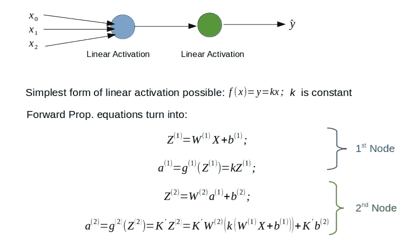
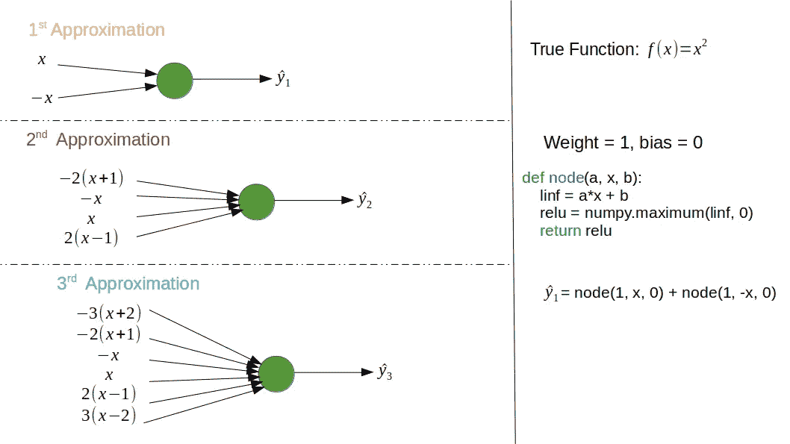
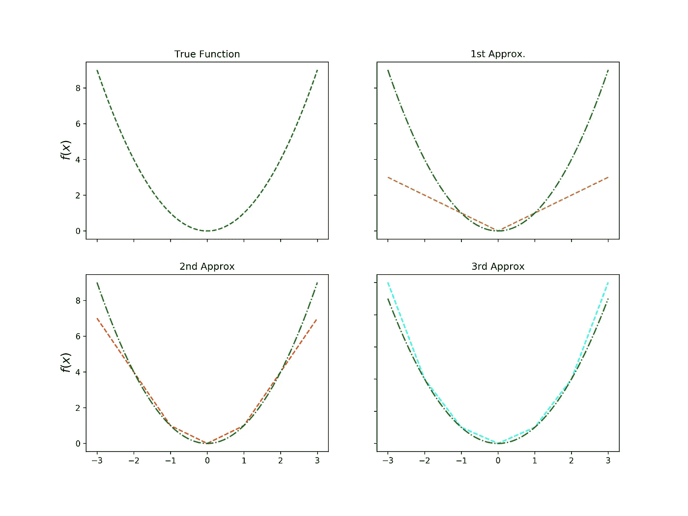
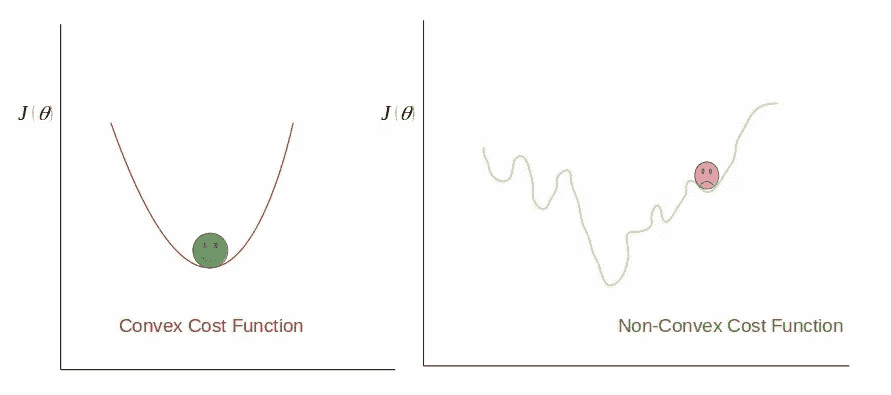
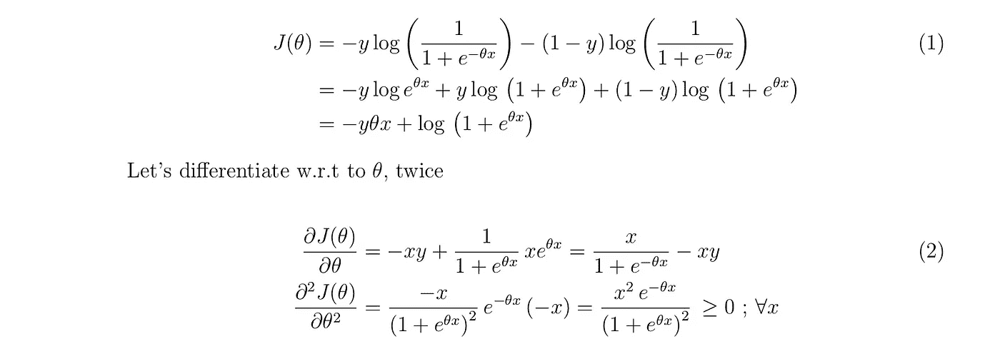
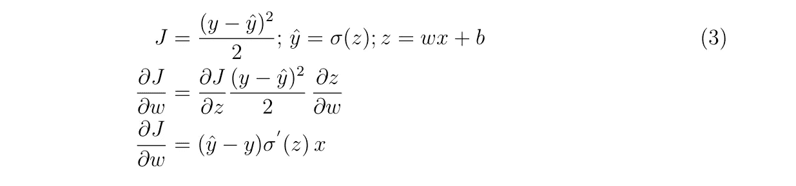
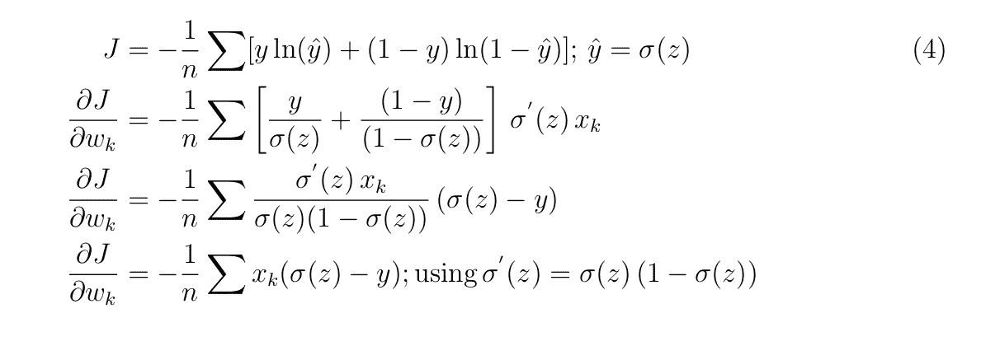
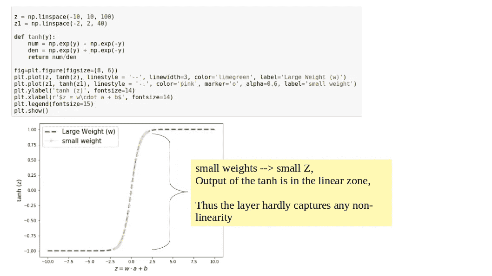

# 重温神经网络和深度学习中的 3 个基本概念

> 原文：<https://towardsdatascience.com/3-basic-concepts-in-neural-net-and-deep-learning-revisited-7f982bb7bb05?source=collection_archive---------29----------------------->

## 准备你的第一次人工智能面试

Outskirts of Tokyo! (Source: Saptashwa)

在这篇文章中，我想重温深度学习的一些非常基本的问题/概念；你可能已经问过自己这些问题，或者，你很有可能在你的第一次人工智能面试中遇到这些问题。所以，没有任何延误，让我们这样做吧！

# 1.线性激活有问题！那为什么用 RELU？或者说，RELU 如何表现非线性？

你可能已经知道为什么(通常)不使用线性激活函数，但是，如果你仍然需要浏览这个概念，这里有一个简短的回顾。

没有激活函数的神经网络本质上是一个线性回归模型。因此，使用线性激活函数将始终线性映射输入，无论有多少层。让我们通过一个简单的演示来看看:

这里，我们考虑一个简单的具有 1 个隐藏层的神经网络。如果您扩展最终方程(将给出输出)，它将始终是输入的线性函数，即使您添加更多具有线性激活函数的层。因此，所有的隐藏层都可以用线性激活的单一层代替。

但是，现在出现了第二个问题。**经过整流的线性单位(RELU)怎么能代表非线性？**这是一个有点棘手的问题。首先，我们来看看一次函数的定义。函数 *f: A→ B* 是线性的，如果对于域 *A* ， *f* 中的每个 *x* 和 *y* 具有以下性质

*f(α x + β y) = α f(x) + β f(y)* …。(1)并且，这个方程更简化的版本是 *f(x+y) = f(x) + f(y)…。* (2) *。* RELU 定义为 *f(x) = max(0，x)。*正如你所看到的，RELU 不满足这两个方程，所以它是一个非线性函数。然而，很难想象一个在一半输入域为零而在另一半输入域为线性的函数如何能表示复杂的非线性！在这里，我将向您展示一个简单的逐步添加线性输入的例子，看看 RELU 如何帮助我们将线性输入映射到非线性输出(例如:y=x)。

如图所示，只需将 RELU 激活的线性输入相加，我们就可以得到 y=x 的一个很好的表示。让我们在下图中验证这一点

Intuition for how RELU represents non-linearity (Here true function is y=x²).

从这里，希望你可以了解 RELU 如何帮助我们用深度神经网络发现数据中的非线性。

# 2.为什么交叉熵而不仅仅是简单的二次成本？

我经常做语义分割任务，我们试图将图像的每个像素分类到特定的类别标签中。在这类任务中，以及在大多数深度学习问题中，你处理的是概率。因此，通常会得出结论(与线性回归任务相比)，均方误差不是您想要最小化的函数。

类似于我们在逻辑回归问题中使用误差函数开始起作用。但是，问题是我们为什么首先使用这样的误差函数？在这里，你可以说带有逻辑回归假设的**均方误差(MSE)成本函数将导致一个*非凸*函数，**然后很有可能陷入局部最小值而不是全局最小值。现在如何知道一个函数是否凸？给定一个单变量函数(两次可微)，如果二阶导数是非负的，则该函数是凸的。对于多变量函数，二阶导数将形成一个称为[海森矩阵](https://en.wikipedia.org/wiki/Hessian_matrix)的矩阵。*这个 Hessian 矩阵需要是半正定的，函数才是凸的。让我们做一些数学运算来证明对数损失成本函数确实是一个凸函数。*

如果您使用逻辑回归假设和 MSE 函数，那么对 w.r.t θ进行两次微分不会得到所有 *x.* 的非负项

关于神经网络，使用这种对数损失成本函数有一个更微妙的原因。*通常神经网络的最后一层会有 sigmoid 作为激活函数，使用 MSE 会导致严重的学习减速。*让我们看一个非常简单的例子

由于在( *w，b* 的导数中存在 sigmoid 函数的导数，这些参数的学习速率变得非常慢。如果我们不使用 MSE，而是使用交叉熵代价函数，那么我们可以解决这个问题。让我们通过几个步骤的计算来看看这个—

我们不仅能够移除 sigmoid 函数的导数(这会导致学习速度变慢)，还使用**交叉熵作为成本函数，使得可训练参数的学习速度与输出中的误差成比例。**您也可以检查偏差项。尽管这是针对单个神经元示出的(等式(4)中的求和超过了训练示例的数量)，但是结论对于许多神经元、多层网络仍然有效。太好了！让我们进入下一个概念。

# 3.对正则项和减少过拟合有什么直觉吗？

机器学习中的过度拟合也被称为高方差，即，当您的模型在训练数据上表现非常好，但无法用测试数据集复制时。为了减少过度拟合，可以采取的一个初步措施是增加训练数据的数量。下一步可能是减少网络的深度，即减少一些层。另一种减少过度拟合的方法是在成本函数中增加一个额外的项。该项是网络所有权重的平方和乘以正则化参数。于是新的代价函数就变成了-新的代价=旧的代价+ λ/2 ∑w，这也被称为 L2 正则化，也用于[岭回归](/ridge-and-lasso-regression-a-complete-guide-with-python-scikit-learn-e20e34bcbf0b)。如果你使用 TensorFlow，这个 L2 正则化可以通过调用`tf.nn.l2_loss`与你的成本函数相加，这个项的作用是告诉网络惩罚大权重项。现在，由于权重不再那么大(如果λ很大)，即使网络非常深，许多隐藏单元对训练模型的影响也会小得多。

我发现了另一种方法，根据激活函数，为吴恩达讲座中的正则化项和高方差减少建立直觉。让我们想想 tanh 激活函数—

因此，降低权重会减少 *tanh(z)* ，迫使其位于线性区域，从而降低网络模拟复杂非线性的能力，并有助于减少方差。

希望这篇文章已经帮助你重温了一些旧的概念，也许在这个过程中你学到了一些新的东西。

保持坚强和快乐，干杯！