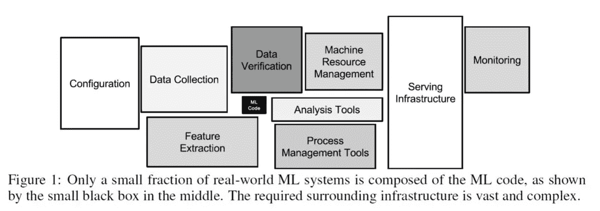

# 3 机器学习中常见的技术债以及如何规避

> 原文：<https://towardsdatascience.com/3-common-technical-debts-in-machine-learning-and-how-to-avoid-them-17f1d7e8a428?source=collection_archive---------13----------------------->

本文概述了机器学习中的 3 个常见技术债务以及如何避免它们。如果你读这篇文章有困难，可以考虑在这里订阅中级会员！

> ***技术债务*** *是实施代码时所做的权宜决策的持续成本。正是技术决策中的所有捷径或变通办法在早期软件版本和更快的上市时间中带来了短期利益。这个短语是沃德·坎宁安在 1992 年创造的，他试图向非技术产品利益相关者解释我们称之为“重构”的必要性。*

人工智能(AI)和机器学习(ML)系统具有增加技术债务的特殊能力。具体来说，它具有常规代码的所有问题，加上系统级的 ML 特定问题。本文讨论了您在生产过程中可能遇到的三个技术债务。

Fig. 1 — AI/ML system is not everything

# 1.隐藏的反馈循环

从整体来看，人工智能系统通常是更大的数据机器的一部分。这意味着它的输入和输出依赖于大型机器中的其他组件(见图 1)。作为其周围环境的结果，真实世界系统经常最终影响它们自己的训练数据。

这可能以令人惊讶的方式发生，例如，你运行一个视频流平台，你的后端团队开发了一个推荐引擎，根据观众过去的观看历史和个人资料向他们推荐新频道。该引擎还包括那些被观众否决或忽略的频道。然后你启动这个功能，并庆祝推荐的视频每周都有越来越多的点击。事情看起来很好，但好得难以置信。

您忽略的是，前端团队实施了一个修复来隐藏低置信度(例如，低于 50%)的推荐视频，因为潜在的不良视频不应被推荐。随着时间的推移，以前置信度为 50–60%的建议现在可以推断出小于 50%的置信度。这形成了一个强大的反馈循环，刺激了你的指标(如收视率)，这是一个危险。您现在不知不觉地陷入了一个陷阱，总是向用户推荐相同类型的内容，削弱了您的系统推荐用户可能感兴趣的新内容的能力。

Because you bought a vacuum, you need to buy more!

最终，这变成了一个问题，您的度量增加了，但是系统的质量没有增加。更糟糕的是，你可能不知道这正在发生。找到并修复循环是一个更加困难的问题，需要跨团队的努力。

## 减轻

退一步，以更全面的方式研究你试图解决的问题。避免视野狭窄，停留在人工智能工程师/科学家的舒适区，在那里你只想提高*你自己的*指标。

**寓意**:你不仅应该开发人工智能，也应该允许它去探索。此外，定期检查你的衡量标准，重新思考你如何衡量成功——不要只看数字。

# 2.管道丛林

人工智能系统通常由一系列工作流管道组成。这些管道负责一系列以特殊顺序运行的复杂作业。它们可能是由不同的人建造的，他们对全局有不同的认识，这就是灾难发生的地方。

通常，由于时间的压力，一条管道只是为了满足某个要求而仓促搭建。它可以由用不同语言编写的不同胶水代码和用于管理管道的特殊语言组成。它们可以从数据准备、抓取、清理、连接、验证、提取特征、在训练/测试集中分割数据、检查点、监控性能和推向生产等。这意味着它更容易以一个意大利面条系统结束，并陷入混乱！

在管道丛林中，你可能还会惊讶地发现*未申报的消费者*。如果没有访问控制，这些消费者中的一些可能是下游系统，它们悄悄地将您的模型的输出作为另一个系统的输入。未声明的消费者既昂贵又危险，尤其是当它与您的 AI 系统的输出紧密耦合时。

## 减轻

通过从更大的角度看待系统，并认真对待数据收集和特征提取等任务，可以避免管道丛林。解决这个问题的一个方法是投入一些投资来清理管道，以大幅减少前进的阻力。对于复杂系统，可能值得将这项工作分成更小的部分，并让外部顾问来完成，因为重构可能需要几个月或几年的时间。

保持子系统的所有组件一致需要额外的努力。管道丛林往往会滚雪球般变成一个更大的问题，所以在为时已晚之前做好清理工作。哦，我提到管理*依赖关系*了吗？

# 3.数据相关性

在一个典型的软件工程项目中，依赖关系指的是你导入的所有模块、包和库，这些模块、包和库有助于在不重新发明轮子的情况下构建某些功能。在一个人工智能系统中，也有*数据依赖*，并且它具有类似的构建债务的能力。更糟糕的是，它可能更难被发现。

## 数据相关性不一致

数据质量的不一致可能导致输入信号不稳定，因为数据可能会随着时间的推移而发生定性或定量的变化。这些输入数据可以从另一个 ML 系统生成，并且可以随时间更新以产生用于另一个系统的嵌入或语义映射(例如，图像嵌入、TF/IDF)。上游系统的静默更新会破坏下游预测系统。

## 数据相关性中未使用的功能

随着时间的推移，新的功能会使旧的功能变得多余，而这种变化不会被发现。例如，匆忙拼凑起来的遗留的、相关的或捆绑的特性会卡在模型中，永远留在那里。最终，这些特征会导致[(多重)共线性](https://statisticsbyjim.com/regression/multicollinearity-in-regression-analysis/)，并削弱模型的统计能力。

## 减轻

使用嵌入/语义映射的冻结副本，并允许原始副本随着时间的推移而改变。仅在审查和验证后部署新映射。此外，未使用或未充分利用的特征可以通过彻底的留一特征评估来检测。定期运行这些检查以删除这些不必要的功能。

**寓意**:代码依赖可以通过使用编译器和链接的静态分析来识别。确定数据相关性需要检查数据如何转化为信号，从数据中去除噪声并提取清晰的信号。

# 结论—偿还技术债务

在这个快速发展的世界里，快速行动和打破常规可能是新的发展口号。然而，通过在开发过程中询问一些有用的问题，可以将技术债务保持在最低限度。我们应该问自己:

1.  我们是否确切地知道一个新的模型或更新的模型将如何影响整个系统？我们在哪里以及如何衡量这种变化的影响？
2.  我们衡量成功的标准是什么？它与商业目标一致吗？
3.  我们是否跟踪了整个系统的所有依赖、生产者和消费者？当我们需要的时候，我们有一个系统的方法来识别错误吗？

注:本文首发于[https://derekchia . com/3-common-technical-debts-in-machine-learning-and-how-to-avoid-them/](https://derekchia.com/3-common-technical-debts-in-machine-learning-and-how-to-avoid-them/)。请在 twitter 上关注我，DerekChia 获取更多更新！

## 参考资料:

1.  机器学习系统中隐藏的技术债务[https://papers . nips . cc/paper/5656-hidden-Technical-Debt-in-Machine-Learning-Systems . pdf](https://papers.nips.cc/paper/5656-hidden-technical-debt-in-machine-learning-systems.pdf)
2.  你的 ML 测试分数是多少？大规模生产系统规则[https://ai.google/research/pubs/pub45742](https://ai.google/research/pubs/pub45742)
3.  机器学习:技术债的高息信用卡【https://ai.google/research/pubs/pub43146 T2