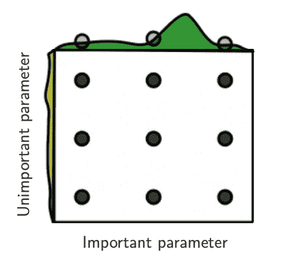
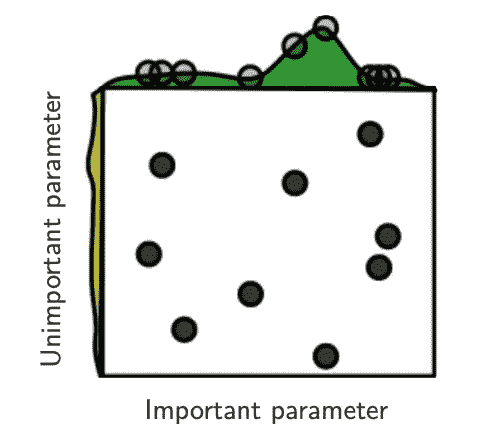

# 优化超参数的 3 种不同方法(交互式 Python 代码)

> 原文：<https://towardsdatascience.com/3-different-ways-to-tune-hyperparameters-interactive-python-code-87548d7f2365?source=collection_archive---------20----------------------->

Photo by [chuttersnap](https://unsplash.com/@chuttersnap?utm_source=medium&utm_medium=referral) on [Unsplash](https://unsplash.com?utm_source=medium&utm_medium=referral)

## 优化和调整超参数的交互式指南

H 超参数(HP)是机器或深度学习算法无法通过训练学习的那些参数。这些参数的值需要在训练过程之前设置，它可以控制算法如何从数据中学习。超参数(HP)可以是神经网络的层数或一层中的节点数，可以是神经网络可以使用的学习速率或优化器类型。获得正确的超参数可能是反直觉的，它更像是一个试错过程。因此，我们需要找到一种方法来自动调整这些参数，以获得最佳组合，最大限度地提高 ML 模型的性能。

在本文中，我将讨论一些优化和调整超参数(HP)的方法，以最大化或最小化客观指标(当指标是准确性时最大化，而当指标是 RMSE 或任何其他损失函数时最小化)。

但是，在我们深入研究超参数优化部分之前，让我们先了解一些重要的概念:

# 目标函数:

机器学习可以简单地定义为从经验中学习行为。这里的*学习*，我们的意思是随着时间的推移，在某些特定的任务上变得更好、更有进步。但是什么是进步呢？

为了开发一个函数来判断改进，我们需要有模型好坏的正式度量。在机器学习中，我们称这些为“目标函数”。最常见的目标函数是平方误差，它基本上是预测值和实际地面真相之间的差异。如果该值较大，则精确度较低。我们优化超参数的目标是最小化这个目标函数。获得模型超参数的正确组合可以极大地提高模型的性能，让我们看看如何调整这些参数以最小化目标函数:

# 一维网格搜索:

调整超参数的一种方法是为每个 HP 定义一个相等的范围，并让计算机尝试所有可能的参数值组合。这可能是获得最佳 HPs 组合的一个很好的方法。它的工作原理是把你想要调优的 HPs 放在一个 n 维网格中，然后在这个网格中尝试每一种组合。您可以使用嵌套循环来实现这一点，也可以使用一些现成的库，如 Scikit Learn — GridSearchCV。让我们看看它是如何工作的，下面的示例将尝试找到超参数(C、Gamma 和 Kernel)的最佳组合来为 MNIST 数据集构建分类器:

**(互动代码——点击播放按钮自行运行代码)**

上面的代码将强力尝试这三个超参数的每一种可能的组合，然后打印出最佳组合。

*   **优点:**这种方法会得到最好的超参数。
*   **缺点**:这是一个详尽的操作。如果超参数范围或数量很大，可能性可能有数百万，这将需要很长时间才能完成。它也遵循一个序列，不考虑过去的经验。

# 2-随机搜索:

顾名思义，它将尝试随机选择预定义数量的超参数组合，这将给出最佳超参数的一些指示。现在，让我们看一些代码:

**(互动代码——点击播放按钮自行运行代码)**

正如您在代码中看到的，您可以定义想要选择一组随机超参数的次数或迭代次数，然后尝试它们并获得最佳组合。

**优点:**比网格搜索法快多了。

**缺点:**可能不会返回能够返回最佳精度的最佳超参数组合。它也不考虑过去的评估，不管结果如何，它都将继续迭代。

# 3-贝叶斯优化:

在上面的例子中，我们有一个客观的指标，即精度，我们还有一个目标函数，试图最大化指标和最小化损失。贝叶斯优化方法试图通过基于目标度量的过去评估结果建立概率模型来找到最小化目标函数的值。它试图在探索包含最佳超参数的最佳区域和利用该区域来最大化/最小化客观度量之间找到平衡。

优化超参数的问题是，评估一组 HPs 的性能是一个昂贵的过程，因为我们必须在每次迭代中建立相应的图或神经网络，然后我们必须训练它，最后，我们必须评估性能。优化过程可能需要几个小时或几天，但在这个例子中，我们将只训练 3 个时期，以便您可以看到最好的 HPs，然后使用这些来训练更多的时期。

让我们看看下面的示例，该示例使用贝叶斯优化来调整 MNIST 数据集的神经网络。我们将使用 scikit-optimize 库来执行 HPO。它是实现了贝叶斯优化算法的库之一:

**(交互式代码—点击播放按钮自行运行代码)**

# 结论:

优化机器学习模型的超参数对于机器学习模型的性能至关重要，并且调整 HPs 的过程不是直观的，并且可能是复杂的任务。上面的文章展示了三种自动调整这些参数的流行方法。我们还探索了 scikit-optimize ( `skopt`)库，在撰写本文时它仍在开发中，但它是一个非常强大的工具。它有一个非常简洁的贝叶斯优化方法的实现，大大优于网格搜索和随机搜索，特别是当涉及到复杂的任务和大量的超参数时。